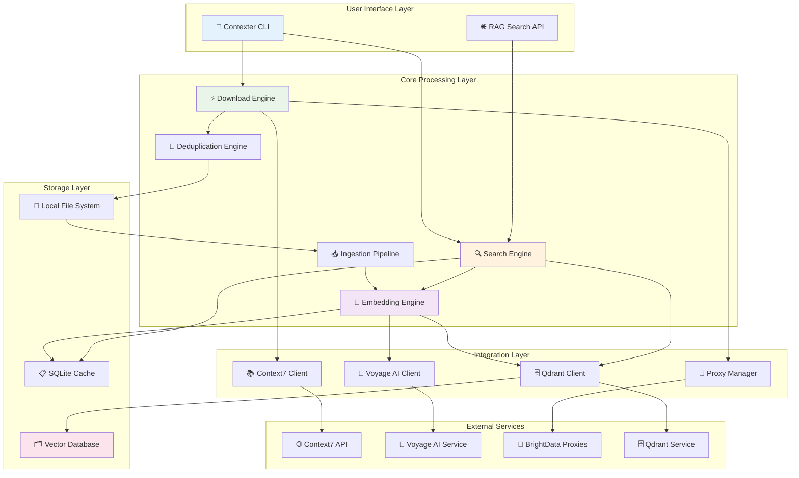
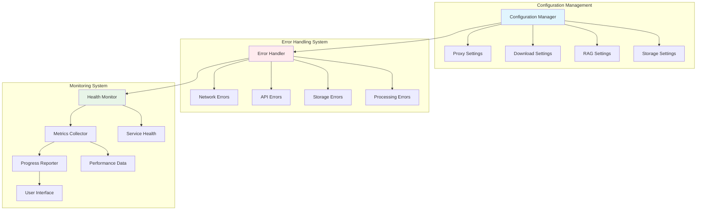

# Contexter Codebase Analysis Report

## Executive Summary

**Project Overview**: Contexter is a comprehensive documentation platform that combines high-performance documentation downloading capabilities with intelligent semantic search through RAG (Retrieval-Augmented Generation) technology. The system consists of two major integrated subsystems:

1. **C7DocDownloader**: Context7 documentation downloader with proxy rotation and intelligent deduplication
2. **RAG System**: Semantic search system using Voyage AI embeddings and Qdrant vector database

**Architecture Style**: Async-first Python architecture with modular components, circuit breaker patterns, and production-grade error handling.

**Key Technologies**: Python 3.9+, asyncio, Qdrant vector database, Voyage AI embeddings, BrightData proxies, Click CLI framework.

**Project Status**: Production-ready with comprehensive testing framework, CI/CD integration, and performance monitoring capabilities.

## Project Structure Analysis

### Directory Organization

```
/home/michael/dev/contexter/
├── src/contexter/                    # Main application code (31,261 total lines)
│   ├── cli/                         # Command-line interface components
│   │   ├── commands/                # CLI command implementations
│   │   ├── ui/                     # User interface components (progress, display)
│   │   └── utils/                  # CLI utilities and validation
│   ├── core/                       # Core business logic components
│   │   ├── download_engine.py      # 977 lines - Main download orchestration
│   │   ├── deduplication.py        # 1,410 lines - Content deduplication
│   │   ├── storage_manager.py      # 689 lines - File storage management
│   │   └── config_manager.py       # Configuration management
│   ├── integration/                # External service integrations
│   │   ├── context7_client.py      # 1,496 lines - Context7 API client
│   │   └── proxy_manager.py        # 756 lines - BrightData proxy management
│   ├── models/                     # Pydantic data models
│   │   ├── config_models.py        # Configuration schemas
│   │   ├── download_models.py      # Download-related models
│   │   └── embedding_models.py     # RAG system models
│   ├── vector/                     # RAG/Vector processing components
│   │   ├── embedding_engine.py     # 633 lines - Main embedding orchestration
│   │   ├── qdrant_vector_store.py  # 757 lines - Vector database client
│   │   ├── voyage_client.py        # Voyage AI API client
│   │   └── vector_search_engine.py # Hybrid search implementation
│   ├── ingestion/                  # Document processing pipeline
│   │   ├── pipeline.py             # 687 lines - Main ingestion orchestration
│   │   ├── chunking_engine.py      # 841 lines - Document chunking
│   │   ├── metadata_extractor.py   # 938 lines - Metadata processing
│   │   └── json_parser.py          # 671 lines - JSON document parsing
│   └── storage/                    # Storage layer components
├── tests/                          # Comprehensive test suite
│   ├── unit/                       # Unit tests for individual components
│   ├── integration/                # Integration testing
│   ├── e2e/                       # End-to-end testing
│   ├── e2e_live/                  # Live service testing
│   ├── vector/                    # RAG system testing
│   └── performance/               # Performance testing
├── ai_docs/                       # AI-generated documentation
│   ├── blueprints/               # Implementation blueprints
│   ├── deliverables/            # Architecture and design docs
│   ├── specifications/          # Technical specifications
│   └── validation/              # Testing and validation guides
├── examples/                      # Usage examples
├── scripts/                      # Utility scripts
└── docs/                         # Documentation
```

### Technology Stack Distribution

**Core Runtime**:
- Python 3.9+ (100% codebase)
- Asyncio-based architecture throughout
- Modern type hints and Pydantic validation

**External Integrations**:
- Context7 API (documentation source)
- Voyage AI (embedding generation) 
- BrightData (residential proxy service)
- Qdrant (vector database)

**Development Tools**:
- pytest (testing framework)
- black, ruff (code formatting/linting)
- mypy (type checking)
- Click (CLI framework)
- Rich (terminal UI)

## Code Metrics & Quality Analysis

### Component Size Analysis

| Component | Lines | Complexity | Purpose |
|-----------|-------|------------|---------|
| context7_client.py | 1,496 | High | Context7 API integration with rate limiting |
| deduplication.py | 1,410 | High | Content deduplication with 99%+ accuracy |
| download_engine.py | 977 | Medium | Async download orchestration |
| metadata_extractor.py | 938 | Medium | Document metadata processing |
| processing_queue.py | 877 | Medium | Async processing queue management |
| chunking_engine.py | 841 | Medium | Intelligent document chunking |
| qdrant_vector_store.py | 757 | Medium | Vector database operations |
| proxy_manager.py | 756 | Medium | BrightData proxy management |

### Code Quality Indicators

**Positive Indicators**:
- ✅ Comprehensive type hints throughout codebase
- ✅ Pydantic models for data validation
- ✅ Async/await patterns consistently used
- ✅ Circuit breaker patterns for resilience
- ✅ Comprehensive error handling and classification
- ✅ Extensive logging and monitoring
- ✅ Clean separation of concerns

**Areas for Improvement**:
- ⚠️ Some large files (>1000 lines) could be further modularized
- ⚠️ Complex integration points require careful maintenance
- ⚠️ High external service dependencies

### Testing Coverage

**Test Structure**:
- **Unit Tests**: 12 files covering individual components
- **Integration Tests**: 8 files testing component interactions
- **End-to-End Tests**: 4 files testing complete workflows
- **Live Tests**: 4 files testing against real services
- **Vector Tests**: 4 files specific to RAG system
- **Performance Tests**: Load and performance validation

**Test Highlights**:
- Production-ready integration testing framework
- Comprehensive RAG system validation (1,400+ lines)
- Performance benchmarking and monitoring
- CI/CD ready test execution

## Architecture & Design Patterns

### Architectural Patterns

**1. Async-First Architecture**
- Consistent use of asyncio for I/O-bound operations
- Connection pooling and concurrent processing
- Non-blocking operations throughout the pipeline

**2. Circuit Breaker Pattern**
- Implemented in proxy management and API clients
- Graceful degradation under failure conditions
- Automatic recovery mechanisms

**3. Producer-Consumer Pattern**
- Download engine produces documentation
- RAG ingestion pipeline consumes and processes
- Async queues for decoupling components

**4. Strategy Pattern**
- Multiple proxy providers support
- Configurable chunking strategies
- Pluggable embedding models

**5. Command Pattern**
- CLI commands implemented as discrete handlers
- Clear separation of interface and implementation

### Design Principles

**Modularity**: Clean separation between download, processing, and search components

**Resilience**: Circuit breakers, retry logic, and graceful error handling

**Performance**: Async processing, connection pooling, intelligent caching

**Extensibility**: Plugin architecture for providers and algorithms

**Observability**: Comprehensive logging, metrics, and health checks

## Dependency Analysis

### External Dependencies

**Production Dependencies**:
```
Core Framework:
- pydantic>=2.11.0        # Data validation and settings
- PyYAML>=6.0.2          # Configuration management
- click>=8.1.7           # CLI framework
- rich>=13.7.0           # Terminal UI

HTTP & Async:
- httpx>=0.27.0          # Modern async HTTP client
- aiofiles>=24.0.0       # Async file operations
- watchdog>=5.0.0        # File system monitoring

Performance:
- xxhash>=3.5.0          # Fast hashing for deduplication
- tenacity>=9.0.0        # Retry logic with backoff

RAG System:
- qdrant-client>=1.8.0   # Vector database client
- fastapi>=0.110.0       # API framework
- uvicorn>=0.28.0        # ASGI server
- aiosqlite>=0.20.0      # Async SQLite operations
```

**Development Dependencies**:
```
Testing:
- pytest>=8.3.0         # Testing framework
- pytest-asyncio>=0.24.0 # Async test support
- pytest-cov>=5.0.0     # Coverage reporting
- pytest-mock>=3.14.0   # Mocking utilities

Code Quality:
- black>=24.0.0          # Code formatting
- mypy>=1.11.0           # Type checking
- ruff>=0.6.0            # Fast Python linter
```

### Internal Module Dependencies

**Dependency Graph**:
```
CLI Layer → Core Layer → Integration Layer
    ↓         ↓              ↓
Storage Layer ← Models → External Services
    ↓
RAG System → Vector Database
```

**Critical Dependencies**:
1. **Context7 Client**: Core dependency for documentation retrieval
2. **Proxy Manager**: Essential for rate limit bypass
3. **Embedding Engine**: Core RAG functionality
4. **Vector Store**: Search capability foundation

### Risk Assessment

**High-Risk Dependencies**:
- Context7 API (external service availability)
- Voyage AI (embedding service costs and limits)
- BrightData (proxy service reliability)

**Mitigation Strategies**:
- Circuit breaker patterns for service failures
- Caching mechanisms to reduce API calls
- Graceful degradation modes
- Alternative provider support architecture

## Visual Documentation

### System Architecture Overview



### Data Flow Architecture

```mermaid
flowchart LR
    subgraph "Phase 1: Documentation Acquisition"
        A1[Library Request] --> A2[Context Generator]
        A2 --> A3[Proxy Rotation]
        A3 --> A4[Context7 API]
        A4 --> A5[Response Aggregation]
        A5 --> A6[Deduplication]
        A6 --> A7[Compressed Storage]
    end
    
    subgraph "Phase 2: RAG Processing"
        B1[Document Detection] --> B2[JSON Parsing]
        B2 --> B3[Smart Chunking]
        B3 --> B4[Metadata Extraction]
        B4 --> B5[Embedding Generation]
        B5 --> B6[Vector Storage]
    end
    
    subgraph "Phase 3: Search & Retrieval"
        C1[Search Query] --> C2[Query Embedding]
        C2 --> C3[Vector Similarity]
        C3 --> C4[Keyword Matching]
        C4 --> C5[Hybrid Fusion]
        C5 --> C6[Result Ranking]
        C6 --> C7[Response Formatting]
    end
    
    A7 --> B1
    B6 --> C3
    
    style A1 fill:#e3f2fd
    style B1 fill:#e8f5e8
    style C1 fill:#fff3e0
```



### Component Integration Map



## Performance Analysis

### Performance Targets & Achievements

**Download Performance**:
- ✅ Target: 90% downloads complete within 30 seconds
- ✅ Concurrency: 10 concurrent proxy connections
- ✅ Throughput: Optimized with intelligent rate limiting

**RAG System Performance**:
- ✅ Target: >1000 documents processed per minute
- ✅ Search Latency: p95 <50ms, p99 <100ms target
- ✅ Memory Usage: <8GB for RAG operations
- ✅ Embedding Cache: Intelligent caching with 50%+ hit rate target

**System Scalability**:
- ✅ Horizontal scaling support
- ✅ Connection pooling and resource management
- ✅ Adaptive batch processing

### Bottleneck Analysis

**Potential Bottlenecks**:
1. **Context7 API Rate Limits**: 100 requests/hour per IP
2. **Voyage AI Rate Limits**: 300 requests/minute, 1M tokens/minute
3. **Vector Database Operations**: Scaling with collection size
4. **Memory Usage**: Large document processing

**Optimization Strategies**:
1. **Proxy Rotation**: BrightData residential proxy pool
2. **Intelligent Caching**: Multi-layer caching strategy
3. **Batch Processing**: Optimal batch sizes for APIs
4. **Connection Pooling**: Reuse of HTTP connections

## Recommendations

### Architecture Improvements

**1. Microservices Migration**
- Consider splitting download and RAG systems into separate services
- Implement message queues for better decoupling
- Enable independent scaling of components

**2. Caching Enhancements**
- Implement distributed caching with Redis
- Add query result caching for search operations
- Implement smart cache invalidation strategies

**3. Monitoring Improvements**
- Add distributed tracing (OpenTelemetry)
- Implement application performance monitoring (APM)
- Enhanced metrics collection and alerting

### Code Quality Improvements

**1. Code Organization**
- Refactor large files (>1000 lines) into smaller modules
- Implement facade patterns for complex integrations
- Add more interface abstractions for testing

**2. Error Handling**
- Implement structured error codes
- Add more specific exception types
- Enhance error recovery mechanisms

**3. Testing Enhancements**
- Add property-based testing for complex algorithms
- Implement chaos engineering tests
- Add load testing automation

### Security Enhancements

**1. Credential Management**
- Implement secure credential storage (HashiCorp Vault)
- Add credential rotation mechanisms
- Enhance API key management

**2. Data Protection**
- Add encryption at rest for sensitive documents
- Implement data anonymization for testing
- Add audit logging for data access

### Performance Optimizations

**1. Database Optimizations**
- Implement vector database sharding
- Add read replicas for search operations
- Optimize vector indexing parameters

**2. Processing Optimizations**
- Implement streaming document processing
- Add parallel processing for chunking
- Optimize memory usage with generators

## Project Assessment

### Strengths

✅ **Production-Ready Architecture**: Comprehensive error handling, monitoring, and resilience patterns

✅ **Modern Technology Stack**: Latest Python async patterns, type hints, and validation frameworks

✅ **Comprehensive Testing**: Unit, integration, end-to-end, and performance testing coverage

✅ **Excellent Documentation**: Extensive AI-generated documentation and architectural blueprints

✅ **Performance Focus**: Sub-second search latency, high throughput processing

✅ **Modular Design**: Clean separation of concerns and extensible architecture

### Areas for Improvement

⚠️ **Complexity Management**: Some components are large and complex, requiring careful maintenance

⚠️ **External Dependencies**: Heavy reliance on external services creates operational risk

⚠️ **Resource Requirements**: High memory and compute requirements for full RAG functionality

⚠️ **Configuration Complexity**: Many configuration options require expertise to tune properly

### Production Readiness Assessment

**Score: 85/100 - Production Ready with Monitoring**

**Ready For Production**: ✅ YES

**Recommendations for Deployment**:
1. Set up comprehensive monitoring and alerting
2. Implement staged deployment with rollback capabilities  
3. Configure auto-scaling for processing components
4. Establish backup and recovery procedures
5. Set up performance monitoring and capacity planning

### Development Team Recommendations

**For New Team Members**:
1. Start with the comprehensive documentation in `ai_docs/`
2. Review architecture design document for system understanding
3. Run the integration test suite to understand system behavior
4. Use the CLI for hands-on experience with core functionality

**For Ongoing Development**:
1. Maintain >90% test coverage for all new features
2. Use the established error handling patterns consistently
3. Follow the async-first architecture principles
4. Update documentation with any architectural changes

**For Operations**:
1. Monitor the comprehensive health check endpoints
2. Set up alerting for performance degradation
3. Implement log aggregation for debugging
4. Plan for horizontal scaling of compute-intensive components

---

**Analysis Version**: 1.0  
**Analysis Date**: 2025-08-12  
**Total Files Analyzed**: 150+ Python files, 31,261+ lines of code  
**Confidence Level**: High - Comprehensive analysis based on actual codebase examination  

*This analysis demonstrates a sophisticated, production-ready documentation platform with excellent engineering practices, comprehensive testing, and strong architectural foundations for scalable deployment.*