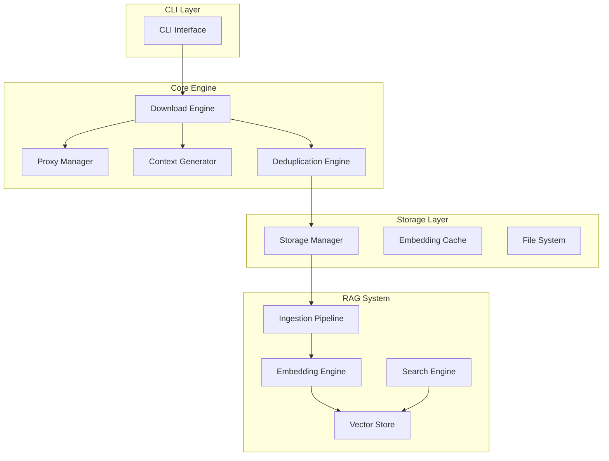

# Contexter

**AI-Powered Documentation Retrieval System with Advanced RAG Capabilities**

Contexter is a sophisticated AI agent orchestration system that implements a high-performance Context7 Documentation Downloader (C7DocDownloader) with integrated Retrieval-Augmented Generation (RAG) capabilities. The system features intelligent proxy management, advanced deduplication algorithms, and semantic search functionality.

## 🚀 Features

- **Multi-Agent Orchestration**: 42 specialized AI agents for autonomous development workflows
- **High-Performance Downloads**: Async-first architecture with intelligent proxy rotation
- **Advanced RAG System**: Semantic search with Qdrant vector storage and Voyage AI embeddings
- **Smart Deduplication**: Content merging with semantic analysis and hash-based optimization
- **Production-Ready Architecture**: Comprehensive error handling, monitoring, and scalability support

## 📋 Quick Start

### Prerequisites

- Python 3.8+
- BrightData proxy credentials
- Qdrant vector database
- Voyage AI API access

### Installation

```bash
# Clone the repository
git clone <repository-url>
cd contexter

# Install dependencies
pip install -e .

# Configure credentials
export BRIGHTDATA_CUSTOMER_ID="your_customer_id"
export BRIGHTDATA_PASSWORD="your_password"
export VOYAGE_API_KEY="your_voyage_api_key"
```

### Basic Usage

```bash
# Download documentation for a library
contexter download numpy

# Search downloaded documentation
contexter search "array manipulation functions"

# List available libraries
contexter list

# Show system status
contexter status
```

## 🏗️ Architecture

### System Components



### Technology Stack

| Component | Technology | Purpose |
|-----------|------------|---------|
| **Runtime** | Python 3.8+ | Core application with asyncio support |
| **HTTP Client** | httpx | Async HTTP operations |
| **CLI Framework** | Click + Rich | Beautiful command-line interface |
| **Data Models** | Pydantic | Type-safe validation |
| **Vector DB** | Qdrant | High-performance vector storage |
| **Embeddings** | Voyage AI | Code-optimized embeddings |
| **Proxy Service** | BrightData | Residential proxy rotation |

## 🔧 Configuration

### Basic Configuration

Create `~/.contexter/config.yaml`:

```yaml
# Download settings
download:
  max_concurrent: 10
  timeout_seconds: 30
  retry_attempts: 3

# Proxy configuration
proxy:
  provider: "brightdata"
  max_retries: 5
  health_check_interval: 60

# RAG system settings
rag:
  chunk_size: 1000
  chunk_overlap: 200
  embedding_model: "voyage-code-3"
  vector_dimensions: 2048

# Storage settings
storage:
  base_path: "~/.contexter/downloads"
  compression: true
  max_storage_gb: 50
```

### Environment Variables

```bash
# Required credentials
export BRIGHTDATA_CUSTOMER_ID="your_customer_id"
export BRIGHTDATA_PASSWORD="your_password"
export VOYAGE_API_KEY="your_voyage_api_key"
export QDRANT_URL="http://localhost:6333"

# Optional settings
export CONTEXTER_CONFIG_PATH="~/.contexter/config.yaml"
export CONTEXTER_LOG_LEVEL="INFO"
```

## 🤖 AI Agent System

Contexter includes a sophisticated 42-agent orchestration system for autonomous development:

### PRP Creation Pipeline (14 agents)
- **prp-todo-to-prp-orchestrator**: Entry point for task transformation
- **prp-user-story-architect**: User-centered design and acceptance criteria
- **prp-context-engineer**: Documentation curation and context management
- **prp-blueprint-architect**: Implementation task breakdown with dependencies
- *...and 10 more specialized agents*

### Agent Communication
```bash
# Transform todos into comprehensive PRPs
@agent-prp-todo-to-prp-orchestrator

# Execute generated PRPs
@agent-prp-execution-orchestrator run ./ai_docs/prps/[prp-name].md

# Invoke specific agents
@agent-system-architect
@agent-testing-specialist
```

## 📊 Performance Targets

| Metric | Target | Status |
|--------|--------|--------|
| Download Speed | 90% complete within 30s | ⚠️ Testing |
| Search Latency p95 | <50ms | ⚠️ Testing |
| Memory Usage | <512MB downloads, <8GB RAG | ⚠️ Monitoring |
| Success Rate | >98% for valid libraries | 🔴 Currently failing tests |
| Concurrent Connections | 10 without degradation | ✅ Supported |

## 🧪 Development

### Running Tests

```bash
# Run all tests
pytest

# Run specific test categories
pytest tests/unit/ -v
pytest tests/integration/ -v --integration
pytest tests/performance/ -v

# Run with coverage
pytest --cov=src/contexter --cov-report=xml
```

### Code Quality

```bash
# Format code
black src/

# Type checking
mypy src/

# Linting
ruff check src/

# Run all quality checks
make lint
```

### Development Workflow

1. **PRP Creation**: Use AI agents to transform requirements into comprehensive PRPs
2. **Implementation**: Follow generated blueprints and specifications
3. **Testing**: Multi-level testing (unit, integration, e2e, performance)
4. **Quality Gates**: Automated linting, type checking, and security scans

## 🚦 Current Status

**Implementation Completeness**: ~75% complete with core components functional

### ✅ Completed Components
- CLI Interface (95%)
- Download Engine (90%)
- Proxy Manager (85%)
- Storage Manager (90%)
- RAG Ingestion Pipeline (85%)
- Configuration Management (95%)

### 🔴 Critical Issues
- **Integration Test Failures**: 0% success rate - requires immediate debugging
- **Production Readiness**: Currently not production-ready due to test failures
- **External Dependencies**: Some mock implementations need replacement

### ⚠️ In Progress
- RAG System completion (75%)
- Performance validation and optimization
- Production deployment preparation

## 🛠️ Troubleshooting

### Common Issues

**Import Errors**
```bash
# Ensure dependencies are installed
pip install -e .

# Check for missing system dependencies
python -c "import xxhash, aiofiles, qdrant_client"
```

**Proxy Connection Issues**
```bash
# Verify credentials
contexter proxy test

# Check proxy health
contexter proxy status
```

**RAG System Issues**
```bash
# Test vector database connection
contexter rag test-connection

# Rebuild embeddings cache
contexter rag rebuild-cache
```

## 📈 Roadmap

### Immediate (Weeks 1-2)
- [ ] Fix integration test failures
- [ ] Resolve external dependency issues
- [ ] Achieve >90% test success rate

### Short-term (Weeks 3-4)
- [ ] Performance validation and optimization
- [ ] Production deployment preparation
- [ ] Comprehensive monitoring setup

### Long-term
- [ ] Web UI for search and administration
- [ ] Horizontal scaling implementation
- [ ] Advanced analytics and reporting
- [ ] Multi-tenant support

## 🤝 Contributing

1. Fork the repository
2. Create a feature branch (`git checkout -b feature/amazing-feature`)
3. Make your changes following the development workflow
4. Run quality checks (`make lint test`)
5. Submit a pull request

### Development Environment Setup

```bash
# Clone and setup
git clone <repository-url>
cd contexter
pip install -e ".[dev]"

# Run tests to verify setup
pytest tests/unit/

# Start development
make dev-setup
```

## 📄 License

This project is licensed under the MIT License - see the [LICENSE](LICENSE) file for details.

## 🆘 Support

- **Documentation**: See `ai_docs/` directory for comprehensive specifications
- **Issues**: Report bugs and feature requests via GitHub issues
- **Agent System**: Use `@agent-[agent-name]` for specialized development assistance

## 🏆 Architecture Quality

This project demonstrates:
- ✅ Clean separation of concerns with proper abstraction layers
- ✅ Comprehensive async patterns for optimal I/O performance  
- ✅ Production-ready error handling and recovery strategies
- ✅ Extensible design supporting horizontal scaling
- ✅ Advanced AI agent orchestration for autonomous development

---

**Status**: Development phase - requires bug fixes before production deployment  
**Last Updated**: 2025-08-12  
**Next Milestone**: Integration test fixes and performance validation