# Contexter 🚀

> **High-Performance Documentation Platform with AI-Powered Semantic Search**

Contexter is a production-ready documentation platform that combines intelligent documentation downloading with advanced RAG (Retrieval-Augmented Generation) search capabilities. Built with async-first Python architecture for maximum performance and scalability.

[](https://github.com/contexter)
[](https://python.org)
[](#architecture)
[](#performance)

## 🎯 Key Features

### 📥 **C7DocDownloader System**
- **Intelligent Proxy Rotation**: BrightData residential proxy integration for rate limit bypass
- **99%+ Deduplication Accuracy**: Advanced content deduplication with xxhash algorithms  
- **Context7 API Integration**: Seamless documentation retrieval with rate limiting
- **Compressed Storage**: Gzip compression with SHA-256 integrity verification

### 🧠 **RAG Search System**
- **Voyage AI Embeddings**: State-of-the-art semantic understanding
- **Qdrant Vector Database**: High-performance vector similarity search
- **Hybrid Search**: Combines semantic and keyword matching
- **Sub-50ms Latency**: Optimized for real-time search performance

### ⚡ **Performance & Scalability**
- **Async-First Architecture**: Built for maximum concurrency and throughput
- **Circuit Breaker Patterns**: Resilient error handling and graceful degradation
- **Connection Pooling**: Optimized resource management
- **Horizontal Scaling**: Production-ready scalability patterns

## 🚀 Quick Start

### Installation

```bash
# Clone the repository
git clone https://github.com/your-org/contexter.git
cd contexter

# Install dependencies
pip install -e .

# Configure environment
cp .env.example .env
# Edit .env with your API keys
```

### Basic Usage

```bash
# Download documentation for a library
contexter download --library "fastapi" --version "latest"

# Start RAG processing
contexter ingest --source "./downloads"

# Search documentation
contexter search "How to create async endpoints?"

# Start web API server
contexter serve --host "0.0.0.0" --port 8000
```

### API Usage

```python
from contexter import ContexterClient

# Initialize client
client = ContexterClient()

# Download documentation
await client.download_library("fastapi", version="latest")

# Search with semantic understanding
results = await client.search("async dependency injection patterns")

for result in results:
    print(f"Score: {result.score}")
    print(f"Content: {result.content}")
```

## 🏗️ Architecture

Contexter follows a modular, async-first architecture designed for production environments:

```mermaid
graph TB
    subgraph "User Interface"
        CLI[🔧 CLI Interface]
        API[🌐 REST API]
    end
    
    subgraph "Core Processing"
        Download[⚡ Download Engine]
        Dedupe[🔀 Deduplication]
        Ingest[📥 RAG Pipeline]
        Search[🔍 Search Engine]
    end
    
    subgraph "External Services"
        Context7[📚 Context7 API]
        Voyage[🧠 Voyage AI]
        Proxies[🔄 BrightData]
        Vector[🗄️ Qdrant DB]
    end
    
    CLI --> Download
    CLI --> Search
    API --> Search
    
    Download --> Context7
    Download --> Proxies
    Download --> Dedupe
    
    Dedupe --> Ingest
    Ingest --> Voyage
    Ingest --> Vector
    
    Search --> Vector
    Search --> Voyage
```



### Core Components

| Component | Purpose | Performance |
|-----------|---------|-------------|
| **Download Engine** | Orchestrates documentation retrieval | 10 concurrent connections |
| **Deduplication** | Content deduplication with 99%+ accuracy | xxhash-based processing |
| **RAG Pipeline** | Document processing and embedding | >1000 docs/minute |
| **Search Engine** | Hybrid semantic + keyword search | <50ms p95 latency |
| **Vector Store** | Qdrant-based similarity search | Horizontal scaling ready |

## 📊 Performance

### Benchmarks
- **Download Throughput**: 90% of downloads complete within 30 seconds
- **Search Latency**: p95 <50ms, p99 <100ms
- **Processing Speed**: >1000 documents per minute
- **Memory Efficiency**: <8GB for full RAG operations
- **Cache Hit Rate**: 50%+ for embedding operations

### Scalability
- **Concurrent Downloads**: 10+ proxy connections
- **Horizontal Scaling**: Production-ready scaling patterns
- **Resource Management**: Intelligent connection pooling
- **Adaptive Processing**: Dynamic batch size optimization

## 🛠️ Development

### Project Structure

```
contexter/
├── src/contexter/           # Main application (31K+ lines)
│   ├── cli/                # Command-line interface
│   ├── core/               # Business logic engines  
│   ├── integration/        # External service clients
│   ├── vector/            # RAG/embedding components
│   ├── ingestion/         # Document processing
│   └── storage/           # Storage abstractions
├── tests/                  # Comprehensive test suite
│   ├── unit/              # Component unit tests
│   ├── integration/       # Integration testing
│   ├── e2e/              # End-to-end workflows
│   ├── performance/       # Load and performance
│   └── vector/           # RAG system validation
├── ai_docs/               # AI-generated documentation
│   ├── blueprints/        # Implementation guides
│   ├── specifications/    # Technical specs
│   └── validation/       # Testing strategies
└── examples/              # Usage examples
```

### Development Setup

```bash
# Install development dependencies
pip install -e ".[dev]"

# Run tests
pytest tests/ -v

# Code formatting and linting
black src/ tests/
ruff check src/ tests/
mypy src/

# Run integration tests
pytest tests/integration/ -v

# Performance testing
pytest tests/performance/ -v
```

### Testing Strategy

- **Unit Tests** (12 files): Individual component testing
- **Integration Tests** (8 files): Component interaction validation
- **End-to-End Tests** (4 files): Complete workflow testing
- **Performance Tests**: Load testing and benchmarking
- **Live Service Tests**: Real API validation

## 🔧 Configuration

### Environment Variables

```bash
# Context7 API
CONTEXT7_API_KEY=your_api_key
CONTEXT7_BASE_URL=https://api.context7.com

# Voyage AI
VOYAGE_API_KEY=your_voyage_key

# BrightData Proxies
BRIGHTDATA_USERNAME=your_username
BRIGHTDATA_PASSWORD=your_password

# Qdrant Vector DB
QDRANT_URL=http://localhost:6333
QDRANT_API_KEY=your_qdrant_key

# Performance Tuning
MAX_CONCURRENT_DOWNLOADS=10
EMBEDDING_BATCH_SIZE=50
SEARCH_TIMEOUT_MS=5000
```

### Advanced Configuration

```yaml
# contexter.yaml
download:
  max_concurrent: 10
  timeout_seconds: 30
  proxy_rotation: true
  
processing:
  chunk_size: 1000
  chunk_overlap: 200
  batch_size: 50
  
search:
  similarity_threshold: 0.7
  max_results: 20
  hybrid_alpha: 0.7
  
storage:
  compression: gzip
  verify_integrity: true
  cache_ttl: 3600
```

## 🚀 Deployment

### Docker Deployment

```dockerfile
FROM python:3.11-slim

WORKDIR /app
COPY . .

RUN pip install -e .

EXPOSE 8000

CMD ["contexter", "serve", "--host", "0.0.0.0", "--port", "8000"]
```

### Production Considerations

- **Monitoring**: Comprehensive health checks and metrics
- **Scaling**: Horizontal scaling with load balancing
- **Security**: API key rotation and secure credential storage
- **Performance**: Connection pooling and intelligent caching
- **Reliability**: Circuit breakers and graceful degradation

## 📈 Monitoring

### Health Checks
```bash
# System health
curl http://localhost:8000/health

# Service dependencies
curl http://localhost:8000/health/dependencies

# Performance metrics
curl http://localhost:8000/metrics
```

### Key Metrics
- **Download Success Rate**: Target >95%
- **Search Latency**: p95 <50ms target
- **Error Rate**: <1% for all operations
- **Memory Usage**: <8GB for RAG operations
- **API Rate Limits**: Context7 and Voyage AI monitoring

## 🤝 Contributing

We welcome contributions! Please see our [contribution guidelines](CONTRIBUTING.md) for details.

### Development Workflow

1. **Fork the repository**
2. **Create feature branch**: `git checkout -b feature/amazing-feature`
3. **Run tests**: `pytest tests/ -v`
4. **Commit changes**: `git commit -m 'Add amazing feature'`
5. **Push branch**: `git push origin feature/amazing-feature`
6. **Create Pull Request**

### Code Standards

- **Type Hints**: All functions must have type annotations
- **Testing**: >90% test coverage for new features
- **Documentation**: Update docstrings and examples
- **Performance**: Maintain async patterns throughout
- **Error Handling**: Use established error handling patterns

## 📄 License

This project is licensed under the MIT License - see the [LICENSE](LICENSE) file for details.

## 🙏 Acknowledgments

- **Context7 Team**: For the comprehensive documentation API
- **Voyage AI**: For state-of-the-art embedding models  
- **Qdrant**: For high-performance vector database
- **BrightData**: For reliable proxy infrastructure

## 📞 Support

- **Documentation**: [Full documentation](https://docs.contexter.com)
- **Issues**: [GitHub Issues](https://github.com/your-org/contexter/issues)
- **Discussions**: [GitHub Discussions](https://github.com/your-org/contexter/discussions)
- **Email**: [support@contexter.com](mailto:support@contexter.com)

---

<div align="center">

**Built with ❤️ for the developer community**

[](https://github.com/your-org/contexter)
[](https://github.com/your-org/contexter)
[](https://github.com/your-org/contexter/issues)

</div>