# System Architecture Design - Contexter Documentation Platform

## 1. Executive Summary

The Contexter Documentation Platform is designed as a comprehensive documentation retrieval and intelligent search system. The architecture combines two major subsystems: the Context7 Documentation Downloader (C7DocDownloader) for comprehensive documentation acquisition, and the RAG (Retrieval-Augmented Generation) System for intelligent semantic search capabilities.

**Key Architectural Decisions:**
- **Async-First Design**: Python asyncio-based architecture for optimal I/O-bound performance across both systems
- **Proxy Abstraction Layer**: BrightData residential proxy integration with circuit breaker pattern for download operations
- **Multi-Query Strategy**: Parallel request processing with intelligent context generation for comprehensive coverage
- **RAG Integration**: Advanced semantic search using Voyage AI embeddings and Qdrant vector database
- **Hybrid Search**: Combination of semantic and keyword-based search for optimal retrieval accuracy
- **Modular Storage**: Unified storage architecture supporting both raw documentation and vector embeddings

**Design Principles:**
- Resilience: Circuit breaker patterns and graceful degradation across all components
- Performance: Sub-50ms search latency, 30-second download completions, >1000 docs/minute processing
- Extensibility: Plugin architecture for proxy providers, embedding models, and vector databases
- Compliance: Rate limiting respect with ToS-compliant usage patterns
- Scalability: Horizontal scaling support for both download and search operations

## 2. Integrated Architectural Drivers

### 2.1 Combined Functional Requirements
**C7DocDownloader Requirements:**
- **FR-003**: Multi-query documentation fetching with 5+ different search contexts
- **FR-004**: Intelligent deduplication achieving >99% accuracy
- **FR-005**: BrightData proxy integration with minimum 10 IP rotation pool
- **FR-006**: Smart request distribution with round-robin and jitter
- **FR-007**: Local documentation storage with compression and versioning

**RAG System Requirements:**
- **FR-RAG-001**: JSON document parsing and intelligent chunking (1000 tokens, 200 overlap)
- **FR-RAG-002**: Voyage AI embedding generation with 2048-dimensional vectors
- **FR-RAG-003**: Qdrant vector storage with HNSW indexing for sub-50ms queries
- **FR-RAG-004**: Hybrid search combining semantic similarity and keyword matching
- **FR-RAG-005**: Metadata filtering and result reranking for improved relevance

### 2.2 Unified Quality Attributes
- **Performance**: 90% downloads complete within 30 seconds, p95 search latency <50ms
- **Throughput**: >1000 documents/minute embedding generation, 100 concurrent search queries
- **Concurrency**: 10 concurrent proxy connections, async processing throughout
- **Memory**: Maximum 512MB for downloads, 8GB for RAG operations
- **Accuracy**: >99% deduplication accuracy, >95% search recall@10
- **Reliability**: 98% success rate for downloads, 99.9% search availability

### 2.3 Technology Constraints
- Python 3.9+ requirement for full asyncio and modern typing support
- Context7 API 200K token limit per request
- Voyage AI rate limiting: 300 requests/minute, 1M tokens/minute
- BrightData proxy costs under $100/month
- Qdrant v1.8.0+ for advanced vector features

## 3. System Context (C4 Level 1)

```mermaid
graph TB
    subgraph "External Users"
        DevUser[👨‍💻 Developer]
        DocUser[📚 Documentation User]
        AdminUser[⚙️ System Admin]
    end
    
    subgraph "Contexter Platform"
        CLI[🔧 Contexter CLI]
        RAGAPI[🔍 RAG Search API]
    end
    
    subgraph "External Services"
        Context7[🌐 Context7 API<br/>Documentation Service]
        VoyageAI[🧠 Voyage AI<br/>Embedding Service]
        BrightData[🔄 BrightData<br/>Residential Proxies]
    end
    
    subgraph "Storage Systems"
        LocalFS[💾 Local File System<br/>Raw Documentation]
        Qdrant[🗄️ Qdrant Vector DB<br/>Embeddings & Search]
        SQLiteCache[📋 SQLite Cache<br/>Embedding Cache]
    end
    
    DevUser --> CLI
    DocUser --> RAGAPI
    AdminUser --> CLI
    
    CLI --> Context7
    CLI --> BrightData
    CLI --> LocalFS
    CLI --> RAGAPI
    
    RAGAPI --> VoyageAI
    RAGAPI --> Qdrant
    RAGAPI --> SQLiteCache
    RAGAPI --> LocalFS
    
    Context7 -.-> RateLimit[⏱️ Rate Limiting<br/>100 req/hr per IP]
    VoyageAI -.-> APILimits[⏱️ API Limits<br/>300 req/min, 1M tokens/min]
    BrightData -.-> ProxyPool[🌍 Proxy Pool<br/>10+ Residential IPs]
    
    style CLI fill:#e1f5fe
    style RAGAPI fill:#e8f5e8
    style Context7 fill:#fff3e0
    style VoyageAI fill:#f3e5f5
    style BrightData fill:#e3f2fd
    style Qdrant fill:#fce4ec
```



**System Actors:**
- **Developer**: Primary user downloading and searching documentation during development
- **Documentation User**: End user performing semantic searches across documentation
- **System Admin**: Administrative user managing configuration, monitoring, and maintenance
- **Context7 API**: Documentation aggregation service with rate limiting constraints
- **Voyage AI**: Code-optimized embedding generation service
- **BrightData**: Residential proxy service for rate limit bypass
- **Qdrant**: High-performance vector database for semantic search
- **Local Storage**: File system storage for raw documentation and caching

## 4. Container Architecture (C4 Level 2)

```mermaid
graph TB
    subgraph "Contexter Platform"
        subgraph "C7DocDownloader System"
            CLI[🔧 CLI Interface<br/>Click Framework]
            ProxyMgr[🔄 Proxy Manager<br/>Connection Pool + Health Check]
            DownloadEngine[⚡ Download Engine<br/>Async Request Processing]
            DedupeEngine[🔀 Deduplication Engine<br/>Content Merging]
            StorageMgr[💾 Storage Manager<br/>JSON + Compression]
            ConfigMgr[⚙️ Configuration Manager<br/>YAML Configuration]
        end
        
        subgraph "RAG System"
            IngestionPipeline[📥 Document Ingestion<br/>JSON Parser + Chunker]
            EmbeddingEngine[🧠 Embedding Generation<br/>Voyage AI Client]
            VectorStore[🗄️ Vector Storage<br/>Qdrant Manager]
            SearchEngine[🔍 Search Engine<br/>Hybrid Semantic+Keyword]
            RAGAPI[🌐 RAG API<br/>REST Endpoints]
            EmbeddingCache[📋 Embedding Cache<br/>SQLite Storage]
        end
        
        subgraph "Shared Components"
            MetricsCollector[📊 Metrics Collector<br/>Performance Monitoring]
            ErrorHandler[🚨 Error Handler<br/>Centralized Error Management]
            HealthMonitor[❤️ Health Monitor<br/>System Health Checks]
        end
    end
    
    subgraph "External Systems"
        Context7[🌐 Context7 API]
        VoyageAI[🧠 Voyage AI]
        BrightData[🔄 BrightData Service]
        QdrantDB[🗄️ Qdrant Database]
        LocalFileSystem[💾 Local Storage]
    end
    
    %% C7DocDownloader connections
    CLI --> ConfigMgr
    CLI --> DownloadEngine
    DownloadEngine --> ProxyMgr
    DownloadEngine --> Context7
    DownloadEngine --> DedupeEngine
    DedupeEngine --> StorageMgr
    StorageMgr --> LocalFileSystem
    ProxyMgr --> BrightData
    
    %% RAG System connections
    CLI --> IngestionPipeline
    IngestionPipeline --> LocalFileSystem
    IngestionPipeline --> EmbeddingEngine
    EmbeddingEngine --> VoyageAI
    EmbeddingEngine --> EmbeddingCache
    EmbeddingEngine --> VectorStore
    VectorStore --> QdrantDB
    SearchEngine --> VectorStore
    SearchEngine --> EmbeddingEngine
    RAGAPI --> SearchEngine
    
    %% Shared component connections
    DownloadEngine --> MetricsCollector
    SearchEngine --> MetricsCollector
    DownloadEngine --> ErrorHandler
    SearchEngine --> ErrorHandler
    HealthMonitor --> ProxyMgr
    HealthMonitor --> VectorStore
    
    %% Integration flow
    StorageMgr -.->|Documentation Ready| IngestionPipeline
    
    style CLI fill:#e3f2fd
    style IngestionPipeline fill:#e8f5e8
    style EmbeddingEngine fill:#f3e5f5
    style SearchEngine fill:#fff3e0
    style RAGAPI fill:#e1f5fe
    style MetricsCollector fill:#fce4ec
```



### 4.2 System Integration Flow

**Documentation Pipeline Flow:**
1. **Download Phase**: CLI → Download Engine → Context7 API (via proxies) → Raw Documentation
2. **Storage Phase**: Deduplication → Storage Manager → Local File System (compressed JSON)
3. **Ingestion Phase**: Ingestion Pipeline → JSON Parser → Document Chunker
4. **Embedding Phase**: Embedding Engine → Voyage AI → Vector Generation → Qdrant Storage
5. **Search Phase**: Search Engine → Hybrid Query Processing → Ranked Results

**Data Dependencies:**
- RAG system depends on C7DocDownloader output (JSON documentation files)
- Search accuracy depends on download completeness and deduplication quality
- Vector storage size scales with documentation volume and chunking strategy

## 5. Component Design (C4 Level 3)

### 5.1 Enhanced Download Engine with RAG Integration


### 5.2 RAG System Components

#### 5.2.1 Document Ingestion Pipeline


**Chunking Strategy:**
- **Token-Based**: 1000 tokens per chunk using tiktoken cl100k_base
- **Semantic Boundaries**: Preserve code blocks, functions, and paragraph structures
- **Overlap Management**: 200-token overlap for context continuity
- **Language Awareness**: Programming language-specific chunking rules
- **Maximum Chunks**: 100 chunks per document to prevent memory issues

#### 5.2.2 Embedding Generation Engine


**Performance Optimizations:**
- **Batch Processing**: Group requests for optimal API utilization
- **Intelligent Caching**: SQLite-based cache with LRU eviction
- **Rate Limiting**: Built-in throttling to respect Voyage AI limits
- **Error Handling**: Exponential backoff with jitter for API failures
- **Memory Management**: Streaming processing for large document sets

#### 5.2.3 Vector Storage and Search Engine


**Search Features:**
- **Semantic Search**: Cosine similarity with 2048-dimensional vectors
- **Keyword Search**: BM25 algorithm for exact term matching
- **Hybrid Scoring**: Weighted combination (70% semantic, 30% keyword)
- **Metadata Filtering**: Library, version, document type, and section filters
- **Result Reranking**: Quality signals including trust score, star count, and recency
- **Performance Target**: p95 latency <50ms, p99 latency <100ms

## 6. Data Architecture

### 6.1 Unified Data Model


### 6.2 Storage Architecture

**Multi-Tier Storage Strategy:**
1. **Raw Documentation Layer**: Compressed JSON files with version management
2. **Vector Storage Layer**: Qdrant database with HNSW indexing
3. **Cache Layer**: SQLite embedding cache and in-memory query cache
4. **Metadata Layer**: SQLite index for search optimization and statistics

**File System Organization:**
```
{base_path}/
├── documentation/           # C7DocDownloader output
│   ├── {library_id}/
│   │   ├── metadata.json
│   │   ├── v1.0.0/
│   │   │   ├── documentation.json.gz
│   │   │   └── metadata.json
│   │   └── latest -> v1.0.0
│   └── .contexter/
├── rag/                     # RAG system data
│   ├── embeddings/
│   │   ├── cache.db         # SQLite embedding cache
│   │   └── metadata.json    # Cache statistics
│   ├── qdrant/              # Qdrant database files
│   │   ├── collection/
│   │   └── snapshots/
│   └── search/
│       ├── query_cache.db   # Recent query results
│       └── analytics.json   # Search analytics
└── config/
    ├── config.yaml          # Unified configuration
    ├── credentials/         # Encrypted credentials
    └── logs/               # Application logs
```

### 6.3 Data Flow Integration


## 7. Technology Stack

### 7.1 Unified Technology Selection

| Layer | Technology | Version | Justification |
|-------|------------|---------|---------------|
| **Runtime** | Python | 3.9+ | Asyncio support, typing, rich ML ecosystem |
| **HTTP Client** | aiohttp | 3.8+ | Async performance, proxy support, connection pooling |
| **CLI Framework** | Click | 8.1+ | Mature, extensive features, excellent documentation |
| **Async Framework** | asyncio | Built-in | Native Python async support for I/O operations |
| **Vector Database** | Qdrant | 1.8.0+ | High performance, HNSW indexing, Python client |
| **Embeddings** | Voyage AI | voyage-code-3 | Code-optimized embeddings, 2048 dimensions |
| **Text Processing** | tiktoken | 0.5+ | Accurate tokenization for chunking |
| **Compression** | gzip | Built-in | Standard compression, good speed/ratio balance |
| **Hashing** | xxhash | 3.3+ | Extremely fast hashing for deduplication |
| **Configuration** | PyYAML | 6.0+ | Human-readable config files |
| **JSON Processing** | orjson | 3.9+ | Fastest JSON parsing for Python |
| **Progress Display** | rich | 13.0+ | Beautiful CLI progress bars and formatting |
| **HTTP Requests** | httpx | 0.24+ | Modern async HTTP client for Voyage AI |
| **Database** | SQLite | 3.38+ | Embedded database for caching and metadata |
| **Monitoring** | prometheus-client | 0.17+ | Metrics export for monitoring |

### 7.2 Architecture-Specific Trade-offs

**Vector Database Selection: Qdrant vs Pinecone vs Weaviate**
- **Selected**: Qdrant
- **Reasoning**: Local deployment, excellent performance, flexible filtering, cost-effective
- **Rejected**: Pinecone (cloud cost), Weaviate (resource heavy)

**Embedding Model: Voyage AI vs OpenAI vs Cohere**
- **Selected**: Voyage AI voyage-code-3
- **Reasoning**: Code-optimized, competitive pricing, 2048 dimensions, batch processing
- **Rejected**: OpenAI (cost), Cohere (less code-specific)

**Hybrid Search: Built-in vs External**
- **Selected**: Built-in hybrid search implementation
- **Reasoning**: Better control over fusion algorithm, reduced dependencies
- **Trade-off**: More implementation complexity vs better customization

## 8. Integration Patterns

### 8.1 C7DocDownloader to RAG Pipeline

**Auto-Ingestion Pattern:**
```python
class DocumentationPipeline:
    async def on_download_complete(self, library_id: str, version: str):
        """Automatically trigger RAG ingestion after download completion."""
        doc_path = self.storage_manager.get_documentation_path(library_id, version)
        
        # Quality validation
        if not await self.quality_validator.validate_completeness(doc_path):
            logger.warning(f"Documentation incomplete for {library_id}:{version}")
            return
        
        # Trigger RAG ingestion
        await self.ingestion_pipeline.queue_document(library_id, version, doc_path)
        
    async def process_ingestion_queue(self):
        """Process queued documents for RAG ingestion."""
        async for doc_item in self.ingestion_queue:
            try:
                chunks = await self.ingestion_pipeline.parse_and_chunk(doc_item)
                embeddings = await self.embedding_engine.generate_embeddings(chunks)
                await self.vector_store.store_embeddings(embeddings)
                await self.mark_ingestion_complete(doc_item)
            except Exception as e:
                await self.handle_ingestion_error(doc_item, e)
```

### 8.2 Unified Configuration Management

**Integrated Configuration Schema:**
```yaml
# Contexter Platform Configuration
version: "2.0"
platform: "contexter-integrated"

# C7DocDownloader Settings
downloader:
  proxy:
    provider: "brightdata"
    zone_name: "zone_residential_1"
    endpoint: "brd.superproxy.io"
    port: 33335
  
  download:
    max_contexts: 7
    max_concurrent_requests: 10
    request_timeout_seconds: 30
    token_limit: 200000
  
  storage:
    base_path: "~/.contexter/downloads"
    compression_level: 6
    max_versions: 5

# RAG System Settings
rag:
  ingestion:
    auto_process: true
    chunk_size: 1000
    chunk_overlap: 200
    max_chunks_per_doc: 100
  
  embeddings:
    provider: "voyage_ai"
    model: "voyage-code-3"
    batch_size: 100
    cache_enabled: true
    cache_ttl_days: 7
  
  vector_store:
    provider: "qdrant"
    host: "localhost"
    port: 6333
    collection_name: "documentation"
    vector_size: 2048
    distance: "cosine"
  
  search:
    hybrid_enabled: true
    semantic_weight: 0.7
    keyword_weight: 0.3
    max_results: 20
    similarity_threshold: 0.7

# Shared Settings
logging:
  level: "INFO"
  file_path: "~/.contexter/logs/contexter.log"
  max_size_mb: 100
  backup_count: 5

monitoring:
  enabled: true
  metrics_port: 8080
  health_check_interval: 300
```

### 8.3 Error Handling Integration

**Unified Error Classification:**
```python
class ErrorCategory(Enum):
    # C7DocDownloader errors
    NETWORK = "network"
    PROXY = "proxy"
    API = "api"
    STORAGE = "storage"
    CONFIGURATION = "configuration"
    DEDUPLICATION = "deduplication"
    
    # RAG system errors
    INGESTION = "ingestion"
    EMBEDDING = "embedding"
    VECTOR_STORAGE = "vector_storage"
    SEARCH = "search"
    VECTOR_DATABASE = "vector_database"

class IntegratedErrorHandler:
    async def handle_pipeline_error(self, error: Exception, stage: str, context: dict):
        """Handle errors across the entire documentation pipeline."""
        error_category = self.classify_error(error, stage)
        recovery_strategy = self.get_recovery_strategy(error_category, stage)
        
        if recovery_strategy.is_recoverable:
            await self.attempt_recovery(error, recovery_strategy, context)
        else:
            await self.escalate_error(error, error_category, context)
```

## 9. Quality Attributes

### 9.1 Integrated Performance Requirements

**End-to-End Performance Targets:**
- **Download Phase**: 90% of downloads complete within 30 seconds
- **Ingestion Phase**: >1000 documents processed per minute
- **Search Phase**: p95 latency <50ms, p99 latency <100ms
- **Memory Usage**: 512MB for download operations, 8GB for RAG processing
- **Throughput**: 100 concurrent search queries without degradation

### 9.2 Scalability Architecture

**Horizontal Scaling Design:**
- **Download Scaling**: Multiple downloader instances with shared proxy pool
- **Ingestion Scaling**: Distributed embedding generation with work queues
- **Search Scaling**: Qdrant clustering support for high-volume queries
- **Storage Scaling**: Partitioned storage with library-based sharding

### 9.3 Reliability and Fault Tolerance

**Multi-System Resilience:**
- **Download Resilience**: Circuit breakers, proxy failover, retry logic
- **RAG Resilience**: Embedding cache, vector database replication, search fallbacks
- **Data Integrity**: End-to-end checksums, vector validation, consistency checks
- **Service Recovery**: Automatic restart, state recovery, graceful degradation

## 10. Deployment Architecture

```mermaid
graph TB
    subgraph "Production Environment"
        subgraph "Application Layer"
            ContexterCLI[🔧 Contexter CLI]
            RAGAPI[🌐 RAG API Server]
            WebUI[🖥️ Web UI<br/>Optional]
        end
        
        subgraph "Processing Layer"
            DownloadWorkers[⚡ Download Workers<br/>Multiple Instances]
            IngestionWorkers[📥 Ingestion Workers<br/>Async Processing]
            EmbeddingWorkers[🧠 Embedding Workers<br/>Batch Processing]
        end
        
        subgraph "Data Layer"
            QdrantCluster[🗄️ Qdrant Cluster<br/>Vector Database]
            SQLiteCluster[📋 SQLite Cluster<br/>Metadata & Cache]
            FileStorage[💾 File Storage<br/>Documentation Archive]
        end
        
        subgraph "Infrastructure Layer"
            LoadBalancer[⚖️ Load Balancer<br/>API Traffic]
            Monitoring[📊 Monitoring<br/>Prometheus + Grafana]
            LogAggregation[📋 Log Aggregation<br/>ELK Stack]
        end
    end
    
    subgraph "External Services"
        Context7API[🌐 Context7 API]
        VoyageAIAPI[🧠 Voyage AI API]
        BrightDataProxy[🔄 BrightData Proxies]
    end
    
    ContexterCLI --> DownloadWorkers
    RAGAPI --> IngestionWorkers
    RAGAPI --> EmbeddingWorkers
    WebUI --> RAGAPI
    
    DownloadWorkers --> Context7API
    DownloadWorkers --> BrightDataProxy
    DownloadWorkers --> FileStorage
    
    IngestionWorkers --> FileStorage
    IngestionWorkers --> EmbeddingWorkers
    EmbeddingWorkers --> VoyageAIAPI
    EmbeddingWorkers --> QdrantCluster
    
    RAGAPI --> QdrantCluster
    RAGAPI --> SQLiteCluster
    
    LoadBalancer --> RAGAPI
    Monitoring --> DownloadWorkers
    Monitoring --> IngestionWorkers
    Monitoring --> QdrantCluster
    
    LogAggregation --> ContexterCLI
    LogAggregation --> RAGAPI
    
    style ContexterCLI fill:#e1f5fe
    style RAGAPI fill:#e8f5e8
    style QdrantCluster fill:#fce4ec
    style Monitoring fill:#fff3e0
```



**Deployment Options:**
1. **Single-Node Development**: All components on single machine with local Qdrant
2. **Multi-Node Production**: Distributed deployment with Qdrant cluster
3. **Docker Compose**: Containerized deployment for easy scaling
4. **Kubernetes**: Full orchestration with auto-scaling and service discovery

## 11. Architecture Decision Records (ADRs)

### ADR-006: RAG System Integration Architecture

- **Status**: Accepted
- **Context**: Need for intelligent semantic search capabilities on downloaded documentation
- **Decision**: Integrate RAG system with automatic ingestion pipeline post-download
- **Consequences**:
  - ✅ Seamless user experience from download to search
  - ✅ Automatic processing eliminates manual ingestion steps
  - ✅ Unified configuration and error handling
  - ⚠️ Increased system complexity and resource requirements
  - ⚠️ Dependency on external embedding service (Voyage AI)

### ADR-007: Voyage AI Embedding Selection

- **Status**: Accepted
- **Context**: Need for high-quality code-specific embeddings for documentation search
- **Decision**: Use Voyage AI voyage-code-3 model for embedding generation
- **Consequences**:
  - ✅ Code-optimized embeddings improve search relevance for technical content
  - ✅ Competitive pricing and performance compared to alternatives
  - ✅ 2048 dimensions provide good semantic representation
  - ⚠️ External dependency with API rate limiting (300 req/min)
  - ⚠️ Cost scaling with document volume

### ADR-008: Qdrant Vector Database Selection

- **Status**: Accepted
- **Context**: Need for high-performance vector storage and search capabilities
- **Decision**: Use Qdrant as primary vector database with local deployment
- **Consequences**:
  - ✅ Excellent performance with HNSW indexing (sub-50ms queries)
  - ✅ Local deployment eliminates external dependencies and costs
  - ✅ Flexible filtering and metadata support
  - ✅ Built-in clustering for horizontal scaling
  - ⚠️ Additional infrastructure maintenance overhead
  - ⚠️ Storage requirements scale with vector count

### ADR-009: Hybrid Search Implementation

- **Status**: Accepted
- **Context**: Need to balance semantic similarity with exact keyword matching
- **Decision**: Implement hybrid search with 70% semantic, 30% keyword weighting
- **Consequences**:
  - ✅ Better search accuracy for both conceptual and specific queries
  - ✅ Fallback to keyword search when semantic search fails
  - ✅ Customizable weighting based on query analysis
  - ⚠️ Increased complexity in search implementation
  - ⚠️ Higher computational overhead per query

### ADR-010: Auto-Ingestion Pipeline Pattern

- **Status**: Accepted
- **Context**: Need for seamless integration between download and search capabilities
- **Decision**: Implement automatic RAG ingestion triggered by download completion
- **Consequences**:
  - ✅ Zero-touch user experience from download to searchability
  - ✅ Consistent processing pipeline with error recovery
  - ✅ Optimal resource utilization through background processing
  - ⚠️ Increased system complexity with async processing
  - ⚠️ Potential for processing backlogs during high download volumes

## 12. Risk Assessment and Mitigation

| Risk ID | Description | Probability | Impact | Mitigation Strategy |
|---------|-------------|-------------|---------|-------------------|
| **ARCH-007** | Voyage AI service disruption affects embedding generation | Low | High | Embedding cache, offline embedding models, service provider diversification |
| **ARCH-008** | Qdrant performance degrades with large vector collections | Medium | High | Collection optimization, horizontal scaling, performance monitoring |
| **ARCH-009** | Integration complexity between C7DocDownloader and RAG | Medium | Medium | Comprehensive testing, clear interface contracts, rollback capabilities |
| **ARCH-010** | Search accuracy insufficient for technical documentation | Medium | High | Evaluation framework, user feedback loops, hybrid search tuning |
| **ARCH-011** | Memory requirements exceed infrastructure capacity | Medium | Medium | Memory profiling, streaming processing, resource monitoring |
| **ARCH-012** | Auto-ingestion pipeline creates processing bottlenecks | Low | Medium | Queue management, worker scaling, priority handling |

## 13. Implementation Roadmap

### Phase 1: Foundation Integration (Sprint 1-2)
1. **Unified Configuration**: Single YAML config for both systems
2. **Shared Components**: Error handling, metrics collection, logging
3. **Basic RAG Pipeline**: Document ingestion and embedding generation
4. **Integration Points**: Download completion triggers RAG processing

### Phase 2: Search Capabilities (Sprint 3-4)
1. **Vector Storage**: Qdrant integration with HNSW indexing
2. **Basic Search**: Semantic similarity search with metadata filtering
3. **API Development**: REST endpoints for search functionality
4. **CLI Integration**: Search commands in unified CLI interface

### Phase 3: Advanced Features (Sprint 5-6)
1. **Hybrid Search**: Semantic + keyword fusion algorithm
2. **Result Reranking**: Quality signals and relevance optimization
3. **Performance Optimization**: Caching, connection pooling, batch processing
4. **Monitoring Integration**: Comprehensive metrics and health checks

### Phase 4: Production Readiness (Sprint 7-8)
1. **Horizontal Scaling**: Multi-instance support and load balancing
2. **Advanced Analytics**: Usage statistics, search analytics, cost monitoring
3. **Web Interface**: Optional web UI for search and administration
4. **Documentation**: Complete API documentation and deployment guides

---

**Architecture Version**: 2.0 (Integrated RAG System)  
**Last Updated**: 2025-08-11  
**Approved By**: System Architect  
**Review Date**: Sprint 1 Start  

*This integrated architecture design provides a comprehensive foundation for a complete documentation platform that combines high-performance downloading capabilities with intelligent semantic search, creating a unified solution for developer documentation needs.*
EOF < /dev/null