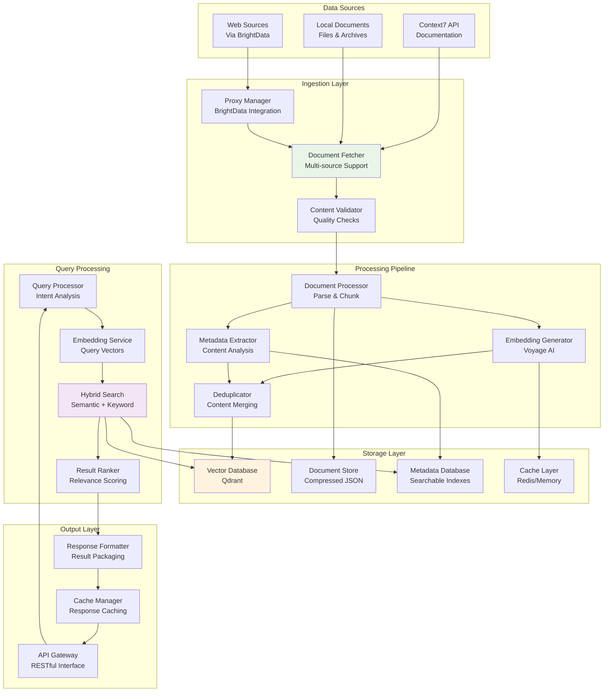

# Data Flow Design

This document defines comprehensive data pipeline and processing strategies for the Contexter RAG system, ensuring efficient data movement, transformation, and storage across all components.

## Table of Contents

1. [Data Flow Architecture](#data-flow-architecture)
2. [Data Pipeline Patterns](#data-pipeline-patterns)
3. [Document Ingestion Flow](#document-ingestion-flow)
4. [Search and Retrieval Flow](#search-and-retrieval-flow)
5. [Real-time Processing](#real-time-processing)
6. [Batch Processing](#batch-processing)
7. [Data Validation and Quality](#data-validation-and-quality)
8. [Error Handling and Recovery](#error-handling-and-recovery)

## Data Flow Architecture

### 1. Overall Data Flow Diagram



### 2. Data Flow Abstraction Layer

```python
from abc import ABC, abstractmethod
from typing import Any, Dict, List, Optional, AsyncIterator, Union, TypeVar
from dataclasses import dataclass, field
from enum import Enum
from datetime import datetime
import asyncio
import uuid

T = TypeVar('T')

class DataFlowStage(Enum):
    """Data flow processing stages."""
    INGESTION = "ingestion"
    PROCESSING = "processing"
    STORAGE = "storage"
    RETRIEVAL = "retrieval"
    OUTPUT = "output"

class DataStatus(Enum):
    """Data processing status."""
    PENDING = "pending"
    PROCESSING = "processing"
    COMPLETED = "completed"
    FAILED = "failed"
    SKIPPED = "skipped"

@dataclass
class DataFlowContext:
    """Context information for data flow operations."""
    flow_id: str
    library_id: str
    stage: DataFlowStage
    status: DataStatus
    created_at: datetime
    updated_at: datetime
    metadata: Dict[str, Any] = field(default_factory=dict)
    error_message: Optional[str] = None
    retry_count: int = 0
    
    def update_status(self, status: DataStatus, error_message: Optional[str] = None):
        """Update flow status."""
        self.status = status
        self.updated_at = datetime.utcnow()
        if error_message:
            self.error_message = error_message

@dataclass
class DataPacket:
    """Standard data packet for flow operations."""
    packet_id: str
    data: Any
    metadata: Dict[str, Any]
    context: DataFlowContext
    source_stage: Optional[DataFlowStage] = None
    target_stage: Optional[DataFlowStage] = None
    
    @classmethod
    def create(
        cls,
        data: Any,
        context: DataFlowContext,
        metadata: Optional[Dict[str, Any]] = None
    ) -> 'DataPacket':
        """Create new data packet."""
        return cls(
            packet_id=str(uuid.uuid4()),
            data=data,
            metadata=metadata or {},
            context=context
        )

class DataFlowProcessor(ABC):
    """Abstract base class for data flow processors."""
    
    def __init__(self, processor_name: str, stage: DataFlowStage):
        self.processor_name = processor_name
        self.stage = stage
        self.metrics = {
            "processed_count": 0,
            "error_count": 0,
            "total_processing_time": 0.0
        }
    
    @abstractmethod
    async def process(self, packet: DataPacket) -> DataPacket:
        """Process data packet."""
        pass
    
    @abstractmethod
    async def validate_input(self, packet: DataPacket) -> bool:
        """Validate input data packet."""
        pass
    
    async def execute(self, packet: DataPacket) -> DataPacket:
        """Execute processing with metrics and error handling."""
        start_time = asyncio.get_event_loop().time()
        
        try:
            # Validate input
            if not await self.validate_input(packet):
                raise DataFlowError(f"Input validation failed for {self.processor_name}")
            
            # Update context
            packet.context.stage = self.stage
            packet.context.status = DataStatus.PROCESSING
            packet.source_stage = self.stage
            
            # Process data
            result_packet = await self.process(packet)
            
            # Update metrics
            self.metrics["processed_count"] += 1
            result_packet.context.status = DataStatus.COMPLETED
            
            return result_packet
            
        except Exception as e:
            self.metrics["error_count"] += 1
            packet.context.update_status(DataStatus.FAILED, str(e))
            raise DataFlowError(f"Processing failed in {self.processor_name}: {e}")
        
        finally:
            processing_time = asyncio.get_event_loop().time() - start_time
            self.metrics["total_processing_time"] += processing_time
    
    def get_metrics(self) -> Dict[str, Any]:
        """Get processor metrics."""
        return {
            "processor_name": self.processor_name,
            "stage": self.stage.value,
            **self.metrics,
            "avg_processing_time": (
                self.metrics["total_processing_time"] / max(self.metrics["processed_count"], 1)
            ),
            "error_rate": (
                self.metrics["error_count"] / max(self.metrics["processed_count"] + self.metrics["error_count"], 1)
            )
        }

class DataFlowPipeline:
    """Data flow pipeline orchestrator."""
    
    def __init__(self, pipeline_name: str):
        self.pipeline_name = pipeline_name
        self.processors: List[DataFlowProcessor] = []
        self.error_handlers: Dict[str, callable] = {}
        self.pipeline_metrics = {
            "total_flows": 0,
            "successful_flows": 0,
            "failed_flows": 0
        }
    
    def add_processor(self, processor: DataFlowProcessor) -> 'DataFlowPipeline':
        """Add processor to pipeline."""
        self.processors.append(processor)
        return self
    
    def add_error_handler(self, stage: DataFlowStage, handler: callable) -> 'DataFlowPipeline':
        """Add error handler for specific stage."""
        self.error_handlers[stage.value] = handler
        return self
    
    async def execute(self, initial_data: Any, context: DataFlowContext) -> DataPacket:
        """Execute pipeline with data."""
        self.pipeline_metrics["total_flows"] += 1
        
        # Create initial packet
        packet = DataPacket.create(initial_data, context)
        
        try:
            # Process through all stages
            for processor in self.processors:
                try:
                    packet = await processor.execute(packet)
                    packet.target_stage = processor.stage
                    
                except DataFlowError as e:
                    # Try error handler
                    if processor.stage.value in self.error_handlers:
                        packet = await self.error_handlers[processor.stage.value](packet, e)
                    else:
                        raise
            
            self.pipeline_metrics["successful_flows"] += 1
            return packet
            
        except Exception as e:
            self.pipeline_metrics["failed_flows"] += 1
            context.update_status(DataStatus.FAILED, str(e))
            raise DataFlowError(f"Pipeline {self.pipeline_name} failed: {e}")
    
    def get_pipeline_metrics(self) -> Dict[str, Any]:
        """Get pipeline metrics."""
        processor_metrics = [p.get_metrics() for p in self.processors]
        
        return {
            "pipeline_name": self.pipeline_name,
            "pipeline_metrics": self.pipeline_metrics,
            "success_rate": (
                self.pipeline_metrics["successful_flows"] / 
                max(self.pipeline_metrics["total_flows"], 1)
            ),
            "processor_metrics": processor_metrics
        }

class DataFlowError(Exception):
    """Data flow specific error."""
    pass
```

## Data Pipeline Patterns

### 1. Streaming Pipeline Pattern

For real-time data processing with backpressure handling.

```python
import asyncio
from typing import AsyncIterator, Callable, Optional
from asyncio import Queue

class StreamingPipeline:
    """Streaming data pipeline with backpressure control."""
    
    def __init__(
        self,
        name: str,
        buffer_size: int = 1000,
        max_concurrent: int = 10,
        batch_size: int = 100
    ):
        self.name = name
        self.buffer_size = buffer_size
        self.max_concurrent = max_concurrent
        self.batch_size = batch_size
        
        self.input_queue: Queue = Queue(maxsize=buffer_size)
        self.output_queue: Queue = Queue(maxsize=buffer_size)
        self.semaphore = asyncio.Semaphore(max_concurrent)
        
        self.processors: List[Callable] = []
        self.running = False
        self.worker_tasks: List[asyncio.Task] = []
    
    def add_processor(self, processor: Callable) -> 'StreamingPipeline':
        """Add processor to streaming pipeline."""
        self.processors.append(processor)
        return self
    
    async def start(self):
        """Start streaming pipeline."""
        self.running = True
        
        # Start worker tasks
        for i in range(self.max_concurrent):
            task = asyncio.create_task(self._worker(f"worker_{i}"))
            self.worker_tasks.append(task)
    
    async def stop(self):
        """Stop streaming pipeline."""
        self.running = False
        
        # Cancel worker tasks
        for task in self.worker_tasks:
            task.cancel()
        
        # Wait for tasks to complete
        await asyncio.gather(*self.worker_tasks, return_exceptions=True)
        self.worker_tasks.clear()
    
    async def push(self, data: Any) -> bool:
        """Push data to pipeline."""
        try:
            await self.input_queue.put(data)
            return True
        except asyncio.QueueFull:
            return False
    
    async def pop(self) -> Optional[Any]:
        """Pop processed data from pipeline."""
        try:
            return await asyncio.wait_for(self.output_queue.get(), timeout=1.0)
        except asyncio.TimeoutError:
            return None
    
    async def _worker(self, worker_id: str):
        """Worker task for processing data."""
        while self.running:
            try:
                # Get data with timeout
                data = await asyncio.wait_for(self.input_queue.get(), timeout=1.0)
                
                # Acquire semaphore for concurrency control
                async with self.semaphore:
                    # Process through all processors
                    processed_data = data
                    for processor in self.processors:
                        processed_data = await processor(processed_data)
                    
                    # Put result in output queue
                    await self.output_queue.put(processed_data)
                
            except asyncio.TimeoutError:
                continue
            except Exception as e:
                # Log error and continue
                print(f"Worker {worker_id} error: {e}")
                continue
    
    async def stream_process(self, data_stream: AsyncIterator[Any]) -> AsyncIterator[Any]:
        """Process data stream."""
        await self.start()
        
        try:
            # Feed data to pipeline
            async def feeder():
                async for data in data_stream:
                    await self.push(data)
            
            # Start feeder task
            feeder_task = asyncio.create_task(feeder())
            
            # Yield processed results
            try:
                while True:
                    result = await self.pop()
                    if result is not None:
                        yield result
                    elif feeder_task.done():
                        # No more input data
                        break
            finally:
                feeder_task.cancel()
                
        finally:
            await self.stop()

class BackpressureManager:
    """Manages backpressure in streaming pipelines."""
    
    def __init__(self, threshold_ratio: float = 0.8):
        self.threshold_ratio = threshold_ratio
        self.queue_monitors: Dict[str, Queue] = {}
    
    def register_queue(self, name: str, queue: Queue):
        """Register queue for monitoring."""
        self.queue_monitors[name] = queue
    
    def check_backpressure(self) -> Dict[str, float]:
        """Check backpressure levels."""
        levels = {}
        for name, queue in self.queue_monitors.items():
            if queue.maxsize > 0:
                levels[name] = queue.qsize() / queue.maxsize
            else:
                levels[name] = 0.0
        return levels
    
    def should_throttle(self, queue_name: str) -> bool:
        """Check if processing should be throttled."""
        levels = self.check_backpressure()
        return levels.get(queue_name, 0.0) > self.threshold_ratio
```

### 2. Batch Processing Pattern

For high-throughput batch operations with efficient resource utilization.

```python
from typing import List, Callable, Any, Optional
import asyncio
from collections import defaultdict

class BatchProcessor:
    """Efficient batch processing with adaptive sizing."""
    
    def __init__(
        self,
        name: str,
        min_batch_size: int = 10,
        max_batch_size: int = 1000,
        max_wait_time: float = 5.0,
        adaptive_sizing: bool = True
    ):
        self.name = name
        self.min_batch_size = min_batch_size
        self.max_batch_size = max_batch_size
        self.max_wait_time = max_wait_time
        self.adaptive_sizing = adaptive_sizing
        
        self.pending_items: List[Any] = []
        self.batch_processors: List[Callable] = []
        self.processing_times: List[float] = []
        self.optimal_batch_size = min_batch_size
        
        self._batch_timer: Optional[asyncio.Task] = None
        self._lock = asyncio.Lock()
    
    def add_processor(self, processor: Callable) -> 'BatchProcessor':
        """Add batch processor."""
        self.batch_processors.append(processor)
        return self
    
    async def add_item(self, item: Any) -> Optional[List[Any]]:
        """Add item to batch, returns batch if ready."""
        async with self._lock:
            self.pending_items.append(item)
            
            # Check if batch is ready
            if len(self.pending_items) >= self.optimal_batch_size:
                return await self._create_batch()
            
            # Start timer if this is first item
            if len(self.pending_items) == 1:
                self._batch_timer = asyncio.create_task(self._timer_callback())
            
            return None
    
    async def flush(self) -> Optional[List[Any]]:
        """Flush remaining items as batch."""
        async with self._lock:
            if self.pending_items:
                return await self._create_batch()
            return None
    
    async def _create_batch(self) -> List[Any]:
        """Create batch from pending items."""
        batch = self.pending_items[:self.optimal_batch_size]
        self.pending_items = self.pending_items[self.optimal_batch_size:]
        
        # Cancel timer
        if self._batch_timer:
            self._batch_timer.cancel()
            self._batch_timer = None
        
        return batch
    
    async def _timer_callback(self):
        """Timer callback to force batch creation."""
        try:
            await asyncio.sleep(self.max_wait_time)
            async with self._lock:
                if self.pending_items:
                    # Force batch creation
                    batch = self.pending_items.copy()
                    self.pending_items.clear()
                    # Process batch asynchronously
                    asyncio.create_task(self.process_batch(batch))
        except asyncio.CancelledError:
            pass
    
    async def process_batch(self, batch: List[Any]) -> List[Any]:
        """Process batch through all processors."""
        start_time = asyncio.get_event_loop().time()
        
        try:
            processed_batch = batch
            for processor in self.batch_processors:
                processed_batch = await processor(processed_batch)
            
            # Update performance metrics
            processing_time = asyncio.get_event_loop().time() - start_time
            self.processing_times.append(processing_time)
            
            # Adaptive batch sizing
            if self.adaptive_sizing:
                await self._adjust_batch_size(len(batch), processing_time)
            
            return processed_batch
            
        except Exception as e:
            raise DataFlowError(f"Batch processing failed: {e}")
    
    async def _adjust_batch_size(self, batch_size: int, processing_time: float):
        """Adjust optimal batch size based on performance."""
        # Keep last 100 measurements
        if len(self.processing_times) > 100:
            self.processing_times = self.processing_times[-100:]
        
        # Calculate throughput (items per second)
        if processing_time > 0:
            throughput = batch_size / processing_time
            
            # Adjust batch size to optimize throughput
            if throughput > 100:  # High throughput, can increase batch size
                self.optimal_batch_size = min(
                    self.max_batch_size,
                    int(self.optimal_batch_size * 1.1)
                )
            elif throughput < 10:  # Low throughput, decrease batch size
                self.optimal_batch_size = max(
                    self.min_batch_size,
                    int(self.optimal_batch_size * 0.9)
                )

class BatchManager:
    """Manages multiple batch processors."""
    
    def __init__(self):
        self.processors: Dict[str, BatchProcessor] = {}
        self.running = False
        self.flush_task: Optional[asyncio.Task] = None
    
    def register_processor(self, name: str, processor: BatchProcessor):
        """Register batch processor."""
        self.processors[name] = processor
    
    async def start(self):
        """Start batch manager."""
        self.running = True
        self.flush_task = asyncio.create_task(self._periodic_flush())
    
    async def stop(self):
        """Stop batch manager."""
        self.running = False
        if self.flush_task:
            self.flush_task.cancel()
            try:
                await self.flush_task
            except asyncio.CancelledError:
                pass
        
        # Flush all processors
        for processor in self.processors.values():
            await processor.flush()
    
    async def add_to_batch(self, processor_name: str, item: Any) -> Optional[List[Any]]:
        """Add item to specific batch processor."""
        if processor_name in self.processors:
            return await self.processors[processor_name].add_item(item)
        return None
    
    async def _periodic_flush(self):
        """Periodically flush all processors."""
        while self.running:
            try:
                await asyncio.sleep(30)  # Flush every 30 seconds
                for processor in self.processors.values():
                    await processor.flush()
            except asyncio.CancelledError:
                break
```

## Document Ingestion Flow

### 1. Multi-Source Document Ingestion

```python
from typing import List, Dict, Any, Optional, Union
from dataclasses import dataclass
from enum import Enum
import aiofiles
import aiohttp
import asyncio

class DocumentSource(Enum):
    CONTEXT7 = "context7"
    LOCAL_FILE = "local_file"
    WEB_URL = "web_url"
    ARCHIVE = "archive"

@dataclass
class DocumentMetadata:
    """Document metadata structure."""
    source: DocumentSource
    library_id: str
    document_id: str
    title: Optional[str] = None
    language: Optional[str] = None
    doc_type: Optional[str] = None
    content_hash: Optional[str] = None
    size_bytes: Optional[int] = None
    created_at: Optional[datetime] = None
    updated_at: Optional[datetime] = None
    source_url: Optional[str] = None
    quality_score: Optional[float] = None
    tags: List[str] = None

@dataclass
class RawDocument:
    """Raw document data."""
    content: str
    metadata: DocumentMetadata
    encoding: str = "utf-8"

class DocumentIngestionProcessor(DataFlowProcessor):
    """Document ingestion processor."""
    
    def __init__(self):
        super().__init__("document_ingestion", DataFlowStage.INGESTION)
        self.fetchers = {
            DocumentSource.CONTEXT7: Context7Fetcher(),
            DocumentSource.LOCAL_FILE: LocalFileFetcher(),
            DocumentSource.WEB_URL: WebURLFetcher(),
            DocumentSource.ARCHIVE: ArchiveFetcher()
        }
    
    async def validate_input(self, packet: DataPacket) -> bool:
        """Validate ingestion input."""
        data = packet.data
        return (
            isinstance(data, dict) and
            "library_id" in data and
            "source" in data and
            "source_config" in data
        )
    
    async def process(self, packet: DataPacket) -> DataPacket:
        """Process document ingestion."""
        request = packet.data
        library_id = request["library_id"]
        source = DocumentSource(request["source"])
        source_config = request["source_config"]
        
        # Get appropriate fetcher
        fetcher = self.fetchers[source]
        
        # Fetch documents
        documents = await fetcher.fetch_documents(library_id, source_config)
        
        # Create result packet
        result_data = {
            "library_id": library_id,
            "source": source.value,
            "documents": documents,
            "document_count": len(documents)
        }
        
        return DataPacket.create(result_data, packet.context)

class Context7Fetcher:
    """Fetches documents from Context7 API."""
    
    def __init__(self):
        self.client = None  # Initialize Context7 client
    
    async def fetch_documents(
        self,
        library_id: str,
        config: Dict[str, Any]
    ) -> List[RawDocument]:
        """Fetch documents from Context7."""
        contexts = config.get("contexts", ["installation", "usage", "api"])
        token_limit = config.get("token_limit", 200000)
        
        documents = []
        
        for context in contexts:
            try:
                # Fetch from Context7
                doc_data = await self.client.fetch_documentation(
                    library_id, [context], token_limit
                )
                
                if context in doc_data and "error" not in doc_data[context]:
                    content = doc_data[context].get("content", "")
                    
                    metadata = DocumentMetadata(
                        source=DocumentSource.CONTEXT7,
                        library_id=library_id,
                        document_id=f"{library_id}_{context}",
                        title=f"{library_id} - {context}",
                        doc_type="documentation",
                        content_hash=self._hash_content(content),
                        size_bytes=len(content.encode('utf-8')),
                        created_at=datetime.utcnow(),
                        source_url=f"context7://{library_id}/{context}",
                        tags=[library_id, context, "documentation"]
                    )
                    
                    documents.append(RawDocument(
                        content=content,
                        metadata=metadata
                    ))
                    
            except Exception as e:
                # Log error but continue with other contexts
                print(f"Failed to fetch {library_id}/{context}: {e}")
        
        return documents
    
    def _hash_content(self, content: str) -> str:
        """Generate content hash."""
        import hashlib
        return hashlib.sha256(content.encode('utf-8')).hexdigest()

class LocalFileFetcher:
    """Fetches documents from local files."""
    
    async def fetch_documents(
        self,
        library_id: str,
        config: Dict[str, Any]
    ) -> List[RawDocument]:
        """Fetch documents from local files."""
        file_paths = config.get("file_paths", [])
        documents = []
        
        for file_path in file_paths:
            try:
                async with aiofiles.open(file_path, 'r', encoding='utf-8') as f:
                    content = await f.read()
                
                # Get file stats
                import os
                stat = os.stat(file_path)
                
                metadata = DocumentMetadata(
                    source=DocumentSource.LOCAL_FILE,
                    library_id=library_id,
                    document_id=f"{library_id}_{os.path.basename(file_path)}",
                    title=os.path.basename(file_path),
                    doc_type=self._detect_file_type(file_path),
                    content_hash=self._hash_content(content),
                    size_bytes=stat.st_size,
                    created_at=datetime.fromtimestamp(stat.st_ctime),
                    updated_at=datetime.fromtimestamp(stat.st_mtime),
                    source_url=f"file://{file_path}",
                    tags=[library_id, "local_file"]
                )
                
                documents.append(RawDocument(
                    content=content,
                    metadata=metadata
                ))
                
            except Exception as e:
                print(f"Failed to fetch {file_path}: {e}")
        
        return documents
    
    def _detect_file_type(self, file_path: str) -> str:
        """Detect file type from extension."""
        import os
        _, ext = os.path.splitext(file_path)
        return ext.lstrip('.').lower() or "text"
    
    def _hash_content(self, content: str) -> str:
        """Generate content hash."""
        import hashlib
        return hashlib.sha256(content.encode('utf-8')).hexdigest()

class WebURLFetcher:
    """Fetches documents from web URLs via proxy."""
    
    def __init__(self):
        self.proxy_manager = None  # Initialize BrightData proxy manager
    
    async def fetch_documents(
        self,
        library_id: str,
        config: Dict[str, Any]
    ) -> List[RawDocument]:
        """Fetch documents from web URLs."""
        urls = config.get("urls", [])
        documents = []
        
        for url in urls:
            try:
                # Get proxy session
                async with await self.proxy_manager.get_session() as session:
                    async with session.get(url) as response:
                        content = await response.text()
                
                metadata = DocumentMetadata(
                    source=DocumentSource.WEB_URL,
                    library_id=library_id,
                    document_id=f"{library_id}_{self._url_to_id(url)}",
                    title=await self._extract_title(content),
                    doc_type="web_page",
                    content_hash=self._hash_content(content),
                    size_bytes=len(content.encode('utf-8')),
                    created_at=datetime.utcnow(),
                    source_url=url,
                    tags=[library_id, "web_page"]
                )
                
                documents.append(RawDocument(
                    content=content,
                    metadata=metadata
                ))
                
            except Exception as e:
                print(f"Failed to fetch {url}: {e}")
        
        return documents
    
    def _url_to_id(self, url: str) -> str:
        """Convert URL to safe ID."""
        import hashlib
        return hashlib.md5(url.encode('utf-8')).hexdigest()[:8]
    
    async def _extract_title(self, content: str) -> str:
        """Extract title from HTML content."""
        from bs4 import BeautifulSoup
        soup = BeautifulSoup(content, 'html.parser')
        title_tag = soup.find('title')
        return title_tag.text.strip() if title_tag else "Untitled"
    
    def _hash_content(self, content: str) -> str:
        """Generate content hash."""
        import hashlib
        return hashlib.sha256(content.encode('utf-8')).hexdigest()
```

### 2. Document Processing Pipeline

```python
import tiktoken
from typing import List, Dict, Any, Tuple
import re
import json

@dataclass
class DocumentChunk:
    """Processed document chunk."""
    chunk_id: str
    content: str
    chunk_index: int
    total_chunks: int
    token_count: int
    character_count: int
    start_position: int
    end_position: int
    overlap_info: Dict[str, Any]
    metadata: Dict[str, Any]

class DocumentChunkingProcessor(DataFlowProcessor):
    """Document chunking processor."""
    
    def __init__(self):
        super().__init__("document_chunking", DataFlowStage.PROCESSING)
        self.tokenizer = tiktoken.get_encoding("cl100k_base")
        self.chunking_strategies = {
            "token_based": self._chunk_by_tokens,
            "semantic": self._chunk_semantically,
            "paragraph": self._chunk_by_paragraphs
        }
    
    async def validate_input(self, packet: DataPacket) -> bool:
        """Validate chunking input."""
        data = packet.data
        return (
            isinstance(data, dict) and
            "documents" in data and
            isinstance(data["documents"], list)
        )
    
    async def process(self, packet: DataPacket) -> DataPacket:
        """Process document chunking."""
        data = packet.data
        documents = data["documents"]
        chunking_config = data.get("chunking_config", {})
        
        all_chunks = []
        
        for document in documents:
            chunks = await self._chunk_document(document, chunking_config)
            all_chunks.extend(chunks)
        
        result_data = {
            "library_id": data["library_id"],
            "chunks": all_chunks,
            "total_chunks": len(all_chunks)
        }
        
        return DataPacket.create(result_data, packet.context)
    
    async def _chunk_document(
        self,
        document: RawDocument,
        config: Dict[str, Any]
    ) -> List[DocumentChunk]:
        """Chunk a single document."""
        strategy = config.get("strategy", "token_based")
        chunk_size = config.get("chunk_size", 1000)
        overlap_size = config.get("overlap_size", 200)
        
        chunker = self.chunking_strategies.get(strategy, self._chunk_by_tokens)
        
        return await chunker(document, chunk_size, overlap_size)
    
    async def _chunk_by_tokens(
        self,
        document: RawDocument,
        chunk_size: int,
        overlap_size: int
    ) -> List[DocumentChunk]:
        """Chunk document by token count."""
        content = document.content
        tokens = self.tokenizer.encode(content)
        
        chunks = []
        stride = chunk_size - overlap_size
        
        for i in range(0, len(tokens), stride):
            chunk_tokens = tokens[i:i + chunk_size]
            chunk_text = self.tokenizer.decode(chunk_tokens)
            
            # Find character positions
            start_pos = len(self.tokenizer.decode(tokens[:i]))
            end_pos = start_pos + len(chunk_text)
            
            chunk = DocumentChunk(
                chunk_id=f"{document.metadata.document_id}_chunk_{len(chunks)}",
                content=chunk_text,
                chunk_index=len(chunks),
                total_chunks=0,  # Will be updated after all chunks are created
                token_count=len(chunk_tokens),
                character_count=len(chunk_text),
                start_position=start_pos,
                end_position=end_pos,
                overlap_info={
                    "has_previous_overlap": i > 0,
                    "has_next_overlap": i + chunk_size < len(tokens),
                    "overlap_size": overlap_size
                },
                metadata={
                    **document.metadata.__dict__,
                    "chunking_strategy": "token_based",
                    "chunk_size": chunk_size
                }
            )
            
            chunks.append(chunk)
        
        # Update total chunks count
        for chunk in chunks:
            chunk.total_chunks = len(chunks)
        
        return chunks
    
    async def _chunk_semantically(
        self,
        document: RawDocument,
        chunk_size: int,
        overlap_size: int
    ) -> List[DocumentChunk]:
        """Chunk document semantically using sentence boundaries."""
        content = document.content
        
        # Split into sentences
        sentences = self._split_sentences(content)
        
        chunks = []
        current_chunk = []
        current_tokens = 0
        
        for sentence in sentences:
            sentence_tokens = len(self.tokenizer.encode(sentence))
            
            if current_tokens + sentence_tokens > chunk_size and current_chunk:
                # Create chunk
                chunk_text = " ".join(current_chunk)
                chunk = self._create_chunk(
                    document, chunk_text, len(chunks), "semantic"
                )
                chunks.append(chunk)
                
                # Start new chunk with overlap
                overlap_sentences = self._get_overlap_sentences(
                    current_chunk, overlap_size
                )
                current_chunk = overlap_sentences + [sentence]
                current_tokens = sum(
                    len(self.tokenizer.encode(s)) for s in current_chunk
                )
            else:
                current_chunk.append(sentence)
                current_tokens += sentence_tokens
        
        # Add final chunk
        if current_chunk:
            chunk_text = " ".join(current_chunk)
            chunk = self._create_chunk(
                document, chunk_text, len(chunks), "semantic"
            )
            chunks.append(chunk)
        
        # Update total chunks count
        for chunk in chunks:
            chunk.total_chunks = len(chunks)
        
        return chunks
    
    def _split_sentences(self, text: str) -> List[str]:
        """Split text into sentences."""
        # Simple sentence splitting - could be improved with spaCy
        sentence_endings = re.compile(r'[.!?]+')
        sentences = sentence_endings.split(text)
        return [s.strip() for s in sentences if s.strip()]
    
    def _get_overlap_sentences(
        self,
        sentences: List[str],
        overlap_size: int
    ) -> List[str]:
        """Get last sentences for overlap."""
        overlap_sentences = []
        total_tokens = 0
        
        for sentence in reversed(sentences):
            sentence_tokens = len(self.tokenizer.encode(sentence))
            if total_tokens + sentence_tokens <= overlap_size:
                overlap_sentences.insert(0, sentence)
                total_tokens += sentence_tokens
            else:
                break
        
        return overlap_sentences
    
    def _create_chunk(
        self,
        document: RawDocument,
        chunk_text: str,
        chunk_index: int,
        strategy: str
    ) -> DocumentChunk:
        """Create document chunk."""
        return DocumentChunk(
            chunk_id=f"{document.metadata.document_id}_chunk_{chunk_index}",
            content=chunk_text,
            chunk_index=chunk_index,
            total_chunks=0,  # Will be updated later
            token_count=len(self.tokenizer.encode(chunk_text)),
            character_count=len(chunk_text),
            start_position=0,  # Simplified for semantic chunking
            end_position=len(chunk_text),
            overlap_info={
                "strategy": strategy,
                "has_overlap": chunk_index > 0
            },
            metadata={
                **document.metadata.__dict__,
                "chunking_strategy": strategy
            }
        )

class EmbeddingGenerationProcessor(DataFlowProcessor):
    """Embedding generation processor."""
    
    def __init__(self, embedding_service):
        super().__init__("embedding_generation", DataFlowStage.PROCESSING)
        self.embedding_service = embedding_service
        self.batch_processor = BatchProcessor(
            "embedding_batch",
            min_batch_size=10,
            max_batch_size=100
        )
    
    async def validate_input(self, packet: DataPacket) -> bool:
        """Validate embedding input."""
        data = packet.data
        return (
            isinstance(data, dict) and
            "chunks" in data and
            isinstance(data["chunks"], list)
        )
    
    async def process(self, packet: DataPacket) -> DataPacket:
        """Process embedding generation."""
        data = packet.data
        chunks = data["chunks"]
        
        # Extract texts for embedding
        texts = [chunk.content for chunk in chunks]
        
        # Generate embeddings in batches
        embeddings = await self.embedding_service.generate_batch_embeddings(
            texts, input_type="document"
        )
        
        # Combine chunks with embeddings
        enriched_chunks = []
        for chunk, embedding in zip(chunks, embeddings):
            enriched_chunk = {
                **chunk.__dict__,
                "embedding": embedding.tolist(),  # Convert numpy to list for serialization
                "embedding_model": "voyage-code-3",
                "embedding_timestamp": datetime.utcnow().isoformat()
            }
            enriched_chunks.append(enriched_chunk)
        
        result_data = {
            "library_id": data["library_id"],
            "enriched_chunks": enriched_chunks,
            "total_chunks": len(enriched_chunks)
        }
        
        return DataPacket.create(result_data, packet.context)
```

## Search and Retrieval Flow

### 1. Query Processing Pipeline

```python
from typing import List, Dict, Any, Optional, Tuple
import numpy as np

@dataclass
class SearchQuery:
    """Search query structure."""
    query_text: str
    query_embedding: Optional[np.ndarray] = None
    filters: Optional[Dict[str, Any]] = None
    search_type: str = "hybrid"  # hybrid, semantic, keyword
    top_k: int = 10
    similarity_threshold: float = 0.1
    rerank: bool = True

@dataclass
class SearchResult:
    """Search result structure."""
    chunk_id: str
    content: str
    score: float
    metadata: Dict[str, Any]
    highlights: Optional[List[str]] = None
    embedding: Optional[np.ndarray] = None

class QueryProcessingProcessor(DataFlowProcessor):
    """Query processing and analysis processor."""
    
    def __init__(self, embedding_service):
        super().__init__("query_processing", DataFlowStage.PROCESSING)
        self.embedding_service = embedding_service
        self.query_analyzer = QueryAnalyzer()
    
    async def validate_input(self, packet: DataPacket) -> bool:
        """Validate query input."""
        data = packet.data
        return (
            isinstance(data, dict) and
            "query" in data and
            isinstance(data["query"], str)
        )
    
    async def process(self, packet: DataPacket) -> DataPacket:
        """Process search query."""
        data = packet.data
        query_text = data["query"]
        search_config = data.get("search_config", {})
        
        # Analyze query
        analysis = await self.query_analyzer.analyze(query_text)
        
        # Generate query embedding
        query_embedding = await self.embedding_service.embed_query(query_text)
        
        # Create search query object
        search_query = SearchQuery(
            query_text=query_text,
            query_embedding=query_embedding,
            filters=search_config.get("filters"),
            search_type=search_config.get("search_type", "hybrid"),
            top_k=search_config.get("top_k", 10),
            similarity_threshold=search_config.get("similarity_threshold", 0.1),
            rerank=search_config.get("rerank", True)
        )
        
        result_data = {
            "search_query": search_query,
            "query_analysis": analysis
        }
        
        return DataPacket.create(result_data, packet.context)

class QueryAnalyzer:
    """Analyzes search queries for intent and optimization."""
    
    def __init__(self):
        self.intent_patterns = {
            "how_to": re.compile(r'\b(how\s+to|how\s+do\s+i|how\s+can\s+i)\b', re.I),
            "what_is": re.compile(r'\b(what\s+is|what\s+are|define)\b', re.I),
            "tutorial": re.compile(r'\b(tutorial|guide|walkthrough|step\s+by\s+step)\b', re.I),
            "example": re.compile(r'\b(example|sample|demo|snippet)\b', re.I),
            "error": re.compile(r'\b(error|exception|bug|issue|problem)\b', re.I),
            "api": re.compile(r'\b(api|endpoint|function|method|class)\b', re.I)
        }
    
    async def analyze(self, query: str) -> Dict[str, Any]:
        """Analyze query for intent and characteristics."""
        analysis = {
            "intent": self._detect_intent(query),
            "complexity": self._assess_complexity(query),
            "entities": self._extract_entities(query),
            "query_type": self._classify_query_type(query),
            "suggested_filters": self._suggest_filters(query)
        }
        
        return analysis
    
    def _detect_intent(self, query: str) -> List[str]:
        """Detect query intent."""
        intents = []
        for intent, pattern in self.intent_patterns.items():
            if pattern.search(query):
                intents.append(intent)
        return intents or ["general"]
    
    def _assess_complexity(self, query: str) -> str:
        """Assess query complexity."""
        word_count = len(query.split())
        if word_count <= 3:
            return "simple"
        elif word_count <= 10:
            return "moderate"
        else:
            return "complex"
    
    def _extract_entities(self, query: str) -> List[str]:
        """Extract named entities from query."""
        # Simplified entity extraction
        # In production, use spaCy or similar NLP library
        import re
        
        # Extract potential library/package names
        entities = []
        
        # CamelCase or snake_case identifiers
        camel_case = re.findall(r'\b[A-Z][a-z]+(?:[A-Z][a-z]+)+\b', query)
        snake_case = re.findall(r'\b[a-z]+(?:_[a-z]+)+\b', query)
        
        entities.extend(camel_case)
        entities.extend(snake_case)
        
        return list(set(entities))
    
    def _classify_query_type(self, query: str) -> str:
        """Classify query type."""
        if any(word in query.lower() for word in ['install', 'setup', 'configure']):
            return "installation"
        elif any(word in query.lower() for word in ['example', 'sample', 'demo']):
            return "example"
        elif any(word in query.lower() for word in ['api', 'reference', 'documentation']):
            return "reference"
        elif any(word in query.lower() for word in ['tutorial', 'guide', 'learn']):
            return "tutorial"
        else:
            return "general"
    
    def _suggest_filters(self, query: str) -> Dict[str, Any]:
        """Suggest filters based on query analysis."""
        filters = {}
        
        # Suggest document type filters
        if "api" in query.lower():
            filters["doc_type"] = ["api_reference"]
        elif any(word in query.lower() for word in ["tutorial", "guide"]):
            filters["doc_type"] = ["tutorial", "guide"]
        elif any(word in query.lower() for word in ["example", "sample"]):
            filters["doc_type"] = ["example", "code_sample"]
        
        return filters

class HybridSearchProcessor(DataFlowProcessor):
    """Hybrid search processor combining semantic and keyword search."""
    
    def __init__(self, vector_store, text_search_engine):
        super().__init__("hybrid_search", DataFlowStage.RETRIEVAL)
        self.vector_store = vector_store
        self.text_search_engine = text_search_engine
        self.result_combiner = SearchResultCombiner()
    
    async def validate_input(self, packet: DataPacket) -> bool:
        """Validate search input."""
        data = packet.data
        return (
            isinstance(data, dict) and
            "search_query" in data and
            isinstance(data["search_query"], SearchQuery)
        )
    
    async def process(self, packet: DataPacket) -> DataPacket:
        """Process hybrid search."""
        data = packet.data
        search_query = data["search_query"]
        
        results = []
        
        if search_query.search_type in ["hybrid", "semantic"]:
            # Semantic search
            semantic_results = await self._semantic_search(search_query)
            results.extend(semantic_results)
        
        if search_query.search_type in ["hybrid", "keyword"]:
            # Keyword search
            keyword_results = await self._keyword_search(search_query)
            results.extend(keyword_results)
        
        # Combine and rank results
        if search_query.search_type == "hybrid":
            combined_results = await self.result_combiner.combine_results(
                semantic_results if 'semantic_results' in locals() else [],
                keyword_results if 'keyword_results' in locals() else [],
                search_query
            )
        else:
            combined_results = results
        
        # Apply reranking if requested
        if search_query.rerank and len(combined_results) > search_query.top_k:
            combined_results = await self._rerank_results(
                search_query, combined_results
            )
        
        # Limit to top_k results
        final_results = combined_results[:search_query.top_k]
        
        result_data = {
            "search_query": search_query,
            "results": final_results,
            "total_results": len(combined_results),
            "search_metadata": {
                "semantic_count": len(semantic_results) if 'semantic_results' in locals() else 0,
                "keyword_count": len(keyword_results) if 'keyword_results' in locals() else 0,
                "reranked": search_query.rerank
            }
        }
        
        return DataPacket.create(result_data, packet.context)
    
    async def _semantic_search(self, query: SearchQuery) -> List[SearchResult]:
        """Perform semantic vector search."""
        vector_results = await self.vector_store.search_vectors(
            query_vector=query.query_embedding,
            limit=query.top_k * 2,  # Get more for hybrid combination
            score_threshold=query.similarity_threshold,
            filters=query.filters
        )
        
        return [
            SearchResult(
                chunk_id=result["id"],
                content=result["payload"]["content"],
                score=result["score"],
                metadata=result["payload"],
                highlights=[]
            )
            for result in vector_results
        ]
    
    async def _keyword_search(self, query: SearchQuery) -> List[SearchResult]:
        """Perform keyword-based search."""
        # This would use a text search engine like Elasticsearch
        # For now, simplified implementation
        keyword_results = await self.text_search_engine.search(
            query=query.query_text,
            limit=query.top_k * 2,
            filters=query.filters
        )
        
        return [
            SearchResult(
                chunk_id=result["id"],
                content=result["content"],
                score=result["score"],
                metadata=result["metadata"],
                highlights=result.get("highlights", [])
            )
            for result in keyword_results
        ]
    
    async def _rerank_results(
        self,
        query: SearchQuery,
        results: List[SearchResult]
    ) -> List[SearchResult]:
        """Rerank search results using advanced scoring."""
        # Advanced reranking logic
        # Could use cross-encoder models, click-through data, etc.
        
        # For now, simple relevance scoring
        for result in results:
            # Combine semantic and keyword scores
            semantic_score = result.score if result.score > 0.5 else 0
            keyword_score = len(result.highlights) / 10.0  # Simplified
            
            # Query-specific boosting
            query_boost = 1.0
            if query.query_text.lower() in result.content.lower():
                query_boost = 1.2
            
            # Metadata boosting
            metadata_boost = 1.0
            if result.metadata.get("doc_type") == "api_reference":
                if "api" in query.query_text.lower():
                    metadata_boost = 1.3
            
            # Combined score
            result.score = (
                semantic_score * 0.6 + 
                keyword_score * 0.4
            ) * query_boost * metadata_boost
        
        # Sort by combined score
        return sorted(results, key=lambda r: r.score, reverse=True)

class SearchResultCombiner:
    """Combines semantic and keyword search results."""
    
    async def combine_results(
        self,
        semantic_results: List[SearchResult],
        keyword_results: List[SearchResult],
        query: SearchQuery
    ) -> List[SearchResult]:
        """Combine and deduplicate search results."""
        
        # Create result map by chunk_id
        result_map = {}
        
        # Add semantic results
        for result in semantic_results:
            result_map[result.chunk_id] = result
            result.metadata["search_type"] = "semantic"
        
        # Add or merge keyword results
        for result in keyword_results:
            if result.chunk_id in result_map:
                # Merge results
                existing = result_map[result.chunk_id]
                
                # Combine scores (weighted average)
                combined_score = (existing.score * 0.6 + result.score * 0.4)
                existing.score = combined_score
                
                # Merge highlights
                if result.highlights:
                    existing.highlights = (existing.highlights or []) + result.highlights
                
                existing.metadata["search_type"] = "hybrid"
            else:
                result.metadata["search_type"] = "keyword"
                result_map[result.chunk_id] = result
        
        # Convert to list and sort by score
        combined_results = list(result_map.values())
        return sorted(combined_results, key=lambda r: r.score, reverse=True)
```

## Real-time Processing

### 1. Stream Processing for Live Updates

```python
import asyncio
from typing import AsyncIterator, Callable, Any
from dataclasses import dataclass
from datetime import datetime

@dataclass
class StreamEvent:
    """Real-time stream event."""
    event_id: str
    event_type: str
    timestamp: datetime
    data: Any
    source: str

class RealTimeProcessor:
    """Real-time stream processor for live updates."""
    
    def __init__(self, name: str):
        self.name = name
        self.event_handlers: Dict[str, List[Callable]] = {}
        self.running = False
        self.event_queue: asyncio.Queue = asyncio.Queue()
        self.processor_task: Optional[asyncio.Task] = None
    
    def register_handler(self, event_type: str, handler: Callable):
        """Register event handler."""
        if event_type not in self.event_handlers:
            self.event_handlers[event_type] = []
        self.event_handlers[event_type].append(handler)
    
    async def start(self):
        """Start real-time processor."""
        self.running = True
        self.processor_task = asyncio.create_task(self._process_events())
    
    async def stop(self):
        """Stop real-time processor."""
        self.running = False
        if self.processor_task:
            self.processor_task.cancel()
            try:
                await self.processor_task
            except asyncio.CancelledError:
                pass
    
    async def emit_event(self, event: StreamEvent):
        """Emit event to stream."""
        await self.event_queue.put(event)
    
    async def _process_events(self):
        """Process events from queue."""
        while self.running:
            try:
                event = await asyncio.wait_for(
                    self.event_queue.get(), timeout=1.0
                )
                
                # Handle event
                handlers = self.event_handlers.get(event.event_type, [])
                if handlers:
                    tasks = [handler(event) for handler in handlers]
                    await asyncio.gather(*tasks, return_exceptions=True)
                
            except asyncio.TimeoutError:
                continue
            except Exception as e:
                print(f"Error processing event: {e}")

class LiveIndexUpdater:
    """Updates search index in real-time."""
    
    def __init__(self, vector_store, text_index):
        self.vector_store = vector_store
        self.text_index = text_index
        self.update_queue: asyncio.Queue = asyncio.Queue()
        self.batch_updater = BatchProcessor("live_index_updates")
    
    async def handle_document_update(self, event: StreamEvent):
        """Handle document update event."""
        if event.event_type == "document.updated":
            update_data = event.data
            await self.update_queue.put(update_data)
    
    async def handle_document_delete(self, event: StreamEvent):
        """Handle document delete event."""
        if event.event_type == "document.deleted":
            document_id = event.data["document_id"]
            
            # Remove from vector store
            await self.vector_store.delete_vectors(
                filters=[{"field": "document_id", "value": document_id}]
            )
            
            # Remove from text index
            await self.text_index.delete_document(document_id)
    
    async def process_batch_updates(self, updates: List[Dict[str, Any]]):
        """Process batch of index updates."""
        vector_updates = []
        text_updates = []
        
        for update in updates:
            if "embedding" in update:
                vector_updates.append(update)
            text_updates.append(update)
        
        # Batch update vector store
        if vector_updates:
            await self.vector_store.upsert_vectors(vector_updates)
        
        # Batch update text index
        if text_updates:
            await self.text_index.bulk_update(text_updates)

class CacheInvalidator:
    """Invalidates cache based on real-time events."""
    
    def __init__(self, cache_manager):
        self.cache_manager = cache_manager
    
    async def handle_content_change(self, event: StreamEvent):
        """Handle content change events."""
        if event.event_type in ["document.updated", "document.deleted"]:
            library_id = event.data.get("library_id")
            if library_id:
                # Invalidate library-specific cache
                await self.cache_manager.invalidate_pattern(f"*{library_id}*")
        
        elif event.event_type == "index.updated":
            # Invalidate all search cache
            await self.cache_manager.invalidate_pattern("search:*")
```

## Batch Processing

### 1. Large-Scale Batch Operations

```python
import asyncio
from typing import List, Dict, Any, AsyncIterator, Optional
from dataclasses import dataclass
from datetime import datetime, timedelta
import logging

@dataclass
class BatchJob:
    """Batch processing job."""
    job_id: str
    job_type: str
    input_data: List[Any]
    config: Dict[str, Any]
    created_at: datetime
    started_at: Optional[datetime] = None
    completed_at: Optional[datetime] = None
    status: str = "pending"  # pending, running, completed, failed
    progress: float = 0.0
    error_message: Optional[str] = None
    result: Optional[Any] = None

class BatchJobManager:
    """Manages batch processing jobs."""
    
    def __init__(self, max_concurrent_jobs: int = 3):
        self.max_concurrent_jobs = max_concurrent_jobs
        self.jobs: Dict[str, BatchJob] = {}
        self.job_queue: asyncio.Queue = asyncio.Queue()
        self.running_jobs: Dict[str, asyncio.Task] = {}
        self.job_processors = {}
        
        self.manager_task: Optional[asyncio.Task] = None
        self.running = False
    
    def register_processor(self, job_type: str, processor: Callable):
        """Register job processor."""
        self.job_processors[job_type] = processor
    
    async def start(self):
        """Start batch job manager."""
        self.running = True
        self.manager_task = asyncio.create_task(self._manage_jobs())
    
    async def stop(self):
        """Stop batch job manager."""
        self.running = False
        
        # Cancel running jobs
        for task in self.running_jobs.values():
            task.cancel()
        
        # Cancel manager task
        if self.manager_task:
            self.manager_task.cancel()
            try:
                await self.manager_task
            except asyncio.CancelledError:
                pass
    
    async def submit_job(
        self,
        job_type: str,
        input_data: List[Any],
        config: Optional[Dict[str, Any]] = None
    ) -> str:
        """Submit batch job."""
        job_id = f"batch_{job_type}_{int(datetime.utcnow().timestamp())}"
        
        job = BatchJob(
            job_id=job_id,
            job_type=job_type,
            input_data=input_data,
            config=config or {},
            created_at=datetime.utcnow()
        )
        
        self.jobs[job_id] = job
        await self.job_queue.put(job_id)
        
        return job_id
    
    async def get_job_status(self, job_id: str) -> Optional[Dict[str, Any]]:
        """Get job status."""
        if job_id in self.jobs:
            job = self.jobs[job_id]
            return {
                "job_id": job.job_id,
                "job_type": job.job_type,
                "status": job.status,
                "progress": job.progress,
                "created_at": job.created_at.isoformat(),
                "started_at": job.started_at.isoformat() if job.started_at else None,
                "completed_at": job.completed_at.isoformat() if job.completed_at else None,
                "error_message": job.error_message,
                "input_size": len(job.input_data)
            }
        return None
    
    async def _manage_jobs(self):
        """Manage job execution."""
        while self.running:
            try:
                # Check if we can start new jobs
                if len(self.running_jobs) < self.max_concurrent_jobs:
                    try:
                        job_id = await asyncio.wait_for(
                            self.job_queue.get(), timeout=1.0
                        )
                        
                        if job_id in self.jobs:
                            job = self.jobs[job_id]
                            if job.status == "pending":
                                # Start job
                                task = asyncio.create_task(
                                    self._execute_job(job)
                                )
                                self.running_jobs[job_id] = task
                                
                    except asyncio.TimeoutError:
                        pass
                
                # Check for completed jobs
                completed_jobs = []
                for job_id, task in self.running_jobs.items():
                    if task.done():
                        completed_jobs.append(job_id)
                
                # Remove completed jobs
                for job_id in completed_jobs:
                    del self.running_jobs[job_id]
                
                await asyncio.sleep(1.0)
                
            except asyncio.CancelledError:
                break
            except Exception as e:
                logging.error(f"Error in job manager: {e}")
    
    async def _execute_job(self, job: BatchJob):
        """Execute batch job."""
        job.status = "running"
        job.started_at = datetime.utcnow()
        
        try:
            if job.job_type in self.job_processors:
                processor = self.job_processors[job.job_type]
                
                # Execute with progress tracking
                async for progress, result in processor(job):
                    job.progress = progress
                    if result is not None:
                        job.result = result
                
                job.status = "completed"
                job.completed_at = datetime.utcnow()
                
            else:
                raise ValueError(f"No processor registered for job type: {job.job_type}")
                
        except Exception as e:
            job.status = "failed"
            job.error_message = str(e)
            job.completed_at = datetime.utcnow()
            logging.error(f"Job {job.job_id} failed: {e}")

class LibraryIngestionBatchProcessor:
    """Batch processor for library ingestion."""
    
    def __init__(self, ingestion_pipeline):
        self.ingestion_pipeline = ingestion_pipeline
    
    async def process_library_batch(
        self,
        job: BatchJob
    ) -> AsyncIterator[Tuple[float, Optional[Any]]]:
        """Process batch of libraries."""
        libraries = job.input_data
        total_libraries = len(libraries)
        processed_libraries = 0
        results = []
        
        for library_config in libraries:
            try:
                # Create flow context
                context = DataFlowContext(
                    flow_id=f"{job.job_id}_{library_config['library_id']}",
                    library_id=library_config["library_id"],
                    stage=DataFlowStage.INGESTION,
                    status=DataStatus.PENDING,
                    created_at=datetime.utcnow(),
                    updated_at=datetime.utcnow()
                )
                
                # Process library
                result = await self.ingestion_pipeline.execute(
                    library_config, context
                )
                
                results.append({
                    "library_id": library_config["library_id"],
                    "status": "success",
                    "result": result.data
                })
                
            except Exception as e:
                results.append({
                    "library_id": library_config["library_id"],
                    "status": "failed",
                    "error": str(e)
                })
            
            processed_libraries += 1
            progress = processed_libraries / total_libraries
            
            # Yield progress update
            yield progress, None
        
        # Yield final result
        yield 1.0, {
            "processed_count": processed_libraries,
            "success_count": len([r for r in results if r["status"] == "success"]),
            "failed_count": len([r for r in results if r["status"] == "failed"]),
            "results": results
        }

class EmbeddingBatchProcessor:
    """Batch processor for embedding generation."""
    
    def __init__(self, embedding_service, vector_store):
        self.embedding_service = embedding_service
        self.vector_store = vector_store
    
    async def process_embedding_batch(
        self,
        job: BatchJob
    ) -> AsyncIterator[Tuple[float, Optional[Any]]]:
        """Process batch of documents for embedding."""
        documents = job.input_data
        batch_size = job.config.get("batch_size", 100)
        
        total_documents = len(documents)
        processed_documents = 0
        embedding_results = []
        
        # Process in batches
        for i in range(0, total_documents, batch_size):
            batch = documents[i:i + batch_size]
            
            try:
                # Extract texts
                texts = [doc["content"] for doc in batch]
                
                # Generate embeddings
                embeddings = await self.embedding_service.generate_batch_embeddings(
                    texts, input_type="document"
                )
                
                # Prepare vector data
                vector_data = []
                for doc, embedding in zip(batch, embeddings):
                    vector_data.append({
                        "id": doc["chunk_id"],
                        "vector": embedding.tolist(),
                        "payload": {
                            "content": doc["content"],
                            "metadata": doc["metadata"]
                        }
                    })
                
                # Upsert to vector store
                upsert_result = await self.vector_store.upsert_vectors(vector_data)
                
                embedding_results.append({
                    "batch_index": i // batch_size,
                    "processed_count": len(batch),
                    "upsert_result": upsert_result
                })
                
            except Exception as e:
                embedding_results.append({
                    "batch_index": i // batch_size,
                    "error": str(e)
                })
            
            processed_documents += len(batch)
            progress = processed_documents / total_documents
            
            # Yield progress update
            yield progress, None
        
        # Yield final result
        successful_batches = len([r for r in embedding_results if "error" not in r])
        yield 1.0, {
            "total_documents": total_documents,
            "processed_documents": processed_documents,
            "successful_batches": successful_batches,
            "failed_batches": len(embedding_results) - successful_batches,
            "batch_results": embedding_results
        }
```

## Data Validation and Quality

### 1. Comprehensive Data Validation

```python
from typing import List, Dict, Any, Optional, Tuple
from dataclasses import dataclass
from enum import Enum
import re
import hashlib
from datetime import datetime

class ValidationSeverity(Enum):
    INFO = "info"
    WARNING = "warning"
    ERROR = "error"
    CRITICAL = "critical"

@dataclass
class ValidationResult:
    """Data validation result."""
    validator_name: str
    severity: ValidationSeverity
    message: str
    field: Optional[str] = None
    value: Optional[Any] = None
    suggestion: Optional[str] = None

class DataValidator:
    """Base data validator class."""
    
    def __init__(self, name: str):
        self.name = name
        self.validation_count = 0
        self.error_count = 0
    
    async def validate(self, data: Any) -> List[ValidationResult]:
        """Validate data and return results."""
        self.validation_count += 1
        
        try:
            results = await self._validate_impl(data)
            
            # Count errors
            error_results = [r for r in results if r.severity == ValidationSeverity.ERROR]
            self.error_count += len(error_results)
            
            return results
            
        except Exception as e:
            self.error_count += 1
            return [ValidationResult(
                validator_name=self.name,
                severity=ValidationSeverity.CRITICAL,
                message=f"Validation failed: {str(e)}"
            )]
    
    async def _validate_impl(self, data: Any) -> List[ValidationResult]:
        """Implementation-specific validation logic."""
        raise NotImplementedError
    
    def get_metrics(self) -> Dict[str, Any]:
        """Get validation metrics."""
        return {
            "validator_name": self.name,
            "validation_count": self.validation_count,
            "error_count": self.error_count,
            "error_rate": self.error_count / max(self.validation_count, 1)
        }

class DocumentContentValidator(DataValidator):
    """Validates document content quality."""
    
    def __init__(self):
        super().__init__("document_content")
        self.min_content_length = 100
        self.max_content_length = 1000000
        self.min_quality_score = 0.3
    
    async def _validate_impl(self, document: RawDocument) -> List[ValidationResult]:
        """Validate document content."""
        results = []
        content = document.content
        metadata = document.metadata
        
        # Content length validation
        if len(content) < self.min_content_length:
            results.append(ValidationResult(
                validator_name=self.name,
                severity=ValidationSeverity.WARNING,
                message=f"Content too short: {len(content)} characters",
                field="content",
                value=len(content),
                suggestion=f"Minimum recommended length: {self.min_content_length} characters"
            ))
        
        if len(content) > self.max_content_length:
            results.append(ValidationResult(
                validator_name=self.name,
                severity=ValidationSeverity.ERROR,
                message=f"Content too long: {len(content)} characters",
                field="content",
                value=len(content),
                suggestion=f"Maximum allowed length: {self.max_content_length} characters"
            ))
        
        # Content quality validation
        quality_score = await self._assess_content_quality(content)
        if quality_score < self.min_quality_score:
            results.append(ValidationResult(
                validator_name=self.name,
                severity=ValidationSeverity.WARNING,
                message=f"Low content quality score: {quality_score:.2f}",
                field="content",
                value=quality_score,
                suggestion="Content may be poorly formatted or contain too much noise"
            ))
        
        # Encoding validation
        try:
            content.encode('utf-8')
        except UnicodeEncodeError as e:
            results.append(ValidationResult(
                validator_name=self.name,
                severity=ValidationSeverity.ERROR,
                message=f"Invalid UTF-8 encoding: {str(e)}",
                field="content",
                suggestion="Ensure content is properly encoded as UTF-8"
            ))
        
        # Metadata validation
        metadata_results = await self._validate_metadata(metadata)
        results.extend(metadata_results)
        
        return results
    
    async def _assess_content_quality(self, content: str) -> float:
        """Assess content quality score."""
        score = 1.0
        
        # Check for excessive whitespace
        whitespace_ratio = len([c for c in content if c.isspace()]) / len(content)
        if whitespace_ratio > 0.5:
            score -= 0.3
        
        # Check for repeated characters/patterns
        if re.search(r'(.)\1{10,}', content):  # 10+ repeated characters
            score -= 0.2
        
        # Check for balanced brackets/parentheses
        open_brackets = content.count('(') + content.count('[') + content.count('{')
        close_brackets = content.count(')') + content.count(']') + content.count('}')
        if abs(open_brackets - close_brackets) > min(open_brackets, close_brackets) * 0.1:
            score -= 0.2
        
        # Check for minimum sentence structure
        sentence_count = len(re.findall(r'[.!?]+', content))
        if len(content) > 500 and sentence_count < 3:
            score -= 0.3
        
        return max(0.0, score)
    
    async def _validate_metadata(self, metadata: DocumentMetadata) -> List[ValidationResult]:
        """Validate document metadata."""
        results = []
        
        # Required fields
        if not metadata.library_id:
            results.append(ValidationResult(
                validator_name=self.name,
                severity=ValidationSeverity.ERROR,
                message="Missing required field: library_id",
                field="library_id"
            ))
        
        if not metadata.document_id:
            results.append(ValidationResult(
                validator_name=self.name,
                severity=ValidationSeverity.ERROR,
                message="Missing required field: document_id",
                field="document_id"
            ))
        
        # ID format validation
        if metadata.library_id and not re.match(r'^[a-zA-Z0-9_-]+$', metadata.library_id):
            results.append(ValidationResult(
                validator_name=self.name,
                severity=ValidationSeverity.WARNING,
                message="Library ID contains invalid characters",
                field="library_id",
                value=metadata.library_id,
                suggestion="Use only alphanumeric characters, underscores, and hyphens"
            ))
        
        return results

class ChunkValidator(DataValidator):
    """Validates document chunks."""
    
    def __init__(self):
        super().__init__("chunk_validation")
        self.min_chunk_size = 50
        self.max_chunk_size = 2000
        self.min_token_count = 10
        self.max_token_count = 1500
    
    async def _validate_impl(self, chunk: DocumentChunk) -> List[ValidationResult]:
        """Validate document chunk."""
        results = []
        
        # Size validation
        if len(chunk.content) < self.min_chunk_size:
            results.append(ValidationResult(
                validator_name=self.name,
                severity=ValidationSeverity.WARNING,
                message=f"Chunk too small: {len(chunk.content)} characters",
                field="content",
                value=len(chunk.content)
            ))
        
        if len(chunk.content) > self.max_chunk_size:
            results.append(ValidationResult(
                validator_name=self.name,
                severity=ValidationSeverity.WARNING,
                message=f"Chunk too large: {len(chunk.content)} characters",
                field="content",
                value=len(chunk.content)
            ))
        
        # Token count validation
        if chunk.token_count < self.min_token_count:
            results.append(ValidationResult(
                validator_name=self.name,
                severity=ValidationSeverity.WARNING,
                message=f"Too few tokens: {chunk.token_count}",
                field="token_count",
                value=chunk.token_count
            ))
        
        if chunk.token_count > self.max_token_count:
            results.append(ValidationResult(
                validator_name=self.name,
                severity=ValidationSeverity.ERROR,
                message=f"Too many tokens: {chunk.token_count}",
                field="token_count",
                value=chunk.token_count,
                suggestion="Chunk may be too large for embedding model"
            ))
        
        # Consistency validation
        if chunk.character_count != len(chunk.content):
            results.append(ValidationResult(
                validator_name=self.name,
                severity=ValidationSeverity.ERROR,
                message="Character count mismatch",
                field="character_count",
                suggestion="Recalculate character count"
            ))
        
        # Index validation
        if chunk.chunk_index < 0:
            results.append(ValidationResult(
                validator_name=self.name,
                severity=ValidationSeverity.ERROR,
                message="Invalid chunk index",
                field="chunk_index"
            ))
        
        return results

class EmbeddingValidator(DataValidator):
    """Validates embedding vectors."""
    
    def __init__(self):
        super().__init__("embedding_validation")
        self.expected_dimension = 2048
        self.min_magnitude = 0.1
        self.max_magnitude = 10.0
    
    async def _validate_impl(self, embedding_data: Dict[str, Any]) -> List[ValidationResult]:
        """Validate embedding vector."""
        results = []
        embedding = embedding_data.get("embedding")
        
        if embedding is None:
            results.append(ValidationResult(
                validator_name=self.name,
                severity=ValidationSeverity.ERROR,
                message="Missing embedding vector",
                field="embedding"
            ))
            return results
        
        # Convert to numpy array if needed
        if isinstance(embedding, list):
            import numpy as np
            embedding = np.array(embedding)
        
        # Dimension validation
        if len(embedding) != self.expected_dimension:
            results.append(ValidationResult(
                validator_name=self.name,
                severity=ValidationSeverity.ERROR,
                message=f"Invalid embedding dimension: {len(embedding)}",
                field="embedding",
                value=len(embedding),
                suggestion=f"Expected dimension: {self.expected_dimension}"
            ))
        
        # Magnitude validation
        magnitude = float(np.linalg.norm(embedding))
        if magnitude < self.min_magnitude:
            results.append(ValidationResult(
                validator_name=self.name,
                severity=ValidationSeverity.WARNING,
                message=f"Very small embedding magnitude: {magnitude:.4f}",
                field="embedding",
                value=magnitude,
                suggestion="Vector may be poorly normalized"
            ))
        
        if magnitude > self.max_magnitude:
            results.append(ValidationResult(
                validator_name=self.name,
                severity=ValidationSeverity.WARNING,
                message=f"Very large embedding magnitude: {magnitude:.4f}",
                field="embedding",
                value=magnitude,
                suggestion="Vector may not be properly normalized"
            ))
        
        # NaN/Inf validation
        if np.any(np.isnan(embedding)):
            results.append(ValidationResult(
                validator_name=self.name,
                severity=ValidationSeverity.ERROR,
                message="Embedding contains NaN values",
                field="embedding",
                suggestion="Check embedding generation process"
            ))
        
        if np.any(np.isinf(embedding)):
            results.append(ValidationResult(
                validator_name=self.name,
                severity=ValidationSeverity.ERROR,
                message="Embedding contains infinite values",
                field="embedding",
                suggestion="Check embedding generation process"
            ))
        
        return results

class DataQualityMonitor:
    """Monitors overall data quality across the pipeline."""
    
    def __init__(self):
        self.validators = [
            DocumentContentValidator(),
            ChunkValidator(),
            EmbeddingValidator()
        ]
        self.quality_metrics = {
            "total_validations": 0,
            "total_errors": 0,
            "quality_score": 1.0,
            "last_updated": datetime.utcnow()
        }
    
    async def validate_data(self, data: Any, data_type: str) -> Dict[str, Any]:
        """Validate data and return comprehensive results."""
        all_results = []
        
        # Select appropriate validators
        validators_to_run = []
        if data_type == "document":
            validators_to_run = [self.validators[0]]  # DocumentContentValidator
        elif data_type == "chunk":
            validators_to_run = [self.validators[1]]  # ChunkValidator
        elif data_type == "embedding":
            validators_to_run = [self.validators[2]]  # EmbeddingValidator
        else:
            validators_to_run = self.validators
        
        # Run validations
        for validator in validators_to_run:
            results = await validator.validate(data)
            all_results.extend(results)
        
        # Update metrics
        self._update_quality_metrics(all_results)
        
        # Categorize results
        categorized_results = {
            "info": [r for r in all_results if r.severity == ValidationSeverity.INFO],
            "warnings": [r for r in all_results if r.severity == ValidationSeverity.WARNING],
            "errors": [r for r in all_results if r.severity == ValidationSeverity.ERROR],
            "critical": [r for r in all_results if r.severity == ValidationSeverity.CRITICAL]
        }
        
        # Calculate data quality score
        quality_score = self._calculate_quality_score(all_results)
        
        return {
            "is_valid": len(categorized_results["errors"]) == 0 and len(categorized_results["critical"]) == 0,
            "quality_score": quality_score,
            "validation_results": categorized_results,
            "total_issues": len(all_results),
            "validator_metrics": [v.get_metrics() for v in validators_to_run]
        }
    
    def _update_quality_metrics(self, results: List[ValidationResult]):
        """Update overall quality metrics."""
        self.quality_metrics["total_validations"] += 1
        
        error_count = len([r for r in results if r.severity in [ValidationSeverity.ERROR, ValidationSeverity.CRITICAL]])
        self.quality_metrics["total_errors"] += error_count
        
        # Calculate rolling quality score
        error_rate = self.quality_metrics["total_errors"] / max(self.quality_metrics["total_validations"], 1)
        self.quality_metrics["quality_score"] = max(0.0, 1.0 - error_rate)
        self.quality_metrics["last_updated"] = datetime.utcnow()
    
    def _calculate_quality_score(self, results: List[ValidationResult]) -> float:
        """Calculate quality score for current data."""
        if not results:
            return 1.0
        
        score = 1.0
        
        for result in results:
            if result.severity == ValidationSeverity.CRITICAL:
                score -= 0.5
            elif result.severity == ValidationSeverity.ERROR:
                score -= 0.3
            elif result.severity == ValidationSeverity.WARNING:
                score -= 0.1
            # INFO level doesn't affect score
        
        return max(0.0, score)
    
    def get_overall_metrics(self) -> Dict[str, Any]:
        """Get overall quality metrics."""
        return {
            **self.quality_metrics,
            "validator_metrics": [v.get_metrics() for v in self.validators]
        }
```

## Error Handling and Recovery

### 1. Comprehensive Error Management

```python
from typing import Dict, Any, List, Optional, Callable, Union
from dataclasses import dataclass
from enum import Enum
import asyncio
import traceback
from datetime import datetime, timedelta

class ErrorRecoveryStrategy(Enum):
    RETRY = "retry"
    SKIP = "skip"
    FALLBACK = "fallback"
    ESCALATE = "escalate"
    ABORT = "abort"

@dataclass
class ErrorContext:
    """Comprehensive error context."""
    error_id: str
    component: str
    operation: str
    error_type: str
    error_message: str
    data_context: Dict[str, Any]
    timestamp: datetime
    recovery_strategy: ErrorRecoveryStrategy
    retry_count: int = 0
    max_retries: int = 3
    escalated: bool = False

class DataFlowErrorHandler:
    """Comprehensive error handler for data flow operations."""
    
    def __init__(self):
        self.error_strategies: Dict[str, ErrorRecoveryStrategy] = {
            # Network errors - retry
            "ConnectionError": ErrorRecoveryStrategy.RETRY,
            "TimeoutError": ErrorRecoveryStrategy.RETRY,
            "HTTPError": ErrorRecoveryStrategy.RETRY,
            
            # Data errors - skip or fallback
            "ValidationError": ErrorRecoveryStrategy.SKIP,
            "DataFormatError": ErrorRecoveryStrategy.FALLBACK,
            
            # Critical errors - escalate
            "AuthenticationError": ErrorRecoveryStrategy.ESCALATE,
            "ConfigurationError": ErrorRecoveryStrategy.ESCALATE,
            
            # Processing errors - retry then skip
            "EmbeddingError": ErrorRecoveryStrategy.RETRY,
            "ChunkingError": ErrorRecoveryStrategy.SKIP
        }
        
        self.fallback_handlers: Dict[str, Callable] = {}
        self.error_log: List[ErrorContext] = []
        self.escalation_handlers: List[Callable] = []
        
    def register_fallback_handler(self, error_type: str, handler: Callable):
        """Register fallback handler for error type."""
        self.fallback_handlers[error_type] = handler
    
    def register_escalation_handler(self, handler: Callable):
        """Register escalation handler."""
        self.escalation_handlers.append(handler)
    
    async def handle_error(
        self,
        error: Exception,
        context: Dict[str, Any],
        component: str,
        operation: str
    ) -> ErrorContext:
        """Handle error with appropriate strategy."""
        
        error_type = type(error).__name__
        error_id = f"{component}_{operation}_{int(datetime.utcnow().timestamp())}"
        
        # Determine recovery strategy
        strategy = self.error_strategies.get(error_type, ErrorRecoveryStrategy.ESCALATE)
        
        # Create error context
        error_context = ErrorContext(
            error_id=error_id,
            component=component,
            operation=operation,
            error_type=error_type,
            error_message=str(error),
            data_context=context,
            timestamp=datetime.utcnow(),
            recovery_strategy=strategy
        )
        
        # Log error
        self.error_log.append(error_context)
        
        # Apply recovery strategy
        await self._apply_recovery_strategy(error_context, error)
        
        return error_context
    
    async def _apply_recovery_strategy(
        self,
        error_context: ErrorContext,
        original_error: Exception
    ):
        """Apply recovery strategy."""
        
        if error_context.recovery_strategy == ErrorRecoveryStrategy.RETRY:
            # Will be handled by retry logic
            pass
            
        elif error_context.recovery_strategy == ErrorRecoveryStrategy.SKIP:
            # Log and continue
            print(f"Skipping due to error: {error_context.error_message}")
            
        elif error_context.recovery_strategy == ErrorRecoveryStrategy.FALLBACK:
            if error_context.error_type in self.fallback_handlers:
                try:
                    await self.fallback_handlers[error_context.error_type](
                        error_context, original_error
                    )
                except Exception as fallback_error:
                    # Fallback failed, escalate
                    await self._escalate_error(error_context, fallback_error)
            else:
                # No fallback available, escalate
                await self._escalate_error(error_context, original_error)
                
        elif error_context.recovery_strategy == ErrorRecoveryStrategy.ESCALATE:
            await self._escalate_error(error_context, original_error)
            
        elif error_context.recovery_strategy == ErrorRecoveryStrategy.ABORT:
            raise DataFlowCriticalError(
                f"Critical error in {error_context.component}: {error_context.error_message}"
            )
    
    async def _escalate_error(self, error_context: ErrorContext, error: Exception):
        """Escalate error to handlers."""
        error_context.escalated = True
        
        for handler in self.escalation_handlers:
            try:
                await handler(error_context, error)
            except Exception as e:
                print(f"Escalation handler failed: {e}")
    
    def get_error_summary(self, time_window_hours: int = 24) -> Dict[str, Any]:
        """Get error summary for time window."""
        cutoff_time = datetime.utcnow() - timedelta(hours=time_window_hours)
        recent_errors = [e for e in self.error_log if e.timestamp > cutoff_time]
        
        # Group by error type
        error_counts = {}
        for error in recent_errors:
            error_counts[error.error_type] = error_counts.get(error.error_type, 0) + 1
        
        # Group by component
        component_errors = {}
        for error in recent_errors:
            component_errors[error.component] = component_errors.get(error.component, 0) + 1
        
        return {
            "time_window_hours": time_window_hours,
            "total_errors": len(recent_errors),
            "error_types": error_counts,
            "component_errors": component_errors,
            "escalated_errors": len([e for e in recent_errors if e.escalated]),
            "most_common_error": max(error_counts.items(), key=lambda x: x[1]) if error_counts else None
        }

class RetryableDataFlowProcessor(DataFlowProcessor):
    """Data flow processor with built-in retry capability."""
    
    def __init__(self, processor_name: str, stage: DataFlowStage, error_handler: DataFlowErrorHandler):
        super().__init__(processor_name, stage)
        self.error_handler = error_handler
        self.max_retries = 3
        self.retry_delay_base = 1.0
        self.retry_delay_max = 60.0
    
    async def execute(self, packet: DataPacket) -> DataPacket:
        """Execute with retry logic."""
        last_error = None
        
        for attempt in range(self.max_retries + 1):
            try:
                # Update retry count in packet context
                packet.context.retry_count = attempt
                
                # Execute processing
                return await super().execute(packet)
                
            except Exception as e:
                last_error = e
                
                # Handle error
                error_context = await self.error_handler.handle_error(
                    e,
                    {
                        "packet_id": packet.packet_id,
                        "library_id": packet.context.library_id,
                        "attempt": attempt
                    },
                    self.processor_name,
                    "process"
                )
                
                # Check if we should retry
                if (error_context.recovery_strategy == ErrorRecoveryStrategy.RETRY and 
                    attempt < self.max_retries):
                    
                    # Calculate delay with exponential backoff
                    delay = min(
                        self.retry_delay_base * (2 ** attempt),
                        self.retry_delay_max
                    )
                    
                    await asyncio.sleep(delay)
                    continue
                else:
                    # No more retries or different strategy
                    if error_context.recovery_strategy == ErrorRecoveryStrategy.SKIP:
                        # Create empty result packet
                        packet.context.status = DataStatus.SKIPPED
                        return packet
                    else:
                        # Re-raise error
                        break
        
        # All retries exhausted or escalation required
        packet.context.update_status(DataStatus.FAILED, str(last_error))
        raise DataFlowError(f"Processing failed after {self.max_retries} retries: {last_error}")

class DataFlowRecoveryManager:
    """Manages recovery of failed data flows."""
    
    def __init__(self):
        self.failed_flows: Dict[str, DataFlowContext] = {}
        self.recovery_strategies: Dict[str, Callable] = {}
        
    def register_recovery_strategy(self, stage: DataFlowStage, strategy: Callable):
        """Register recovery strategy for stage."""
        self.recovery_strategies[stage.value] = strategy
    
    async def record_failure(self, context: DataFlowContext):
        """Record failed flow for recovery."""
        self.failed_flows[context.flow_id] = context
    
    async def attempt_recovery(self, flow_id: str) -> bool:
        """Attempt to recover failed flow."""
        if flow_id not in self.failed_flows:
            return False
        
        context = self.failed_flows[flow_id]
        
        if context.stage.value in self.recovery_strategies:
            strategy = self.recovery_strategies[context.stage.value]
            
            try:
                # Attempt recovery
                success = await strategy(context)
                
                if success:
                    # Remove from failed flows
                    del self.failed_flows[flow_id]
                    return True
                    
            except Exception as e:
                print(f"Recovery failed for {flow_id}: {e}")
        
        return False
    
    async def bulk_recovery(self) -> Dict[str, bool]:
        """Attempt recovery for all failed flows."""
        recovery_results = {}
        
        for flow_id in list(self.failed_flows.keys()):
            recovery_results[flow_id] = await self.attempt_recovery(flow_id)
        
        return recovery_results
    
    def get_recovery_stats(self) -> Dict[str, Any]:
        """Get recovery statistics."""
        stage_counts = {}
        for context in self.failed_flows.values():
            stage = context.stage.value
            stage_counts[stage] = stage_counts.get(stage, 0) + 1
        
        return {
            "total_failed_flows": len(self.failed_flows),
            "failures_by_stage": stage_counts,
            "oldest_failure": min(
                (c.updated_at for c in self.failed_flows.values()),
                default=None
            ),
            "available_recovery_strategies": list(self.recovery_strategies.keys())
        }

class DataFlowCriticalError(Exception):
    """Critical data flow error that requires immediate attention."""
    pass
```

This comprehensive data flow design provides:

1. **Layered Architecture**: Clear separation between ingestion, processing, storage, and retrieval
2. **Pipeline Patterns**: Streaming and batch processing with adaptive optimization
3. **Multi-Source Ingestion**: Support for Context7, local files, web scraping, and archives
4. **Robust Processing**: Document chunking, embedding generation, and quality validation
5. **Hybrid Search**: Combining semantic and keyword search with intelligent ranking
6. **Real-Time Updates**: Stream processing for live index updates and cache invalidation
7. **Batch Operations**: Large-scale processing with progress tracking and job management
8. **Data Quality**: Comprehensive validation with quality scoring and monitoring
9. **Error Recovery**: Sophisticated error handling with multiple recovery strategies
10. **Performance Monitoring**: Metrics collection and adaptive optimization

The design ensures efficient, reliable, and scalable data flow throughout the RAG system while maintaining high data quality and system resilience.