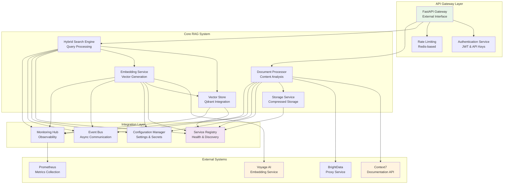

# Integration Architecture

This document defines the overall integration design and patterns for the Contexter RAG system, ensuring reliable, scalable, and secure interoperability between all system components.

## Table of Contents

1. [Architecture Overview](#architecture-overview)
2. [Integration Patterns](#integration-patterns)
3. [Service Integration Registry](#service-integration-registry)
4. [Communication Protocols](#communication-protocols)
5. [Integration Layers](#integration-layers)
6. [Service Discovery](#service-discovery)
7. [Configuration Management](#configuration-management)
8. [Implementation Guidelines](#implementation-guidelines)

## Architecture Overview

The Contexter RAG system uses a layered integration architecture that promotes loose coupling, high cohesion, and operational excellence through standardized patterns and protocols.



## Integration Patterns

### 1. Circuit Breaker Pattern

Protects services from cascading failures by monitoring failures and preventing calls to unhealthy services.

```python
from abc import ABC, abstractmethod
from typing import Any, Callable, Dict, Optional
from datetime import datetime, timedelta
import asyncio
from enum import Enum

class CircuitState(Enum):
    CLOSED = "closed"
    OPEN = "open"
    HALF_OPEN = "half_open"

class CircuitBreaker:
    """Circuit breaker implementation for service protection."""
    
    def __init__(
        self,
        failure_threshold: int = 5,
        recovery_timeout: float = 60.0,
        success_threshold: int = 3,
        timeout: float = 30.0
    ):
        self.failure_threshold = failure_threshold
        self.recovery_timeout = recovery_timeout
        self.success_threshold = success_threshold
        self.timeout = timeout
        
        self.failure_count = 0
        self.success_count = 0
        self.last_failure_time: Optional[datetime] = None
        self.state = CircuitState.CLOSED
        
    async def call(self, operation: Callable, *args, **kwargs) -> Any:
        """Execute operation through circuit breaker protection."""
        
        if self.state == CircuitState.OPEN:
            if self._should_attempt_reset():
                self.state = CircuitState.HALF_OPEN
                self.success_count = 0
            else:
                raise CircuitBreakerOpenError(
                    f"Circuit breaker OPEN. Last failure: {self.last_failure_time}"
                )
        
        try:
            # Execute with timeout
            result = await asyncio.wait_for(operation(*args, **kwargs), timeout=self.timeout)
            self._on_success()
            return result
            
        except asyncio.TimeoutError:
            self._on_failure()
            raise CircuitBreakerTimeoutError(f"Operation timed out after {self.timeout}s")
            
        except Exception as e:
            self._on_failure()
            raise
    
    def _should_attempt_reset(self) -> bool:
        """Check if circuit breaker should attempt reset."""
        return (
            self.last_failure_time and
            datetime.utcnow() - self.last_failure_time >= timedelta(seconds=self.recovery_timeout)
        )
    
    def _on_success(self):
        """Handle successful operation."""
        if self.state == CircuitState.HALF_OPEN:
            self.success_count += 1
            if self.success_count >= self.success_threshold:
                self.state = CircuitState.CLOSED
                self.failure_count = 0
                self.success_count = 0
        elif self.state == CircuitState.CLOSED:
            self.failure_count = 0
    
    def _on_failure(self):
        """Handle failed operation."""
        self.failure_count += 1
        self.last_failure_time = datetime.utcnow()
        
        if self.failure_count >= self.failure_threshold:
            self.state = CircuitState.OPEN
        elif self.state == CircuitState.HALF_OPEN:
            self.state = CircuitState.OPEN
            self.success_count = 0

class CircuitBreakerOpenError(Exception):
    """Circuit breaker is open, rejecting calls."""
    pass

class CircuitBreakerTimeoutError(Exception):
    """Operation timed out in circuit breaker."""
    pass
```

### 2. Retry Pattern with Exponential Backoff

Handles transient failures with intelligent retry logic and jitter to prevent thundering herd.

```python
import asyncio
import random
from typing import TypeVar, Callable, Awaitable, Tuple, Type
from contextlib import asynccontextmanager

T = TypeVar('T')

class RetryConfig:
    """Configuration for retry behavior."""
    
    def __init__(
        self,
        max_attempts: int = 3,
        base_delay: float = 1.0,
        max_delay: float = 60.0,
        backoff_multiplier: float = 2.0,
        jitter: bool = True,
        retryable_exceptions: Tuple[Type[Exception], ...] = (Exception,)
    ):
        self.max_attempts = max_attempts
        self.base_delay = base_delay
        self.max_delay = max_delay
        self.backoff_multiplier = backoff_multiplier
        self.jitter = jitter
        self.retryable_exceptions = retryable_exceptions

async def retry_with_backoff(
    operation: Callable[[], Awaitable[T]],
    config: RetryConfig
) -> T:
    """Execute operation with exponential backoff retry."""
    
    last_exception = None
    
    for attempt in range(config.max_attempts):
        try:
            return await operation()
            
        except config.retryable_exceptions as e:
            last_exception = e
            
            if attempt == config.max_attempts - 1:
                break
            
            # Calculate delay with exponential backoff
            delay = min(
                config.base_delay * (config.backoff_multiplier ** attempt),
                config.max_delay
            )
            
            # Add jitter to prevent thundering herd
            if config.jitter:
                delay *= (0.5 + random.random() * 0.5)
            
            await asyncio.sleep(delay)
    
    raise last_exception

@asynccontextmanager
async def retry_context(config: RetryConfig):
    """Context manager for retry operations."""
    async def retry_operation(operation):
        return await retry_with_backoff(operation, config)
    
    yield retry_operation
```

### 3. Service Adapter Pattern

Standardizes integration with external services through consistent interfaces.

```python
from abc import ABC, abstractmethod
from typing import Dict, Any, Optional
from dataclasses import dataclass
from datetime import datetime

@dataclass
class ServiceHealth:
    """Standard health check response."""
    status: str  # healthy, degraded, unhealthy
    response_time_ms: float
    details: Dict[str, Any]
    timestamp: datetime
    error_message: Optional[str] = None

class ServiceAdapter(ABC):
    """Abstract base class for all service integrations."""
    
    def __init__(self, service_name: str, config: Dict[str, Any]):
        self.service_name = service_name
        self.config = config
        self.circuit_breaker = CircuitBreaker()
        self.retry_config = RetryConfig()
        
    @abstractmethod
    async def initialize(self) -> bool:
        """Initialize the service connection."""
        pass
    
    @abstractmethod
    async def health_check(self) -> ServiceHealth:
        """Perform health check on the service."""
        pass
    
    async def execute_with_resilience(self, operation: Callable) -> Any:
        """Execute operation with circuit breaker and retry."""
        return await self.circuit_breaker.call(
            lambda: retry_with_backoff(operation, self.retry_config)
        )
    
    async def shutdown(self):
        """Clean shutdown of service connection."""
        pass

class VoyageAIAdapter(ServiceAdapter):
    """Voyage AI service adapter with embedding-specific logic."""
    
    async def initialize(self) -> bool:
        """Initialize Voyage AI client."""
        # Implementation specific to Voyage AI
        pass
    
    async def generate_embeddings(self, texts: List[str]) -> List[np.ndarray]:
        """Generate embeddings with resilience patterns."""
        async def embedding_operation():
            # Actual embedding generation logic
            pass
        
        return await self.execute_with_resilience(embedding_operation)
```

### 4. Event-Driven Integration

Enables loose coupling through asynchronous event communication.

```python
from typing import Any, Callable, Dict, List
import asyncio
from dataclasses import dataclass
from datetime import datetime
import json

@dataclass
class IntegrationEvent:
    """Standard event structure for integration communication."""
    event_type: str
    source_service: str
    target_service: Optional[str]
    payload: Dict[str, Any]
    timestamp: datetime
    correlation_id: str
    metadata: Dict[str, Any] = None

class EventBus:
    """Event bus for asynchronous service communication."""
    
    def __init__(self):
        self.subscribers: Dict[str, List[Callable]] = {}
        self.event_store: List[IntegrationEvent] = []
        
    def subscribe(self, event_type: str, handler: Callable[[IntegrationEvent], Awaitable[None]]):
        """Subscribe to events of a specific type."""
        if event_type not in self.subscribers:
            self.subscribers[event_type] = []
        self.subscribers[event_type].append(handler)
    
    async def publish(self, event: IntegrationEvent):
        """Publish event to all subscribers."""
        self.event_store.append(event)
        
        if event.event_type in self.subscribers:
            tasks = []
            for handler in self.subscribers[event.event_type]:
                task = asyncio.create_task(handler(event))
                tasks.append(task)
            
            if tasks:
                await asyncio.gather(*tasks, return_exceptions=True)
    
    async def publish_document_processed(
        self,
        library_id: str,
        document_count: int,
        processing_time: float
    ):
        """Publish document processing completion event."""
        event = IntegrationEvent(
            event_type="document.processed",
            source_service="document_processor",
            target_service=None,
            payload={
                "library_id": library_id,
                "document_count": document_count,
                "processing_time_seconds": processing_time
            },
            timestamp=datetime.utcnow(),
            correlation_id=f"doc_proc_{library_id}_{int(time.time())}"
        )
        await self.publish(event)
```

## Service Integration Registry

Central registry for managing service integrations, health monitoring, and discovery.

```python
from typing import Dict, Any, List, Optional
import asyncio
from datetime import datetime, timedelta

class ServiceIntegrationRegistry:
    """Central registry for service integrations."""
    
    def __init__(self):
        self.services: Dict[str, ServiceAdapter] = {}
        self.health_cache: Dict[str, ServiceHealth] = {}
        self.health_check_interval = 60  # seconds
        self._health_check_task: Optional[asyncio.Task] = None
        
    async def register_service(self, adapter: ServiceAdapter):
        """Register a service adapter."""
        await adapter.initialize()
        self.services[adapter.service_name] = adapter
        
        # Start health checking if this is the first service
        if len(self.services) == 1:
            self._health_check_task = asyncio.create_task(self._health_check_loop())
    
    async def get_service(self, service_name: str) -> ServiceAdapter:
        """Get service adapter by name."""
        if service_name not in self.services:
            raise ServiceNotFoundError(f"Service '{service_name}' not registered")
        return self.services[service_name]
    
    async def get_healthy_services(self) -> List[str]:
        """Get list of healthy service names."""
        healthy = []
        for service_name, health in self.health_cache.items():
            if health.status == "healthy":
                healthy.append(service_name)
        return healthy
    
    async def get_service_health(self, service_name: str) -> Optional[ServiceHealth]:
        """Get cached health status for a service."""
        return self.health_cache.get(service_name)
    
    async def _health_check_loop(self):
        """Background health checking loop."""
        while True:
            try:
                for service_name, adapter in self.services.items():
                    try:
                        health = await adapter.health_check()
                        self.health_cache[service_name] = health
                    except Exception as e:
                        self.health_cache[service_name] = ServiceHealth(
                            status="unhealthy",
                            response_time_ms=0,
                            details={"error": str(e)},
                            timestamp=datetime.utcnow(),
                            error_message=str(e)
                        )
                
                await asyncio.sleep(self.health_check_interval)
                
            except asyncio.CancelledError:
                break
            except Exception as e:
                # Log error and continue
                await asyncio.sleep(self.health_check_interval)
    
    async def shutdown(self):
        """Shutdown all services and health checking."""
        if self._health_check_task:
            self._health_check_task.cancel()
            try:
                await self._health_check_task
            except asyncio.CancelledError:
                pass
        
        for adapter in self.services.values():
            await adapter.shutdown()

class ServiceNotFoundError(Exception):
    """Service not found in registry."""
    pass
```

## Communication Protocols

### 1. Synchronous Communication

For real-time operations requiring immediate responses.

```python
class SynchronousIntegration:
    """Handles synchronous service-to-service communication."""
    
    def __init__(self, registry: ServiceIntegrationRegistry):
        self.registry = registry
        
    async def search_with_embeddings(
        self,
        query: str,
        top_k: int = 10
    ) -> Dict[str, Any]:
        """Example: Search operation requiring embedding and vector search."""
        
        # Get embedding service
        embedding_service = await self.registry.get_service("voyage_ai")
        
        # Generate query embedding
        query_embedding = await embedding_service.generate_embeddings([query])
        
        # Get vector store service
        vector_service = await self.registry.get_service("qdrant")
        
        # Perform vector search
        search_results = await vector_service.search_vectors(
            query_vector=query_embedding[0],
            limit=top_k
        )
        
        return {
            "query": query,
            "results": search_results,
            "embedding_time_ms": embedding_service.last_operation_time,
            "search_time_ms": vector_service.last_operation_time
        }
```

### 2. Asynchronous Communication

For non-blocking operations and event-driven workflows.

```python
class AsynchronousIntegration:
    """Handles asynchronous service communication."""
    
    def __init__(self, event_bus: EventBus, registry: ServiceIntegrationRegistry):
        self.event_bus = event_bus
        self.registry = registry
        self._setup_event_handlers()
    
    def _setup_event_handlers(self):
        """Setup event handlers for async operations."""
        self.event_bus.subscribe("document.ingested", self._handle_document_ingested)
        self.event_bus.subscribe("embedding.completed", self._handle_embedding_completed)
        self.event_bus.subscribe("vector.indexed", self._handle_vector_indexed)
    
    async def _handle_document_ingested(self, event: IntegrationEvent):
        """Handle document ingestion completion."""
        payload = event.payload
        library_id = payload["library_id"]
        
        # Trigger embedding generation
        await self.event_bus.publish(IntegrationEvent(
            event_type="embedding.requested",
            source_service="integration_handler",
            target_service="embedding_service",
            payload={
                "library_id": library_id,
                "document_chunks": payload["chunks"],
                "correlation_id": event.correlation_id
            },
            timestamp=datetime.utcnow(),
            correlation_id=event.correlation_id
        ))
    
    async def _handle_embedding_completed(self, event: IntegrationEvent):
        """Handle embedding generation completion."""
        payload = event.payload
        
        # Trigger vector indexing
        await self.event_bus.publish(IntegrationEvent(
            event_type="vector.index_requested",
            source_service="integration_handler",
            target_service="vector_service",
            payload={
                "embeddings": payload["embeddings"],
                "metadata": payload["metadata"],
                "correlation_id": event.correlation_id
            },
            timestamp=datetime.utcnow(),
            correlation_id=event.correlation_id
        ))
    
    async def _handle_vector_indexed(self, event: IntegrationEvent):
        """Handle vector indexing completion."""
        # Final step - notify completion
        await self.event_bus.publish(IntegrationEvent(
            event_type="processing.completed",
            source_service="integration_handler",
            target_service="api_gateway",
            payload={
                "status": "success",
                "correlation_id": event.correlation_id,
                "completion_time": datetime.utcnow().isoformat()
            },
            timestamp=datetime.utcnow(),
            correlation_id=event.correlation_id
        ))
```

## Integration Layers

### 1. Transport Layer

Handles network communication protocols and serialization.

```python
import httpx
import json
from typing import Dict, Any, Optional

class HTTPTransport:
    """HTTP transport layer for service communication."""
    
    def __init__(self, base_url: str, timeout: float = 30.0):
        self.base_url = base_url
        self.client = httpx.AsyncClient(
            base_url=base_url,
            timeout=httpx.Timeout(timeout),
            limits=httpx.Limits(max_connections=100, max_keepalive_connections=20)
        )
    
    async def get(self, path: str, params: Optional[Dict] = None) -> Dict[str, Any]:
        """HTTP GET request."""
        response = await self.client.get(path, params=params)
        response.raise_for_status()
        return response.json()
    
    async def post(self, path: str, data: Dict[str, Any]) -> Dict[str, Any]:
        """HTTP POST request."""
        response = await self.client.post(path, json=data)
        response.raise_for_status()
        return response.json()
    
    async def close(self):
        """Close HTTP client."""
        await self.client.aclose()

class MessageTransport:
    """Message queue transport for async communication."""
    
    def __init__(self, broker_url: str):
        self.broker_url = broker_url
        # Initialize message broker connection (Redis, RabbitMQ, etc.)
    
    async def publish(self, topic: str, message: Dict[str, Any]):
        """Publish message to topic."""
        # Implementation depends on message broker
        pass
    
    async def subscribe(self, topic: str, handler: Callable):
        """Subscribe to topic with handler."""
        # Implementation depends on message broker
        pass
```

### 2. Protocol Layer

Defines communication protocols and message formats.

```python
from enum import Enum
from dataclasses import dataclass
from typing import Union, Any

class MessageType(Enum):
    REQUEST = "request"
    RESPONSE = "response"
    EVENT = "event"
    ERROR = "error"

@dataclass
class IntegrationMessage:
    """Standard message format for service communication."""
    message_id: str
    message_type: MessageType
    source_service: str
    target_service: str
    operation: str
    payload: Dict[str, Any]
    timestamp: datetime
    correlation_id: str
    retry_count: int = 0
    timeout_ms: Optional[int] = None

class ProtocolHandler:
    """Handles protocol-specific message processing."""
    
    def __init__(self, service_name: str):
        self.service_name = service_name
    
    def create_request(
        self,
        target_service: str,
        operation: str,
        payload: Dict[str, Any],
        correlation_id: str
    ) -> IntegrationMessage:
        """Create a request message."""
        return IntegrationMessage(
            message_id=self._generate_message_id(),
            message_type=MessageType.REQUEST,
            source_service=self.service_name,
            target_service=target_service,
            operation=operation,
            payload=payload,
            timestamp=datetime.utcnow(),
            correlation_id=correlation_id
        )
    
    def create_response(
        self,
        request: IntegrationMessage,
        payload: Dict[str, Any]
    ) -> IntegrationMessage:
        """Create a response message."""
        return IntegrationMessage(
            message_id=self._generate_message_id(),
            message_type=MessageType.RESPONSE,
            source_service=self.service_name,
            target_service=request.source_service,
            operation=request.operation,
            payload=payload,
            timestamp=datetime.utcnow(),
            correlation_id=request.correlation_id
        )
    
    def _generate_message_id(self) -> str:
        """Generate unique message ID."""
        import uuid
        return str(uuid.uuid4())
```

## Service Discovery

### 1. Health-Based Discovery

Services are discovered based on health status and capability.

```python
class ServiceDiscovery:
    """Service discovery based on health and capabilities."""
    
    def __init__(self, registry: ServiceIntegrationRegistry):
        self.registry = registry
        self.service_capabilities: Dict[str, List[str]] = {}
    
    def register_capabilities(self, service_name: str, capabilities: List[str]):
        """Register service capabilities."""
        self.service_capabilities[service_name] = capabilities
    
    async def discover_service_for_capability(self, capability: str) -> Optional[str]:
        """Find healthy service with specific capability."""
        healthy_services = await self.registry.get_healthy_services()
        
        for service_name in healthy_services:
            if capability in self.service_capabilities.get(service_name, []):
                return service_name
        
        return None
    
    async def get_load_balanced_service(self, capability: str) -> Optional[str]:
        """Get service using load balancing strategy."""
        eligible_services = []
        healthy_services = await self.registry.get_healthy_services()
        
        for service_name in healthy_services:
            if capability in self.service_capabilities.get(service_name, []):
                health = await self.registry.get_service_health(service_name)
                if health and health.response_time_ms < 1000:  # Under 1 second
                    eligible_services.append((service_name, health.response_time_ms))
        
        if not eligible_services:
            return None
        
        # Simple load balancing: choose service with lowest response time
        eligible_services.sort(key=lambda x: x[1])
        return eligible_services[0][0]
```

## Configuration Management

### 1. Dynamic Configuration

Configuration that can be updated without service restart.

```python
import os
import yaml
from typing import Dict, Any, Optional
from pathlib import Path

class ConfigurationManager:
    """Manages dynamic configuration for service integrations."""
    
    def __init__(self, config_path: str):
        self.config_path = Path(config_path)
        self.config: Dict[str, Any] = {}
        self.watchers: Dict[str, Callable] = {}
        self._load_configuration()
    
    def _load_configuration(self):
        """Load configuration from file."""
        if self.config_path.exists():
            with open(self.config_path, 'r') as f:
                self.config = yaml.safe_load(f) or {}
    
    def get_service_config(self, service_name: str) -> Dict[str, Any]:
        """Get configuration for a specific service."""
        return self.config.get('services', {}).get(service_name, {})
    
    def get_integration_config(self, integration_name: str) -> Dict[str, Any]:
        """Get configuration for a specific integration."""
        return self.config.get('integrations', {}).get(integration_name, {})
    
    def register_config_watcher(self, key: str, callback: Callable[[Any], None]):
        """Register callback for configuration changes."""
        self.watchers[key] = callback
    
    async def update_config(self, key: str, value: Any):
        """Update configuration and notify watchers."""
        keys = key.split('.')
        config_section = self.config
        
        # Navigate to the parent of the target key
        for k in keys[:-1]:
            if k not in config_section:
                config_section[k] = {}
            config_section = config_section[k]
        
        # Update the value
        config_section[keys[-1]] = value
        
        # Save to file
        with open(self.config_path, 'w') as f:
            yaml.dump(self.config, f, default_flow_style=False)
        
        # Notify watchers
        if key in self.watchers:
            self.watchers[key](value)

# Configuration schema for services
SERVICE_CONFIG_SCHEMA = {
    "voyage_ai": {
        "api_key": str,
        "base_url": str,
        "rate_limit": int,
        "timeout": float,
        "retry_config": {
            "max_attempts": int,
            "base_delay": float,
            "max_delay": float
        }
    },
    "qdrant": {
        "host": str,
        "port": int,
        "timeout": float,
        "collection_config": {
            "vector_size": int,
            "distance_metric": str
        }
    }
}
```

## Implementation Guidelines

### 1. Integration Best Practices

```python
# Example: Complete service integration implementation
class DocumentProcessingIntegration:
    """Complete integration for document processing workflow."""
    
    def __init__(
        self,
        registry: ServiceIntegrationRegistry,
        event_bus: EventBus,
        config_manager: ConfigurationManager
    ):
        self.registry = registry
        self.event_bus = event_bus
        self.config_manager = config_manager
        self.discovery = ServiceDiscovery(registry)
        
        # Setup capabilities
        self.discovery.register_capabilities("context7", ["document_fetching"])
        self.discovery.register_capabilities("voyage_ai", ["embedding_generation"])
        self.discovery.register_capabilities("qdrant", ["vector_storage", "vector_search"])
    
    async def process_library_documentation(self, library_id: str) -> Dict[str, Any]:
        """Complete document processing integration flow."""
        
        correlation_id = f"lib_proc_{library_id}_{int(time.time())}"
        
        try:
            # Step 1: Discover and use document fetching service
            doc_service_name = await self.discovery.discover_service_for_capability("document_fetching")
            if not doc_service_name:
                raise IntegrationError("No healthy document fetching service available")
            
            doc_service = await self.registry.get_service(doc_service_name)
            
            # Step 2: Fetch documentation with resilience
            documents = await doc_service.execute_with_resilience(
                lambda: doc_service.fetch_library_docs(library_id)
            )
            
            # Step 3: Process documents asynchronously
            await self.event_bus.publish(IntegrationEvent(
                event_type="document.ingested",
                source_service="integration_processor",
                target_service=None,
                payload={
                    "library_id": library_id,
                    "documents": documents,
                    "document_count": len(documents)
                },
                timestamp=datetime.utcnow(),
                correlation_id=correlation_id
            ))
            
            return {
                "status": "processing_started",
                "library_id": library_id,
                "document_count": len(documents),
                "correlation_id": correlation_id
            }
            
        except Exception as e:
            # Comprehensive error handling
            await self.event_bus.publish(IntegrationEvent(
                event_type="processing.failed",
                source_service="integration_processor",
                target_service="monitoring",
                payload={
                    "library_id": library_id,
                    "error": str(e),
                    "error_type": type(e).__name__
                },
                timestamp=datetime.utcnow(),
                correlation_id=correlation_id
            ))
            raise

class IntegrationError(Exception):
    """Integration-specific error."""
    pass
```

### 2. Monitoring Integration Health

```python
class IntegrationHealthMonitor:
    """Monitors health of all integration points."""
    
    def __init__(
        self,
        registry: ServiceIntegrationRegistry,
        event_bus: EventBus
    ):
        self.registry = registry
        self.event_bus = event_bus
        self.health_metrics: Dict[str, List[float]] = {}
    
    async def monitor_integration_health(self) -> Dict[str, Any]:
        """Comprehensive health monitoring for all integrations."""
        
        health_report = {
            "overall_status": "healthy",
            "services": {},
            "integrations": {},
            "alerts": []
        }
        
        # Check individual service health
        for service_name in self.registry.services.keys():
            health = await self.registry.get_service_health(service_name)
            health_report["services"][service_name] = {
                "status": health.status if health else "unknown",
                "response_time_ms": health.response_time_ms if health else None,
                "last_check": health.timestamp.isoformat() if health else None
            }
            
            if health and health.status != "healthy":
                health_report["overall_status"] = "degraded"
                health_report["alerts"].append({
                    "service": service_name,
                    "status": health.status,
                    "message": health.error_message
                })
        
        # Check integration patterns health
        health_report["integrations"] = await self._check_integration_patterns()
        
        return health_report
    
    async def _check_integration_patterns(self) -> Dict[str, Any]:
        """Check health of integration patterns."""
        return {
            "circuit_breakers": await self._check_circuit_breakers(),
            "event_bus": await self._check_event_bus(),
            "service_discovery": await self._check_service_discovery()
        }
    
    async def _check_circuit_breakers(self) -> Dict[str, Any]:
        """Check circuit breaker states."""
        circuit_states = {}
        for service_name, adapter in self.registry.services.items():
            circuit_states[service_name] = {
                "state": adapter.circuit_breaker.state.value,
                "failure_count": adapter.circuit_breaker.failure_count,
                "last_failure": adapter.circuit_breaker.last_failure_time.isoformat() 
                              if adapter.circuit_breaker.last_failure_time else None
            }
        return circuit_states
    
    async def _check_event_bus(self) -> Dict[str, Any]:
        """Check event bus health."""
        return {
            "subscribers_count": len(self.event_bus.subscribers),
            "event_store_size": len(self.event_bus.event_store),
            "last_event": self.event_bus.event_store[-1].timestamp.isoformat() 
                         if self.event_bus.event_store else None
        }
    
    async def _check_service_discovery(self) -> Dict[str, Any]:
        """Check service discovery health."""
        healthy_services = await self.registry.get_healthy_services()
        return {
            "healthy_service_count": len(healthy_services),
            "total_service_count": len(self.registry.services),
            "health_ratio": len(healthy_services) / len(self.registry.services) if self.registry.services else 0
        }
```

This integration architecture provides:

1. **Resilient Patterns**: Circuit breakers, retries, and timeouts
2. **Loose Coupling**: Event-driven communication and service registry
3. **Health Monitoring**: Comprehensive health checking and discovery
4. **Configuration Management**: Dynamic configuration with hot reloading
5. **Error Handling**: Structured error handling with recovery strategies
6. **Observability**: Built-in monitoring and metrics collection
7. **Scalability**: Load balancing and service discovery
8. **Security**: Authentication and authorization integration

The architecture ensures that all RAG system components can integrate reliably while maintaining high availability and performance standards.