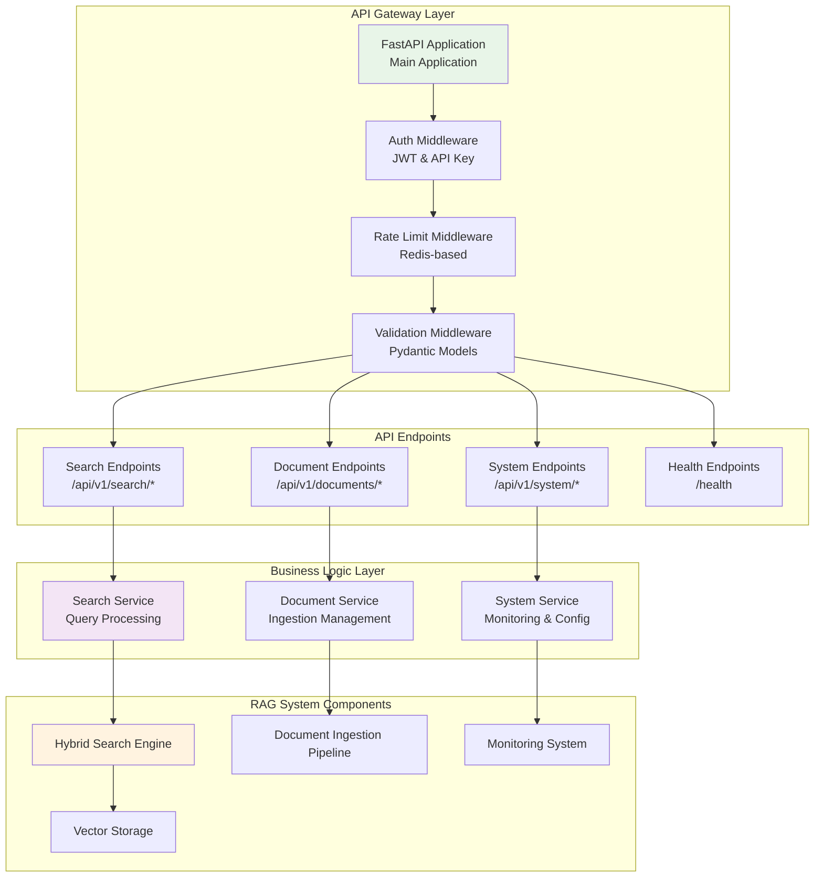

# Product Requirement Prompt: RAG API Integration

## Context

This PRP defines the implementation of RESTful API endpoints for the Contexter Documentation Platform's RAG system, providing external access to search functionality, ingestion management, and system monitoring through a well-designed FastAPI application with authentication, rate limiting, and comprehensive error handling.

**Project Background**:
- **System**: Contexter Documentation Platform
- **Component**: Integration Layer - API Gateway for RAG Operations
- **Technology Stack**: FastAPI, Pydantic, asyncio, Redis (rate limiting), JWT authentication
- **Performance Target**: <100ms API response time, 1000+ requests/minute throughput
- **Dependencies**: Hybrid Search Engine, Document Ingestion Pipeline, Vector Storage

## Requirements

### Functional Requirements

**FR-API-001: Search API Endpoints**
- **As an** external system integrator
- **I want** comprehensive search API endpoints
- **So that** other applications can access RAG search functionality
- **Acceptance Criteria**:
  - [ ] POST /api/v1/search - Main search endpoint with full parameter support
  - [ ] GET /api/v1/search/suggestions - Query suggestions and autocomplete
  - [ ] POST /api/v1/search/batch - Batch search for multiple queries
  - [ ] GET /api/v1/search/history/{user_id} - User search history
  - [ ] OpenAPI 3.0 specification with comprehensive documentation

**FR-API-002: Document Management API**
- **As a** system administrator
- **I want** API endpoints for document management
- **So that** ingestion and processing can be controlled programmatically
- **Acceptance Criteria**:
  - [ ] POST /api/v1/documents/ingest - Trigger document ingestion
  - [ ] GET /api/v1/documents/{library_id}/status - Check processing status
  - [ ] DELETE /api/v1/documents/{library_id} - Remove library from system
  - [ ] GET /api/v1/documents/stats - Document collection statistics
  - [ ] POST /api/v1/documents/reindex - Trigger reindexing operations

**FR-API-003: Authentication and Authorization**
- **As a** system administrator
- **I want** secure API access control
- **So that** system resources are protected from unauthorized access
- **Acceptance Criteria**:
  - [ ] JWT-based authentication with configurable expiration
  - [ ] API key authentication for service-to-service calls
  - [ ] Role-based access control (admin, user, readonly)
  - [ ] Rate limiting per user/API key (configurable limits)
  - [ ] Request logging and audit trail

**FR-API-004: System Monitoring API**
- **As a** system administrator
- **I want** system monitoring and health check endpoints
- **So that** system status can be monitored programmatically
- **Acceptance Criteria**:
  - [ ] GET /health - Basic health check endpoint
  - [ ] GET /api/v1/system/status - Detailed system status
  - [ ] GET /api/v1/system/metrics - Performance metrics and statistics
  - [ ] GET /api/v1/system/config - System configuration information
  - [ ] Integration with Prometheus metrics export

### Non-Functional Requirements

**NFR-API-001: Performance**
- API response time <100ms for search queries (p95)
- Throughput >1000 requests/minute sustained
- Concurrent request handling >100 simultaneous users
- Rate limiting overhead <5ms per request

**NFR-API-002: Security**
- All endpoints secured with authentication
- Input validation and sanitization
- SQL injection and XSS protection
- Request size limits and timeout protection

## Architecture

### API Architecture



## Implementation Blueprint

### Phase 1: Core API Infrastructure (8 hours)

**Task API-001: FastAPI Application Setup**
- **Duration**: 3 hours
- **Dependencies**: None
- **Deliverables**: FastAPI application with middleware and configuration

**Implementation Steps**:
```python
from fastapi import FastAPI, Depends, HTTPException, status
from fastapi.middleware.cors import CORSMiddleware
from fastapi.security import HTTPBearer, HTTPAuthorizationCredentials
import asyncio
from typing import List, Dict, Any, Optional
from pydantic import BaseModel, Field
import time

# Pydantic Models
class SearchRequest(BaseModel):
    query: str = Field(..., min_length=1, max_length=500)
    filters: Optional[Dict[str, Any]] = None
    top_k: int = Field(default=10, ge=1, le=100)
    search_type: str = Field(default="hybrid", regex="^(hybrid|semantic|keyword)$")
    similarity_threshold: float = Field(default=0.1, ge=0.0, le=1.0)

class SearchResponse(BaseModel):
    results: List[Dict[str, Any]]
    total_results: int
    query_time_ms: float
    search_metadata: Dict[str, Any]

# FastAPI Application
app = FastAPI(
    title="Contexter RAG API",
    description="RESTful API for Contexter Documentation Platform RAG System",
    version="1.0.0",
    docs_url="/api/docs",
    redoc_url="/api/redoc"
)

# CORS Configuration
app.add_middleware(
    CORSMiddleware,
    allow_origins=["*"],  # Configure for production
    allow_credentials=True,
    allow_methods=["GET", "POST", "PUT", "DELETE"],
    allow_headers=["*"],
)

# Dependency Injection
async def get_search_service():
    return app.state.search_service

async def get_document_service():
    return app.state.document_service
```

**Task API-002: Authentication and Authorization**
- **Duration**: 3 hours
- **Dependencies**: API-001
- **Deliverables**: JWT and API key authentication with role-based access

**Task API-003: Rate Limiting and Security**
- **Duration**: 2 hours
- **Dependencies**: API-002
- **Deliverables**: Redis-based rate limiting and security middleware

### Phase 2: Search API Endpoints (6 hours)

**Task API-004: Search Endpoints Implementation**
- **Duration**: 4 hours
- **Dependencies**: API-003, Hybrid Search Engine
- **Deliverables**: Complete search API with all endpoint variants

**Implementation Steps**:
```python
@app.post("/api/v1/search", response_model=SearchResponse)
async def search_documents(
    request: SearchRequest,
    search_service: SearchService = Depends(get_search_service),
    current_user: Dict = Depends(get_current_user)
):
    """Main search endpoint with full parameter support."""
    
    start_time = time.time()
    
    try:
        # Process search request
        search_results = await search_service.search(
            query=request.query,
            filters=request.filters,
            top_k=request.top_k,
            search_type=request.search_type,
            similarity_threshold=request.similarity_threshold,
            user_context=current_user
        )
        
        query_time = (time.time() - start_time) * 1000
        
        return SearchResponse(
            results=search_results.results,
            total_results=search_results.total_count,
            query_time_ms=query_time,
            search_metadata=search_results.metadata
        )
        
    except Exception as e:
        logger.error(f"Search error: {e}")
        raise HTTPException(
            status_code=status.HTTP_500_INTERNAL_SERVER_ERROR,
            detail="Search operation failed"
        )

@app.post("/api/v1/search/batch")
async def batch_search(
    requests: List[SearchRequest],
    search_service: SearchService = Depends(get_search_service),
    current_user: Dict = Depends(get_current_user)
):
    """Batch search for multiple queries."""
    
    if len(requests) > 10:  # Limit batch size
        raise HTTPException(
            status_code=status.HTTP_400_BAD_REQUEST,
            detail="Batch size cannot exceed 10 queries"
        )
    
    results = []
    for request in requests:
        result = await search_documents(request, search_service, current_user)
        results.append(result)
    
    return {"batch_results": results}
```

**Task API-005: Advanced Search Features**
- **Duration**: 2 hours
- **Dependencies**: API-004
- **Deliverables**: Query suggestions, search history, and analytics

### Phase 3: System Management APIs (4 hours)

**Task API-006: Document Management Endpoints**
- **Duration**: 2 hours
- **Dependencies**: API-003, Document Ingestion Pipeline
- **Deliverables**: Document ingestion and management API endpoints

**Task API-007: System Monitoring Endpoints**
- **Duration**: 2 hours
- **Dependencies**: API-006, Monitoring System
- **Deliverables**: Health checks, metrics, and system status APIs

## Success Criteria

### Functional Success Metrics
- [ ] **API Coverage**: All core RAG operations accessible via RESTful endpoints
- [ ] **Authentication**: Secure access control with JWT and API key support
- [ ] **Documentation**: Complete OpenAPI specification with examples
- [ ] **Error Handling**: Comprehensive error responses with actionable messages
- [ ] **Rate Limiting**: Configurable limits preventing system abuse

### Performance Success Metrics
- [ ] **Response Time**: <100ms API response time for search queries (p95)
- [ ] **Throughput**: >1000 requests/minute sustained load handling
- [ ] **Concurrency**: Support 100+ simultaneous users without degradation
- [ ] **Rate Limiting**: <5ms overhead for rate limit checking
- [ ] **Memory Usage**: <500MB memory consumption during normal operations

---

**PRP Version**: 1.0  
**Created By**: PRP Generation System  
**Target Sprint**: Sprint 2, Week 4  
**Estimated Effort**: 18 hours (2.25 developer-days)  
**Dependencies**: Hybrid Search Engine, Document Ingestion Pipeline  
**Success Criteria**: <100ms response time, 1000+ requests/minute, comprehensive API coverage