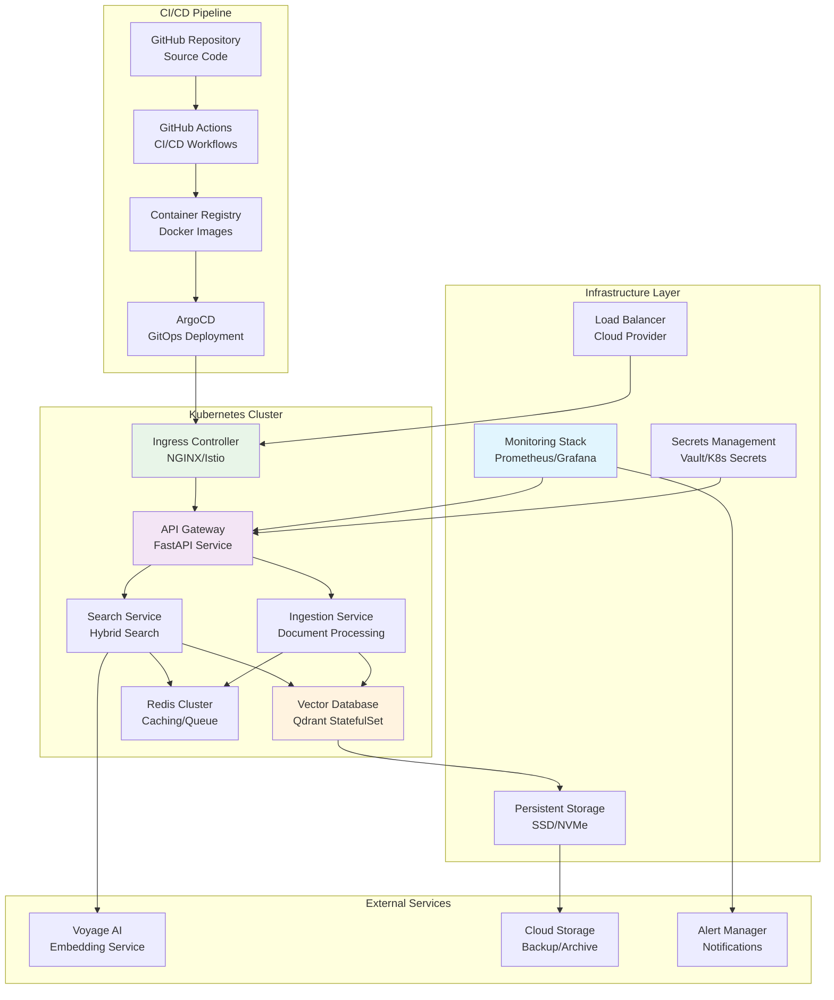

# Product Requirement Prompt: RAG Deployment Configuration

## Context

This PRP defines the implementation of production-ready deployment configuration for the Contexter Documentation Platform's RAG system, including Docker containerization, Kubernetes orchestration, CI/CD pipeline integration, and infrastructure as code with comprehensive security, scalability, and operational excellence.

**Project Background**:
- **System**: Contexter Documentation Platform  
- **Component**: Documentation & Deployment - Production Deployment
- **Technology Stack**: Docker, Kubernetes, Terraform, GitHub Actions, Prometheus, Grafana
- **Performance Target**: Zero-downtime deployments, 99.9% availability, auto-scaling
- **Dependencies**: All RAG system components, monitoring infrastructure

## Requirements

### Functional Requirements

**FR-DEP-001: Containerization and Orchestration**
- **As a** DevOps engineer
- **I want** production-ready containerization and orchestration
- **So that** the RAG system can be deployed consistently across environments
- **Acceptance Criteria**:
  - [ ] Multi-stage Docker builds for all services with optimization
  - [ ] Kubernetes deployment manifests with resource limits and health checks
  - [ ] Service mesh configuration for inter-service communication
  - [ ] Persistent volume management for data storage
  - [ ] Auto-scaling configuration based on resource utilization and queue depth

**FR-DEP-002: CI/CD Pipeline Integration**
- **As a** development team
- **I want** automated CI/CD pipeline for safe deployments
- **So that** code changes are tested, validated, and deployed reliably
- **Acceptance Criteria**:
  - [ ] Automated testing on every pull request with quality gates
  - [ ] Blue-green deployment strategy with automatic rollback
  - [ ] Canary deployment support for gradual rollout
  - [ ] Security scanning and vulnerability assessment
  - [ ] Performance regression testing in staging environment

**FR-DEP-003: Infrastructure as Code**
- **As a** platform engineer
- **I want** infrastructure defined as code with version control
- **So that** environments can be created and managed consistently
- **Acceptance Criteria**:
  - [ ] Terraform modules for cloud infrastructure provisioning
  - [ ] Environment-specific configuration management
  - [ ] Infrastructure validation and compliance checking
  - [ ] Disaster recovery and backup automation
  - [ ] Cost optimization and resource management

**FR-DEP-004: Security and Compliance**
- **As a** security engineer
- **I want** comprehensive security controls and compliance
- **So that** the system meets enterprise security requirements
- **Acceptance Criteria**:
  - [ ] Container image security scanning and hardening
  - [ ] Network policies and service mesh security
  - [ ] Secrets management with encryption at rest and in transit
  - [ ] RBAC (Role-Based Access Control) for all resources
  - [ ] Audit logging and compliance reporting

### Non-Functional Requirements

**NFR-DEP-001: Reliability and Availability**
- Zero-downtime deployments with <1% error rate during rollouts
- System availability 99.9% with automatic failover
- Recovery time objective (RTO) <5 minutes for critical services
- Recovery point objective (RPO) <1 hour for data loss scenarios

**NFR-DEP-002: Performance and Scalability**
- Horizontal auto-scaling based on CPU (>70%) and queue depth (>1000 jobs)
- Container startup time <30 seconds for all services
- Resource utilization efficiency >80% during normal operations
- Support for 10x traffic spikes with auto-scaling

## Architecture

### Deployment Architecture



## Implementation Blueprint

### Phase 1: Containerization (8 hours)

**Task DEP-001: Docker Container Optimization**
- **Duration**: 4 hours
- **Dependencies**: All application components
- **Deliverables**: Optimized multi-stage Docker builds

**Implementation Steps**:
```dockerfile
# Multi-stage Dockerfile for RAG API Service
FROM python:3.9-slim as base

# Install system dependencies
RUN apt-get update && apt-get install -y \
    gcc \
    g++ \
    && rm -rf /var/lib/apt/lists/*

# Create non-root user
RUN useradd --create-home --shell /bin/bash rag-user

# Set working directory
WORKDIR /app

# Copy requirements first for better layer caching
COPY requirements.txt .
RUN pip install --no-cache-dir --user -r requirements.txt

# Development stage
FROM base as development
COPY requirements-dev.txt .
RUN pip install --no-cache-dir --user -r requirements-dev.txt
COPY . .
USER rag-user
CMD ["uvicorn", "main:app", "--host", "0.0.0.0", "--port", "8000", "--reload"]

# Production stage
FROM base as production
COPY . .
RUN chown -R rag-user:rag-user /app
USER rag-user

# Health check
HEALTHCHECK --interval=30s --timeout=10s --start-period=5s --retries=3 \
    CMD curl -f http://localhost:8000/health || exit 1

EXPOSE 8000
CMD ["uvicorn", "main:app", "--host", "0.0.0.0", "--port", "8000", "--workers", "4"]
```

**Task DEP-002: Kubernetes Manifests**
- **Duration**: 4 hours
- **Dependencies**: DEP-001
- **Deliverables**: Complete Kubernetes deployment manifests

**Implementation Steps**:
```yaml
# Deployment for RAG API Service
apiVersion: apps/v1
kind: Deployment
metadata:
  name: rag-api
  labels:
    app: rag-api
spec:
  replicas: 3
  strategy:
    type: RollingUpdate
    rollingUpdate:
      maxSurge: 1
      maxUnavailable: 0
  selector:
    matchLabels:
      app: rag-api
  template:
    metadata:
      labels:
        app: rag-api
    spec:
      containers:
      - name: rag-api
        image: contexter/rag-api:latest
        ports:
        - containerPort: 8000
        env:
        - name: DATABASE_URL
          valueFrom:
            secretKeyRef:
              name: rag-secrets
              key: database-url
        - name: VOYAGE_API_KEY
          valueFrom:
            secretKeyRef:
              name: rag-secrets
              key: voyage-api-key
        resources:
          requests:
            memory: "512Mi"
            cpu: "250m"
          limits:
            memory: "1Gi" 
            cpu: "500m"
        livenessProbe:
          httpGet:
            path: /health
            port: 8000
          initialDelaySeconds: 30
          periodSeconds: 10
        readinessProbe:
          httpGet:
            path: /ready
            port: 8000
          initialDelaySeconds: 5
          periodSeconds: 5

---
apiVersion: v1
kind: Service
metadata:
  name: rag-api-service
spec:
  selector:
    app: rag-api
  ports:
  - protocol: TCP
    port: 80
    targetPort: 8000
  type: ClusterIP

---
apiVersion: autoscaling/v2
kind: HorizontalPodAutoscaler
metadata:
  name: rag-api-hpa
spec:
  scaleTargetRef:
    apiVersion: apps/v1
    kind: Deployment
    name: rag-api
  minReplicas: 3
  maxReplicas: 20
  metrics:
  - type: Resource
    resource:
      name: cpu
      target:
        type: Utilization
        averageUtilization: 70
  - type: Resource
    resource:
      name: memory
      target:
        type: Utilization
        averageUtilization: 80
```

### Phase 2: CI/CD Pipeline (10 hours)

**Task DEP-003: GitHub Actions Workflows**
- **Duration**: 6 hours
- **Dependencies**: DEP-002
- **Deliverables**: Complete CI/CD pipeline with testing and deployment

**Implementation Steps**:
```yaml
# .github/workflows/ci-cd.yml
name: RAG System CI/CD

on:
  push:
    branches: [main, develop]
  pull_request:
    branches: [main]

env:
  REGISTRY: ghcr.io
  IMAGE_NAME: ${{ github.repository }}

jobs:
  test:
    runs-on: ubuntu-latest
    strategy:
      matrix:
        python-version: [3.9, 3.10]
    
    steps:
    - uses: actions/checkout@v3
    
    - name: Set up Python ${{ matrix.python-version }}
      uses: actions/setup-python@v4
      with:
        python-version: ${{ matrix.python-version }}
    
    - name: Install dependencies
      run: |
        python -m pip install --upgrade pip
        pip install -r requirements.txt
        pip install -r requirements-test.txt
    
    - name: Run linting
      run: |
        flake8 src/ tests/
        black --check src/ tests/
        mypy src/
    
    - name: Run unit tests
      run: |
        pytest tests/unit/ --cov=src --cov-report=xml --cov-report=term
    
    - name: Run integration tests
      run: |
        pytest tests/integration/ --maxfail=3
      env:
        TEST_DATABASE_URL: ${{ secrets.TEST_DATABASE_URL }}
    
    - name: Upload coverage reports
      uses: codecov/codecov-action@v3
      with:
        file: ./coverage.xml

  security-scan:
    runs-on: ubuntu-latest
    steps:
    - uses: actions/checkout@v3
    
    - name: Run Trivy vulnerability scanner
      uses: aquasecurity/trivy-action@master
      with:
        scan-type: 'fs'
        scan-ref: '.'
        format: 'sarif'
        output: 'trivy-results.sarif'
    
    - name: Upload Trivy scan results
      uses: github/codeql-action/upload-sarif@v2
      with:
        sarif_file: 'trivy-results.sarif'

  build-and-push:
    needs: [test, security-scan]
    runs-on: ubuntu-latest
    permissions:
      contents: read
      packages: write
    
    steps:
    - name: Checkout repository
      uses: actions/checkout@v3
    
    - name: Log in to Container Registry
      uses: docker/login-action@v2
      with:
        registry: ${{ env.REGISTRY }}
        username: ${{ github.actor }}
        password: ${{ secrets.GITHUB_TOKEN }}
    
    - name: Extract metadata
      id: meta
      uses: docker/metadata-action@v4
      with:
        images: ${{ env.REGISTRY }}/${{ env.IMAGE_NAME }}
        tags: |
          type=ref,event=branch
          type=ref,event=pr
          type=sha
    
    - name: Build and push Docker image
      uses: docker/build-push-action@v4
      with:
        context: .
        push: true
        tags: ${{ steps.meta.outputs.tags }}
        labels: ${{ steps.meta.outputs.labels }}
        target: production

  deploy-staging:
    if: github.ref == 'refs/heads/develop'
    needs: build-and-push
    runs-on: ubuntu-latest
    environment: staging
    
    steps:
    - name: Deploy to staging
      run: |
        echo "Deploying to staging environment"
        # ArgoCD sync or kubectl apply commands

  deploy-production:
    if: github.ref == 'refs/heads/main'
    needs: build-and-push
    runs-on: ubuntu-latest
    environment: production
    
    steps:
    - name: Deploy to production
      run: |
        echo "Deploying to production environment"
        # Blue-green deployment commands
```

**Task DEP-004: Blue-Green Deployment**
- **Duration**: 4 hours
- **Dependencies**: DEP-003
- **Deliverables**: Zero-downtime deployment strategy

### Phase 3: Infrastructure as Code (6 hours)

**Task DEP-005: Terraform Infrastructure**
- **Duration**: 4 hours
- **Dependencies**: DEP-004
- **Deliverables**: Complete infrastructure provisioning

**Task DEP-006: Environment Configuration**
- **Duration**: 2 hours
- **Dependencies**: DEP-005
- **Deliverables**: Environment-specific configuration management

## Success Criteria

### Functional Success Metrics
- [ ] **Zero-Downtime Deployments**: Successfully deploy without service interruption
- [ ] **Auto-Scaling**: Automatic horizontal scaling based on load metrics
- [ ] **Security Compliance**: Pass all security scans and vulnerability assessments
- [ ] **Infrastructure Automation**: Complete infrastructure provisioning via Terraform
- [ ] **CI/CD Integration**: Automated testing and deployment on every code change

### Performance Success Metrics
- [ ] **Deployment Speed**: Complete deployment process in <10 minutes
- [ ] **Availability**: Achieve 99.9% system availability in production
- [ ] **Scalability**: Handle 10x traffic spikes with auto-scaling
- [ ] **Recovery Time**: <5 minutes RTO for service recovery
- [ ] **Resource Efficiency**: >80% resource utilization during normal operations

---

**PRP Version**: 1.0  
**Created By**: PRP Generation System  
**Target Sprint**: Sprint 3, Week 6  
**Estimated Effort**: 24 hours (3 developer-days)  
**Dependencies**: All RAG system components, monitoring infrastructure  
**Success Criteria**: Zero-downtime deployments, 99.9% availability, automated scaling