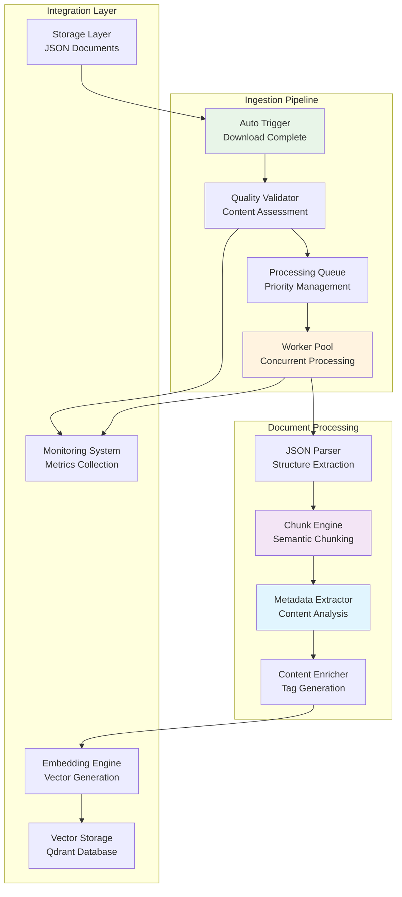
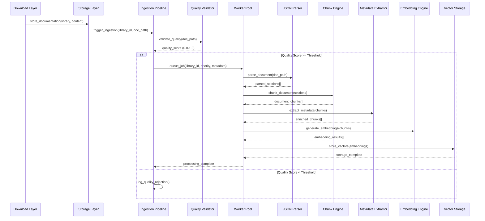

# Product Requirement Prompt: RAG Document Ingestion Pipeline

## Context

This PRP defines the implementation of an automated document ingestion pipeline for the Contexter Documentation Platform's RAG system. The pipeline processes raw JSON documentation from the C7DocDownloader into searchable chunks with intelligent preprocessing, metadata enrichment, and seamless integration with the embedding generation and vector storage systems.

**Project Background**:
- **System**: Contexter Documentation Platform
- **Component**: RAG System Core Features - Document Processing Pipeline
- **Technology Stack**: Python 3.9+, asyncio, tiktoken, JSON, SQLite
- **Integration**: Processes C7DocDownloader output, feeds Embedding Engine and Vector Storage
- **Performance Target**: >1000 documents/minute processing, <10 seconds trigger latency

**Existing System Context**:
- C7DocDownloader produces compressed JSON documentation files stored in Storage Layer
- Storage Layer provides versioned, compressed documentation with integrity verification
- Embedding Engine expects processed chunks with consistent format and metadata
- Vector Storage requires structured data with proper indexing for search optimization

## Requirements

### Functional Requirements

**FR-ING-001: Automatic Ingestion Trigger System**
- **As a** system administrator
- **I want** automatic ingestion pipeline activation after download completion
- **So that** documentation becomes searchable without manual intervention
- **Acceptance Criteria**:
  - [ ] Auto-trigger within 10 seconds of successful download completion
  - [ ] Quality validation before ingestion with configurable thresholds (default 0.7)
  - [ ] Priority-based processing queue with library importance weighting
  - [ ] Error handling with retry logic and manual intervention capabilities
  - [ ] Status tracking and progress reporting throughout pipeline

**FR-ING-002: JSON Documentation Parser**
- **As a** system administrator
- **I want** robust parsing of library documentation from JSON files
- **So that** all content sections are properly extracted and processed
- **Acceptance Criteria**:
  - [ ] Parse nested JSON structures preserving hierarchical relationships
  - [ ] Handle various JSON schemas with adaptive parsing strategies
  - [ ] Extract metadata from document structure (library_id, version, sections)
  - [ ] Error recovery for malformed JSON with detailed error reporting
  - [ ] Support for compressed (gzip) and uncompressed JSON formats

**FR-ING-003: Intelligent Document Chunking**
- **As a** system administrator
- **I want** semantically-aware document chunking optimized for embeddings
- **So that** search results maintain context and accuracy
- **Acceptance Criteria**:
  - [ ] Chunk size: 1000 tokens with 200 token overlap for context continuity
  - [ ] Semantic boundary preservation (functions, classes, paragraphs, code blocks)
  - [ ] Programming language-aware chunking with syntax recognition
  - [ ] Maximum 100 chunks per document to prevent memory issues
  - [ ] Token counting using tiktoken cl100k_base for accuracy

**FR-ING-004: Metadata Extraction and Enrichment**
- **As a** system administrator
- **I want** comprehensive metadata extraction and automatic enrichment
- **So that** search filtering and relevance ranking are optimized
- **Acceptance Criteria**:
  - [ ] Extract library metadata (name, version, category, trust_score, star_count)
  - [ ] Automatic document type classification (api, guide, tutorial, reference)
  - [ ] Programming language detection and categorization
  - [ ] Content quality scoring based on completeness and coherence
  - [ ] Tag generation from content analysis and structure

**FR-ING-005: Processing Queue Management**
- **As a** system administrator
- **I want** efficient queue management for concurrent processing
- **So that** ingestion throughput meets performance requirements
- **Acceptance Criteria**:
  - [ ] Concurrent worker pool with configurable size (default 5 workers)
  - [ ] Priority-based job scheduling with importance weighting
  - [ ] Load balancing across available workers with resource monitoring
  - [ ] Error recovery with exponential backoff and dead letter queue
  - [ ] Processing statistics and performance monitoring

### Non-Functional Requirements

**NFR-ING-001: Performance**
- Processing throughput >1000 documents/minute during batch operations
- Ingestion trigger latency <10 seconds after download completion
- Memory usage <2GB during peak processing with large documents
- Queue processing delay <5 minutes for normal priority jobs

**NFR-ING-002: Reliability**
- Processing success rate >99% for valid JSON documentation
- Automatic retry for transient failures with exponential backoff
- Data consistency verification throughout pipeline
- Graceful degradation during high load or resource constraints

**NFR-ING-003: Scalability**
- Horizontal scaling support through worker pool expansion
- Linear performance scaling with worker count increase
- Memory-efficient processing for documents up to 50MB
- Queue capacity supporting 10,000+ pending jobs

## Architecture

### Ingestion Pipeline Architecture



### Processing Flow Architecture



### Data Models

**Ingestion Job Schema**:
```yaml
ingestion_job:
  job_id: string (UUID)
  library_id: string
  version: string
  doc_path: string
  priority: integer (0-10, higher is more urgent)
  quality_score: float (0.0-1.0)
  metadata:
    library_name: string
    star_count: integer
    trust_score: float
    category: string
    download_timestamp: datetime
  status: enum [queued, processing, completed, failed, retrying]
  created_at: datetime
  started_at: datetime
  completed_at: datetime
  processing_attempts: integer
  error_message: string
  worker_id: string
```

**Document Chunk Schema**:
```yaml
document_chunk:
  chunk_id: string (UUID)
  library_id: string
  version: string
  chunk_index: integer
  total_chunks: integer
  content: text
  content_hash: string (SHA-256)
  token_count: integer
  char_count: integer
  chunk_type: enum [text, code, api, example]
  programming_language: string
  semantic_boundary: boolean
  embedding_ready: boolean
  metadata:
    section: string
    subsection: string
    doc_type: enum [api, guide, tutorial, reference]
    trust_score: float
    star_count: integer
    tags: array[string]
    quality_score: float
  created_at: datetime
```

## Implementation Blueprint

### Phase 1: Core Pipeline Infrastructure (12 hours)

**Task ING-001: Auto-Ingestion Trigger System**
- **Duration**: 4 hours
- **Dependencies**: Storage Layer integration
- **Deliverables**: Automatic trigger system with quality validation

**Implementation Steps**:
1. Create IngestionTrigger class with event-driven architecture:
   ```python
   import asyncio
   from typing import Dict, Any, Optional, List
   from dataclasses import dataclass, asdict
   from datetime import datetime
   from pathlib import Path
   import json
   
   @dataclass
   class IngestionTriggerEvent:
       library_id: str
       version: str
       doc_path: Path
       metadata: Dict[str, Any]
       trigger_timestamp: datetime
   
   class AutoIngestionTrigger:
       def __init__(
           self, 
           storage_manager: 'StorageManager',
           ingestion_pipeline: 'IngestionPipeline',
           quality_threshold: float = 0.7
       ):
           self.storage_manager = storage_manager
           self.ingestion_pipeline = ingestion_pipeline
           self.quality_threshold = quality_threshold
           self.event_queue = asyncio.Queue()
           self.quality_validator = QualityValidator()
           
       async def on_download_complete(
           self, 
           library_id: str, 
           version: str, 
           doc_path: Path, 
           metadata: Dict[str, Any]
       ):
           """Handle download completion event and trigger ingestion."""
           
           trigger_event = IngestionTriggerEvent(
               library_id=library_id,
               version=version,
               doc_path=doc_path,
               metadata=metadata,
               trigger_timestamp=datetime.now()
           )
           
           # Queue for processing
           await self.event_queue.put(trigger_event)
           
       async def process_trigger_events(self):
           """Background processor for ingestion triggers."""
           
           while True:
               try:
                   event = await asyncio.wait_for(self.event_queue.get(), timeout=5.0)
                   await self._process_trigger_event(event)
               except asyncio.TimeoutError:
                   continue
               except Exception as e:
                   logger.error(f"Error processing trigger event: {e}")
                   
       async def _process_trigger_event(self, event: IngestionTriggerEvent):
           """Process individual trigger event with quality validation."""
           
           try:
               # Validate document quality
               quality_score = await self.quality_validator.assess_document_quality(
                   event.doc_path
               )
               
               if quality_score >= self.quality_threshold:
                   # Calculate priority based on metadata
                   priority = self._calculate_priority(event.metadata, quality_score)
                   
                   # Queue for ingestion
                   await self.ingestion_pipeline.queue_document(
                       library_id=event.library_id,
                       version=event.version,
                       doc_path=event.doc_path,
                       priority=priority,
                       metadata={
                           **event.metadata,
                           'quality_score': quality_score,
                           'trigger_timestamp': event.trigger_timestamp.isoformat()
                       }
                   )
                   
                   logger.info(f"Queued {event.library_id}:{event.version} for ingestion (quality: {quality_score:.2f})")
               else:
                   logger.warning(f"Rejected {event.library_id}:{event.version} due to low quality: {quality_score:.2f}")
                   
           except Exception as e:
               logger.error(f"Failed to process trigger event for {event.library_id}: {e}")
   ```

2. Implement QualityValidator for content assessment
3. Add priority calculation based on library metadata
4. Create monitoring and alerting for trigger processing

**Task ING-002: Processing Queue Management**
- **Duration**: 4 hours
- **Dependencies**: ING-001
- **Deliverables**: Priority-based queue with worker pool management

**Implementation Steps**:
1. Implement IngestionQueue with priority support:
   ```python
   import heapq
   from dataclasses import dataclass, field
   from typing import Any
   
   @dataclass
   class IngestionJob:
       priority: int
       job_id: str
       library_id: str
       version: str
       doc_path: Path
       metadata: Dict[str, Any]
       created_at: datetime = field(default_factory=datetime.now)
       processing_attempts: int = 0
       
       def __lt__(self, other):
           # Higher priority values come first (max-heap behavior)
           return self.priority > other.priority
   
   class IngestionQueue:
       def __init__(self, max_size: int = 10000):
           self.queue = []
           self.max_size = max_size
           self.lock = asyncio.Lock()
           self.not_empty = asyncio.Condition()
           
       async def put(self, job: IngestionJob):
           """Add job to priority queue."""
           async with self.lock:
               if len(self.queue) >= self.max_size:
                   raise QueueFullError("Ingestion queue is full")
                   
               heapq.heappush(self.queue, job)
               
               async with self.not_empty:
                   self.not_empty.notify()
                   
       async def get(self, timeout: Optional[float] = None) -> IngestionJob:
           """Get highest priority job from queue."""
           async with self.not_empty:
               while not self.queue:
                   await asyncio.wait_for(self.not_empty.wait(), timeout)
                   
               async with self.lock:
                   return heapq.heappop(self.queue)
   ```

2. Create WorkerPool for concurrent processing
3. Add load balancing and resource monitoring
4. Implement error handling and retry logic

**Task ING-003: Worker Pool Implementation**
- **Duration**: 4 hours
- **Dependencies**: ING-002
- **Deliverables**: Concurrent worker system with error recovery

**Implementation Steps**:
1. Implement WorkerPool with configurable concurrency
2. Add worker lifecycle management and health monitoring
3. Create error recovery with exponential backoff
4. Add processing statistics and performance metrics

### Phase 2: Document Processing Engine (10 hours)

**Task ING-004: JSON Document Parser**
- **Duration**: 4 hours
- **Dependencies**: ING-003
- **Deliverables**: Robust JSON parsing with error recovery

**Implementation Steps**:
1. Create JSONDocumentParser with adaptive parsing:
   ```python
   import json
   import gzip
   from typing import List, Dict, Any, Union
   from pathlib import Path
   
   class JSONDocumentParser:
       def __init__(self):
           self.supported_schemas = [
               'standard_library_schema',
               'context7_output_schema',
               'generic_documentation_schema'
           ]
           
       async def parse_document(self, doc_path: Path) -> List[Dict[str, Any]]:
           """Parse JSON document with adaptive schema detection."""
           
           try:
               # Load JSON content (handle compression)
               content = await self._load_json_content(doc_path)
               
               # Detect schema and parse accordingly
               schema_type = self._detect_schema(content)
               
               if schema_type == 'standard_library_schema':
                   return await self._parse_standard_schema(content)
               elif schema_type == 'context7_output_schema':
                   return await self._parse_context7_schema(content)
               else:
                   return await self._parse_generic_schema(content)
                   
           except json.JSONDecodeError as e:
               raise DocumentParsingError(f"Invalid JSON format: {e}")
           except Exception as e:
               raise DocumentParsingError(f"Failed to parse document: {e}")
               
       async def _parse_standard_schema(self, content: Dict[str, Any]) -> List[Dict[str, Any]]:
           """Parse standard library documentation schema."""
           
           sections = []
           library_metadata = content.get('metadata', {})
           
           # Extract content sections
           for section_name, section_content in content.items():
               if section_name == 'metadata':
                   continue
                   
               if isinstance(section_content, str):
                   sections.append({
                       'content': section_content,
                       'metadata': {
                           **library_metadata,
                           'section': section_name,
                           'doc_type': self._infer_doc_type(section_name),
                           'content_type': 'text'
                       }
                   })
               elif isinstance(section_content, dict):
                   # Handle nested sections
                   for subsection_name, subsection_content in section_content.items():
                       if isinstance(subsection_content, str):
                           sections.append({
                               'content': subsection_content,
                               'metadata': {
                                   **library_metadata,
                                   'section': section_name,
                                   'subsection': subsection_name,
                                   'doc_type': self._infer_doc_type(f"{section_name}.{subsection_name}"),
                                   'content_type': self._detect_content_type(subsection_content)
                               }
                           })
           
           return sections
   ```

2. Add schema detection and adaptive parsing
3. Implement error recovery for malformed JSON
4. Add support for compressed and uncompressed formats

**Task ING-005: Intelligent Chunking Engine**
- **Duration**: 4 hours
- **Dependencies**: ING-004
- **Deliverables**: Semantic-aware chunking with boundary preservation

**Implementation Steps**:
1. Create ChunkingEngine with semantic boundary detection:
   ```python
   import tiktoken
   import re
   from typing import List, Dict, Any, Tuple
   
   class IntelligentChunkingEngine:
       def __init__(
           self, 
           chunk_size: int = 1000, 
           chunk_overlap: int = 200,
           max_chunks_per_doc: int = 100
       ):
           self.chunk_size = chunk_size
           self.chunk_overlap = chunk_overlap
           self.max_chunks_per_doc = max_chunks_per_doc
           self.tokenizer = tiktoken.get_encoding("cl100k_base")
           
       async def chunk_document_sections(
           self, 
           sections: List[Dict[str, Any]]
       ) -> List[Dict[str, Any]]:
           """Chunk document sections with semantic boundary preservation."""
           
           all_chunks = []
           
           for section in sections:
               content = section['content']
               metadata = section['metadata']
               
               # Detect content structure for optimized chunking
               structure = self._analyze_content_structure(content)
               
               if structure['has_code_blocks']:
                   chunks = await self._chunk_code_aware_content(content, metadata)
               elif structure['has_api_documentation']:
                   chunks = await self._chunk_api_documentation(content, metadata)
               else:
                   chunks = await self._chunk_narrative_content(content, metadata)
               
               all_chunks.extend(chunks)
               
               # Respect maximum chunks limit
               if len(all_chunks) >= self.max_chunks_per_doc:
                   all_chunks = all_chunks[:self.max_chunks_per_doc]
                   break
                   
           return all_chunks
           
       async def _chunk_code_aware_content(
           self, 
           content: str, 
           metadata: Dict[str, Any]
       ) -> List[Dict[str, Any]]:
           """Chunk content with code-aware boundary detection."""
           
           # Tokenize content
           tokens = self.tokenizer.encode(content)
           
           if len(tokens) <= self.chunk_size:
               return [self._create_chunk(content, 0, 1, metadata)]
           
           chunks = []
           current_pos = 0
           chunk_index = 0
           
           while current_pos < len(tokens) and len(chunks) < self.max_chunks_per_doc:
               chunk_end = min(current_pos + self.chunk_size, len(tokens))
               
               # Find semantic boundary
               if chunk_end < len(tokens):
                   chunk_tokens = tokens[current_pos:chunk_end]
                   chunk_text = self.tokenizer.decode(chunk_tokens)
                   
                   # Look for code boundaries
                   code_boundaries = ['```', '"""', "'''", '\n\n', '\nclass ', '\ndef ']
                   boundary_pos = self._find_nearest_boundary(chunk_text, code_boundaries)
                   
                   if boundary_pos and boundary_pos > len(chunk_text) * 0.7:
                       chunk_text = chunk_text[:boundary_pos]
                       chunk_tokens = self.tokenizer.encode(chunk_text)
                       chunk_end = current_pos + len(chunk_tokens)
               else:
                   chunk_tokens = tokens[current_pos:chunk_end]
                   chunk_text = self.tokenizer.decode(chunk_tokens)
               
               # Add overlap for continuity
               overlap_start = max(0, current_pos - self.chunk_overlap) if chunk_index > 0 else current_pos
               overlap_tokens = tokens[overlap_start:chunk_end]
               overlap_text = self.tokenizer.decode(overlap_tokens)
               
               chunk = self._create_chunk(
                   overlap_text, 
                   chunk_index, 
                   -1,  # Will be updated after all chunks created
                   metadata,
                   has_overlap=(chunk_index > 0)
               )
               chunks.append(chunk)
               
               current_pos = chunk_end - (self.chunk_overlap if chunk_index > 0 else 0)
               chunk_index += 1
           
           # Update total chunks count
           for chunk in chunks:
               chunk['metadata']['total_chunks'] = len(chunks)
           
           return chunks
   ```

2. Add programming language-specific chunking strategies
3. Implement semantic boundary detection algorithms
4. Add token counting optimization and validation

**Task ING-006: Metadata Extraction and Enrichment**
- **Duration**: 2 hours
- **Dependencies**: ING-005
- **Deliverables**: Comprehensive metadata extraction with content analysis

**Implementation Steps**:
1. Create MetadataExtractor with content analysis
2. Add automatic tag generation and categorization
3. Implement quality scoring algorithms
4. Add programming language detection and classification

### Phase 3: Integration and Optimization (6 hours)

**Task ING-007: Pipeline Integration**
- **Duration**: 3 hours
- **Dependencies**: All previous tasks
- **Deliverables**: Complete ingestion pipeline with all components

**Implementation Steps**:
1. Integrate all components into unified IngestionPipeline:
   ```python
   class IngestionPipeline:
       def __init__(
           self,
           storage_manager: 'StorageManager',
           embedding_engine: 'EmbeddingEngine',
           vector_storage: 'VectorStorage',
           max_workers: int = 5
       ):
           self.storage_manager = storage_manager
           self.embedding_engine = embedding_engine
           self.vector_storage = vector_storage
           
           # Initialize components
           self.trigger_system = AutoIngestionTrigger(storage_manager, self)
           self.job_queue = IngestionQueue()
           self.worker_pool = WorkerPool(max_workers, self._process_job)
           
           # Processing components
           self.json_parser = JSONDocumentParser()
           self.chunk_engine = IntelligentChunkingEngine()
           self.metadata_extractor = MetadataExtractor()
           
           # Statistics and monitoring
           self.statistics = IngestionStatistics()
           
       async def start(self):
           """Start the ingestion pipeline."""
           await self.trigger_system.start_processing()
           await self.worker_pool.start()
           logger.info("Ingestion pipeline started")
           
       async def _process_job(self, job: IngestionJob) -> bool:
           """Process individual ingestion job."""
           
           try:
               self.statistics.job_started(job.job_id)
               
               # Parse JSON document
               sections = await self.json_parser.parse_document(job.doc_path)
               
               # Chunk document sections
               chunks = await self.chunk_engine.chunk_document_sections(sections)
               
               # Extract and enrich metadata
               enriched_chunks = await self.metadata_extractor.enrich_chunks(chunks)
               
               # Generate embeddings
               embedding_results = await self.embedding_engine.generate_batch_embeddings(
                   [self._create_embedding_request(chunk) for chunk in enriched_chunks]
               )
               
               # Store vectors
               vector_documents = self._create_vector_documents(enriched_chunks, embedding_results)
               await self.vector_storage.upsert_vectors_batch(vector_documents)
               
               self.statistics.job_completed(job.job_id, len(chunks))
               return True
               
           except Exception as e:
               self.statistics.job_failed(job.job_id, str(e))
               logger.error(f"Failed to process job {job.job_id}: {e}")
               return False
   ```

2. Add comprehensive error handling and recovery
3. Implement status tracking and progress reporting
4. Add graceful shutdown and resource cleanup

**Task ING-008: Performance Optimization**
- **Duration**: 2 hours
- **Dependencies**: ING-007
- **Deliverables**: Optimized pipeline performance for production

**Implementation Steps**:
1. Implement memory optimization for large documents
2. Add batch processing optimization for efficiency
3. Create performance profiling and benchmarking
4. Add resource usage monitoring and throttling

**Task ING-009: Monitoring and Alerting**
- **Duration**: 1 hour
- **Dependencies**: ING-008
- **Deliverables**: Comprehensive monitoring and alerting system

**Implementation Steps**:
1. Add comprehensive metrics collection
2. Create monitoring dashboards and visualizations
3. Implement alerting for performance and error thresholds
4. Add operational runbooks and troubleshooting guides

## Validation Loops

### Level 1: Unit Testing
**Validation Criteria**:
- [ ] All ingestion components have >90% test coverage
- [ ] JSON parsing handles various schema formats correctly
- [ ] Chunking preserves semantic boundaries accurately
- [ ] Metadata extraction produces consistent results
- [ ] Queue management handles priority and concurrency properly

**Test Implementation**:
```python
import pytest
import asyncio
import tempfile
from pathlib import Path
import json

class TestIngestionPipeline:
    @pytest.fixture
    async def ingestion_pipeline(self):
        # Create test pipeline with mock dependencies
        storage_manager = MockStorageManager()
        embedding_engine = MockEmbeddingEngine()
        vector_storage = MockVectorStorage()
        
        pipeline = IngestionPipeline(
            storage_manager, embedding_engine, vector_storage, max_workers=2
        )
        await pipeline.initialize()
        return pipeline
    
    async def test_json_parsing_performance(self, ingestion_pipeline):
        # Test parsing performance with realistic document
        test_doc = {
            "metadata": {
                "library_id": "test_lib",
                "name": "Test Library",
                "version": "1.0.0"
            },
            "api_reference": "Large API reference content...",
            "user_guide": "Comprehensive user guide...",
            "examples": {"basic": "Basic examples...", "advanced": "Advanced examples..."}
        }
        
        # Create temporary file
        with tempfile.NamedTemporaryFile(mode='w', suffix='.json', delete=False) as f:
            json.dump(test_doc, f)
            temp_path = Path(f.name)
        
        try:
            start_time = time.time()
            sections = await ingestion_pipeline.json_parser.parse_document(temp_path)
            parsing_time = time.time() - start_time
            
            assert parsing_time < 1.0  # Should parse in under 1 second
            assert len(sections) >= 4  # Should extract all sections
            assert all('content' in section for section in sections)
            
        finally:
            temp_path.unlink()
    
    async def test_chunking_semantic_boundaries(self, ingestion_pipeline):
        # Test chunking with code content
        code_content = '''
        def example_function(param1, param2):
            """Example function documentation."""
            result = param1 + param2
            return result
        
        class ExampleClass:
            """Example class documentation."""
            
            def __init__(self):
                self.value = 0
                
            def method(self):
                return self.value
        '''
        
        sections = [{
            'content': code_content,
            'metadata': {'section': 'code_examples', 'doc_type': 'api'}
        }]
        
        chunks = await ingestion_pipeline.chunk_engine.chunk_document_sections(sections)
        
        # Verify semantic boundaries are preserved
        assert len(chunks) >= 1
        assert all('def ' not in chunk['content'][1:] or chunk['content'].startswith('def ') 
                  for chunk in chunks)  # Functions should start chunks
```

### Level 2: Integration Testing
**Validation Criteria**:
- [ ] End-to-end processing from JSON to vectors works correctly
- [ ] Integration with all external systems functions properly
- [ ] Performance meets throughput requirements under load
- [ ] Error handling and recovery mechanisms work as expected
- [ ] Queue management scales with concurrent processing

**Integration Test Scenarios**:
```python
async def test_end_to_end_ingestion():
    # Test complete pipeline from JSON to searchable vectors
    pipeline = create_real_ingestion_pipeline()
    
    # Load realistic test documentation
    test_doc_path = load_test_documentation("python-requests-2.28.0.json")
    
    # Trigger ingestion
    job_id = await pipeline.queue_document(
        library_id="requests",
        version="2.28.0", 
        doc_path=test_doc_path,
        priority=5,
        metadata={"test": True}
    )
    
    # Wait for completion
    result = await pipeline.wait_for_job_completion(job_id, timeout=60)
    
    assert result.status == "completed"
    assert result.chunks_processed > 0
    assert result.vectors_stored == result.chunks_processed
    
    # Verify vectors are searchable
    search_results = await vector_storage.search_vectors(
        query_vector=test_query_vector,
        filters={"library_id": "requests"}
    )
    
    assert len(search_results) > 0
```

### Level 3: Performance and Load Testing
**Validation Criteria**:
- [ ] Processing throughput >1000 documents/minute sustained
- [ ] Memory usage remains stable during extended processing
- [ ] Queue handles 10,000+ jobs without degradation
- [ ] Concurrent processing scales linearly with worker count
- [ ] Error recovery maintains system stability under failures

**Load Testing Framework**:
```python
async def test_ingestion_throughput():
    """Test sustained throughput under load."""
    pipeline = create_production_ingestion_pipeline(max_workers=10)
    
    # Generate 5000 test documents
    test_docs = generate_test_documents(count=5000, avg_size_kb=50)
    
    start_time = time.time()
    
    # Queue all documents for processing
    job_ids = []
    for doc in test_docs:
        job_id = await pipeline.queue_document(
            library_id=doc["library_id"],
            version=doc["version"],
            doc_path=doc["path"],
            priority=random.randint(1, 10)
        )
        job_ids.append(job_id)
    
    # Wait for all jobs to complete
    completed_jobs = 0
    while completed_jobs < len(job_ids):
        await asyncio.sleep(10)  # Check every 10 seconds
        completed_jobs = await pipeline.count_completed_jobs(job_ids)
        
        elapsed_minutes = (time.time() - start_time) / 60
        current_rate = completed_jobs / elapsed_minutes
        
        logger.info(f"Completed {completed_jobs}/{len(job_ids)} jobs at {current_rate:.1f} docs/min")
        
        # Verify throughput requirement
        if elapsed_minutes > 1:  # After first minute
            assert current_rate > 1000, f"Throughput {current_rate:.1f} below target"
    
    total_time = time.time() - start_time
    final_rate = len(job_ids) / (total_time / 60)
    
    assert final_rate > 1000, f"Final throughput {final_rate:.1f} docs/min below target"
```

## Success Criteria

### Functional Success Metrics
- [ ] **Auto-Triggering**: Successfully trigger ingestion within 10 seconds of download
- [ ] **JSON Parsing**: Parse 99%+ of valid JSON documentation without errors
- [ ] **Chunking Quality**: Preserve semantic boundaries in 95%+ of chunks
- [ ] **Metadata Extraction**: Extract complete metadata for all processed documents
- [ ] **Queue Management**: Handle 10,000+ jobs with priority-based processing

### Performance Success Metrics
- [ ] **Processing Throughput**: >1000 documents/minute sustained processing rate
- [ ] **Trigger Latency**: <10 seconds from download completion to ingestion start
- [ ] **Memory Efficiency**: <2GB memory usage during peak processing
- [ ] **Queue Latency**: <5 minutes processing delay for normal priority jobs
- [ ] **Error Rate**: <1% processing failure rate for valid documents

### Integration Success Metrics
- [ ] **Pipeline Integration**: Seamless integration with all system components
- [ ] **Error Recovery**: Automatic recovery from transient failures
- [ ] **Monitoring Coverage**: Comprehensive metrics for all processing stages
- [ ] **Configuration Management**: External configuration without code changes
- [ ] **Scalability**: Linear performance scaling with worker count increases

## Potential Gotchas

### Document Processing Challenges
1. **JSON Schema Variability**
   - **Issue**: Different libraries may use varying JSON structures
   - **Solution**: Implement adaptive parsing with schema detection
   - **Mitigation**: Comprehensive test suite with diverse document formats

2. **Large Document Memory Usage**
   - **Issue**: Processing very large documents can consume excessive memory
   - **Solution**: Implement streaming processing and memory monitoring
   - **Mitigation**: Document size limits and memory usage alerts

3. **Content Quality Assessment**
   - **Issue**: Determining document quality is subjective and complex
   - **Solution**: Use multiple quality signals and configurable thresholds
   - **Mitigation**: Manual override capabilities and quality analytics

### Performance Bottlenecks
1. **Token Counting Overhead**
   - **Issue**: Tiktoken tokenization can be CPU-intensive for large documents
   - **Solution**: Implement caching and optimize tokenization calls
   - **Mitigation**: Batch processing and concurrent tokenization

2. **Queue Processing Delays**
   - **Issue**: High-priority jobs may be delayed by long-running low-priority jobs
   - **Solution**: Implement job preemption and timeout mechanisms
   - **Mitigation**: Worker pool scaling and load balancing

3. **Chunking Boundary Detection**
   - **Issue**: Semantic boundary detection can be computationally expensive
   - **Solution**: Cache boundary patterns and optimize algorithms
   - **Mitigation**: Fallback to simple tokenization for performance

### Integration Complexity
1. **Error Propagation Between Components**
   - **Issue**: Failures in one component can cascade to others
   - **Solution**: Implement circuit breaker patterns and isolation
   - **Mitigation**: Comprehensive error handling and monitoring

2. **Concurrency and Race Conditions**
   - **Issue**: Multiple workers processing related jobs may cause conflicts
   - **Solution**: Implement proper locking and atomic operations
   - **Mitigation**: Idempotent operations and conflict resolution

### Operational Concerns
1. **Queue Management Complexity**
   - **Issue**: Priority-based queues can become complex to tune and monitor
   - **Solution**: Implement queue analytics and automatic tuning
   - **Mitigation**: Manual queue management tools and procedures

2. **Processing State Recovery**
   - **Issue**: System restarts may lose in-progress processing state
   - **Solution**: Implement persistent job state and recovery procedures
   - **Mitigation**: Regular state checkpointing and recovery testing

---

**PRP Version**: 1.0  
**Created By**: PRP Generation System  
**Target Sprint**: Sprint 2, Week 3  
**Estimated Effort**: 28 hours (3.5 developer-days)  
**Dependencies**: Storage Layer, C7DocDownloader output format  
**Success Criteria**: >1000 docs/min throughput, <10s trigger latency, 99%+ parsing success rate