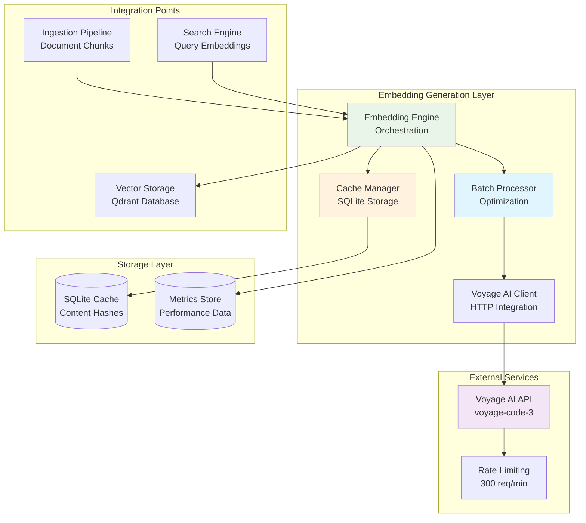
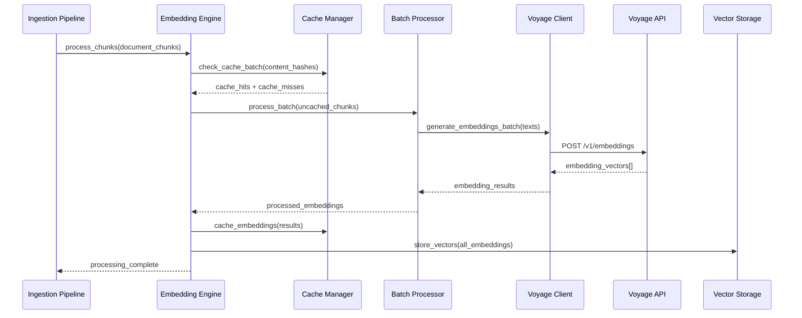

# Product Requirement Prompt: RAG Embedding Service Integration (Voyage AI)

## Context

This PRP defines the implementation of a high-throughput embedding generation system using Voyage AI's voyage-code-3 model for the Contexter Documentation Platform's RAG system. The embedding service provides code-optimized 2048-dimensional vectors that power semantic search capabilities with intelligent caching and batch processing.

**Project Background**:
- **System**: Contexter Documentation Platform
- **Component**: RAG System Infrastructure - Embedding Generation Layer
- **Technology Stack**: Python 3.9+, httpx, asyncio, SQLite (caching)
- **External Service**: Voyage AI API with voyage-code-3 model
- **Performance Target**: >1000 documents/minute, 99.9% API success rate

**Existing System Context**:
- Document Ingestion Pipeline produces chunked text (1000 tokens, 200 overlap)
- Vector Storage (Qdrant) expects 2048-dimensional float32 vectors
- Search Engine requires both document and query embeddings
- Auto-Ingestion Pipeline triggers embedding generation after chunking

## Requirements

### Functional Requirements

**FR-EMB-001: Voyage AI Client Integration**
- **As a** system administrator
- **I want** reliable integration with Voyage AI's voyage-code-3 model
- **So that** code-optimized embeddings are generated for technical documentation
- **Acceptance Criteria**:
  - [ ] HTTP client integration with authentication and API key management
  - [ ] Support for both "document" and "query" input types
  - [ ] Batch processing with configurable batch sizes (default 100 texts)
  - [ ] Rate limiting compliance (300 requests/minute, 1M tokens/minute)
  - [ ] Comprehensive error handling and retry logic with exponential backoff

**FR-EMB-002: High-Throughput Batch Processing**
- **As a** system administrator
- **I want** efficient batch processing of document embeddings
- **So that** large document collections can be processed quickly
- **Acceptance Criteria**:
  - [ ] Concurrent processing with semaphore-based rate limiting
  - [ ] Batch optimization for API efficiency (target >1000 docs/minute)
  - [ ] Progress tracking and detailed error reporting
  - [ ] Memory-efficient processing for large document sets
  - [ ] Support for priority-based processing queues

**FR-EMB-003: Intelligent Caching System**
- **As a** system administrator
- **I want** intelligent caching to minimize API costs and latency
- **So that** duplicate content doesn't require re-embedding
- **Acceptance Criteria**:
  - [ ] Content-based hash caching with collision detection
  - [ ] SQLite-based persistent cache with LRU eviction
  - [ ] Configurable TTL (default 7 days) with automatic cleanup
  - [ ] Cache statistics and hit rate monitoring
  - [ ] Cache warming capabilities for common queries

**FR-EMB-004: Error Handling and Resilience**
- **As a** system administrator
- **I want** robust error handling and automatic recovery
- **So that** embedding generation continues despite transient failures
- **Acceptance Criteria**:
  - [ ] Exponential backoff retry for transient failures (max 3 attempts)
  - [ ] Rate limiting detection and adaptive backoff
  - [ ] Circuit breaker pattern for sustained API failures
  - [ ] Detailed error classification and logging
  - [ ] Graceful degradation when API is unavailable

**FR-EMB-005: Performance Monitoring and Optimization**
- **As a** system administrator
- **I want** comprehensive performance monitoring and optimization
- **So that** embedding generation meets throughput and cost targets
- **Acceptance Criteria**:
  - [ ] API usage tracking and cost monitoring
  - [ ] Performance metrics collection (latency, throughput, errors)
  - [ ] Automatic batch size optimization based on performance data
  - [ ] Memory usage monitoring and optimization
  - [ ] Integration with system-wide monitoring infrastructure

### Non-Functional Requirements

**NFR-EMB-001: Performance**
- Throughput > 1000 documents/minute during batch processing
- API success rate > 99.9% for valid requests
- Cache hit rate > 50% for production workloads
- Memory usage < 2GB during peak processing

**NFR-EMB-002: Reliability**
- Automatic retry and recovery from transient failures
- Circuit breaker protection against sustained API failures
- Data integrity verification for generated embeddings
- Persistent caching survives application restarts

**NFR-EMB-003: Cost Optimization**
- Intelligent caching to minimize duplicate API calls
- Batch optimization to reduce API request overhead
- Usage monitoring to stay within budget constraints
- Cost per document tracking and alerting

## Architecture

### System Architecture



### Data Flow Architecture

**Batch Processing Flow**:


### Component Specifications

**Embedding Engine Interface**:
```python
from abc import ABC, abstractmethod
from typing import List, Dict, Any, Optional, AsyncIterator
from dataclasses import dataclass
import asyncio

@dataclass
class EmbeddingRequest:
    content: str
    content_hash: str
    metadata: Dict[str, Any]
    input_type: str = "document"  # "document" or "query"
    priority: int = 0

@dataclass
class EmbeddingResult:
    content_hash: str
    embedding: List[float]
    model: str
    dimensions: int
    processing_time: float
    cache_hit: bool
    error: Optional[str] = None

class IEmbeddingEngine(ABC):
    @abstractmethod
    async def generate_embedding(self, request: EmbeddingRequest) -> EmbeddingResult:
        """Generate single embedding with caching."""
        pass
    
    @abstractmethod
    async def generate_batch_embeddings(
        self, requests: List[EmbeddingRequest]
    ) -> List[EmbeddingResult]:
        """Generate embeddings in batches for optimal throughput."""
        pass
    
    @abstractmethod
    async def embed_query(self, query: str) -> List[float]:
        """Quick embedding generation for search queries."""
        pass
    
    @abstractmethod
    def get_cache_statistics(self) -> Dict[str, Any]:
        """Get cache performance statistics."""
        pass
```

## Implementation Blueprint

### Phase 1: Core Client Integration (8 hours)

**Task EMB-001: Voyage AI HTTP Client**
- **Duration**: 4 hours
- **Dependencies**: None
- **Deliverables**: VoyageAIClient with authentication and rate limiting

**Implementation Steps**:
1. Set up HTTP client with authentication:
   ```python
   import httpx
   import asyncio
   from typing import List, Dict, Any
   import time
   
   class VoyageAIClient:
       def __init__(self, api_key: str):
           self.api_key = api_key
           self.base_url = "https://api.voyageai.com/v1"
           self.client = httpx.AsyncClient(
               headers={"Authorization": f"Bearer {api_key}"},
               timeout=httpx.Timeout(60.0),
               limits=httpx.Limits(max_keepalive_connections=10)
           )
           self.rate_limiter = RateLimiter(requests_per_minute=300)
   ```

2. Implement embedding generation with retry logic:
   ```python
   async def generate_embeddings(
       self, texts: List[str], 
       input_type: str = "document",
       model: str = "voyage-code-3"
   ) -> List[List[float]]:
       
       await self.rate_limiter.acquire(len(texts))
       
       payload = {
           "input": texts,
           "model": model,
           "input_type": input_type
       }
       
       for attempt in range(3):
           try:
               response = await self.client.post(
                   f"{self.base_url}/embeddings",
                   json=payload
               )
               response.raise_for_status()
               
               data = response.json()
               return [item["embedding"] for item in data["data"]]
               
           except httpx.HTTPStatusError as e:
               if e.response.status_code == 429:
                   # Rate limited - wait and retry
                   retry_after = int(e.response.headers.get("retry-after", 60))
                   await asyncio.sleep(retry_after + random.uniform(1, 5))
                   continue
               elif attempt == 2:
                   raise
           except Exception as e:
               if attempt == 2:
                   raise
               await asyncio.sleep(2 ** attempt)
   ```

3. Add error classification and monitoring
4. Implement connection pooling optimization

**Task EMB-002: Rate Limiting and Circuit Breaker**
- **Duration**: 2 hours
- **Dependencies**: EMB-001
- **Deliverables**: Advanced rate limiting with circuit breaker protection

**Implementation Steps**:
1. Implement token bucket rate limiter:
   ```python
   class RateLimiter:
       def __init__(self, requests_per_minute: int, tokens_per_minute: int):
           self.request_bucket = TokenBucket(requests_per_minute, requests_per_minute)
           self.token_bucket = TokenBucket(tokens_per_minute, tokens_per_minute)
           
       async def acquire(self, num_requests: int, num_tokens: int = None):
           await self.request_bucket.acquire(num_requests)
           if num_tokens:
               await self.token_bucket.acquire(num_tokens)
   ```

2. Add circuit breaker for API failures
3. Implement adaptive backoff based on API response patterns
4. Add monitoring for rate limit utilization

**Task EMB-003: Performance Monitoring Integration**
- **Duration**: 2 hours  
- **Dependencies**: EMB-002
- **Deliverables**: Comprehensive metrics collection and monitoring

**Implementation Steps**:
1. Implement metrics collection for API operations
2. Add cost tracking and usage monitoring
3. Create performance dashboards and alerts
4. Integrate with system-wide monitoring infrastructure

### Phase 2: Intelligent Caching System (6 hours)

**Task EMB-004: SQLite Cache Implementation**
- **Duration**: 3 hours
- **Dependencies**: None (parallel to Phase 1)
- **Deliverables**: Persistent embedding cache with LRU eviction

**Implementation Steps**:
1. Design cache schema and indexes:
   ```sql
   CREATE TABLE embedding_cache (
       content_hash TEXT PRIMARY KEY,
       content TEXT NOT NULL,
       embedding BLOB NOT NULL,
       model TEXT NOT NULL,
       dimensions INTEGER NOT NULL,
       created_at TIMESTAMP DEFAULT CURRENT_TIMESTAMP,
       last_accessed TIMESTAMP DEFAULT CURRENT_TIMESTAMP,
       access_count INTEGER DEFAULT 1
   );
   
   CREATE INDEX idx_last_accessed ON embedding_cache(last_accessed);
   CREATE INDEX idx_model ON embedding_cache(model);
   ```

2. Implement cache operations with async support:
   ```python
   import aiosqlite
   import pickle
   import hashlib
   
   class EmbeddingCache:
       def __init__(self, db_path: str, max_size_gb: float = 10.0):
           self.db_path = db_path
           self.max_size_bytes = int(max_size_gb * 1024 * 1024 * 1024)
           
       async def get_embedding(self, content_hash: str) -> Optional[List[float]]:
           async with aiosqlite.connect(self.db_path) as db:
               cursor = await db.execute(
                   "SELECT embedding, dimensions FROM embedding_cache WHERE content_hash = ?",
                   (content_hash,)
               )
               result = await cursor.fetchone()
               
               if result:
                   # Update access statistics
                   await db.execute(
                       "UPDATE embedding_cache SET last_accessed = CURRENT_TIMESTAMP, "
                       "access_count = access_count + 1 WHERE content_hash = ?",
                       (content_hash,)
                   )
                   await db.commit()
                   
                   embedding_blob, dimensions = result
                   return pickle.loads(embedding_blob)
               return None
   ```

3. Implement LRU eviction and cleanup procedures
4. Add cache statistics and monitoring

**Task EMB-005: Cache Optimization and Management**
- **Duration**: 2 hours
- **Dependencies**: EMB-004
- **Deliverables**: Advanced cache management features

**Implementation Steps**:
1. Implement cache warming for common queries
2. Add cache statistics and hit rate monitoring
3. Create automatic cleanup procedures for TTL management
4. Optimize cache queries for better performance

**Task EMB-006: Hash-based Content Deduplication**
- **Duration**: 1 hour
- **Dependencies**: EMB-004
- **Deliverables**: Efficient content hashing and collision handling

**Implementation Steps**:
1. Implement consistent hashing for content:
   ```python
   def generate_content_hash(content: str) -> str:
       # Normalize content for consistent hashing
       normalized = " ".join(content.strip().split())
       return hashlib.sha256(normalized.encode()).hexdigest()
   ```

2. Add collision detection and resolution
3. Implement batch hash checking for performance
4. Add hash validation and integrity checking

### Phase 3: Batch Processing and Optimization (8 hours)

**Task EMB-007: Advanced Batch Processor**
- **Duration**: 4 hours
- **Dependencies**: EMB-002, EMB-005
- **Deliverables**: High-performance batch processing system

**Implementation Steps**:
1. Implement intelligent batch processing:
   ```python
   class BatchProcessor:
       def __init__(self, voyage_client: VoyageAIClient, cache: EmbeddingCache):
           self.voyage_client = voyage_client
           self.cache = cache
           self.batch_size = 100
           self.max_concurrent_batches = 5
           self.semaphore = asyncio.Semaphore(self.max_concurrent_batches)
           
       async def process_embedding_requests(
           self, requests: List[EmbeddingRequest]
       ) -> List[EmbeddingResult]:
           
           # Check cache first
           cached_results, uncached_requests = await self._check_cache_batch(requests)
           
           if not uncached_requests:
               return cached_results
               
           # Process uncached requests in batches
           batch_results = []
           for i in range(0, len(uncached_requests), self.batch_size):
               batch = uncached_requests[i:i + self.batch_size]
               async with self.semaphore:
                   batch_result = await self._process_batch(batch)
                   batch_results.extend(batch_result)
           
           # Cache new results
           await self._cache_results(batch_results)
           
           return cached_results + batch_results
   ```

2. Implement adaptive batch sizing based on performance
3. Add progress tracking and detailed error reporting
4. Optimize memory usage for large batch processing

**Task EMB-008: Performance Optimization**
- **Duration**: 3 hours
- **Dependencies**: EMB-007
- **Deliverables**: Optimized embedding generation performance

**Implementation Steps**:
1. Implement batch size optimization based on latency metrics
2. Add connection pooling optimization
3. Create performance benchmarking and testing suite
4. Optimize memory usage and garbage collection

**Task EMB-009: Priority Queue and Resource Management**
- **Duration**: 1 hour
- **Dependencies**: EMB-007
- **Deliverables**: Priority-based processing and resource management

**Implementation Steps**:
1. Implement priority queue for embedding requests
2. Add resource usage monitoring and limits
3. Create load balancing for concurrent processing
4. Add emergency throttling for resource protection

### Phase 4: Integration and Testing (6 hours)

**Task EMB-010: Engine Integration and API**
- **Duration**: 3 hours
- **Dependencies**: All previous tasks
- **Deliverables**: Complete EmbeddingEngine implementation

**Implementation Steps**:
1. Integrate all components into unified EmbeddingEngine:
   ```python
   class VoyageEmbeddingEngine(IEmbeddingEngine):
       def __init__(self, api_key: str, cache_path: str):
           self.voyage_client = VoyageAIClient(api_key)
           self.cache = EmbeddingCache(cache_path)
           self.batch_processor = BatchProcessor(self.voyage_client, self.cache)
           self.metrics_collector = MetricsCollector()
           
       async def generate_batch_embeddings(
           self, requests: List[EmbeddingRequest]
       ) -> List[EmbeddingResult]:
           start_time = time.time()
           
           try:
               results = await self.batch_processor.process_embedding_requests(requests)
               
               # Update metrics
               processing_time = time.time() - start_time
               self.metrics_collector.record_batch_processing(
                   batch_size=len(requests),
                   processing_time=processing_time,
                   cache_hits=sum(1 for r in results if r.cache_hit),
                   errors=sum(1 for r in results if r.error)
               )
               
               return results
               
           except Exception as e:
               self.metrics_collector.record_error(str(e))
               raise
   ```

2. Add comprehensive error handling and logging
3. Implement graceful shutdown and resource cleanup
4. Add configuration management and validation

**Task EMB-011: Comprehensive Testing**
- **Duration**: 2 hours
- **Dependencies**: EMB-010
- **Deliverables**: Complete test suite with performance validation

**Implementation Steps**:
1. Create unit tests for all components
2. Add integration tests with mock Voyage AI API
3. Implement performance benchmarking tests
4. Create load testing scenarios

**Task EMB-012: Monitoring and Observability**
- **Duration**: 1 hour
- **Dependencies**: EMB-010
- **Deliverables**: Production monitoring and alerting

**Implementation Steps**:
1. Add comprehensive metrics export
2. Create monitoring dashboards for embedding operations
3. Set up alerting for performance thresholds
4. Add operational runbooks and troubleshooting guides

## Validation Loops

### Level 1: Unit Testing
**Validation Criteria**:
- [ ] All EmbeddingEngine methods have >90% test coverage
- [ ] Cache operations handle edge cases correctly
- [ ] Rate limiting and circuit breaker functionality verified
- [ ] Error handling works for all failure scenarios
- [ ] Performance benchmarks meet throughput targets

**Test Implementation**:
```python
import pytest
from unittest.mock import AsyncMock, patch
import numpy as np

class TestVoyageEmbeddingEngine:
    @pytest.fixture
    async def embedding_engine(self):
        engine = VoyageEmbeddingEngine(
            api_key="test_key",
            cache_path=":memory:"  # In-memory SQLite for testing
        )
        await engine.initialize()
        return engine
    
    async def test_batch_processing_performance(self, embedding_engine):
        # Test with 1000 documents to verify throughput target
        requests = [
            EmbeddingRequest(
                content=f"Test document content {i}",
                content_hash=f"hash_{i}",
                metadata={"chunk_index": i}
            )
            for i in range(1000)
        ]
        
        start_time = time.time()
        results = await embedding_engine.generate_batch_embeddings(requests)
        duration = time.time() - start_time
        
        # Should process 1000 documents in under 60 seconds (>1000/min)
        assert duration < 60.0
        assert len(results) == 1000
        assert all(len(r.embedding) == 2048 for r in results if not r.error)
    
    async def test_cache_hit_rate(self, embedding_engine):
        # Test caching effectiveness
        request = EmbeddingRequest(
            content="Reusable test content",
            content_hash="test_hash",
            metadata={}
        )
        
        # First request should miss cache
        result1 = await embedding_engine.generate_embedding(request)
        assert not result1.cache_hit
        
        # Second request should hit cache
        result2 = await embedding_engine.generate_embedding(request)
        assert result2.cache_hit
        assert result2.embedding == result1.embedding
```

### Level 2: Integration Testing
**Validation Criteria**:
- [ ] Integration with Voyage AI API works correctly
- [ ] Cache persistence survives application restarts
- [ ] Rate limiting respects API constraints
- [ ] Error recovery and retry logic functions properly
- [ ] Performance meets requirements under realistic load

**Integration Test Scenarios**:
```python
async def test_api_integration():
    # Test with real Voyage AI API (requires API key)
    if not os.getenv("VOYAGE_API_KEY"):
        pytest.skip("VOYAGE_API_KEY not set")
    
    engine = VoyageEmbeddingEngine(
        api_key=os.getenv("VOYAGE_API_KEY"),
        cache_path="test_cache.db"
    )
    
    test_content = [
        "How to make HTTP requests in Python using requests library",
        "FastAPI tutorial for building web APIs",
        "Docker containerization best practices"
    ]
    
    requests = [
        EmbeddingRequest(content=content, content_hash=hashlib.sha256(content.encode()).hexdigest())
        for content in test_content
    ]
    
    results = await engine.generate_batch_embeddings(requests)
    
    assert len(results) == len(test_content)
    assert all(len(r.embedding) == 2048 for r in results)
    assert all(not r.error for r in results)
```

### Level 3: Performance and Load Testing
**Validation Criteria**:
- [ ] Throughput >1000 documents/minute sustained for 10+ minutes
- [ ] Memory usage remains stable during extended processing
- [ ] Cache hit rate >50% for realistic document distribution
- [ ] API success rate >99.9% under normal load
- [ ] Graceful degradation under extreme load conditions

**Load Testing Framework**:
```python
import asyncio
import time
from concurrent.futures import ThreadPoolExecutor

async def load_test_embedding_generation():
    """Test sustained throughput under load."""
    engine = VoyageEmbeddingEngine(api_key="test_key", cache_path="load_test.db")
    
    # Generate 10,000 unique documents
    documents = [
        f"Test document {i} with unique content for load testing embedding generation"
        for i in range(10000)
    ]
    
    # Process in batches to simulate realistic usage
    batch_size = 100
    start_time = time.time()
    total_processed = 0
    
    for i in range(0, len(documents), batch_size):
        batch = documents[i:i + batch_size]
        requests = [
            EmbeddingRequest(content=doc, content_hash=f"hash_{i + j}")
            for j, doc in enumerate(batch)
        ]
        
        results = await engine.generate_batch_embeddings(requests)
        total_processed += len([r for r in results if not r.error])
        
        # Monitor performance every 1000 documents
        if (i + batch_size) % 1000 == 0:
            elapsed = time.time() - start_time
            rate = total_processed / (elapsed / 60)  # per minute
            print(f"Processed {total_processed} documents at {rate:.1f} docs/min")
            assert rate > 1000, f"Throughput {rate:.1f} below target of 1000 docs/min"
```

## Success Criteria

### Functional Success Metrics
- [ ] **API Integration**: Successfully integrate with Voyage AI API with authentication
- [ ] **Batch Processing**: Process 100+ documents per batch with <1% failure rate
- [ ] **Caching System**: Achieve >50% cache hit rate for production workloads
- [ ] **Error Handling**: Graceful handling of rate limits, timeouts, and API failures
- [ ] **Performance Monitoring**: Comprehensive metrics and cost tracking

### Performance Success Metrics
- [ ] **Throughput**: >1000 documents/minute sustained throughput during batch processing
- [ ] **API Success Rate**: >99.9% success rate for valid embedding requests
- [ ] **Cache Performance**: <10ms cache lookup latency, >50% hit rate
- [ ] **Memory Efficiency**: <2GB memory usage during peak processing
- [ ] **Cost Optimization**: <$0.001 per document average cost through caching

### Integration Success Metrics
- [ ] **Pipeline Integration**: Seamless integration with ingestion and vector storage
- [ ] **Query Processing**: Sub-100ms embedding generation for search queries
- [ ] **Monitoring**: Real-time performance metrics and alerting
- [ ] **Configuration**: External configuration without code changes
- [ ] **Documentation**: Complete API documentation with usage examples

## Potential Gotchas

### API Integration Challenges
1. **Rate Limiting Complexity**
   - **Issue**: Voyage AI has multiple rate limits (requests/min, tokens/min)
   - **Solution**: Implement dual token bucket rate limiting
   - **Mitigation**: Monitor both metrics and implement adaptive throttling

2. **Token Counting Accuracy**
   - **Issue**: Client-side token counting may not match API counting
   - **Solution**: Track API usage from response headers when available
   - **Mitigation**: Build in safety margins for rate limiting

3. **API Response Variability**
   - **Issue**: Response times may vary significantly based on load
   - **Solution**: Implement adaptive timeout based on historical data
   - **Mitigation**: Circuit breaker to prevent cascade failures

### Performance Optimization Pitfalls
1. **Memory Usage with Large Batches**
   - **Issue**: Large embedding batches can consume excessive memory
   - **Solution**: Implement streaming processing and memory monitoring
   - **Mitigation**: Dynamic batch size adjustment based on available memory

2. **Cache Memory Growth**
   - **Issue**: SQLite cache can grow indefinitely without proper management
   - **Solution**: Implement LRU eviction and automatic cleanup procedures
   - **Mitigation**: Monitor cache size and set hard limits

3. **Connection Pool Exhaustion**
   - **Issue**: Too many concurrent requests can exhaust connection pools
   - **Solution**: Implement connection pool monitoring and adaptive limits
   - **Mitigation**: Queue overflow handling and backpressure

### Data Integrity Concerns
1. **Cache Consistency**
   - **Issue**: Cache corruption or inconsistency can affect embedding quality
   - **Solution**: Implement cache validation and integrity checking
   - **Mitigation**: Cache invalidation and rebuild procedures

2. **Embedding Vector Validation**
   - **Issue**: Invalid or corrupted embeddings can break downstream processing
   - **Solution**: Validate embedding dimensions and value ranges
   - **Mitigation**: Error detection and automatic retry with fresh embeddings

### Cost Management Risks
1. **API Cost Explosion**
   - **Issue**: Poor caching or retry logic can lead to excessive API usage
   - **Solution**: Implement cost monitoring and automatic throttling
   - **Mitigation**: Usage alerts and emergency shutoff mechanisms

2. **Cache Storage Costs**
   - **Issue**: Large caches can become expensive to maintain
   - **Solution**: Implement cost-effective storage tiers and archival
   - **Mitigation**: Regular cost analysis and optimization procedures

---

**PRP Version**: 1.0  
**Created By**: PRP Generation System  
**Target Sprint**: Sprint 2, Week 3  
**Estimated Effort**: 28 hours (3.5 developer-days)  
**Dependencies**: Document Ingestion Pipeline  
**Success Criteria**: >1000 docs/min throughput, 99.9% API success rate, >50% cache hit rate