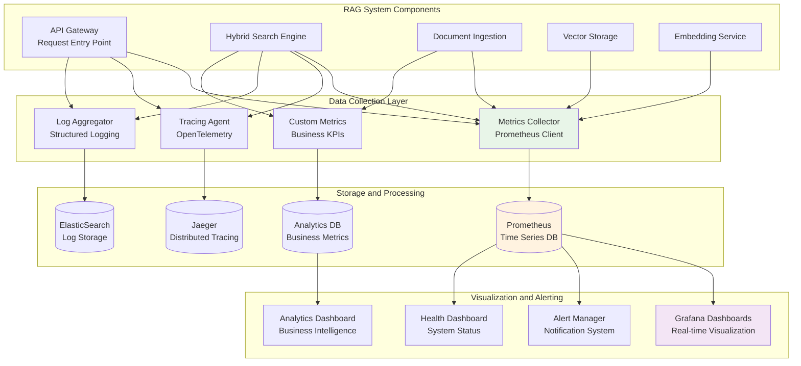

# Product Requirement Prompt: RAG Monitoring and Observability

## Context

This PRP defines the implementation of comprehensive monitoring and observability for the Contexter Documentation Platform's RAG system, providing real-time insights, performance tracking, error detection, and operational intelligence across all system components with Prometheus, Grafana, and custom analytics.

**Project Background**:
- **System**: Contexter Documentation Platform
- **Component**: Quality & Performance - Monitoring and Observability
- **Technology Stack**: Prometheus, Grafana, OpenTelemetry, Python logging, asyncio
- **Performance Target**: <5ms monitoring overhead, 99.9% metric availability, real-time alerting
- **Dependencies**: All RAG system components

## Requirements

### Functional Requirements

**FR-MON-001: System Performance Monitoring**
- **As a** site reliability engineer
- **I want** comprehensive performance monitoring across all RAG components
- **So that** system performance can be tracked and optimized continuously
- **Acceptance Criteria**:
  - [ ] Search latency metrics (p50, p95, p99) with <1ms precision
  - [ ] Ingestion pipeline throughput and processing times
  - [ ] Vector database operation metrics (insert, query, optimization)
  - [ ] Embedding generation performance and API usage tracking
  - [ ] Memory usage, CPU utilization, and resource consumption

**FR-MON-002: Business Intelligence Dashboard**
- **As a** product manager
- **I want** business intelligence dashboards for RAG system usage
- **So that** system value and user engagement can be measured
- **Acceptance Criteria**:
  - [ ] Search query analytics (volume, types, success rates)
  - [ ] Library usage statistics and popularity trends
  - [ ] User behavior analytics and search patterns
  - [ ] Document processing statistics and growth trends
  - [ ] Cost analysis and resource utilization optimization

**FR-MON-003: Error Detection and Alerting**
- **As a** system administrator
- **I want** proactive error detection and intelligent alerting
- **So that** issues can be identified and resolved before user impact
- **Acceptance Criteria**:
  - [ ] Real-time error rate monitoring with threshold-based alerts
  - [ ] Anomaly detection for performance degradation
  - [ ] Component health checks with dependency mapping
  - [ ] Alert correlation and noise reduction
  - [ ] Integration with incident management systems

**FR-MON-004: Distributed Tracing and Debugging**
- **As a** developer
- **I want** distributed tracing for request flow visualization
- **So that** performance bottlenecks and errors can be debugged effectively
- **Acceptance Criteria**:
  - [ ] End-to-end request tracing from API to vector storage
  - [ ] Component interaction visualization and timing
  - [ ] Error propagation tracking across system boundaries
  - [ ] Custom span annotations for business logic insights
  - [ ] Trace sampling and retention management

### Non-Functional Requirements

**NFR-MON-001: Performance Impact**
- Monitoring overhead <5ms per request (p99)
- Metric collection impact <2% CPU utilization
- Dashboard load time <3 seconds for all views
- Alert notification latency <30 seconds

**NFR-MON-002: Reliability**
- Monitoring system availability 99.9%
- Metric data retention: 30 days high resolution, 1 year aggregated
- Dashboard uptime 99.95%
- Alert delivery reliability 99.99%

## Architecture

### Monitoring Architecture



## Implementation Blueprint

### Phase 1: Core Monitoring Infrastructure (8 hours)

**Task MON-001: Metrics Collection Framework**
- **Duration**: 4 hours
- **Dependencies**: None
- **Deliverables**: Prometheus-based metrics collection system

**Implementation Steps**:
```python
from prometheus_client import Counter, Histogram, Gauge, CollectorRegistry, generate_latest
import time
import asyncio
from typing import Dict, Any, Optional
from contextlib import asynccontextmanager
from functools import wraps

class RAGMetricsCollector:
    def __init__(self):
        self.registry = CollectorRegistry()
        
        # Search Engine Metrics
        self.search_requests_total = Counter(
            'rag_search_requests_total',
            'Total number of search requests',
            ['search_type', 'status'],
            registry=self.registry
        )
        
        self.search_latency = Histogram(
            'rag_search_latency_seconds',
            'Search request latency in seconds',
            ['search_type'],
            buckets=[0.005, 0.01, 0.025, 0.05, 0.1, 0.25, 0.5, 1.0, 2.5, 5.0],
            registry=self.registry
        )
        
        # Document Ingestion Metrics
        self.documents_processed_total = Counter(
            'rag_documents_processed_total',
            'Total number of documents processed',
            ['status'],
            registry=self.registry
        )
        
        self.ingestion_throughput = Gauge(
            'rag_ingestion_throughput_docs_per_minute',
            'Current document ingestion throughput',
            registry=self.registry
        )
        
        # Vector Storage Metrics
        self.vector_operations_total = Counter(
            'rag_vector_operations_total',
            'Total vector database operations',
            ['operation_type', 'status'],
            registry=self.registry
        )
        
        self.vector_storage_size = Gauge(
            'rag_vector_storage_size_bytes',
            'Vector storage size in bytes',
            registry=self.registry
        )
        
        # Embedding Service Metrics
        self.embedding_requests_total = Counter(
            'rag_embedding_requests_total',
            'Total embedding generation requests',
            ['status'],
            registry=self.registry
        )
        
        self.embedding_cache_hit_rate = Gauge(
            'rag_embedding_cache_hit_rate',
            'Embedding cache hit rate percentage',
            registry=self.registry
        )
        
    @asynccontextmanager
    async def measure_search_latency(self, search_type: str):
        """Context manager for measuring search latency."""
        start_time = time.time()
        try:
            yield
            self.search_requests_total.labels(
                search_type=search_type, status='success'
            ).inc()
        except Exception as e:
            self.search_requests_total.labels(
                search_type=search_type, status='error'
            ).inc()
            raise
        finally:
            duration = time.time() - start_time
            self.search_latency.labels(search_type=search_type).observe(duration)
    
    def record_document_processed(self, success: bool):
        """Record document processing result."""
        status = 'success' if success else 'error'
        self.documents_processed_total.labels(status=status).inc()
    
    def update_ingestion_throughput(self, docs_per_minute: float):
        """Update ingestion throughput gauge."""
        self.ingestion_throughput.set(docs_per_minute)
    
    def get_metrics(self) -> bytes:
        """Get Prometheus metrics in text format."""
        return generate_latest(self.registry)

# Global metrics instance
metrics = RAGMetricsCollector()

# Decorator for automatic method monitoring
def monitor_performance(metric_name: str, labels: Dict[str, str] = None):
    def decorator(func):
        @wraps(func)
        async def wrapper(*args, **kwargs):
            start_time = time.time()
            try:
                result = await func(*args, **kwargs)
                # Record success metrics
                return result
            except Exception as e:
                # Record error metrics
                raise
            finally:
                duration = time.time() - start_time
                # Record latency metrics
        return wrapper
    return decorator
```

**Task MON-002: Distributed Tracing Implementation**
- **Duration**: 2 hours  
- **Dependencies**: MON-001
- **Deliverables**: OpenTelemetry-based distributed tracing

**Task MON-003: Structured Logging System**
- **Duration**: 2 hours
- **Dependencies**: MON-001
- **Deliverables**: Centralized structured logging with correlation IDs

### Phase 2: Dashboard and Visualization (6 hours)

**Task MON-004: Grafana Dashboard Creation**
- **Duration**: 4 hours
- **Dependencies**: MON-001
- **Deliverables**: Comprehensive Grafana dashboards for all system aspects

**Implementation Steps**:
```json
{
  "dashboard": {
    "title": "RAG System Performance Dashboard",
    "panels": [
      {
        "title": "Search Latency",
        "type": "graph",
        "targets": [
          {
            "expr": "histogram_quantile(0.95, rate(rag_search_latency_seconds_bucket[5m]))",
            "legendFormat": "95th percentile"
          },
          {
            "expr": "histogram_quantile(0.99, rate(rag_search_latency_seconds_bucket[5m]))",
            "legendFormat": "99th percentile"
          }
        ],
        "yAxes": [
          {
            "unit": "s",
            "max": 0.1
          }
        ]
      },
      {
        "title": "Search Throughput",
        "type": "graph",
        "targets": [
          {
            "expr": "rate(rag_search_requests_total[1m])",
            "legendFormat": "Requests per second"
          }
        ]
      },
      {
        "title": "Error Rate",
        "type": "singlestat",
        "targets": [
          {
            "expr": "rate(rag_search_requests_total{status=\"error\"}[5m]) / rate(rag_search_requests_total[5m]) * 100"
          }
        ],
        "format": "percent",
        "thresholds": [1, 5]
      }
    ]
  }
}
```

**Task MON-005: Business Intelligence Dashboard**
- **Duration**: 2 hours
- **Dependencies**: MON-004
- **Deliverables**: Business-focused analytics dashboard

### Phase 3: Alerting and Intelligence (6 hours)

**Task MON-006: Alert Management System**
- **Duration**: 3 hours
- **Dependencies**: MON-004
- **Deliverables**: Intelligent alerting with correlation and escalation

**Task MON-007: Anomaly Detection and Intelligence**
- **Duration**: 3 hours
- **Dependencies**: MON-006
- **Deliverables**: AI-powered anomaly detection and root cause analysis

## Success Criteria

### Functional Success Metrics
- [ ] **Complete Coverage**: Monitoring for all RAG system components
- [ ] **Real-time Dashboards**: <3 second load time for all dashboard views
- [ ] **Proactive Alerting**: <30 second alert notification latency
- [ ] **Distributed Tracing**: End-to-end request flow visualization
- [ ] **Business Intelligence**: Usage analytics and cost optimization insights

### Performance Success Metrics
- [ ] **Low Overhead**: <5ms monitoring overhead per request (p99)
- [ ] **High Availability**: 99.9% monitoring system uptime
- [ ] **Data Retention**: 30 days high resolution, 1 year aggregated
- [ ] **Alert Accuracy**: >95% relevant alerts, <5% false positives
- [ ] **Dashboard Responsiveness**: All queries complete within 5 seconds

---

**PRP Version**: 1.0  
**Created By**: PRP Generation System  
**Target Sprint**: Sprint 3, Week 6  
**Estimated Effort**: 20 hours (2.5 developer-days)  
**Dependencies**: All RAG system components  
**Success Criteria**: <5ms overhead, 99.9% availability, real-time insights