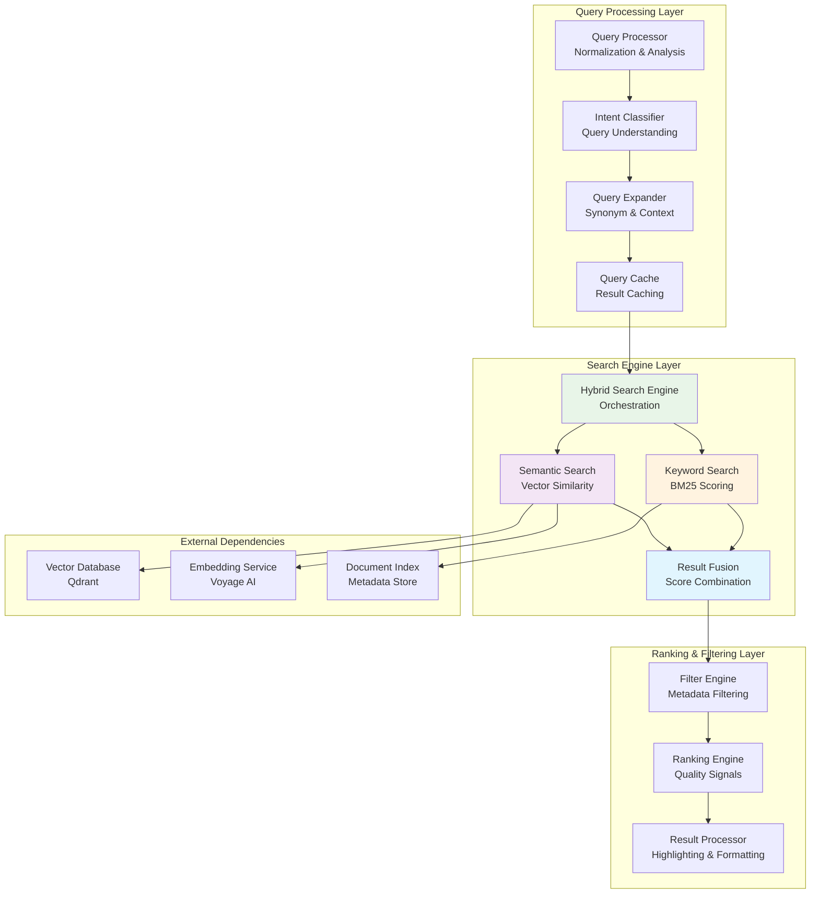
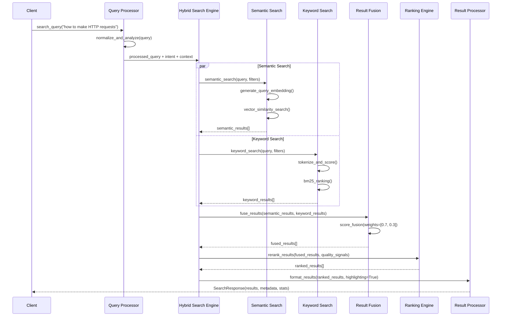

# Product Requirement Prompt: RAG Retrieval Engine with Similarity Search

## Context

This PRP defines the implementation of a high-performance hybrid retrieval engine for the Contexter Documentation Platform's RAG system. The retrieval engine combines semantic vector similarity search with keyword-based search, providing accurate, fast, and contextually relevant results for technical documentation queries with sub-50ms latency.

**Project Background**:
- **System**: Contexter Documentation Platform
- **Component**: RAG System Core Features - Hybrid Search and Retrieval
- **Technology Stack**: Python 3.9+, asyncio, numpy, Qdrant client, BM25 implementation
- **Integration**: Works with Vector Database (Qdrant), Embedding Service (Voyage AI), Query Processing
- **Performance Target**: p95 <50ms latency, p99 <100ms latency, >95% recall@10

**Existing System Context**:
- Vector Database stores 2048-dimensional embeddings with metadata indexing
- Embedding Service generates query embeddings using voyage-code-3 model
- Document chunks are stored with rich metadata for filtering and ranking
- API layer requires structured search results with relevance scoring

## Requirements

### Functional Requirements

**FR-RET-001: Hybrid Search Architecture**
- **As a** developer user
- **I want** combined semantic and keyword search capabilities
- **So that** I can find relevant documentation using both meaning-based and exact-term matching
- **Acceptance Criteria**:
  - [ ] Semantic vector similarity search using cosine distance
  - [ ] Keyword-based search with BM25-like scoring algorithm
  - [ ] Configurable fusion weights (default 70% semantic, 30% keyword)
  - [ ] Fallback to keyword-only search when semantic search fails
  - [ ] Query type detection for optimal search strategy selection

**FR-RET-002: Advanced Filtering and Ranking**
- **As a** developer user
- **I want** sophisticated filtering and ranking capabilities
- **So that** search results are highly relevant and contextually appropriate
- **Acceptance Criteria**:
  - [ ] Metadata filtering (library_id, doc_type, programming_language, trust_score)
  - [ ] Complex filter combinations with AND/OR logic support
  - [ ] Result reranking based on quality signals (trust_score, star_count, recency)
  - [ ] Configurable similarity thresholds for result filtering
  - [ ] Support for negative filtering (exclude specific content types)

**FR-RET-003: Query Processing and Optimization**
- **As a** developer user
- **I want** intelligent query processing and optimization
- **So that** search queries are understood and processed effectively
- **Acceptance Criteria**:
  - [ ] Query normalization and preprocessing (stopword removal, stemming)
  - [ ] Query expansion with synonyms and related terms
  - [ ] Programming language and framework detection in queries
  - [ ] Query intent classification (api_lookup, tutorial_search, troubleshooting)
  - [ ] Query caching for improved performance on repeated searches

**FR-RET-004: Result Presentation and Highlighting**
- **As a** developer user
- **I want** well-formatted results with relevant highlights
- **So that** I can quickly identify the most relevant information
- **Acceptance Criteria**:
  - [ ] Relevance score normalization and presentation (0.0-1.0 scale)
  - [ ] Context snippets with query term highlighting
  - [ ] Result clustering by library and document type
  - [ ] Pagination support for large result sets (configurable page size)
  - [ ] Rich metadata display (library info, doc type, code language)

**FR-RET-005: Performance Optimization and Caching**
- **As a** system administrator
- **I want** optimized search performance with intelligent caching
- **So that** users experience fast and responsive search operations
- **Acceptance Criteria**:
  - [ ] Query result caching with configurable TTL (default 1 hour)
  - [ ] Embedding caching for frequent queries
  - [ ] Search index warming for popular queries
  - [ ] Batch search support for multiple queries
  - [ ] Connection pooling and resource optimization

### Non-Functional Requirements

**NFR-RET-001: Performance**
- Search latency p95 <50ms, p99 <100ms for typical queries
- Support 100+ concurrent search requests without degradation
- Query result caching achieves >30% cache hit rate
- Memory usage <1GB during normal search operations

**NFR-RET-002: Accuracy**
- Semantic search recall@10 >95% for relevant technical queries
- Hybrid search improves relevance over semantic-only by >10%
- Query processing accuracy >90% for intent classification
- Result ranking correlation >0.8 with human relevance judgments

**NFR-RET-003: Scalability**
- Linear performance scaling with vector database size growth
- Support for 10M+ indexed document chunks
- Horizontal scaling through connection pooling
- Graceful degradation under high load conditions

## Architecture

### Retrieval Engine Architecture



### Search Flow Architecture



### Data Models

**Search Request Schema**:
```yaml
search_request:
  query: string
  filters:
    library_ids: array[string] (optional)
    doc_types: array[string] (optional) # [api, guide, tutorial, reference]
    programming_languages: array[string] (optional)
    trust_score_min: float (optional, 0.0-10.0)
    star_count_min: integer (optional)
    date_range:
      start: datetime (optional)
      end: datetime (optional)
  search_params:
    top_k: integer (default: 10, max: 100)
    similarity_threshold: float (default: 0.1)
    search_type: enum [hybrid, semantic, keyword] (default: hybrid)
    semantic_weight: float (default: 0.7)
    keyword_weight: float (default: 0.3)
    enable_reranking: boolean (default: true)
    enable_highlighting: boolean (default: true)
```

**Search Result Schema**:
```yaml
search_result:
  result_id: string
  chunk_id: string
  library_id: string
  library_name: string
  version: string
  doc_type: enum [api, guide, tutorial, reference]
  content: text
  content_snippet: text (highlighted)
  relevance_score: float (0.0-1.0)
  semantic_score: float (0.0-1.0)
  keyword_score: float (0.0-1.0)
  quality_score: float (0.0-1.0)
  metadata:
    section: string
    subsection: string
    programming_language: string
    trust_score: float
    star_count: integer
    chunk_index: integer
    total_chunks: integer
  highlights: array[string]
  created_at: datetime
  relevance_explanation: string
```

## Implementation Blueprint

### Phase 1: Core Search Infrastructure (10 hours)

**Task RET-001: Query Processing Engine**
- **Duration**: 4 hours
- **Dependencies**: None
- **Deliverables**: Query normalization, analysis, and intent classification

**Implementation Steps**:
1. Create QueryProcessor with normalization and analysis:
   ```python
   import re
   import asyncio
   from typing import Dict, List, Any, Optional, Tuple
   from dataclasses import dataclass
   from enum import Enum
   
   class QueryIntent(Enum):
       API_LOOKUP = "api_lookup"
       TUTORIAL_SEARCH = "tutorial_search"
       TROUBLESHOOTING = "troubleshooting"
       CONCEPT_EXPLANATION = "concept_explanation"
       CODE_EXAMPLE = "code_example"
       GENERAL_SEARCH = "general_search"
   
   @dataclass
   class ProcessedQuery:
       original_query: str
       normalized_query: str
       tokens: List[str]
       intent: QueryIntent
       programming_language: Optional[str]
       confidence: float
       expanded_terms: List[str]
   
   class QueryProcessor:
       def __init__(self):
           self.stopwords = self._load_stopwords()
           self.programming_languages = {
               'python', 'javascript', 'typescript', 'java', 'cpp', 'c++', 
               'rust', 'go', 'ruby', 'php', 'swift', 'kotlin'
           }
           self.intent_patterns = self._load_intent_patterns()
           
       async def process_query(self, query: str) -> ProcessedQuery:
           """Process and analyze search query."""
           
           # Normalize query
           normalized = self._normalize_query(query)
           
           # Tokenize
           tokens = self._tokenize(normalized)
           
           # Detect programming language
           prog_lang = self._detect_programming_language(tokens)
           
           # Classify intent
           intent, confidence = self._classify_intent(tokens, normalized)
           
           # Expand query terms
           expanded_terms = await self._expand_query_terms(tokens)
           
           return ProcessedQuery(
               original_query=query,
               normalized_query=normalized,
               tokens=tokens,
               intent=intent,
               programming_language=prog_lang,
               confidence=confidence,
               expanded_terms=expanded_terms
           )
           
       def _normalize_query(self, query: str) -> str:
           """Normalize query text."""
           # Convert to lowercase
           normalized = query.lower().strip()
           
           # Remove special characters but preserve code-like patterns
           normalized = re.sub(r'[^\w\s\(\)\[\]\.\_\-\+]', ' ', normalized)
           
           # Collapse multiple spaces
           normalized = re.sub(r'\s+', ' ', normalized)
           
           return normalized
           
       def _classify_intent(self, tokens: List[str], query: str) -> Tuple[QueryIntent, float]:
           """Classify query intent with confidence score."""
           
           scores = {intent: 0.0 for intent in QueryIntent}
           
           # Pattern-based classification
           for intent, patterns in self.intent_patterns.items():
               for pattern in patterns:
                   if pattern in query:
                       scores[intent] += 0.3
                       
           # Token-based classification
           api_indicators = {'api', 'function', 'method', 'class', 'endpoint'}
           tutorial_indicators = {'how', 'tutorial', 'guide', 'learn', 'getting started'}
           troubleshooting_indicators = {'error', 'fix', 'problem', 'issue', 'debug', 'troubleshoot'}
           
           token_set = set(tokens)
           scores[QueryIntent.API_LOOKUP] += len(token_set & api_indicators) * 0.2
           scores[QueryIntent.TUTORIAL_SEARCH] += len(token_set & tutorial_indicators) * 0.2
           scores[QueryIntent.TROUBLESHOOTING] += len(token_set & troubleshooting_indicators) * 0.2
           
           # Find best intent
           best_intent = max(scores, key=scores.get)
           confidence = scores[best_intent]
           
           # Default to general search if confidence is low
           if confidence < 0.3:
               best_intent = QueryIntent.GENERAL_SEARCH
               confidence = 0.5
               
           return best_intent, min(confidence, 1.0)
   ```

2. Add query expansion with synonyms and related terms
3. Implement programming language detection
4. Create query caching mechanism

**Task RET-002: Semantic Search Implementation**
- **Duration**: 3 hours
- **Dependencies**: RET-001, Vector Database, Embedding Service
- **Deliverables**: High-performance semantic vector search

**Implementation Steps**:
1. Create SemanticSearchEngine with vector similarity:
   ```python
   import numpy as np
   from typing import List, Dict, Any, Optional
   
   class SemanticSearchEngine:
       def __init__(
           self, 
           vector_store: 'QdrantVectorStore',
           embedding_engine: 'EmbeddingEngine'
       ):
           self.vector_store = vector_store
           self.embedding_engine = embedding_engine
           self.query_cache = {}  # LRU cache for query embeddings
           self.cache_size = 1000
           
       async def search(
           self,
           processed_query: ProcessedQuery,
           top_k: int = 10,
           similarity_threshold: float = 0.1,
           filters: Optional[Dict[str, Any]] = None
       ) -> List[Dict[str, Any]]:
           """Perform semantic vector similarity search."""
           
           # Generate query embedding with caching
           query_embedding = await self._get_query_embedding(processed_query)
           
           # Adjust search parameters based on query intent
           search_params = self._optimize_search_params(processed_query, top_k)
           
           # Perform vector similarity search
           results = await self.vector_store.search_vectors(
               query_vector=query_embedding,
               limit=search_params['limit'],
               score_threshold=similarity_threshold,
               filters=self._build_semantic_filters(filters, processed_query),
               search_params={"ef": search_params['ef']}
           )
           
           # Format results with semantic scores
           formatted_results = []
           for result in results:
               formatted_results.append({
                   'result_id': result['id'],
                   'content': result['payload']['content'],
                   'semantic_score': result['score'],
                   'keyword_score': 0.0,  # Will be updated by fusion
                   'metadata': result['payload'],
                   'search_type': 'semantic'
               })
               
           return formatted_results
           
       async def _get_query_embedding(self, processed_query: ProcessedQuery) -> np.ndarray:
           """Get query embedding with caching."""
           
           cache_key = processed_query.normalized_query
           
           if cache_key in self.query_cache:
               return self.query_cache[cache_key]
           
           # Generate new embedding
           embedding = await self.embedding_engine.embed_query(processed_query.normalized_query)
           
           # Cache with LRU eviction
           if len(self.query_cache) >= self.cache_size:
               oldest_key = next(iter(self.query_cache))
               del self.query_cache[oldest_key]
               
           self.query_cache[cache_key] = embedding
           
           return embedding
   ```

2. Add query-specific search parameter optimization
3. Implement result filtering and threshold management
4. Create performance monitoring and optimization

**Task RET-003: Keyword Search Implementation**
- **Duration**: 3 hours
- **Dependencies**: RET-001, Document Index
- **Deliverables**: BM25-based keyword search with ranking

**Implementation Steps**:
1. Implement KeywordSearchEngine with BM25 scoring
2. Add term frequency and document frequency calculation
3. Create keyword extraction and normalization
4. Add search result ranking and filtering

### Phase 2: Hybrid Search and Result Fusion (8 hours)

**Task RET-004: Hybrid Search Engine**
- **Duration**: 4 hours
- **Dependencies**: RET-002, RET-003
- **Deliverables**: Combined semantic and keyword search with score fusion

**Implementation Steps**:
1. Create HybridSearchEngine orchestrating both search types:
   ```python
   class HybridSearchEngine:
       def __init__(
           self,
           semantic_engine: SemanticSearchEngine,
           keyword_engine: KeywordSearchEngine,
           default_semantic_weight: float = 0.7,
           default_keyword_weight: float = 0.3
       ):
           self.semantic_engine = semantic_engine
           self.keyword_engine = keyword_engine
           self.default_semantic_weight = default_semantic_weight
           self.default_keyword_weight = default_keyword_weight
           self.fusion_engine = ResultFusionEngine()
           
       async def search(
           self,
           processed_query: ProcessedQuery,
           search_params: Dict[str, Any]
       ) -> List[Dict[str, Any]]:
           """Perform hybrid search combining semantic and keyword approaches."""
           
           search_type = search_params.get('search_type', 'hybrid')
           
           if search_type == 'semantic':
               return await self._semantic_only_search(processed_query, search_params)
           elif search_type == 'keyword':
               return await self._keyword_only_search(processed_query, search_params)
           else:
               return await self._hybrid_search(processed_query, search_params)
               
       async def _hybrid_search(
           self,
           processed_query: ProcessedQuery,
           search_params: Dict[str, Any]
       ) -> List[Dict[str, Any]]:
           """Perform hybrid search with result fusion."""
           
           # Get more results than needed for better fusion
           expanded_top_k = min(search_params['top_k'] * 3, 100)
           
           # Perform searches concurrently
           semantic_task = asyncio.create_task(
               self.semantic_engine.search(
                   processed_query,
                   top_k=expanded_top_k,
                   similarity_threshold=search_params.get('similarity_threshold', 0.1),
                   filters=search_params.get('filters')
               )
           )
           
           keyword_task = asyncio.create_task(
               self.keyword_engine.search(
                   processed_query,
                   top_k=expanded_top_k,
                   filters=search_params.get('filters')
               )
           )
           
           semantic_results, keyword_results = await asyncio.gather(
               semantic_task, keyword_task, return_exceptions=True
           )
           
           # Handle search failures gracefully
           if isinstance(semantic_results, Exception):
               logger.warning(f"Semantic search failed: {semantic_results}")
               semantic_results = []
               
           if isinstance(keyword_results, Exception):
               logger.warning(f"Keyword search failed: {keyword_results}")
               keyword_results = []
           
           # Fuse results
           weights = {
               'semantic': search_params.get('semantic_weight', self.default_semantic_weight),
               'keyword': search_params.get('keyword_weight', self.default_keyword_weight)
           }
           
           fused_results = await self.fusion_engine.fuse_results(
               semantic_results, keyword_results, weights
           )
           
           return fused_results[:search_params['top_k']]
   ```

2. Add adaptive weight adjustment based on query type
3. Implement fallback strategies for search failures
4. Create result fusion algorithms and score normalization

**Task RET-005: Result Fusion and Ranking**
- **Duration**: 4 hours
- **Dependencies**: RET-004
- **Deliverables**: Advanced result fusion and quality-based ranking

**Implementation Steps**:
1. Create ResultFusionEngine with multiple fusion strategies
2. Implement quality-based reranking with trust scores
3. Add result deduplication and clustering
4. Create relevance explanation generation

### Phase 3: Advanced Features and Optimization (6 hours)

**Task RET-006: Advanced Filtering and Ranking**
- **Duration**: 3 hours
- **Dependencies**: RET-005
- **Deliverables**: Sophisticated filtering and ranking capabilities

**Implementation Steps**:
1. Implement FilterEngine with complex filter combinations:
   ```python
   class FilterEngine:
       def __init__(self):
           self.filter_builders = {
               'library_ids': self._build_library_filter,
               'doc_types': self._build_doc_type_filter,
               'programming_languages': self._build_language_filter,
               'trust_score_min': self._build_trust_score_filter,
               'date_range': self._build_date_range_filter
           }
           
       async def apply_filters(
           self,
           results: List[Dict[str, Any]],
           filters: Dict[str, Any]
       ) -> List[Dict[str, Any]]:
           """Apply complex filters to search results."""
           
           filtered_results = results
           
           for filter_name, filter_value in filters.items():
               if filter_name in self.filter_builders and filter_value:
                   filter_func = self.filter_builders[filter_name]
                   filtered_results = filter_func(filtered_results, filter_value)
           
           return filtered_results
           
       def _build_trust_score_filter(
           self, 
           results: List[Dict[str, Any]], 
           min_trust_score: float
       ) -> List[Dict[str, Any]]:
           """Filter results by minimum trust score."""
           
           return [
               result for result in results
               if result['metadata'].get('trust_score', 0.0) >= min_trust_score
           ]
   ```

2. Add RankingEngine with multiple quality signals
3. Implement negative filtering capabilities
4. Create filter performance optimization

**Task RET-007: Result Presentation and Highlighting**
- **Duration**: 2 hours
- **Dependencies**: RET-006
- **Deliverables**: Rich result formatting with highlighting and snippets

**Implementation Steps**:
1. Create ResultProcessor for highlighting and formatting
2. Add context snippet extraction with query term highlighting
3. Implement result clustering and grouping
4. Add pagination and result metadata

**Task RET-008: Performance Optimization and Monitoring**
- **Duration**: 1 hour
- **Dependencies**: All previous tasks
- **Deliverables**: Production-ready performance optimization

**Implementation Steps**:
1. Add comprehensive performance monitoring
2. Implement connection pooling optimization
3. Create search analytics and usage tracking
4. Add performance benchmarking and alerting

## Validation Loops

### Level 1: Unit Testing
**Validation Criteria**:
- [ ] All search components have >90% test coverage
- [ ] Query processing handles edge cases correctly
- [ ] Score fusion algorithms produce consistent results
- [ ] Filtering and ranking work accurately
- [ ] Performance meets latency requirements

### Level 2: Integration Testing
**Validation Criteria**:
- [ ] End-to-end search functionality works correctly
- [ ] Integration with vector database and embedding service
- [ ] Hybrid search improves over individual search methods
- [ ] Error handling and fallback mechanisms function properly
- [ ] Concurrent search requests perform without degradation

### Level 3: Performance and Accuracy Testing
**Validation Criteria**:
- [ ] Search latency meets p95 <50ms, p99 <100ms requirements
- [ ] Recall@10 >95% for relevant technical queries
- [ ] Memory usage remains stable under load
- [ ] Cache hit rates achieve >30% for repeated queries
- [ ] Relevance ranking correlation >0.8 with human judgments

## Success Criteria

### Functional Success Metrics
- [ ] **Hybrid Search**: Successfully combine semantic and keyword search
- [ ] **Query Processing**: Accurate intent classification and normalization
- [ ] **Filtering**: Complex metadata filtering with AND/OR logic
- [ ] **Ranking**: Quality-based reranking improves relevance
- [ ] **Highlighting**: Accurate query term highlighting in results

### Performance Success Metrics
- [ ] **Search Latency**: p95 <50ms, p99 <100ms for typical queries
- [ ] **Throughput**: Support 100+ concurrent search requests
- [ ] **Cache Performance**: >30% cache hit rate for query embeddings
- [ ] **Memory Efficiency**: <1GB memory usage during normal operations
- [ ] **Accuracy**: >95% recall@10 for relevant technical documentation

### Integration Success Metrics
- [ ] **System Integration**: Seamless integration with all RAG components
- [ ] **Error Resilience**: Graceful degradation during component failures
- [ ] **Monitoring Coverage**: Comprehensive metrics for all search operations
- [ ] **Configuration Management**: External configuration without code changes
- [ ] **API Compatibility**: RESTful API supporting all search features

## Potential Gotchas

### Search Quality Challenges
1. **Semantic vs Keyword Balance**
   - **Issue**: Optimal fusion weights vary significantly by query type
   - **Solution**: Implement adaptive weight adjustment based on query analysis
   - **Mitigation**: A/B testing framework for weight optimization

2. **Relevance Ranking Complexity**
   - **Issue**: Multiple quality signals can conflict and reduce accuracy
   - **Solution**: Machine learning-based ranking model training
   - **Mitigation**: Configurable ranking weights and manual overrides

### Performance Bottlenecks
1. **Query Embedding Generation**
   - **Issue**: Embedding generation can add significant latency
   - **Solution**: Aggressive caching and precomputation of common queries
   - **Mitigation**: Asynchronous embedding generation with fallback

2. **Vector Search Latency**
   - **Issue**: Large vector databases can have variable search performance
   - **Solution**: HNSW parameter optimization and index warming
   - **Mitigation**: Search timeout and degraded service mode

### Integration Complexity
1. **Multi-Component Coordination**
   - **Issue**: Coordinating multiple search engines increases complexity
   - **Solution**: Circuit breaker patterns and independent fallback modes
   - **Mitigation**: Comprehensive error handling and monitoring

---

**PRP Version**: 1.0  
**Created By**: PRP Generation System  
**Target Sprint**: Sprint 2, Week 4  
**Estimated Effort**: 24 hours (3 developer-days)  
**Dependencies**: Vector Database, Embedding Service, Document Index  
**Success Criteria**: p95 <50ms latency, >95% recall@10, >30% cache hit rate