# Product Requirement Prompt: RAG Storage Layer Implementation

## Context

This PRP defines the implementation of a comprehensive storage layer for the Contexter Documentation Platform's RAG system. The storage layer manages the complete data lifecycle from raw documentation ingestion through processed vectors, providing efficient, scalable, and reliable data management with compression, versioning, and integrity verification.

**Project Background**:
- **System**: Contexter Documentation Platform
- **Component**: RAG System Infrastructure - Storage Management Layer
- **Technology Stack**: Python 3.9+, SQLite, gzip, JSON, asyncio
- **Integration**: Works with C7DocDownloader output, Vector Database (Qdrant), Embedding Cache
- **Performance Target**: >60% compression ratio, <1s retrieval time, 99.9% data integrity

**Existing System Context**:
- C7DocDownloader produces compressed JSON documentation files
- Document Ingestion Pipeline processes JSON into chunks
- Vector Database stores embeddings and search indexes
- Embedding Cache maintains generated embeddings for reuse

## Requirements

### Functional Requirements

**FR-STG-001: Multi-Tier Storage Architecture**
- **As a** system administrator
- **I want** a unified storage layer managing different data types efficiently
- **So that** all system data is organized, accessible, and maintainable
- **Acceptance Criteria**:
  - [ ] Raw documentation storage with compression (>60% ratio)
  - [ ] Processed chunk storage with metadata indexing
  - [ ] Embedding cache with SQLite backend
  - [ ] Metadata index for fast lookups and filtering
  - [ ] Unified API for all storage operations across data types

**FR-STG-002: Version Management and History**
- **As a** system administrator
- **I want** version control for documentation with history tracking
- **So that** updates can be managed and rollbacks are possible
- **Acceptance Criteria**:
  - [ ] Multiple version support per library (configurable retention)
  - [ ] Version comparison and diff capabilities
  - [ ] Automatic cleanup of old versions based on policies
  - [ ] Version metadata tracking (timestamp, size, checksum)
  - [ ] Atomic updates with rollback on failure

**FR-STG-003: Data Integrity and Verification**
- **As a** system administrator
- **I want** comprehensive data integrity verification
- **So that** data corruption is detected and prevented
- **Acceptance Criteria**:
  - [ ] Checksum verification for all stored files
  - [ ] Corruption detection and automatic recovery
  - [ ] Integrity verification during read operations
  - [ ] Backup verification and validation procedures
  - [ ] Consistency checks across related data stores

**FR-STG-004: Performance Optimization**
- **As a** system administrator
- **I want** optimized storage performance for large-scale operations
- **So that** storage doesn't become a bottleneck in processing
- **Acceptance Criteria**:
  - [ ] Sub-second retrieval for typical document sizes (<1MB compressed)
  - [ ] Streaming I/O for large files to manage memory usage
  - [ ] Batch operations for efficient bulk processing
  - [ ] Index optimization for fast metadata queries
  - [ ] Connection pooling and resource management

**FR-STG-005: Storage Analytics and Monitoring**
- **As a** system administrator
- **I want** comprehensive storage analytics and monitoring
- **So that** storage usage and performance can be optimized
- **Acceptance Criteria**:
  - [ ] Storage usage reporting by library, version, and data type
  - [ ] Performance metrics (read/write latency, throughput)
  - [ ] Compression ratio analysis and optimization recommendations
  - [ ] Growth trend analysis and capacity planning
  - [ ] Error rate monitoring and alerting

### Non-Functional Requirements

**NFR-STG-001: Performance**
- File retrieval latency <1 second for 95% of operations
- Compression ratio >60% for JSON documentation
- Batch processing >100 files per second for small files
- Memory usage <500MB during normal operations

**NFR-STG-002: Reliability**
- Data integrity 99.99% - no data loss or corruption
- Automatic recovery from storage failures within 30 seconds
- Backup completion within 2 hours for full system backup
- Zero-downtime upgrades and maintenance operations

**NFR-STG-003: Scalability**
- Support storage of 100,000+ documents per library
- Handle 10TB+ total storage across all libraries
- Linear performance scaling with storage growth
- Efficient storage utilization with minimal fragmentation

## Architecture

### Storage Layer Architecture

```mermaid
graph TB
    subgraph "Storage Management Layer"
        StorageManager[Storage Manager<br/>Unified API]
        DocStorage[Documentation Storage<br/>Compressed JSON]
        ChunkStorage[Chunk Storage<br/>Processed Data]
        MetadataIndex[Metadata Index<br/>SQLite Database]
        CacheStorage[Cache Storage<br/>Embeddings & Queries]
    end
    
    subgraph "File System Organization"
        RawDocs[(Raw Documentation<br/>Library/Version Structure)]
        ProcessedData[(Processed Chunks<br/>Indexed Storage)]
        Indexes[(Metadata Indexes<br/>Fast Lookups)]
        Caches[(Cache Files<br/>Embeddings & Queries)]
    end
    
    subgraph "Data Operations"
        Compression[Compression Engine<br/>gzip + JSON]
        Integrity[Integrity Checker<br/>Checksum Verification]
        Versioning[Version Manager<br/>History & Cleanup]
        Backup[Backup Manager<br/>Incremental Backup]
    end
    
    subgraph "Integration Points"
        Downloader[C7DocDownloader<br/>Raw JSON Input]
        IngestionPipeline[Ingestion Pipeline<br/>Chunk Processing]
        VectorDB[Vector Database<br/>Qdrant Storage]
        EmbeddingEngine[Embedding Engine<br/>Cache Management]
    end
    
    Downloader --> DocStorage
    IngestionPipeline --> ChunkStorage
    VectorDB --> MetadataIndex
    EmbeddingEngine --> CacheStorage
    
    StorageManager --> DocStorage
    StorageManager --> ChunkStorage
    StorageManager --> MetadataIndex
    StorageManager --> CacheStorage
    
    DocStorage --> RawDocs
    ChunkStorage --> ProcessedData
    MetadataIndex --> Indexes
    CacheStorage --> Caches
    
    StorageManager --> Compression
    StorageManager --> Integrity
    StorageManager --> Versioning
    StorageManager --> Backup
    
    style StorageManager fill:#e8f5e8
    style DocStorage fill:#fff3e0
    style ChunkStorage fill:#f3e5f5
    style MetadataIndex fill:#e1f5fe
```



### File System Organization

**Directory Structure**:
```
{base_path}/contexter/
├── documentation/                 # Raw documentation storage
│   ├── {library_id}/
│   │   ├── metadata.json          # Library metadata
│   │   ├── v1.0.0/
│   │   │   ├── documentation.json.gz  # Compressed documentation
│   │   │   ├── checksum.sha256         # Integrity verification
│   │   │   └── metadata.json           # Version metadata
│   │   ├── v1.0.1/
│   │   └── latest -> v1.0.1            # Symbolic link to latest
│   └── .index/
│       ├── library_index.db       # SQLite index for libraries
│       └── version_index.db       # Version tracking database
├── processed/                     # Processed chunk storage
│   ├── chunks/
│   │   ├── {library_id}/
│   │   │   ├── {version}/
│   │   │   │   ├── chunks.jsonl        # Line-delimited JSON chunks
│   │   │   │   ├── chunk_index.db      # SQLite chunk index
│   │   │   │   └── metadata.json       # Processing metadata
│   │   └── .global_index.db            # Global chunk search index
│   └── embeddings/
│       ├── embedding_cache.db      # SQLite embedding cache
│       ├── query_cache.db          # Query result cache
│       └── cache_stats.json        # Cache performance statistics
├── metadata/                      # System-wide metadata
│   ├── system_index.db            # Global system index
│   ├── storage_stats.json         # Storage usage statistics
│   ├── integrity_log.jsonl        # Integrity check results
│   └── backup_manifest.json       # Backup tracking
└── backups/                       # Backup storage
    ├── incremental/               # Incremental backups
    ├── full/                      # Full system backups
    └── recovery/                  # Recovery staging area
```

### Data Models

**Library Metadata Schema**:
```yaml
library_metadata:
  library_id: string (primary key)
  name: string
  description: string
  category: string
  trust_score: float (0.0-10.0)
  star_count: integer
  language: string
  homepage_url: string
  repository_url: string
  created_at: datetime
  updated_at: datetime
  total_versions: integer
  latest_version: string
  total_size_bytes: integer
  compressed_size_bytes: integer
  compression_ratio: float
```

**Version Metadata Schema**:
```yaml
version_metadata:
  version_id: string (UUID)
  library_id: string (foreign key)
  version: string
  file_path: string
  file_size_bytes: integer
  compressed_size_bytes: integer
  compression_ratio: float
  checksum_sha256: string
  created_at: datetime
  download_source: string
  processing_status: enum [pending, processing, completed, failed]
  chunk_count: integer
  embedding_count: integer
  vector_count: integer
  last_accessed: datetime
  access_count: integer
```

**Chunk Storage Schema**:
```yaml
chunk_record:
  chunk_id: string (UUID)
  library_id: string
  version: string
  chunk_index: integer
  content_hash: string
  content: text
  token_count: integer
  char_count: integer
  metadata: json
  created_at: datetime
  has_embedding: boolean
  embedding_model: string
  vector_stored: boolean
```

## Implementation Blueprint

### Phase 1: Core Storage Infrastructure (10 hours)

**Task STG-001: Storage Manager Foundation**
- **Duration**: 4 hours
- **Dependencies**: None
- **Deliverables**: Unified StorageManager with base functionality

**Implementation Steps**:
1. Create StorageManager base class with unified API:
   ```python
   from pathlib import Path
   import aiosqlite
   import gzip
   import json
   import hashlib
   from typing import Dict, List, Optional, Any, AsyncIterator
   import asyncio
   
   class StorageManager:
       def __init__(self, base_path: str):
           self.base_path = Path(base_path)
           self.doc_storage = DocumentationStorage(self.base_path / "documentation")
           self.chunk_storage = ChunkStorage(self.base_path / "processed")
           self.metadata_index = MetadataIndex(self.base_path / "metadata")
           self.cache_storage = CacheStorage(self.base_path / "processed/embeddings")
           
       async def initialize(self):
           """Initialize all storage components."""
           await self.doc_storage.initialize()
           await self.chunk_storage.initialize()
           await self.metadata_index.initialize()
           await self.cache_storage.initialize()
   ```

2. Implement configuration management for storage paths and settings
3. Add logging and monitoring integration
4. Create resource management and connection pooling

**Task STG-002: Documentation Storage Implementation**
- **Duration**: 3 hours
- **Dependencies**: STG-001
- **Deliverables**: Compressed documentation storage with versioning

**Implementation Steps**:
1. Implement DocumentationStorage class:
   ```python
   class DocumentationStorage:
       def __init__(self, base_path: Path):
           self.base_path = base_path
           self.compression_level = 6  # Balanced compression
           
       async def store_documentation(
           self, 
           library_id: str, 
           version: str, 
           content: Dict[str, Any],
           metadata: Optional[Dict[str, Any]] = None
       ) -> str:
           """Store documentation with compression and integrity checking."""
           
           library_path = self.base_path / library_id
           version_path = library_path / version
           version_path.mkdir(parents=True, exist_ok=True)
           
           # Serialize and compress content
           json_content = json.dumps(content, ensure_ascii=False, indent=None)
           compressed_content = gzip.compress(
               json_content.encode('utf-8'), 
               compresslevel=self.compression_level
           )
           
           # Calculate checksum
           checksum = hashlib.sha256(compressed_content).hexdigest()
           
           # Store files atomically
           doc_file = version_path / "documentation.json.gz"
           checksum_file = version_path / "checksum.sha256"
           metadata_file = version_path / "metadata.json"
           
           # Write compressed documentation
           async with aiofiles.open(doc_file, 'wb') as f:
               await f.write(compressed_content)
           
           # Write checksum
           async with aiofiles.open(checksum_file, 'w') as f:
               await f.write(f"{checksum}  documentation.json.gz\n")
           
           # Write metadata
           version_metadata = {
               "library_id": library_id,
               "version": version,
               "file_size": len(json_content),
               "compressed_size": len(compressed_content),
               "compression_ratio": 1 - (len(compressed_content) / len(json_content)),
               "checksum": checksum,
               "created_at": datetime.now().isoformat(),
               **(metadata or {})
           }
           
           async with aiofiles.open(metadata_file, 'w') as f:
               await f.write(json.dumps(version_metadata, indent=2))
           
           return str(doc_file)
   ```

2. Add version management with symbolic links
3. Implement integrity verification during reads
4. Add compression ratio optimization

**Task STG-003: Metadata Indexing System**
- **Duration**: 3 hours
- **Dependencies**: STG-002
- **Deliverables**: SQLite-based metadata indexing with fast queries

**Implementation Steps**:
1. Design and create SQLite schema for metadata indexing:
   ```sql
   -- Library index table
   CREATE TABLE libraries (
       library_id TEXT PRIMARY KEY,
       name TEXT NOT NULL,
       category TEXT,
       trust_score REAL DEFAULT 0.0,
       star_count INTEGER DEFAULT 0,
       language TEXT,
       total_versions INTEGER DEFAULT 0,
       latest_version TEXT,
       total_size_bytes INTEGER DEFAULT 0,
       compressed_size_bytes INTEGER DEFAULT 0,
       created_at TIMESTAMP DEFAULT CURRENT_TIMESTAMP,
       updated_at TIMESTAMP DEFAULT CURRENT_TIMESTAMP
   );
   
   -- Version index table
   CREATE TABLE versions (
       version_id TEXT PRIMARY KEY,
       library_id TEXT NOT NULL,
       version TEXT NOT NULL,
       file_path TEXT NOT NULL,
       file_size_bytes INTEGER,
       compressed_size_bytes INTEGER,
       compression_ratio REAL,
       checksum_sha256 TEXT,
       created_at TIMESTAMP DEFAULT CURRENT_TIMESTAMP,
       processing_status TEXT DEFAULT 'pending',
       chunk_count INTEGER DEFAULT 0,
       FOREIGN KEY (library_id) REFERENCES libraries (library_id)
   );
   
   CREATE INDEX idx_library_versions ON versions(library_id, created_at DESC);
   CREATE INDEX idx_processing_status ON versions(processing_status);
   CREATE INDEX idx_created_at ON versions(created_at);
   ```

2. Implement MetadataIndex class with async operations
3. Add indexing for fast searches and filtering
4. Create query optimization for common access patterns

### Phase 2: Advanced Storage Features (8 hours)

**Task STG-004: Chunk Storage and Processing**
- **Duration**: 4 hours
- **Dependencies**: STG-003
- **Deliverables**: Efficient storage for processed document chunks

**Implementation Steps**:
1. Implement ChunkStorage class for processed data:
   ```python
   class ChunkStorage:
       def __init__(self, base_path: Path):
           self.base_path = base_path
           self.chunks_path = base_path / "chunks"
           
       async def store_chunks(
           self, 
           library_id: str, 
           version: str, 
           chunks: List[Dict[str, Any]]
       ) -> str:
           """Store document chunks with indexing."""
           
           library_path = self.chunks_path / library_id / version
           library_path.mkdir(parents=True, exist_ok=True)
           
           chunks_file = library_path / "chunks.jsonl"
           index_file = library_path / "chunk_index.db"
           
           # Store chunks as JSON Lines for efficient streaming
           async with aiofiles.open(chunks_file, 'w') as f:
               for chunk in chunks:
                   chunk_line = json.dumps(chunk, ensure_ascii=False)
                   await f.write(chunk_line + '\n')
           
           # Create chunk index for fast lookups
           async with aiosqlite.connect(index_file) as db:
               await db.execute("""
                   CREATE TABLE IF NOT EXISTS chunk_index (
                       chunk_id TEXT PRIMARY KEY,
                       chunk_index INTEGER,
                       content_hash TEXT,
                       token_count INTEGER,
                       has_embedding BOOLEAN DEFAULT FALSE,
                       created_at TIMESTAMP DEFAULT CURRENT_TIMESTAMP
                   )
               """)
               
               # Insert chunk metadata
               chunk_data = [
                   (chunk['chunk_id'], chunk['chunk_index'], 
                    chunk['content_hash'], chunk['token_count'])
                   for chunk in chunks
               ]
               
               await db.executemany(
                   "INSERT INTO chunk_index (chunk_id, chunk_index, content_hash, token_count) VALUES (?, ?, ?, ?)",
                   chunk_data
               )
               await db.commit()
           
           return str(chunks_file)
   ```

2. Add streaming read operations for large chunk files
3. Implement chunk search and filtering capabilities
4. Create batch operations for efficiency

**Task STG-005: Cache Storage Management**
- **Duration**: 2 hours
- **Dependencies**: STG-004
- **Deliverables**: Optimized cache storage for embeddings and queries

**Implementation Steps**:
1. Implement CacheStorage for embedding and query caches
2. Add cache statistics tracking and reporting
3. Create cache cleanup and maintenance procedures
4. Implement cache warming and preloading strategies

**Task STG-006: Backup and Recovery System**
- **Duration**: 2 hours
- **Dependencies**: STG-004
- **Deliverables**: Automated backup and recovery capabilities

**Implementation Steps**:
1. Implement incremental backup system:
   ```python
   class BackupManager:
       def __init__(self, storage_manager: StorageManager):
           self.storage_manager = storage_manager
           self.backup_path = storage_manager.base_path / "backups"
           
       async def create_incremental_backup(self) -> str:
           """Create incremental backup of changed files."""
           timestamp = datetime.now().strftime("%Y%m%d_%H%M%S")
           backup_dir = self.backup_path / "incremental" / timestamp
           backup_dir.mkdir(parents=True, exist_ok=True)
           
           # Find files changed since last backup
           changed_files = await self._find_changed_files()
           
           # Copy changed files to backup location
           for source_file in changed_files:
               relative_path = source_file.relative_to(self.storage_manager.base_path)
               backup_file = backup_dir / relative_path
               backup_file.parent.mkdir(parents=True, exist_ok=True)
               
               # Copy with verification
               await self._copy_with_verification(source_file, backup_file)
           
           # Create backup manifest
           manifest = {
               "backup_type": "incremental",
               "timestamp": timestamp,
               "files_count": len(changed_files),
               "total_size": sum(f.stat().st_size for f in changed_files)
           }
           
           manifest_file = backup_dir / "manifest.json"
           async with aiofiles.open(manifest_file, 'w') as f:
               await f.write(json.dumps(manifest, indent=2))
           
           return str(backup_dir)
   ```

2. Add full backup creation and scheduling
3. Implement backup verification and integrity checking
4. Create recovery procedures and testing

### Phase 3: Performance and Monitoring (6 hours)

**Task STG-007: Performance Optimization**
- **Duration**: 3 hours
- **Dependencies**: STG-006
- **Deliverables**: Optimized storage performance for production

**Implementation Steps**:
1. Implement connection pooling for SQLite databases
2. Add read/write optimization with caching
3. Create batch processing for bulk operations
4. Optimize file I/O patterns for better performance

**Task STG-008: Storage Analytics and Monitoring**
- **Duration**: 2 hours
- **Dependencies**: STG-007
- **Deliverables**: Comprehensive storage monitoring and analytics

**Implementation Steps**:
1. Implement storage usage tracking and reporting:
   ```python
   class StorageAnalytics:
       def __init__(self, storage_manager: StorageManager):
           self.storage_manager = storage_manager
           
       async def generate_usage_report(self) -> Dict[str, Any]:
           """Generate comprehensive storage usage report."""
           
           report = {
               "timestamp": datetime.now().isoformat(),
               "libraries": {},
               "summary": {
                   "total_libraries": 0,
                   "total_versions": 0,
                   "total_chunks": 0,
                   "raw_size_bytes": 0,
                   "compressed_size_bytes": 0,
                   "average_compression_ratio": 0.0
               }
           }
           
           # Analyze each library
           async for library_id in self.storage_manager.list_libraries():
               library_stats = await self._analyze_library(library_id)
               report["libraries"][library_id] = library_stats
               
               # Update summary
               report["summary"]["total_libraries"] += 1
               report["summary"]["total_versions"] += library_stats["version_count"]
               report["summary"]["raw_size_bytes"] += library_stats["raw_size"]
               report["summary"]["compressed_size_bytes"] += library_stats["compressed_size"]
           
           # Calculate average compression ratio
           if report["summary"]["raw_size_bytes"] > 0:
               report["summary"]["average_compression_ratio"] = 1 - (
                   report["summary"]["compressed_size_bytes"] / 
                   report["summary"]["raw_size_bytes"]
               )
           
           return report
   ```

2. Add performance metrics collection and monitoring
3. Create alerting for storage thresholds and issues
4. Implement capacity planning and growth analysis

**Task STG-009: Integration Testing and Validation**
- **Duration**: 1 hour
- **Dependencies**: STG-008
- **Deliverables**: Comprehensive testing suite for storage layer

**Implementation Steps**:
1. Create integration tests with realistic data volumes
2. Add performance benchmarking tests
3. Implement data integrity validation tests
4. Create load testing for concurrent operations

## Validation Loops

### Level 1: Unit Testing
**Validation Criteria**:
- [ ] All StorageManager operations have >90% test coverage
- [ ] Compression and decompression work correctly for all data types
- [ ] Integrity verification detects corruption accurately
- [ ] Version management handles edge cases properly
- [ ] Cache operations perform within latency targets

**Test Implementation**:
```python
import pytest
import tempfile
import shutil
from pathlib import Path
import json
import gzip

class TestStorageManager:
    @pytest.fixture
    async def storage_manager(self):
        temp_dir = tempfile.mkdtemp()
        manager = StorageManager(temp_dir)
        await manager.initialize()
        yield manager
        shutil.rmtree(temp_dir)
    
    async def test_documentation_storage_compression(self, storage_manager):
        # Test compression ratio and retrieval
        test_doc = {
            "content": "This is test documentation content " * 100,
            "metadata": {"test": True}
        }
        
        doc_path = await storage_manager.store_documentation(
            "test_lib", "v1.0.0", test_doc
        )
        
        retrieved_doc = await storage_manager.get_documentation(
            "test_lib", "v1.0.0"
        )
        
        assert retrieved_doc == test_doc
        
        # Verify compression ratio
        stats = await storage_manager.get_storage_stats("test_lib")
        assert stats["compression_ratio"] > 0.6  # >60% compression
    
    async def test_integrity_verification(self, storage_manager):
        # Test corruption detection
        test_doc = {"content": "Test content"}
        
        doc_path = await storage_manager.store_documentation(
            "test_lib", "v1.0.0", test_doc
        )
        
        # Simulate corruption by modifying file
        doc_file = Path(doc_path)
        with open(doc_file, 'rb') as f:
            content = f.read()
        
        corrupted_content = content[:-10] + b"corrupted!"
        with open(doc_file, 'wb') as f:
            f.write(corrupted_content)
        
        # Should detect corruption
        with pytest.raises(IntegrityError):
            await storage_manager.get_documentation("test_lib", "v1.0.0")
```

### Level 2: Integration Testing
**Validation Criteria**:
- [ ] Integration with C7DocDownloader output processing
- [ ] Integration with RAG pipeline chunk processing
- [ ] Performance under realistic data volumes
- [ ] Concurrent access and thread safety
- [ ] Backup and recovery procedures

**Integration Test Scenarios**:
```python
async def test_full_pipeline_integration():
    # Test complete storage pipeline
    storage_manager = StorageManager("test_storage")
    await storage_manager.initialize()
    
    # Simulate C7DocDownloader output
    doc_data = load_realistic_documentation("python-requests")
    
    # Store documentation
    doc_path = await storage_manager.store_documentation(
        "requests", "2.28.0", doc_data
    )
    
    # Process into chunks (simulate ingestion pipeline)
    chunks = chunk_documentation(doc_data)
    chunk_path = await storage_manager.store_chunks(
        "requests", "2.28.0", chunks
    )
    
    # Verify retrieval and integrity
    retrieved_doc = await storage_manager.get_documentation(
        "requests", "2.28.0"
    )
    retrieved_chunks = await storage_manager.get_chunks(
        "requests", "2.28.0"
    )
    
    assert retrieved_doc == doc_data
    assert len(retrieved_chunks) == len(chunks)
```

### Level 3: Performance and Load Testing
**Validation Criteria**:
- [ ] Storage operations meet latency requirements
- [ ] Compression ratios achieve >60% for typical documentation
- [ ] Memory usage remains stable during large operations
- [ ] Concurrent access performs without degradation
- [ ] Backup and recovery complete within time limits

**Load Testing Framework**:
```python
async def test_storage_performance():
    """Test storage performance under load."""
    storage_manager = StorageManager("perf_test_storage")
    await storage_manager.initialize()
    
    # Generate test data
    libraries = [f"test_lib_{i}" for i in range(100)]
    versions = ["v1.0.0", "v1.1.0", "v2.0.0"]
    
    start_time = time.time()
    
    # Test concurrent storage operations
    tasks = []
    for library in libraries:
        for version in versions:
            doc_data = generate_test_documentation(size_kb=100)
            task = storage_manager.store_documentation(library, version, doc_data)
            tasks.append(task)
    
    # Wait for all operations to complete
    results = await asyncio.gather(*tasks, return_exceptions=True)
    
    end_time = time.time()
    total_time = end_time - start_time
    
    # Verify performance targets
    assert total_time < 60.0  # Should complete in under 1 minute
    assert sum(1 for r in results if isinstance(r, Exception)) < len(results) * 0.01  # <1% failure rate
    
    # Test retrieval performance
    retrieval_start = time.time()
    
    for library in libraries[:10]:  # Test subset for retrieval
        for version in versions:
            doc = await storage_manager.get_documentation(library, version)
            assert doc is not None
    
    retrieval_time = time.time() - retrieval_start
    assert retrieval_time / 30 < 1.0  # <1 second per retrieval average
```

## Success Criteria

### Functional Success Metrics
- [ ] **Multi-Tier Storage**: Successfully manage raw docs, chunks, embeddings, and metadata
- [ ] **Version Management**: Support multiple versions with history and cleanup
- [ ] **Data Integrity**: 99.99% integrity verification with automatic corruption detection
- [ ] **Compression Efficiency**: Achieve >60% compression ratio for JSON documentation
- [ ] **API Completeness**: Unified storage API supporting all required operations

### Performance Success Metrics
- [ ] **Retrieval Latency**: <1 second for 95% of document retrievals
- [ ] **Storage Throughput**: >100 files/second for batch storage operations
- [ ] **Memory Efficiency**: <500MB memory usage during normal operations
- [ ] **Compression Speed**: <5 seconds compression time for 1MB documents
- [ ] **Index Performance**: <100ms for metadata queries and filtering

### Integration Success Metrics
- [ ] **Pipeline Integration**: Seamless integration with all RAG system components
- [ ] **Backup Operations**: Complete system backup in <2 hours
- [ ] **Recovery Time**: <30 seconds recovery from storage failures
- [ ] **Monitoring Coverage**: Comprehensive metrics for all storage operations
- [ ] **Configuration Management**: External configuration without code changes

## Potential Gotchas

### File System Challenges
1. **Path Length Limitations**
   - **Issue**: Long library names and versions may exceed filesystem path limits
   - **Solution**: Implement path shortening and hash-based directory structure
   - **Mitigation**: Validate path lengths during storage operations

2. **Concurrent File Access**
   - **Issue**: Simultaneous read/write operations can cause corruption
   - **Solution**: Implement file locking and atomic operations
   - **Mitigation**: Use temporary files with atomic moves for writes

3. **Storage Space Management**
   - **Issue**: Unlimited growth can exhaust available disk space
   - **Solution**: Implement quota management and automatic cleanup
   - **Mitigation**: Monitor disk usage and implement alerting

### Performance Pitfalls
1. **SQLite Concurrency Limitations**
   - **Issue**: SQLite doesn't handle high concurrent writes well
   - **Solution**: Use WAL mode and connection pooling
   - **Mitigation**: Batch operations and queue writes

2. **Compression CPU Usage**
   - **Issue**: High compression levels can impact performance significantly
   - **Solution**: Profile and optimize compression level vs speed trade-offs
   - **Mitigation**: Use adaptive compression based on content type

3. **Memory Usage During Large Operations**
   - **Issue**: Processing large files can consume excessive memory
   - **Solution**: Implement streaming I/O and chunked processing
   - **Mitigation**: Monitor memory usage and implement limits

### Data Integrity Concerns
1. **Checksum Calculation Overhead**
   - **Issue**: Calculating checksums for every operation can be expensive
   - **Solution**: Background checksum verification and caching
   - **Mitigation**: Configurable verification frequency

2. **Backup Consistency**
   - **Issue**: Backups during active operations may be inconsistent
   - **Solution**: Implement snapshot-based backup procedures
   - **Mitigation**: Validation and recovery testing procedures

### Operational Challenges
1. **Version Management Complexity**
   - **Issue**: Complex version retention policies can be error-prone
   - **Solution**: Implement clear policy configuration and validation
   - **Mitigation**: Manual override capabilities and audit trails

2. **Storage Migration Requirements**
   - **Issue**: Schema changes may require complex migration procedures
   - **Solution**: Implement versioned schemas with migration scripts
   - **Mitigation**: Backward compatibility and rollback procedures

---

**PRP Version**: 1.0  
**Created By**: PRP Generation System  
**Target Sprint**: Sprint 2, Week 2  
**Estimated Effort**: 24 hours (3 developer-days)  
**Dependencies**: C7DocDownloader output format  
**Success Criteria**: >60% compression ratio, <1s retrieval latency, 99.99% data integrity