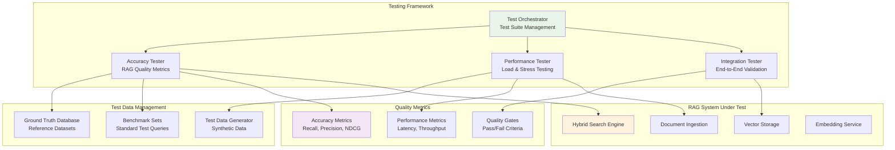

# Product Requirement Prompt: RAG Testing Framework for Accuracy

## Context

This PRP defines the implementation of a comprehensive testing framework for the Contexter Documentation Platform's RAG system, focusing on accuracy validation, performance benchmarking, and quality assurance across all components with automated testing suites and continuous validation.

**Project Background**:
- **System**: Contexter Documentation Platform
- **Component**: Quality & Performance - Testing and Validation Framework
- **Technology Stack**: pytest, asyncio, locust (load testing), custom accuracy metrics
- **Performance Target**: >95% test coverage, >90% accuracy validation, automated CI/CD integration
- **Dependencies**: All RAG system components

## Requirements

### Functional Requirements

**FR-TEST-001: RAG Accuracy Testing**
- **As a** QA engineer
- **I want** comprehensive accuracy testing for RAG operations
- **So that** search relevance and quality meet standards consistently
- **Acceptance Criteria**:
  - [ ] Recall@K testing (K=1,5,10) with >95% target accuracy
  - [ ] Precision measurement for search result relevance
  - [ ] NDCG (Normalized Discounted Cumulative Gain) scoring
  - [ ] Query-document relevance ground truth validation
  - [ ] Cross-validation with multiple test datasets

**FR-TEST-002: Component Integration Testing**
- **As a** QA engineer
- **I want** end-to-end integration testing
- **So that** all RAG components work together correctly
- **Acceptance Criteria**:
  - [ ] Document ingestion to searchable vectors pipeline testing
  - [ ] Search query processing through result delivery
  - [ ] Error propagation and recovery testing
  - [ ] Performance regression detection
  - [ ] Data consistency validation across components

**FR-TEST-003: Performance and Load Testing**
- **As a** performance engineer
- **I want** automated performance benchmarking
- **So that** system performance meets requirements under various loads
- **Acceptance Criteria**:
  - [ ] Search latency benchmarking (p95 <50ms, p99 <100ms)
  - [ ] Throughput testing (>1000 docs/minute ingestion)
  - [ ] Concurrent user load testing (100+ simultaneous users)
  - [ ] Memory usage profiling and leak detection
  - [ ] Stress testing with breaking point identification

**FR-TEST-004: Quality Assurance Automation**
- **As a** development team
- **I want** automated quality assurance in CI/CD pipeline
- **So that** code changes don't degrade system quality
- **Acceptance Criteria**:
  - [ ] Automated test execution on every pull request
  - [ ] Quality gate enforcement with configurable thresholds
  - [ ] Performance regression detection and alerting
  - [ ] Test result reporting and trend analysis
  - [ ] Integration with deployment pipeline for quality gates

### Non-Functional Requirements

**NFR-TEST-001: Test Coverage and Quality**
- Unit test coverage >95% for all RAG components
- Integration test coverage >90% for critical workflows
- Performance test execution <10 minutes for CI/CD
- Test data generation and management automation

## Architecture

### Testing Framework Architecture



## Implementation Blueprint

### Phase 1: Core Testing Infrastructure (10 hours)

**Task TEST-001: Test Framework Foundation**
- **Duration**: 4 hours
- **Dependencies**: None
- **Deliverables**: Base testing framework with orchestration

**Implementation Steps**:
```python
import pytest
import asyncio
import numpy as np
from typing import List, Dict, Any, Optional, Tuple
from dataclasses import dataclass
import time
import logging
from pathlib import Path

@dataclass
class TestResult:
    test_name: str
    passed: bool
    score: Optional[float]
    execution_time: float
    metadata: Dict[str, Any]
    error_message: Optional[str] = None

@dataclass
class AccuracyMetrics:
    recall_at_1: float
    recall_at_5: float
    recall_at_10: float
    precision_at_10: float
    ndcg_at_10: float
    mrr: float  # Mean Reciprocal Rank

class RAGTestFramework:
    def __init__(self, config_path: Path):
        self.config = self._load_config(config_path)
        self.test_results = []
        self.ground_truth_data = None
        
    async def run_all_tests(self) -> Dict[str, Any]:
        """Run complete test suite with all categories."""
        
        test_suite_results = {
            'accuracy_tests': await self._run_accuracy_tests(),
            'performance_tests': await self._run_performance_tests(),
            'integration_tests': await self._run_integration_tests(),
            'summary': {}
        }
        
        # Calculate overall metrics
        test_suite_results['summary'] = self._calculate_summary_metrics(
            test_suite_results
        )
        
        return test_suite_results
    
    async def _run_accuracy_tests(self) -> List[TestResult]:
        """Execute all accuracy and quality tests."""
        
        accuracy_tester = AccuracyTester(self.config)
        
        tests = [
            accuracy_tester.test_search_recall,
            accuracy_tester.test_search_precision,
            accuracy_tester.test_query_intent_classification,
            accuracy_tester.test_result_ranking_quality,
            accuracy_tester.test_embedding_quality
        ]
        
        results = []
        for test_func in tests:
            try:
                start_time = time.time()
                result = await test_func()
                execution_time = time.time() - start_time
                
                results.append(TestResult(
                    test_name=test_func.__name__,
                    passed=result.passed,
                    score=result.score,
                    execution_time=execution_time,
                    metadata=result.metadata
                ))
                
            except Exception as e:
                results.append(TestResult(
                    test_name=test_func.__name__,
                    passed=False,
                    score=0.0,
                    execution_time=0.0,
                    metadata={},
                    error_message=str(e)
                ))
        
        return results
```

**Task TEST-002: Ground Truth Data Management**
- **Duration**: 3 hours
- **Dependencies**: TEST-001
- **Deliverables**: Ground truth dataset creation and management system

**Task TEST-003: Accuracy Metrics Implementation**
- **Duration**: 3 hours
- **Dependencies**: TEST-002
- **Deliverables**: Comprehensive accuracy metrics calculation

### Phase 2: RAG-Specific Testing (12 hours)

**Task TEST-004: Search Accuracy Testing**
- **Duration**: 6 hours
- **Dependencies**: TEST-003
- **Deliverables**: Search relevance and accuracy validation

**Implementation Steps**:
```python
class AccuracyTester:
    def __init__(self, config: Dict[str, Any]):
        self.config = config
        self.search_engine = None  # Injected during testing
        self.ground_truth = self._load_ground_truth_data()
        
    async def test_search_recall(self) -> TestResult:
        """Test search recall@K for different K values."""
        
        recall_scores = {'recall@1': [], 'recall@5': [], 'recall@10': []}
        
        for query_data in self.ground_truth:
            query = query_data['query']
            relevant_docs = set(query_data['relevant_document_ids'])
            
            # Perform search
            search_results = await self.search_engine.search(
                query=query,
                top_k=10,
                search_type='hybrid'
            )
            
            retrieved_docs = [r['result_id'] for r in search_results]
            
            # Calculate recall@K
            for k in [1, 5, 10]:
                retrieved_k = set(retrieved_docs[:k])
                recall_k = len(retrieved_k & relevant_docs) / len(relevant_docs)
                recall_scores[f'recall@{k}'].append(recall_k)
        
        # Calculate average recall scores
        avg_recalls = {
            metric: np.mean(scores) 
            for metric, scores in recall_scores.items()
        }
        
        # Determine if test passed (recall@10 > 95%)
        passed = avg_recalls['recall@10'] >= 0.95
        
        return TestResult(
            test_name='search_recall',
            passed=passed,
            score=avg_recalls['recall@10'],
            execution_time=0.0,  # Set by caller
            metadata={'detailed_recalls': avg_recalls}
        )
    
    async def test_result_ranking_quality(self) -> TestResult:
        """Test quality of result ranking using NDCG."""
        
        ndcg_scores = []
        
        for query_data in self.ground_truth:
            query = query_data['query']
            relevance_scores = query_data['document_relevance_scores']  # Dict[doc_id, score]
            
            search_results = await self.search_engine.search(
                query=query,
                top_k=10,
                search_type='hybrid'
            )
            
            # Calculate NDCG@10
            ndcg = self._calculate_ndcg(search_results, relevance_scores, k=10)
            ndcg_scores.append(ndcg)
        
        avg_ndcg = np.mean(ndcg_scores)
        passed = avg_ndcg >= 0.8  # Target NDCG@10 > 0.8
        
        return TestResult(
            test_name='ranking_quality',
            passed=passed,
            score=avg_ndcg,
            execution_time=0.0,
            metadata={'ndcg_distribution': ndcg_scores}
        )
    
    def _calculate_ndcg(
        self, 
        search_results: List[Dict], 
        relevance_scores: Dict[str, float], 
        k: int
    ) -> float:
        """Calculate Normalized Discounted Cumulative Gain."""
        
        # DCG calculation
        dcg = 0.0
        for i, result in enumerate(search_results[:k]):
            doc_id = result['result_id']
            relevance = relevance_scores.get(doc_id, 0.0)
            dcg += relevance / np.log2(i + 2)  # i+2 because log2(1) = 0
        
        # IDCG calculation (perfect ranking)
        sorted_relevances = sorted(relevance_scores.values(), reverse=True)[:k]
        idcg = sum(
            rel / np.log2(i + 2) 
            for i, rel in enumerate(sorted_relevances)
        )
        
        return dcg / idcg if idcg > 0 else 0.0
```

**Task TEST-005: Performance Benchmarking**
- **Duration**: 4 hours
- **Dependencies**: TEST-004
- **Deliverables**: Automated performance testing and benchmarking

**Task TEST-006: Integration Testing Suite**
- **Duration**: 2 hours
- **Dependencies**: TEST-005
- **Deliverables**: End-to-end pipeline testing

### Phase 3: CI/CD Integration and Reporting (6 hours)

**Task TEST-007: Test Automation and CI/CD Integration**
- **Duration**: 3 hours
- **Dependencies**: All previous tasks
- **Deliverables**: Automated testing in CI/CD pipeline

**Task TEST-008: Test Reporting and Analytics**
- **Duration**: 3 hours
- **Dependencies**: TEST-007
- **Deliverables**: Comprehensive test reporting and trend analysis

## Success Criteria

### Functional Success Metrics
- [ ] **Accuracy Testing**: >95% recall@10 for test queries consistently
- [ ] **Integration Testing**: 100% end-to-end pipeline test coverage
- [ ] **Performance Testing**: Automated benchmarking meeting all targets
- [ ] **Quality Gates**: Automated enforcement in CI/CD pipeline
- [ ] **Test Coverage**: >95% unit test coverage, >90% integration coverage

### Performance Success Metrics  
- [ ] **Test Execution Speed**: Complete test suite runs in <10 minutes
- [ ] **Accuracy Validation**: Ground truth validation >90% confidence
- [ ] **Performance Benchmarks**: All performance targets validated automatically
- [ ] **Regression Detection**: Automatic detection of >5% performance degradation
- [ ] **Load Testing**: Validation under 100+ concurrent users

---

**PRP Version**: 1.0  
**Created By**: PRP Generation System  
**Target Sprint**: Sprint 3, Week 5  
**Estimated Effort**: 28 hours (3.5 developer-days)  
**Dependencies**: All RAG system components  
**Success Criteria**: >95% test coverage, >90% accuracy validation, <10min test execution