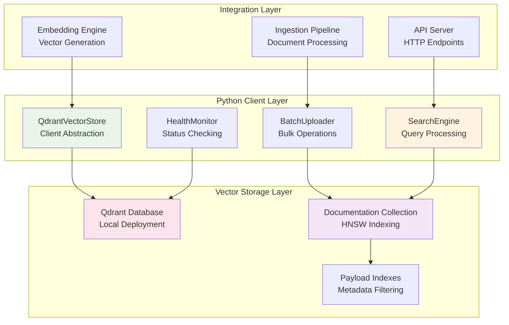

# Product Requirement Prompt: RAG Vector Database Setup (Qdrant)

## Context

This PRP defines the implementation of a high-performance vector database system using Qdrant for the Contexter Documentation Platform's RAG system. The vector database serves as the core storage and retrieval layer for semantic search operations, requiring sub-50ms query latency and support for 10M+ vectors.

**Project Background**:
- **System**: Contexter Documentation Platform
- **Component**: RAG System Infrastructure  
- **Technology Stack**: Python 3.9+, Qdrant 1.8.0+, asyncio
- **Integration**: Works with Voyage AI embeddings (2048-dimensional vectors)
- **Performance Target**: p95 latency <50ms, p99 latency <100ms

**Existing System Context**:
- Storage Manager creates compressed JSON documentation files
- Auto-Ingestion Pipeline processes documents into chunks
- Embedding Engine generates 2048-dimensional vectors using Voyage AI
- Hybrid Search Engine performs semantic + keyword search

## Requirements

### Functional Requirements

**FR-VDB-001: Collection Management**
- **As a** system administrator
- **I want** automated Qdrant collection creation and configuration
- **So that** vector storage is optimized for search performance
- **Acceptance Criteria**:
  - [ ] Create collections with HNSW indexing (m=16, ef_construct=200, ef=100)
  - [ ] Support 2048-dimensional vectors with cosine distance metric
  - [ ] Automatic payload indexing for metadata fields (library_id, doc_type, section, timestamp)
  - [ ] Collection optimization automation with configurable triggers
  - [ ] Schema validation and migration support for version updates

**FR-VDB-002: Batch Vector Operations**
- **As a** system administrator
- **I want** efficient batch upload and management of vectors
- **So that** large document collections can be processed quickly
- **Acceptance Criteria**:
  - [ ] Batch upsert support for 1000+ vectors per operation
  - [ ] Atomic operations with rollback capability on partial failures
  - [ ] Progress tracking and detailed error reporting
  - [ ] Duplicate detection and conflict resolution
  - [ ] Memory-efficient processing for large batches

**FR-VDB-003: High-Performance Search**
- **As a** developer user
- **I want** sub-50ms semantic search across vectors
- **So that** I can find relevant documentation quickly
- **Acceptance Criteria**:
  - [ ] Vector similarity search with configurable similarity thresholds
  - [ ] Metadata filtering with indexed field performance optimization
  - [ ] Support for complex filter combinations (AND/OR conditions)
  - [ ] Result ranking with relevance scores
  - [ ] Search parameter optimization (ef, top_k, score_threshold)

**FR-VDB-004: Maintenance and Optimization**
- **As a** system administrator
- **I want** automated collection maintenance and optimization
- **So that** search performance remains consistent as data grows
- **Acceptance Criteria**:
  - [ ] Automatic index optimization when vector count exceeds thresholds
  - [ ] Vacuum operations to reclaim deleted vector storage space
  - [ ] Collection statistics and performance monitoring
  - [ ] Health checks for collection integrity
  - [ ] Backup and restore capabilities for collections

### Non-Functional Requirements

**NFR-VDB-001: Performance**
- Search response time p95 < 50ms, p99 < 100ms
- Support 100+ concurrent queries without degradation
- Index build time < 10 minutes for 1M vectors
- Memory usage < 4GB for 10M vectors with HNSW indexing

**NFR-VDB-002: Scalability**
- Support up to 10M vectors per collection
- Horizontal scaling with collection sharding
- Storage efficiency < 100GB for 10M 2048-dimensional vectors
- Linear performance scaling with vector count growth

**NFR-VDB-003: Reliability**
- 99.9% availability during business hours
- Automatic recovery from connection failures within 30 seconds
- Data integrity verification and corruption detection
- Point-in-time consistency for batch operations

## Architecture

### System Architecture



### Data Model

**Vector Document Schema**:
```yaml
vector_document:
  id: string (UUID)
  vector: array[float] (2048 dimensions)
  payload:
    library_id: string (indexed)
    library_name: string
    version: string
    doc_type: enum [api, guide, tutorial, reference] (indexed)
    section: string (indexed)
    subsection: string
    content: text (searchable)
    token_count: integer
    timestamp: datetime (indexed)
    trust_score: float (0.0-10.0)
    star_count: integer
    programming_language: string
    chunk_index: integer
    total_chunks: integer
    embedding_model: string
    indexed_at: datetime
```

**HNSW Configuration**:
```yaml
hnsw_config:
  m: 16                    # Bi-directional links for balanced performance
  ef_construct: 200        # Construction time parameter for accuracy
  full_scan_threshold: 10000
  max_indexing_threads: 0  # Use all available cores
```

### Integration Patterns

**Async Client Pattern**:
```python
class QdrantVectorStore:
    async def __aenter__(self):
        await self.initialize_client()
        return self
        
    async def __aexit__(self, exc_type, exc_val, exc_tb):
        await self.cleanup_resources()
        
    async def search_vectors(self, query_vector, filters=None):
        async with self.connection_semaphore:
            return await self._perform_search(query_vector, filters)
```

## Implementation Blueprint

### Phase 1: Core Infrastructure Setup (8 hours)

**Task VDB-001: Qdrant Client Integration**
- **Duration**: 3 hours
- **Dependencies**: None
- **Deliverables**: QdrantVectorStore class with connection management

**Implementation Steps**:
1. Install and configure Qdrant client library
   ```bash
   pip install qdrant-client[grpc] asyncio-compat
   ```

2. Create QdrantVectorStore base class:
   ```python
   from qdrant_client import QdrantClient
   from qdrant_client.models import Distance, VectorParams, HnswConfigDiff
   
   class QdrantVectorStore:
       def __init__(self, host="localhost", port=6333, prefer_grpc=True):
           self.client = QdrantClient(
               host=host, port=port, grpc_port=6334 if prefer_grpc else None,
               prefer_grpc=prefer_grpc, timeout=30
           )
           self.collection_name = "contexter_documentation"
           self.vector_size = 2048
   ```

3. Implement connection pooling and health checks
4. Add configuration management for connection parameters

**Task VDB-002: Collection Management System**
- **Duration**: 3 hours  
- **Dependencies**: VDB-001
- **Deliverables**: Automated collection creation and configuration

**Implementation Steps**:
1. Design collection schema and HNSW configuration:
   ```python
   async def create_collection(self, recreate=False):
       hnsw_config = HnswConfigDiff(
           m=16, ef_construct=200, full_scan_threshold=10000
       )
       
       self.client.create_collection(
           collection_name=self.collection_name,
           vectors_config=VectorParams(size=2048, distance=Distance.COSINE),
           hnsw_config=hnsw_config
       )
   ```

2. Implement payload index creation for filterable fields
3. Add collection validation and schema migration support
4. Create collection optimization triggers

**Task VDB-003: Health Monitoring Integration**
- **Duration**: 2 hours
- **Dependencies**: VDB-002
- **Deliverables**: Health check system with status reporting

**Implementation Steps**:
1. Implement collection health verification
2. Add connection status monitoring
3. Create performance metrics collection
4. Integrate with system-wide health monitoring

### Phase 2: Batch Operations Implementation (6 hours)

**Task VDB-004: Batch Upload System**
- **Duration**: 4 hours
- **Dependencies**: VDB-002
- **Deliverables**: High-performance batch vector upload

**Implementation Steps**:
1. Design batch processing architecture:
   ```python
   async def upsert_vectors_batch(self, vectors, batch_size=1000):
       for i in range(0, len(vectors), batch_size):
           batch = vectors[i:i + batch_size]
           points = [self._create_point(v) for v in batch]
           await self._upsert_with_retry(points)
   ```

2. Implement error handling and retry logic
3. Add progress tracking and detailed error reporting
4. Optimize batch size based on performance testing

**Task VDB-005: Vector Management Operations**
- **Duration**: 2 hours
- **Dependencies**: VDB-004
- **Deliverables**: CRUD operations for individual vectors

**Implementation Steps**:
1. Implement get, update, delete operations for individual vectors
2. Add bulk delete functionality with filter support
3. Create vector existence checking and duplicate handling
4. Add vector metadata update capabilities

### Phase 3: Search Optimization (6 hours)

**Task VDB-006: Search Engine Implementation**  
- **Duration**: 4 hours
- **Dependencies**: VDB-002
- **Deliverables**: Optimized vector search with filtering

**Implementation Steps**:
1. Implement core search functionality:
   ```python
   async def search_vectors(self, query_vector, top_k=10, filters=None):
       search_params = {"ef": 128}  # Higher precision
       
       results = self.client.search(
           collection_name=self.collection_name,
           query_vector=query_vector,
           limit=top_k,
           query_filter=self._build_filter(filters),
           search_params=search_params
       )
       return self._format_results(results)
   ```

2. Implement filter building for complex metadata queries
3. Add result ranking and score normalization
4. Optimize search parameters for different query types

**Task VDB-007: Performance Tuning**
- **Duration**: 2 hours
- **Dependencies**: VDB-006
- **Deliverables**: Performance-optimized configuration

**Implementation Steps**:
1. Benchmark search performance with different HNSW parameters
2. Optimize ef parameter based on accuracy vs latency trade-offs
3. Implement search result caching for common queries
4. Add performance monitoring and alerting

### Phase 4: Maintenance and Operations (4 hours)

**Task VDB-008: Collection Maintenance**
- **Duration**: 2 hours
- **Dependencies**: VDB-006
- **Deliverables**: Automated maintenance procedures

**Implementation Steps**:
1. Implement collection optimization triggers
2. Add vacuum operations for deleted vector cleanup
3. Create collection statistics reporting
4. Implement backup and restore procedures

**Task VDB-009: Integration Testing**
- **Duration**: 2 hours
- **Dependencies**: All previous tasks
- **Deliverables**: Comprehensive integration test suite

**Implementation Steps**:
1. Create integration tests with embedding generation pipeline
2. Test performance under load with concurrent operations
3. Validate data integrity and consistency
4. Test failure scenarios and recovery procedures

## Validation Loops

### Level 1: Unit Testing
**Validation Criteria**:
- [ ] All QdrantVectorStore methods have >90% test coverage
- [ ] Collection creation and configuration validation
- [ ] Batch upload operations handle edge cases correctly
- [ ] Search functionality returns accurate results
- [ ] Error handling works for all failure scenarios

**Test Implementation**:
```python
import pytest
from unittest.mock import Mock, patch
import numpy as np

class TestQdrantVectorStore:
    @pytest.fixture
    async def vector_store(self):
        store = QdrantVectorStore(host="localhost", port=6333)
        await store.initialize_collection()
        return store
    
    async def test_batch_upload_performance(self, vector_store):
        vectors = [self._create_test_vector() for _ in range(1000)]
        start_time = time.time()
        
        result = await vector_store.upsert_vectors_batch(vectors)
        
        duration = time.time() - start_time
        assert duration < 10.0  # Should complete within 10 seconds
        assert result["successful_uploads"] == len(vectors)
    
    async def test_search_latency(self, vector_store):
        query_vector = np.random.random(2048).tolist()
        
        start_time = time.time()
        results = await vector_store.search_vectors(query_vector, top_k=10)
        duration = time.time() - start_time
        
        assert duration < 0.05  # Sub-50ms requirement
        assert len(results) <= 10
        assert all(r["score"] >= 0 for r in results)
```

### Level 2: Integration Testing
**Validation Criteria**:
- [ ] Integration with embedding generation pipeline
- [ ] End-to-end document ingestion to searchable vectors
- [ ] Performance testing with realistic data volumes
- [ ] Concurrent access testing with multiple clients
- [ ] Failure recovery and error propagation testing

**Test Scenarios**:
```python
async def test_end_to_end_ingestion():
    # Test complete pipeline from document to searchable vector
    document = load_test_document("python-requests-docs.json")
    
    # Process through ingestion pipeline
    chunks = await ingestion_pipeline.process_document(document)
    embeddings = await embedding_engine.generate_embeddings(chunks)
    
    # Store in vector database
    vector_ids = await vector_store.upsert_vectors_batch(embeddings)
    
    # Verify searchability
    query = "how to make HTTP requests"
    results = await vector_store.search_vectors(
        await embedding_engine.embed_query(query)
    )
    
    assert len(results) > 0
    assert any("requests" in r["payload"]["content"].lower() for r in results)
```

### Level 3: Performance Testing
**Validation Criteria**:
- [ ] Search latency p95 < 50ms under normal load
- [ ] Support 100+ concurrent queries without degradation
- [ ] Memory usage remains stable during extended operations
- [ ] Index build performance meets requirements
- [ ] Storage efficiency targets achieved

**Load Testing Framework**:
```python
import asyncio
import aiohttp
from locust import HttpUser, task, between

class VectorSearchLoadTest(HttpUser):
    wait_time = between(1, 3)
    
    @task
    async def search_vectors(self):
        query_vector = np.random.random(2048).tolist()
        
        response = await self.client.post("/api/v1/search", json={
            "vector": query_vector,
            "top_k": 10,
            "filters": {"doc_type": "api"}
        })
        
        assert response.status_code == 200
        assert len(response.json()["results"]) <= 10
```

## Success Criteria

### Functional Success Metrics
- [ ] **Collection Management**: Successfully create and configure collections with HNSW indexing
- [ ] **Batch Operations**: Process 1000+ vectors per batch with <1% failure rate
- [ ] **Search Accuracy**: Return relevant results with >95% precision for test queries
- [ ] **Metadata Filtering**: Support complex filter combinations with indexed performance
- [ ] **Maintenance Operations**: Automated optimization and cleanup procedures

### Performance Success Metrics
- [ ] **Search Latency**: p95 < 50ms, p99 < 100ms for vector similarity search
- [ ] **Throughput**: Support 100+ concurrent queries without performance degradation
- [ ] **Scalability**: Handle 10M+ vectors with linear performance scaling
- [ ] **Memory Efficiency**: <4GB memory usage for 10M vector index
- [ ] **Storage Efficiency**: <100GB storage for 10M 2048-dimensional vectors

### Integration Success Metrics
- [ ] **Pipeline Integration**: Seamless integration with embedding generation and search
- [ ] **Error Handling**: Graceful degradation and recovery from failures
- [ ] **Monitoring**: Comprehensive metrics and health checking
- [ ] **Configuration**: External configuration management without code changes
- [ ] **Documentation**: Complete API documentation with usage examples

## Potential Gotchas

### Performance Pitfalls
1. **HNSW Parameter Tuning**
   - **Issue**: Default parameters may not be optimal for 2048-dimensional vectors
   - **Solution**: Benchmark different m and ef_construct values for accuracy vs build time
   - **Mitigation**: Implement A/B testing framework for parameter optimization

2. **Memory Usage with Large Collections**
   - **Issue**: HNSW index can consume significant memory as collection grows
   - **Solution**: Monitor memory usage and implement collection sharding when needed
   - **Mitigation**: Set up alerting for memory usage thresholds

3. **Search Latency Degradation**
   - **Issue**: Query latency may increase with collection size and concurrent load
   - **Solution**: Optimize ef parameter based on query patterns and implement caching
   - **Mitigation**: Regular performance benchmarking and automated alerts

### Data Integrity Challenges
1. **Concurrent Write Conflicts**
   - **Issue**: Simultaneous batch uploads may cause data inconsistencies
   - **Solution**: Implement proper locking and atomic operations
   - **Mitigation**: Use unique vector IDs and implement conflict resolution

2. **Index Corruption During Optimization**
   - **Issue**: Index optimization may fail and corrupt the collection
   - **Solution**: Implement backup before optimization and rollback capability
   - **Mitigation**: Regular collection integrity checks and monitoring

### Integration Complexity
1. **Client Connection Management**
   - **Issue**: Connection pooling and reconnection logic can be complex
   - **Solution**: Implement robust connection management with health checks
   - **Mitigation**: Comprehensive connection testing and monitoring

2. **Version Compatibility**
   - **Issue**: Qdrant version updates may break existing functionality
   - **Solution**: Pin specific versions and test upgrades thoroughly
   - **Mitigation**: Maintain backward compatibility and migration procedures

### Operational Concerns
1. **Collection Size Growth**
   - **Issue**: Unlimited growth can impact performance and storage costs
   - **Solution**: Implement retention policies and archive old vectors
   - **Mitigation**: Monitor collection growth and automate cleanup procedures

2. **Backup and Recovery Complexity**
   - **Issue**: Backing up large vector collections can be time-consuming
   - **Solution**: Implement incremental backups and point-in-time recovery
   - **Mitigation**: Regular backup testing and recovery drills

---

**PRP Version**: 1.0  
**Created By**: PRP Generation System  
**Target Sprint**: Sprint 2, Week 3  
**Estimated Effort**: 24 hours (3 developer-days)  
**Dependencies**: Embedding Engine, Document Ingestion Pipeline  
**Success Criteria**: Sub-50ms search latency, 10M+ vector support, 99.9% availability