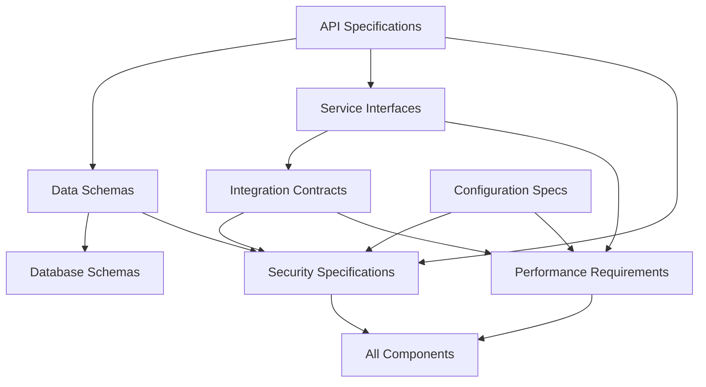

# Contexter RAG System - Specification Index

## Document Information
- **Version**: 1.0.0
- **Last Updated**: 2025-01-15
- **Document Type**: Master Index and Cross-Reference Guide
- **System**: Contexter RAG System

## Overview

This document serves as the master index and navigation guide for all technical specifications of the Contexter RAG system. It provides cross-references, dependencies, and implementation guidance across all specification documents.

## 📋 Specification Documents

### Core Specifications

| Document | File | Version | Status | Dependencies |
|----------|------|---------|---------|-------------|
| [API Specifications](#api-specifications) | `api-specifications.yaml` | 1.0.0 | ✅ Complete | Data Schemas, Service Interfaces |
| [Data Schemas](#data-schemas) | `data-schemas.json` | 1.0.0 | ✅ Complete | Database Schemas |
| [Service Interfaces](#service-interfaces) | `service-interfaces.md` | 1.0.0 | ✅ Complete | API Specifications, Integration Contracts |
| [Configuration Specifications](#configuration-specifications) | `configuration-specs.md` | 1.0.0 | ✅ Complete | Security Specifications |
| [Database Schemas](#database-schemas) | `database-schemas.sql` | 1.0.0 | ✅ Complete | Data Schemas |
| [Integration Contracts](#integration-contracts) | `integration-contracts.md` | 1.0.0 | ✅ Complete | Service Interfaces, Security |

### Quality & Operations Specifications

| Document | File | Version | Status | Dependencies |
|----------|------|---------|---------|-------------|
| [Performance Requirements](#performance-requirements) | `performance-requirements.md` | 1.0.0 | ✅ Complete | API Specifications, Service Interfaces |
| [Security Specifications](#security-specifications) | `security-specifications.md` | 1.0.0 | ✅ Complete | All Core Specifications |

## 🔗 Cross-Reference Matrix

### Component Dependencies



### Implementation Order

1. **Phase 1: Foundation**
   - Database Schemas → Data Schemas → Configuration Specifications

2. **Phase 2: Core Services**
   - Service Interfaces → API Specifications → Integration Contracts

3. **Phase 3: Quality Assurance**
   - Security Specifications → Performance Requirements

## 📊 API Specifications

**File**: [`api-specifications.yaml`](./api-specifications.yaml)

### Key Components
- **OpenAPI 3.0** specification with 28 endpoints
- **Authentication**: Bearer token and JWT support
- **Rate Limiting**: Per-endpoint limits defined
- **Error Handling**: Comprehensive error response schemas

### Endpoint Categories
```yaml
categories:
  document_management:
    endpoints: 8
    operations: ["upload", "process", "retrieve", "delete"]
    
  search_operations:
    endpoints: 6
    operations: ["semantic_search", "hybrid_search", "suggestions"]
    
  vector_operations:
    endpoints: 5
    operations: ["store", "retrieve", "similarity", "batch"]
    
  embedding_service:
    endpoints: 4
    operations: ["generate", "batch", "cache", "models"]
    
  system_operations:
    endpoints: 5
    operations: ["health", "metrics", "config", "admin"]
```

### Dependencies
- **Data Schemas**: Request/response models
- **Service Interfaces**: Internal service contracts
- **Security**: Authentication and authorization
- **Performance**: Response time and rate limiting requirements

### Implementation Notes
- Use **FastAPI** framework for automatic OpenAPI generation
- Implement **Pydantic** models for request/response validation
- Enable **automatic documentation** generation

---

## 📋 Data Schemas

**File**: [`data-schemas.json`](./data-schemas.json)

### Schema Categories
```json
{
  "document_schemas": {
    "DocumentModel": "Core document representation",
    "ChunkModel": "Text chunk with embeddings",
    "ProcessingResult": "Document processing outcomes"
  },
  "search_schemas": {
    "SearchQuery": "Search request parameters",
    "SearchResult": "Search response structure",
    "SuggestionQuery": "Query suggestion requests"
  },
  "system_schemas": {
    "HealthCheck": "System health status",
    "MetricsData": "Performance metrics",
    "ConfigurationModel": "System configuration"
  }
}
```

### Validation Rules
- **String lengths**: Enforced min/max constraints
- **Enum values**: Predefined valid options
- **Required fields**: Marked with validation
- **Format validation**: Email, URL, date formats
- **Custom validators**: Business logic validation

### Cross-References
- **API Specifications**: Used in request/response models
- **Database Schemas**: Maps to database table structures
- **Service Interfaces**: Defines service method parameters

---

## 🏗️ Service Interfaces

**File**: [`service-interfaces.md`](./service-interfaces.md)

### Interface Hierarchy
```python
# Core interfaces
IVectorStore          # Vector database operations
IEmbeddingService     # Embedding generation
IDocumentProcessor    # Document parsing and chunking
IStorageService       # File and metadata storage
ISearchService        # Search orchestration
ICacheService         # Caching operations
IConfigService        # Configuration management
IHealthService        # Health monitoring
```

### Service Contracts
Each interface defines:
- **Method signatures** with type hints
- **Error handling** specifications
- **Performance contracts** (SLAs)
- **Async/await patterns** for I/O operations

### Implementation Guidance
- Use **dependency injection** for service resolution
- Implement **circuit breaker pattern** for external services
- Add **comprehensive logging** for all operations
- Include **metrics collection** for monitoring

---

## ⚙️ Configuration Specifications

**File**: [`configuration-specs.md`](./configuration-specs.md)

### Configuration Layers
```yaml
configuration_hierarchy:
  1_default_config: "Built-in defaults"
  2_config_files: "YAML configuration files"
  3_environment_vars: "Environment variable overrides"
  4_runtime_config: "Dynamic configuration updates"
```

### Configuration Categories
- **Database settings**: Connection strings, timeouts
- **External services**: API keys, endpoints, timeouts
- **Performance tuning**: Batch sizes, concurrency limits
- **Security settings**: Encryption keys, session timeouts
- **Feature flags**: Enable/disable functionality

### Validation Framework
- **Schema validation**: Pydantic models for type safety
- **Environment-specific** configs (dev, staging, prod)
- **Sensitive data handling**: Encryption for secrets
- **Configuration auditing**: Change tracking

---

## 🗄️ Database Schemas

**File**: [`database-schemas.sql`](./database-schemas.sql)

### Database Systems
```sql
-- Multi-database architecture
databases:
  sqlite:
    purpose: "Operational metadata, caching, configuration"
    tables: 15
    size_estimate: "10GB maximum"
    
  qdrant:
    purpose: "Vector storage and similarity search"
    collections: 1
    vectors: "100M maximum"
    
  redis:
    purpose: "Query cache, sessions, rate limiting"
    structures: "Hash, List, String with TTL"
    memory: "1GB maximum"
```

### Key Tables
- **documents**: Document metadata and processing status
- **document_chunks**: Text chunks with embedding references
- **search_queries**: Query logging and analytics
- **embedding_cache**: Embedding storage with compression
- **performance_metrics**: System monitoring data
- **system_configuration**: Dynamic configuration storage

### Performance Optimizations
- **Composite indexes** for complex queries
- **Partitioning strategy** for large tables
- **Cleanup triggers** for automatic maintenance
- **View definitions** for common query patterns

---

## 🔗 Integration Contracts

**File**: [`integration-contracts.md`](./integration-contracts.md)

### External Service Integrations
```yaml
external_services:
  voyage_ai:
    purpose: "Embedding generation"
    authentication: "Bearer token"
    rate_limits: "1000 requests/minute"
    circuit_breaker: "5 failures → 60s timeout"
    
  qdrant:
    purpose: "Vector database"
    protocol: "HTTP/gRPC"
    clustering: "Distributed deployment"
    consistency: "Eventually consistent"
    
  context7:
    purpose: "Documentation fetching"
    authentication: "API key"
    rate_limits: "100 requests/minute"
    retry_strategy: "Exponential backoff"
    
  brightdata:
    purpose: "Proxy rotation"
    authentication: "Customer ID + Password"
    protocols: "HTTP/HTTPS"
    geographic_routing: "Global proxy network"
```

### Integration Patterns
- **Circuit breaker** for fault tolerance
- **Retry logic** with exponential backoff
- **Connection pooling** for performance
- **Health monitoring** for all services
- **Fallback strategies** for service degradation

---

## 🚀 Performance Requirements

**File**: [`performance-requirements.md`](./performance-requirements.md)

### Performance Targets
```yaml
sla_targets:
  api_response_times:
    search_queries: "500ms P95, 1000ms P99"
    document_ingestion: "2000ms P95, 5000ms P99"
    health_checks: "100ms P95, 200ms P99"
    
  throughput_limits:
    concurrent_users: 100
    search_rps: 200
    ingestion_rps: 10
    
  scalability_targets:
    max_documents: "10M documents"
    max_vectors: "100M vectors"
    max_concurrent_processing: 50
```

### Load Testing Scenarios
- **Baseline testing**: Normal load patterns
- **Stress testing**: Breaking point identification
- **Spike testing**: Traffic burst handling
- **Endurance testing**: Memory leak detection

### Monitoring & Alerting
- **Real-time metrics** collection
- **Performance dashboards** for visualization
- **Automated alerting** for SLA violations
- **Capacity planning** projections

---

## 🔒 Security Specifications

**File**: [`security-specifications.md`](./security-specifications.md)

### Security Framework
```yaml
security_layers:
  authentication:
    methods: ["Bearer Token", "JWT", "OAuth2"]
    session_management: "Redis-based with TTL"
    mfa_support: "TOTP and SMS"
    
  authorization:
    model: "Role-Based Access Control (RBAC)"
    permissions: "Fine-grained resource permissions"
    policy_enforcement: "Centralized authorization service"
    
  data_protection:
    encryption_at_rest: "AES-256-GCM"
    encryption_in_transit: "TLS 1.3"
    key_management: "AWS KMS / HashiCorp Vault"
    
  input_validation:
    sql_injection_prevention: "Parameterized queries"
    xss_prevention: "Content sanitization"
    file_upload_security: "MIME type validation"
```

### Compliance Standards
- **GDPR**: Data privacy and protection
- **CCPA**: California Consumer Privacy Act
- **SOX**: Sarbanes-Oxley Act compliance
- **ISO 27001**: Information security management

### Security Testing
- **Automated security scanning**: SAST/DAST tools
- **Penetration testing**: Quarterly assessments
- **Vulnerability management**: Dependency scanning
- **Incident response**: Automated containment

---

## 🎯 Implementation Roadmap

### Phase 1: Core Infrastructure (Weeks 1-4)
```yaml
week_1_2:
  - Database schema implementation
  - Data model definitions
  - Basic configuration management
  
week_3_4:
  - Service interface implementations
  - Core API endpoints
  - Authentication framework
```

### Phase 2: Integration & Features (Weeks 5-8)
```yaml
week_5_6:
  - External service integrations
  - Document processing pipeline
  - Vector storage implementation
  
week_7_8:
  - Search functionality
  - Performance optimization
  - Security hardening
```

### Phase 3: Production Readiness (Weeks 9-12)
```yaml
week_9_10:
  - Comprehensive testing
  - Performance benchmarking
  - Security testing
  
week_11_12:
  - Production deployment
  - Monitoring setup
  - Documentation finalization
```

---

## 📈 Metrics & KPIs

### System Health Metrics
```yaml
availability_metrics:
  uptime_target: "99.9%"
  mttr_target: "15 minutes"
  error_rate_threshold: "<0.1%"
  
performance_metrics:
  response_time_p95: "<500ms"
  throughput_target: "200 RPS"
  resource_utilization: "<80%"
  
quality_metrics:
  search_accuracy: ">95%"
  embedding_quality: "Cosine similarity >0.8"
  user_satisfaction: ">4.5/5"
```

### Business Metrics
- **Document processing rate**: Documents per minute
- **Search success rate**: Queries returning relevant results
- **User engagement**: Session duration and query frequency
- **Cost efficiency**: Processing cost per document

---

## 🛠️ Development Guidelines

### Code Quality Standards
```yaml
code_standards:
  test_coverage: ">90%"
  type_hints: "All public functions"
  documentation: "Docstrings for all modules"
  linting: "Ruff, MyPy, Black formatting"
  
architecture_principles:
  - "Separation of concerns"
  - "Dependency inversion"
  - "Interface segregation"
  - "Single responsibility"
  
patterns:
  - "Repository pattern for data access"
  - "Factory pattern for service creation"
  - "Observer pattern for event handling"
  - "Strategy pattern for algorithms"
```

### Testing Strategy
- **Unit tests**: Component isolation testing
- **Integration tests**: Service interaction testing
- **End-to-end tests**: Complete workflow testing
- **Performance tests**: Load and stress testing
- **Security tests**: Vulnerability assessment

---

## 📚 Reference Documentation

### External Standards
- **OpenAPI 3.0**: API specification standard
- **JSON Schema**: Data validation standard
- **OAuth 2.0**: Authentication protocol
- **JWT**: Token-based authentication
- **OWASP**: Security best practices

### Technology Stack
```yaml
backend:
  framework: "FastAPI (Python 3.11+)"
  database: "SQLite, Qdrant, Redis"
  async_framework: "asyncio, httpx"
  validation: "Pydantic"
  
infrastructure:
  containerization: "Docker"
  orchestration: "Docker Compose / Kubernetes"
  monitoring: "Prometheus, Grafana"
  logging: "Structured JSON logging"
```

### Useful Commands
```bash
# Generate OpenAPI documentation
python -m uvicorn main:app --reload

# Run database migrations
python scripts/migrate_database.py

# Execute security scan
bandit -r src/

# Run performance tests
pytest tests/performance/ -v

# Validate configuration
python scripts/validate_config.py
```

---

## 🔄 Maintenance & Updates

### Document Versioning
- **Semantic versioning**: MAJOR.MINOR.PATCH
- **Change tracking**: Git history with detailed commits
- **Review process**: Peer review for all changes
- **Approval workflow**: Architecture team sign-off

### Update Schedule
```yaml
review_schedule:
  specifications: "Monthly review"
  security_updates: "Immediate for critical"
  performance_tuning: "Quarterly optimization"
  compliance_review: "Annual audit"
```

### Change Management Process
1. **Identify change need**: Performance, security, or feature requirements
2. **Impact assessment**: Dependencies and breaking changes
3. **Specification update**: Modify relevant documents
4. **Review and approval**: Stakeholder sign-off
5. **Implementation**: Code changes following specifications
6. **Validation**: Testing against specifications
7. **Documentation**: Update deployment and user guides

---

## 📞 Support & Contact

### Document Ownership
- **Technical Specifications**: Architecture Team
- **Security Specifications**: Security Team  
- **Performance Requirements**: DevOps Team
- **Overall Coordination**: Project Management Office

### Getting Help
```yaml
support_channels:
  technical_questions: "architecture-team@contexter.dev"
  security_concerns: "security-team@contexter.dev"
  performance_issues: "devops-team@contexter.dev"
  general_inquiries: "pmo@contexter.dev"
```

### Contributing
- **Bug reports**: Create GitHub issues with reproduction steps
- **Feature requests**: Submit RFC documents for review
- **Documentation improvements**: Submit pull requests
- **Security issues**: Report through private security channel

---

**Document Control:**
- **Created**: 2025-01-15
- **Version**: 1.0.0
- **Next Review**: 2025-02-15
- **Owner**: Contexter Architecture Team
- **Stakeholders**: All Development Teams

---

*This index document serves as the single source of truth for navigating the Contexter RAG system specifications. Keep it updated as the system evolves.*