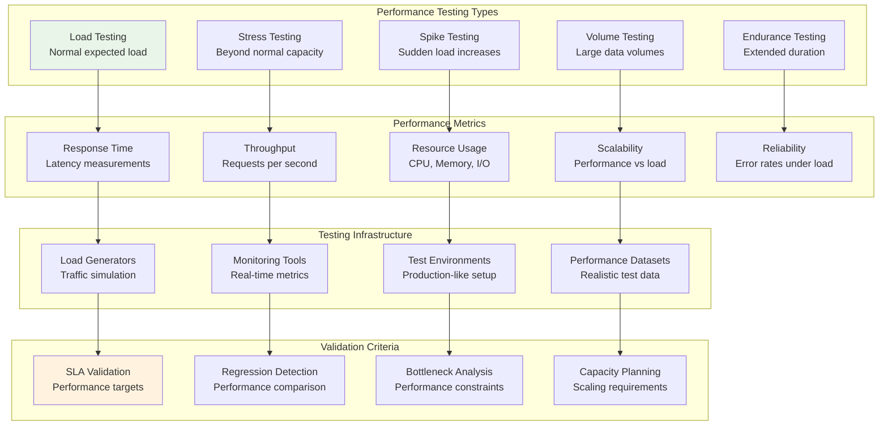

# Performance Validation Strategies

## Document Information
- **Version**: 1.0.0
- **Created**: 2025-01-15
- **System**: Contexter RAG Implementation
- **Scope**: Performance testing strategies, benchmarking, and validation criteria

## Overview

This document defines comprehensive performance validation strategies for the RAG system, including load testing, stress testing, benchmarking methodologies, and performance monitoring to ensure the system meets all performance requirements under various conditions.

## Performance Validation Framework



## Performance Testing Strategies

### Load Testing Strategy

**Purpose**: Validate system performance under expected normal load conditions
**Target**: Verify system meets SLA requirements under typical usage patterns

**Load Testing Scenarios**:

**Scenario LT-001: Normal Search Load**
```python
# tests/performance/test_search_load.py
import asyncio
import time
import statistics
from typing import List, Dict, Any
import locust
from locust import HttpUser, task, between

class SearchLoadTester:
    def __init__(self, config: LoadTestConfig):
        self.config = config
        self.search_queries = []
        self.response_times = []
        self.error_rates = []
        
    async def setup_test_data(self):
        """Setup realistic search queries for load testing."""
        self.search_queries = [
            "python async functions implementation",
            "machine learning data preprocessing",
            "FastAPI authentication middleware",
            "Docker container optimization",
            "database connection pooling",
            "error handling best practices",
            "API rate limiting strategies",
            "memory management techniques",
            "concurrent programming patterns",
            "testing framework setup"
        ]
    
    async def run_load_test(self, concurrent_users: int, duration_seconds: int) -> LoadTestResult:
        """Run search load test with specified parameters."""
        
        class SearchUser(HttpUser):
            wait_time = between(1, 3)  # Wait 1-3 seconds between requests
            
            def on_start(self):
                """Initialize user session."""
                self.client.headers.update({
                    "Authorization": "Bearer test-api-key",
                    "Content-Type": "application/json"
                })
            
            @task(weight=80)
            def search_hybrid(self):
                """Perform hybrid search (80% of requests)."""
                query = random.choice(self.parent.search_queries)
                
                with self.client.post(
                    "/api/v1/search",
                    json={
                        "query": query,
                        "search_type": "hybrid",
                        "limit": 10
                    },
                    catch_response=True
                ) as response:
                    if response.status_code == 200:
                        data = response.json()
                        if len(data.get("results", [])) > 0:
                            response.success()
                        else:
                            response.failure("No search results returned")
                    else:
                        response.failure(f"HTTP {response.status_code}")
            
            @task(weight=15)
            def search_semantic(self):
                """Perform semantic search (15% of requests)."""
                query = random.choice(self.parent.search_queries)
                
                with self.client.post(
                    "/api/v1/search",
                    json={
                        "query": query,
                        "search_type": "semantic",
                        "limit": 20
                    },
                    catch_response=True
                ) as response:
                    if response.status_code == 200:
                        response.success()
                    else:
                        response.failure(f"HTTP {response.status_code}")
            
            @task(weight=5)
            def search_with_filters(self):
                """Perform filtered search (5% of requests)."""
                query = random.choice(self.parent.search_queries)
                
                with self.client.post(
                    "/api/v1/search",
                    json={
                        "query": query,
                        "search_type": "hybrid",
                        "limit": 10,
                        "filters": {"language": "python"}
                    },
                    catch_response=True
                ) as response:
                    if response.status_code == 200:
                        response.success()
                    else:
                        response.failure(f"HTTP {response.status_code}")
        
        # Configure and run Locust test
        env = locust.Environment(user_classes=[SearchUser])
        runner = env.create_local_runner()
        
        # Start load test
        runner.start(user_count=concurrent_users, spawn_rate=10)
        
        # Run for specified duration
        await asyncio.sleep(duration_seconds)
        
        # Stop test and collect results
        runner.stop()
        
        # Analyze results
        stats = runner.stats
        
        return LoadTestResult(
            test_name="search_load_test",
            concurrent_users=concurrent_users,
            duration_seconds=duration_seconds,
            total_requests=stats.total.num_requests,
            failed_requests=stats.total.num_failures,
            average_response_time=stats.total.avg_response_time,
            p50_response_time=stats.total.median_response_time,
            p95_response_time=stats.total.get_response_time_percentile(0.95),
            p99_response_time=stats.total.get_response_time_percentile(0.99),
            requests_per_second=stats.total.current_rps,
            error_rate=stats.total.fail_ratio,
            passed=self._evaluate_load_test_criteria(stats)
        )
    
    def _evaluate_load_test_criteria(self, stats) -> bool:
        """Evaluate if load test meets performance criteria."""
        criteria = {
            "p95_response_time": 500,  # milliseconds
            "p99_response_time": 1000,  # milliseconds
            "error_rate": 0.01,  # 1%
            "min_throughput": 100  # RPS
        }
        
        p95_time = stats.total.get_response_time_percentile(0.95)
        p99_time = stats.total.get_response_time_percentile(0.99)
        error_rate = stats.total.fail_ratio
        throughput = stats.total.current_rps
        
        return (
            p95_time <= criteria["p95_response_time"] and
            p99_time <= criteria["p99_response_time"] and
            error_rate <= criteria["error_rate"] and
            throughput >= criteria["min_throughput"]
        )

# Command to run
pytest tests/performance/test_search_load.py::SearchLoadTester::test_normal_search_load -v
```

**Scenario LT-002: Document Ingestion Load**
```python
# tests/performance/test_ingestion_load.py
class IngestionLoadTester:
    def __init__(self, config: LoadTestConfig):
        self.config = config
        self.test_documents = []
        
    async def setup_test_documents(self, count: int):
        """Generate realistic documents for ingestion testing."""
        self.test_documents = []
        
        for i in range(count):
            doc_size = random.choice([
                ("small", 1000),    # 1KB documents
                ("medium", 10000),  # 10KB documents  
                ("large", 100000)   # 100KB documents
            ])
            
            content = await self._generate_realistic_content(doc_size[1])
            
            document = {
                "document_id": f"load-test-doc-{i:06d}",
                "library_id": "load-test-library",
                "content": content,
                "metadata": {
                    "size_category": doc_size[0],
                    "generated_for_load_test": True,
                    "topic": random.choice(["python", "javascript", "devops", "ml", "api"]),
                    "complexity": random.choice(["beginner", "intermediate", "advanced"])
                }
            }
            
            self.test_documents.append(document)
    
    async def run_ingestion_load_test(
        self, 
        concurrent_workers: int,
        documents_per_minute: int,
        duration_minutes: int
    ) -> LoadTestResult:
        """Run document ingestion load test."""
        
        total_documents = documents_per_minute * duration_minutes
        await self.setup_test_documents(total_documents)
        
        ingestion_results = []
        ingestion_times = []
        errors = []
        
        # Calculate batching parameters
        documents_per_worker = total_documents // concurrent_workers
        batch_size = min(documents_per_worker, 10)  # Max 10 docs per batch
        
        async def worker_ingestion(worker_id: int, documents: List[Dict]):
            """Worker function for ingesting documents."""
            worker_results = []
            
            for i in range(0, len(documents), batch_size):
                batch = documents[i:i + batch_size]
                batch_start_time = time.time()
                
                try:
                    # Simulate batch ingestion API call
                    async with aiohttp.ClientSession() as session:
                        async with session.post(
                            f"{self.config.api_base_url}/api/v1/documents/batch",
                            json={"documents": batch},
                            headers={"Authorization": "Bearer test-api-key"}
                        ) as response:
                            if response.status == 200:
                                result_data = await response.json()
                                
                                batch_time = time.time() - batch_start_time
                                ingestion_times.append(batch_time)
                                
                                worker_results.append({
                                    "worker_id": worker_id,
                                    "batch_size": len(batch),
                                    "processing_time": batch_time,
                                    "success": True,
                                    "documents_processed": result_data.get("processed_count", len(batch))
                                })
                            else:
                                error_msg = f"HTTP {response.status}: {await response.text()}"
                                errors.append(error_msg)
                                worker_results.append({
                                    "worker_id": worker_id,
                                    "batch_size": len(batch),
                                    "success": False,
                                    "error": error_msg
                                })
                
                except Exception as e:
                    errors.append(str(e))
                    worker_results.append({
                        "worker_id": worker_id,
                        "batch_size": len(batch),
                        "success": False,
                        "error": str(e)
                    })
                
                # Control ingestion rate
                target_interval = 60.0 / (documents_per_minute / concurrent_workers)
                await asyncio.sleep(max(0, target_interval - (time.time() - batch_start_time)))
            
            return worker_results
        
        # Start all workers
        start_time = time.time()
        worker_documents = [
            self.test_documents[i::concurrent_workers] 
            for i in range(concurrent_workers)
        ]
        
        tasks = [
            worker_ingestion(i, docs) 
            for i, docs in enumerate(worker_documents)
        ]
        
        # Wait for all workers to complete
        worker_results = await asyncio.gather(*tasks)
        total_time = time.time() - start_time
        
        # Aggregate results
        all_results = [result for worker in worker_results for result in worker]
        successful_ingestions = sum(1 for r in all_results if r["success"])
        total_documents_processed = sum(
            r.get("documents_processed", 0) for r in all_results if r["success"]
        )
        
        # Calculate performance metrics
        avg_ingestion_time = statistics.mean(ingestion_times) if ingestion_times else 0
        p95_ingestion_time = statistics.quantiles(ingestion_times, n=20)[18] if len(ingestion_times) > 10 else 0
        throughput = total_documents_processed / (total_time / 60)  # documents per minute
        error_rate = len(errors) / len(all_results) if all_results else 0
        
        return LoadTestResult(
            test_name="document_ingestion_load_test",
            concurrent_workers=concurrent_workers,
            duration_minutes=duration_minutes,
            total_documents=total_documents,
            processed_documents=total_documents_processed,
            average_processing_time=avg_ingestion_time,
            p95_processing_time=p95_ingestion_time,
            throughput_per_minute=throughput,
            error_rate=error_rate,
            errors=errors,
            passed=self._evaluate_ingestion_criteria(throughput, avg_ingestion_time, error_rate)
        )
    
    def _evaluate_ingestion_criteria(self, throughput: float, avg_time: float, error_rate: float) -> bool:
        """Evaluate ingestion performance against criteria."""
        return (
            throughput >= 1000 and  # Min 1000 docs/minute
            avg_time <= 30 and      # Max 30 seconds average
            error_rate <= 0.01      # Max 1% errors
        )
```

### Stress Testing Strategy

**Purpose**: Identify system breaking points and behavior beyond normal capacity
**Target**: Determine maximum sustainable load and failure modes

**Scenario ST-001: Search Service Stress Test**
```python
# tests/performance/test_search_stress.py
class SearchStressTester:
    def __init__(self, config: StressTestConfig):
        self.config = config
        self.breaking_point_found = False
        self.max_successful_load = 0
        
    async def run_progressive_stress_test(self) -> StressTestResult:
        """Run progressive stress test to find breaking point."""
        
        stress_levels = [
            {"users": 50, "duration": 120},    # 2 minutes
            {"users": 100, "duration": 120},   # 2 minutes
            {"users": 200, "duration": 120},   # 2 minutes
            {"users": 400, "duration": 120},   # 2 minutes
            {"users": 800, "duration": 120},   # 2 minutes
            {"users": 1600, "duration": 120},  # 2 minutes
        ]
        
        stress_results = []
        breaking_point = None
        
        for level in stress_levels:
            logger.info(f"Running stress test: {level['users']} users for {level['duration']}s")
            
            # Run load test at this level
            result = await self._run_stress_level(level["users"], level["duration"])
            stress_results.append(result)
            
            # Check if this level failed stress criteria
            if not self._meets_stress_criteria(result):
                breaking_point = level
                logger.warning(f"Breaking point found at {level['users']} users")
                break
            else:
                self.max_successful_load = level["users"]
                logger.info(f"Stress level {level['users']} users: PASSED")
        
        return StressTestResult(
            test_name="progressive_search_stress_test",
            stress_levels_tested=len(stress_results),
            max_successful_load=self.max_successful_load,
            breaking_point=breaking_point,
            level_results=stress_results,
            degradation_analysis=self._analyze_performance_degradation(stress_results)
        )
    
    async def _run_stress_level(self, users: int, duration: int) -> StressLevelResult:
        """Run stress test at specific user level."""
        
        # Use Locust for stress testing
        class StressSearchUser(HttpUser):
            wait_time = between(0.1, 0.5)  # Aggressive timing for stress test
            
            @task
            def aggressive_search(self):
                query = random.choice([
                    "python", "javascript", "api", "database", "framework",
                    "algorithm", "optimization", "performance", "security", "testing"
                ])
                
                self.client.post(
                    "/api/v1/search",
                    json={
                        "query": query,
                        "search_type": "hybrid",
                        "limit": 50  # Larger result set for stress
                    },
                    headers={"Authorization": "Bearer stress-test-key"}
                )
        
        # Run stress test
        env = locust.Environment(user_classes=[StressSearchUser])
        runner = env.create_local_runner()
        
        # Monitor system resources during test
        resource_monitor = ResourceMonitor()
        await resource_monitor.start_monitoring()
        
        try:
            runner.start(user_count=users, spawn_rate=20)
            await asyncio.sleep(duration)
            runner.stop()
            
            # Get final resource usage
            resource_usage = await resource_monitor.get_final_stats()
            
            # Collect performance stats
            stats = runner.stats.total
            
            return StressLevelResult(
                user_count=users,
                duration=duration,
                total_requests=stats.num_requests,
                failed_requests=stats.num_failures,
                average_response_time=stats.avg_response_time,
                p95_response_time=stats.get_response_time_percentile(0.95),
                p99_response_time=stats.get_response_time_percentile(0.99),
                max_response_time=stats.max_response_time,
                requests_per_second=stats.current_rps,
                error_rate=stats.fail_ratio,
                cpu_usage=resource_usage["cpu_percent"],
                memory_usage=resource_usage["memory_percent"],
                disk_io=resource_usage["disk_io_mb_per_sec"],
                network_io=resource_usage["network_io_mb_per_sec"]
            )
            
        finally:
            await resource_monitor.stop_monitoring()
    
    def _meets_stress_criteria(self, result: StressLevelResult) -> bool:
        """Check if stress level meets acceptable criteria."""
        return (
            result.error_rate <= 0.05 and        # Max 5% errors under stress
            result.p95_response_time <= 2000 and # Max 2s P95 under stress
            result.cpu_usage <= 90 and           # Max 90% CPU
            result.memory_usage <= 85             # Max 85% memory
        )
    
    def _analyze_performance_degradation(self, results: List[StressLevelResult]) -> Dict[str, Any]:
        """Analyze performance degradation across stress levels."""
        if len(results) < 2:
            return {"analysis": "Insufficient data for degradation analysis"}
        
        baseline = results[0]
        degradation_analysis = {
            "response_time_degradation": [],
            "throughput_degradation": [],
            "error_rate_progression": [],
            "resource_usage_progression": []
        }
        
        for result in results[1:]:
            # Response time degradation
            rt_degradation = (
                (result.p95_response_time - baseline.p95_response_time) / 
                baseline.p95_response_time * 100
            )
            degradation_analysis["response_time_degradation"].append({
                "users": result.user_count,
                "degradation_percent": rt_degradation
            })
            
            # Throughput degradation (per user)
            baseline_per_user = baseline.requests_per_second / baseline.user_count
            current_per_user = result.requests_per_second / result.user_count
            throughput_degradation = (
                (baseline_per_user - current_per_user) / baseline_per_user * 100
            )
            degradation_analysis["throughput_degradation"].append({
                "users": result.user_count,
                "degradation_percent": throughput_degradation
            })
            
            # Error rate progression
            degradation_analysis["error_rate_progression"].append({
                "users": result.user_count,
                "error_rate": result.error_rate
            })
            
            # Resource usage progression
            degradation_analysis["resource_usage_progression"].append({
                "users": result.user_count,
                "cpu_usage": result.cpu_usage,
                "memory_usage": result.memory_usage
            })
        
        return degradation_analysis
```

### Spike Testing Strategy

**Purpose**: Validate system behavior under sudden load spikes
**Target**: Ensure graceful handling of traffic surges

**Scenario SP-001: Traffic Spike Simulation**
```python
# tests/performance/test_spike_handling.py
class SpikeTestRunner:
    def __init__(self, config: SpikeTestConfig):
        self.config = config
        
    async def run_spike_test(self, spike_config: SpikeConfig) -> SpikeTestResult:
        """Run traffic spike test."""
        
        phases = [
            {"name": "baseline", "users": spike_config.baseline_users, "duration": 60},
            {"name": "ramp_up", "users": spike_config.spike_users, "duration": 30},
            {"name": "spike", "users": spike_config.spike_users, "duration": spike_config.spike_duration},
            {"name": "ramp_down", "users": spike_config.baseline_users, "duration": 30},
            {"name": "recovery", "users": spike_config.baseline_users, "duration": 120}
        ]
        
        phase_results = []
        system_stability = []
        
        for phase in phases:
            logger.info(f"Starting phase: {phase['name']} - {phase['users']} users")
            
            # Run phase
            phase_result = await self._run_spike_phase(phase)
            phase_results.append(phase_result)
            
            # Monitor system stability
            stability_metrics = await self._check_system_stability()
            system_stability.append({
                "phase": phase["name"],
                "timestamp": datetime.utcnow(),
                "metrics": stability_metrics
            })
            
            # Brief pause between phases
            await asyncio.sleep(5)
        
        # Analyze spike handling
        spike_analysis = self._analyze_spike_handling(phase_results, system_stability)
        
        return SpikeTestResult(
            test_name="traffic_spike_test",
            spike_multiplier=spike_config.spike_users / spike_config.baseline_users,
            spike_duration=spike_config.spike_duration,
            phase_results=phase_results,
            stability_metrics=system_stability,
            spike_analysis=spike_analysis,
            passed=spike_analysis["recovery_successful"]
        )
    
    async def _run_spike_phase(self, phase_config: Dict) -> SpikePhaseResult:
        """Run individual phase of spike test."""
        
        class SpikeUser(HttpUser):
            wait_time = between(0.5, 1.5)
            
            @task
            def search_during_spike(self):
                self.client.post(
                    "/api/v1/search",
                    json={
                        "query": f"spike test query {random.randint(1, 1000)}",
                        "search_type": "hybrid",
                        "limit": 10
                    },
                    headers={"Authorization": "Bearer spike-test-key"}
                )
        
        env = locust.Environment(user_classes=[SpikeUser])
        runner = env.create_local_runner()
        
        # Start monitoring
        performance_samples = []
        monitoring_task = asyncio.create_task(
            self._continuous_monitoring(performance_samples, phase_config["duration"])
        )
        
        try:
            runner.start(user_count=phase_config["users"], spawn_rate=50)
            await asyncio.sleep(phase_config["duration"])
            runner.stop()
            
            await monitoring_task
            
            stats = runner.stats.total
            
            return SpikePhaseResult(
                phase_name=phase_config["name"],
                user_count=phase_config["users"],
                duration=phase_config["duration"],
                total_requests=stats.num_requests,
                failed_requests=stats.num_failures,
                average_response_time=stats.avg_response_time,
                p95_response_time=stats.get_response_time_percentile(0.95),
                requests_per_second=stats.current_rps,
                error_rate=stats.fail_ratio,
                performance_samples=performance_samples
            )
            
        except Exception as e:
            monitoring_task.cancel()
            raise
    
    async def _continuous_monitoring(self, samples: List, duration: int):
        """Continuously monitor performance during phase."""
        start_time = time.time()
        
        while time.time() - start_time < duration:
            sample = await self._get_performance_sample()
            samples.append(sample)
            await asyncio.sleep(5)  # Sample every 5 seconds
    
    async def _get_performance_sample(self) -> Dict[str, Any]:
        """Get current performance sample."""
        return {
            "timestamp": datetime.utcnow(),
            "cpu_percent": psutil.cpu_percent(),
            "memory_percent": psutil.virtual_memory().percent,
            "active_connections": len(psutil.net_connections()),
            "response_time_sample": await self._sample_response_time()
        }
    
    async def _sample_response_time(self) -> float:
        """Sample current response time."""
        try:
            start_time = time.time()
            async with aiohttp.ClientSession() as session:
                async with session.post(
                    f"{self.config.api_base_url}/api/v1/search",
                    json={"query": "monitoring probe", "limit": 1},
                    headers={"Authorization": "Bearer monitor-key"}
                ) as response:
                    await response.read()
                    return (time.time() - start_time) * 1000  # milliseconds
        except:
            return -1  # Error indicator
    
    def _analyze_spike_handling(self, phase_results: List, stability_metrics: List) -> Dict[str, Any]:
        """Analyze how well system handled the spike."""
        
        baseline_phase = next(p for p in phase_results if p.phase_name == "baseline")
        spike_phase = next(p for p in phase_results if p.phase_name == "spike")
        recovery_phase = next(p for p in phase_results if p.phase_name == "recovery")
        
        # Response time analysis
        response_time_spike = spike_phase.p95_response_time / baseline_phase.p95_response_time
        response_time_recovery = recovery_phase.p95_response_time / baseline_phase.p95_response_time
        
        # Error rate analysis
        error_rate_spike = spike_phase.error_rate
        error_rate_recovery = recovery_phase.error_rate
        
        # Recovery analysis
        recovery_successful = (
            response_time_recovery <= 1.2 and  # Within 20% of baseline
            error_rate_recovery <= 0.01 and    # Less than 1% errors
            recovery_phase.requests_per_second >= baseline_phase.requests_per_second * 0.9
        )
        
        return {
            "response_time_spike_ratio": response_time_spike,
            "response_time_recovery_ratio": response_time_recovery,
            "max_error_rate_during_spike": error_rate_spike,
            "error_rate_after_recovery": error_rate_recovery,
            "recovery_successful": recovery_successful,
            "recommendations": self._generate_spike_recommendations(
                response_time_spike, error_rate_spike, recovery_successful
            )
        }
    
    def _generate_spike_recommendations(self, rt_spike: float, error_spike: float, recovery: bool) -> List[str]:
        """Generate recommendations based on spike test results."""
        recommendations = []
        
        if rt_spike > 3.0:
            recommendations.append("Consider implementing request queuing to handle spikes")
        if rt_spike > 5.0:
            recommendations.append("Add auto-scaling capabilities for sudden load increases")
        
        if error_spike > 0.05:
            recommendations.append("Implement circuit breakers to prevent cascade failures")
        if error_spike > 0.10:
            recommendations.append("Add rate limiting to protect system during spikes")
        
        if not recovery:
            recommendations.append("Investigate system recovery mechanisms")
            recommendations.append("Consider implementing graceful degradation strategies")
        
        return recommendations
```

### Volume Testing Strategy

**Purpose**: Validate system performance with large data volumes
**Target**: Ensure performance scales with data size

**Scenario VT-001: Large Dataset Performance**
```python
# tests/performance/test_volume_performance.py
class VolumeTestRunner:
    def __init__(self, config: VolumeTestConfig):
        self.config = config
        self.test_datasets = {}
        
    async def run_volume_scaling_test(self) -> VolumeTestResult:
        """Test performance scaling with different data volumes."""
        
        volume_levels = [
            {"name": "small", "documents": 10000, "vectors": 10000},
            {"name": "medium", "documents": 100000, "vectors": 100000},
            {"name": "large", "documents": 1000000, "vectors": 1000000},
            {"name": "xl", "documents": 5000000, "vectors": 5000000}
        ]
        
        volume_results = []
        
        for level in volume_levels:
            logger.info(f"Testing volume level: {level['name']} - {level['documents']} documents")
            
            # Setup test dataset
            await self._setup_volume_dataset(level)
            
            # Run performance tests on this volume
            result = await self._test_volume_performance(level)
            volume_results.append(result)
            
            # Cleanup dataset
            await self._cleanup_volume_dataset(level)
        
        # Analyze scaling characteristics
        scaling_analysis = self._analyze_volume_scaling(volume_results)
        
        return VolumeTestResult(
            test_name="volume_scaling_test",
            volume_levels_tested=len(volume_results),
            level_results=volume_results,
            scaling_analysis=scaling_analysis,
            scalability_rating=scaling_analysis["scalability_rating"]
        )
    
    async def _setup_volume_dataset(self, level_config: Dict):
        """Setup test dataset for volume level."""
        logger.info(f"Setting up {level_config['documents']} test documents")
        
        # Generate documents in batches
        batch_size = 1000
        total_documents = level_config["documents"]
        
        for batch_start in range(0, total_documents, batch_size):
            batch_end = min(batch_start + batch_size, total_documents)
            batch_documents = []
            
            for i in range(batch_start, batch_end):
                document = {
                    "document_id": f"volume-test-{level_config['name']}-{i:08d}",
                    "library_id": f"volume-test-{level_config['name']}",
                    "content": await self._generate_volume_test_content(i),
                    "metadata": {
                        "volume_level": level_config["name"],
                        "document_index": i,
                        "batch": batch_start // batch_size
                    }
                }
                batch_documents.append(document)
            
            # Ingest batch
            await self._ingest_document_batch(batch_documents)
            
            # Progress logging
            if (batch_start + batch_size) % 10000 == 0:
                logger.info(f"Processed {batch_start + batch_size} documents")
        
        logger.info(f"Volume dataset setup complete: {total_documents} documents")
    
    async def _test_volume_performance(self, level_config: Dict) -> VolumeTestLevelResult:
        """Test performance characteristics at specific volume level."""
        
        # Test 1: Search performance across volume
        search_performance = await self._test_search_performance_at_volume(level_config)
        
        # Test 2: Ingestion performance at volume
        ingestion_performance = await self._test_ingestion_performance_at_volume(level_config)
        
        # Test 3: Index optimization time
        optimization_performance = await self._test_index_optimization_at_volume(level_config)
        
        # Test 4: Memory usage scaling
        memory_usage = await self._measure_memory_usage_at_volume(level_config)
        
        return VolumeTestLevelResult(
            volume_name=level_config["name"],
            document_count=level_config["documents"],
            vector_count=level_config["vectors"],
            search_performance=search_performance,
            ingestion_performance=ingestion_performance,
            optimization_performance=optimization_performance,
            memory_usage=memory_usage,
            storage_size_mb=await self._measure_storage_size(level_config)
        )
    
    async def _test_search_performance_at_volume(self, level_config: Dict) -> Dict[str, Any]:
        """Test search performance at specific volume level."""
        
        test_queries = [
            "python machine learning",
            "database optimization",
            "api design patterns",
            "performance monitoring",
            "security best practices"
        ]
        
        search_times = []
        result_quality = []
        
        for query in test_queries:
            # Run multiple searches to get stable metrics
            for _ in range(10):
                start_time = time.time()
                
                async with aiohttp.ClientSession() as session:
                    async with session.post(
                        f"{self.config.api_base_url}/api/v1/search",
                        json={
                            "query": query,
                            "search_type": "hybrid",
                            "limit": 20
                        },
                        headers={"Authorization": "Bearer volume-test-key"}
                    ) as response:
                        if response.status == 200:
                            data = await response.json()
                            search_time = (time.time() - start_time) * 1000
                            search_times.append(search_time)
                            result_quality.append(len(data.get("results", [])))
                        else:
                            search_times.append(-1)  # Error indicator
        
        # Calculate performance metrics
        valid_times = [t for t in search_times if t > 0]
        
        return {
            "average_search_time_ms": statistics.mean(valid_times) if valid_times else -1,
            "p95_search_time_ms": statistics.quantiles(valid_times, n=20)[18] if len(valid_times) > 10 else -1,
            "p99_search_time_ms": statistics.quantiles(valid_times, n=100)[98] if len(valid_times) > 50 else -1,
            "search_success_rate": len(valid_times) / len(search_times),
            "average_result_count": statistics.mean(result_quality) if result_quality else 0
        }
    
    def _analyze_volume_scaling(self, results: List[VolumeTestLevelResult]) -> Dict[str, Any]:
        """Analyze how performance scales with volume."""
        
        if len(results) < 2:
            return {"analysis": "Insufficient data for scaling analysis"}
        
        # Extract scaling data
        volumes = [r.document_count for r in results]
        search_times = [r.search_performance["average_search_time_ms"] for r in results]
        memory_usage = [r.memory_usage["total_mb"] for r in results]
        storage_sizes = [r.storage_size_mb for r in results]
        
        # Calculate scaling coefficients
        search_scaling = self._calculate_scaling_coefficient(volumes, search_times)
        memory_scaling = self._calculate_scaling_coefficient(volumes, memory_usage)
        storage_scaling = self._calculate_scaling_coefficient(volumes, storage_sizes)
        
        # Determine scalability rating
        scalability_rating = self._determine_scalability_rating(
            search_scaling, memory_scaling, storage_scaling
        )
        
        return {
            "search_time_scaling": search_scaling,
            "memory_usage_scaling": memory_scaling,
            "storage_size_scaling": storage_scaling,
            "scalability_rating": scalability_rating,
            "volume_performance_trend": self._calculate_performance_trend(results),
            "recommendations": self._generate_volume_recommendations(scalability_rating, search_scaling)
        }
    
    def _calculate_scaling_coefficient(self, x_values: List[float], y_values: List[float]) -> Dict[str, Any]:
        """Calculate how y scales with x (linear, logarithmic, etc.)."""
        import numpy as np
        from scipy import stats
        
        # Try different scaling models
        x_array = np.array(x_values)
        y_array = np.array(y_values)
        
        # Linear scaling: y = ax + b
        linear_slope, linear_intercept, linear_r, _, _ = stats.linregress(x_array, y_array)
        
        # Logarithmic scaling: y = a*log(x) + b
        log_x = np.log(x_array)
        log_slope, log_intercept, log_r, _, _ = stats.linregress(log_x, y_array)
        
        # Determine best fit
        if abs(linear_r) > abs(log_r):
            return {
                "type": "linear",
                "coefficient": linear_slope,
                "r_squared": linear_r ** 2,
                "formula": f"y = {linear_slope:.4f}x + {linear_intercept:.4f}"
            }
        else:
            return {
                "type": "logarithmic", 
                "coefficient": log_slope,
                "r_squared": log_r ** 2,
                "formula": f"y = {log_slope:.4f}*log(x) + {log_intercept:.4f}"
            }
    
    def _determine_scalability_rating(self, search_scaling: Dict, memory_scaling: Dict, storage_scaling: Dict) -> str:
        """Determine overall scalability rating."""
        
        # Good scalability: logarithmic search scaling, linear memory/storage
        if (search_scaling["type"] == "logarithmic" and search_scaling["r_squared"] > 0.8 and
            memory_scaling["r_squared"] > 0.9 and storage_scaling["r_squared"] > 0.9):
            return "excellent"
        elif (search_scaling["r_squared"] > 0.7 and
              memory_scaling["r_squared"] > 0.8 and storage_scaling["r_squared"] > 0.8):
            return "good"
        elif (search_scaling["r_squared"] > 0.5 and
              memory_scaling["r_squared"] > 0.6 and storage_scaling["r_squared"] > 0.6):
            return "fair"
        else:
            return "poor"
```

## Performance Monitoring and Alerting

### Real-Time Performance Monitoring

**Monitoring Infrastructure**:
```python
# monitoring/performance_monitor.py
class PerformanceMonitor:
    def __init__(self, config: MonitoringConfig):
        self.config = config
        self.metrics_collector = PrometheusMetricsCollector()
        self.alert_manager = AlertManager(config.alerting)
        self.performance_baselines = {}
        
    async def start_monitoring(self):
        """Start continuous performance monitoring."""
        
        monitoring_tasks = [
            asyncio.create_task(self._monitor_response_times()),
            asyncio.create_task(self._monitor_throughput()),
            asyncio.create_task(self._monitor_resource_usage()),
            asyncio.create_task(self._monitor_error_rates()),
            asyncio.create_task(self._detect_performance_anomalies())
        ]
        
        await asyncio.gather(*monitoring_tasks)
    
    async def _monitor_response_times(self):
        """Monitor API response times continuously."""
        while True:
            try:
                # Sample response times across different endpoints
                response_times = await self._sample_endpoint_response_times()
                
                for endpoint, timing_data in response_times.items():
                    # Record metrics
                    self.metrics_collector.record_response_time(
                        endpoint=endpoint,
                        response_time=timing_data["average"],
                        percentile_95=timing_data["p95"],
                        percentile_99=timing_data["p99"]
                    )
                    
                    # Check for SLA violations
                    if timing_data["p95"] > self.config.sla_thresholds[endpoint]["p95"]:
                        await self.alert_manager.send_alert(
                            severity="warning",
                            message=f"P95 response time exceeded for {endpoint}: {timing_data['p95']}ms",
                            metrics=timing_data
                        )
                
                await asyncio.sleep(30)  # Sample every 30 seconds
                
            except Exception as e:
                logger.error(f"Response time monitoring error: {e}")
                await asyncio.sleep(60)
    
    async def _detect_performance_anomalies(self):
        """Detect performance anomalies using statistical analysis."""
        while True:
            try:
                # Get recent performance data
                recent_metrics = await self._get_recent_performance_metrics(window_minutes=15)
                
                # Compare against baselines
                anomalies = []
                
                for metric_name, recent_values in recent_metrics.items():
                    if metric_name in self.performance_baselines:
                        baseline = self.performance_baselines[metric_name]
                        
                        # Statistical anomaly detection
                        if self._is_statistical_anomaly(recent_values, baseline):
                            anomalies.append({
                                "metric": metric_name,
                                "current_value": statistics.mean(recent_values),
                                "baseline_mean": baseline["mean"],
                                "deviation": self._calculate_deviation(recent_values, baseline)
                            })
                
                # Alert on anomalies
                if anomalies:
                    await self.alert_manager.send_alert(
                        severity="critical" if len(anomalies) > 3 else "warning",
                        message=f"Performance anomalies detected: {len(anomalies)} metrics",
                        anomalies=anomalies
                    )
                
                await asyncio.sleep(300)  # Check every 5 minutes
                
            except Exception as e:
                logger.error(f"Anomaly detection error: {e}")
                await asyncio.sleep(300)
```

## Performance Validation Execution

### Validation Command Framework

**Make Targets for Performance Testing**:
```makefile
# Makefile performance testing targets

.PHONY: test-performance test-load test-stress test-spike test-volume performance-baseline

# Run all performance tests
test-performance: test-load test-stress test-spike test-volume
	@echo "All performance tests completed"

# Load testing
test-load:
	@echo "Running load tests..."
	pytest tests/performance/test_search_load.py -v --tb=short
	pytest tests/performance/test_ingestion_load.py -v --tb=short

# Stress testing  
test-stress:
	@echo "Running stress tests..."
	pytest tests/performance/test_search_stress.py -v --tb=short

# Spike testing
test-spike:
	@echo "Running spike tests..."
	pytest tests/performance/test_spike_handling.py -v --tb=short

# Volume testing
test-volume:
	@echo "Running volume tests..."
	pytest tests/performance/test_volume_performance.py -v --tb=short

# Performance baseline establishment
performance-baseline:
	@echo "Establishing performance baseline..."
	python scripts/establish_performance_baseline.py

# Performance regression check
performance-regression:
	@echo "Checking for performance regression..."
	python scripts/check_performance_regression.py --baseline-file performance-baseline.json

# Performance monitoring setup
performance-monitor:
	@echo "Starting performance monitoring..."
	python scripts/start_performance_monitoring.py --config monitoring-config.yaml
```

This comprehensive performance validation strategy ensures the RAG system meets all performance requirements under various load conditions while providing mechanisms for continuous performance monitoring and regression detection.