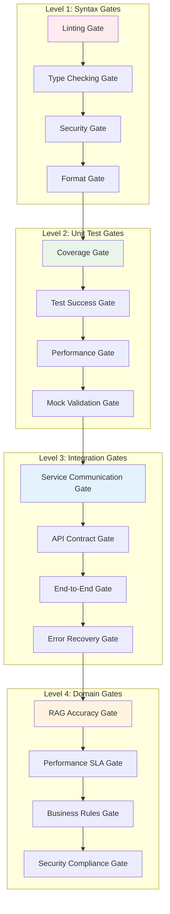

# Quality Gates and Acceptance Criteria

## Document Information
- **Version**: 1.0.0
- **Created**: 2025-01-15
- **System**: Contexter RAG Implementation
- **Scope**: Quality gates, acceptance criteria, and validation thresholds

## Overview

This document defines comprehensive quality gates and acceptance criteria for the RAG system validation. Quality gates serve as automated checkpoints that must be passed before code can proceed to the next stage of development or deployment.

## Quality Gate Framework

### Gate Execution Model


## Level 1: Syntax and Code Quality Gates

### Gate SQ-001: Code Linting Gate

**Purpose**: Ensure code follows style guidelines and best practices
**Execution Point**: Pre-commit, CI/CD pipeline entry
**Blocking**: Yes - Must pass to proceed

**Acceptance Criteria**:
```yaml
ruff_linting:
  violations_allowed: 0
  severity_threshold: "error"
  excluded_rules: []
  configuration_file: "pyproject.toml"
  
success_criteria:
  - total_violations: 0
  - critical_violations: 0
  - files_processed: ">= 1"
  - execution_time: "< 30 seconds"
```

**Validation Commands**:
```bash
# Primary validation
ruff check src/ tests/ --output-format=json > ruff-report.json

# Gate evaluation script
python scripts/evaluate_linting_gate.py ruff-report.json
```

**Gate Evaluation Logic**:
```python
# scripts/evaluate_linting_gate.py
def evaluate_linting_gate(report_file: str) -> GateResult:
    """Evaluate linting gate based on ruff output."""
    with open(report_file) as f:
        violations = json.load(f)
    
    # Count violations by severity
    error_count = sum(1 for v in violations if v.get("level") == "error")
    warning_count = sum(1 for v in violations if v.get("level") == "warning")
    
    # Gate pass/fail logic
    gate_passed = (
        error_count == 0 and
        warning_count <= 5  # Allow up to 5 warnings
    )
    
    return GateResult(
        gate_name="code_linting",
        passed=gate_passed,
        score=1.0 if gate_passed else 0.0,
        metrics={
            "error_count": error_count,
            "warning_count": warning_count,
            "total_violations": len(violations)
        },
        message="Linting gate passed" if gate_passed else f"Linting failed: {error_count} errors, {warning_count} warnings"
    )
```

### Gate SQ-002: Type Checking Gate

**Purpose**: Ensure type safety and proper type annotations
**Execution Point**: Pre-commit, CI/CD pipeline
**Blocking**: Yes

**Acceptance Criteria**:
```yaml
mypy_type_checking:
  errors_allowed: 0
  strict_mode: true
  ignore_missing_imports: false
  configuration_file: "mypy.ini"
  
success_criteria:
  - type_errors: 0
  - annotation_coverage: ">= 95%"
  - files_checked: ">= 1"
  - execution_time: "< 60 seconds"
```

**Validation Commands**:
```bash
# Type checking with JSON output
mypy src/ --strict --json-report mypy-report

# Gate evaluation
python scripts/evaluate_type_checking_gate.py mypy-report/index.json
```

### Gate SQ-003: Security Scanning Gate

**Purpose**: Identify security vulnerabilities and unsafe practices
**Execution Point**: Pre-commit, CI/CD pipeline, nightly scans
**Blocking**: Yes for critical/high severity issues

**Acceptance Criteria**:
```yaml
bandit_security:
  critical_issues_allowed: 0
  high_issues_allowed: 0
  medium_issues_allowed: 2
  low_issues_allowed: 10
  confidence_threshold: "medium"
  
success_criteria:
  - critical_issues: 0
  - high_severity_issues: 0
  - medium_severity_issues: "<= 2"
  - execution_time: "< 45 seconds"
```

**Validation Commands**:
```bash
# Security scanning
bandit -r src/ -f json -o security-report.json

# Additional security checks
safety check --json --output safety-report.json
semgrep --config=auto --json --output=semgrep-report.json src/

# Gate evaluation
python scripts/evaluate_security_gate.py security-report.json safety-report.json semgrep-report.json
```

### Gate SQ-004: Code Formatting Gate

**Purpose**: Ensure consistent code formatting
**Execution Point**: Pre-commit hook
**Blocking**: Yes

**Acceptance Criteria**:
```yaml
black_formatting:
  changes_required: 0
  line_length: 88
  target_versions: ["py311"]
  
isort_imports:
  changes_required: 0
  profile: "black"
  
success_criteria:
  - formatting_changes_needed: 0
  - import_changes_needed: 0
  - files_compliant: "100%"
```

**Validation Commands**:
```bash
# Check formatting without making changes
black src/ tests/ --check --diff > formatting-diff.txt
isort src/ tests/ --check-only --diff > import-diff.txt

# Gate evaluation
python scripts/evaluate_formatting_gate.py formatting-diff.txt import-diff.txt
```

## Level 2: Unit Testing Gates

### Gate UT-001: Test Coverage Gate

**Purpose**: Ensure adequate test coverage across all components
**Execution Point**: After unit test execution
**Blocking**: Yes

**Acceptance Criteria**:
```yaml
coverage_requirements:
  line_coverage_minimum: 95.0
  branch_coverage_minimum: 90.0
  function_coverage_minimum: 98.0
  excluded_files:
    - "*/tests/*"
    - "*/migrations/*"
    - "*/__init__.py"
  
component_coverage:
  vector_db: ">= 95%"
  embedding: ">= 95%"
  storage: ">= 95%"
  ingestion: ">= 95%"
  retrieval: ">= 95%"
  api: ">= 90%"
  
success_criteria:
  - overall_line_coverage: ">= 95%"
  - overall_branch_coverage: ">= 90%"
  - no_component_below_threshold: true
  - critical_paths_coverage: "100%"
```

**Validation Commands**:
```bash
# Run tests with coverage
pytest tests/unit/ --cov=src/contexter/rag --cov-report=json --cov-report=term-missing

# Generate detailed coverage report
coverage json -o coverage-report.json
coverage html --directory=htmlcov

# Gate evaluation
python scripts/evaluate_coverage_gate.py coverage-report.json
```

**Gate Evaluation Logic**:
```python
def evaluate_coverage_gate(coverage_file: str) -> GateResult:
    """Evaluate test coverage gate."""
    with open(coverage_file) as f:
        coverage_data = json.load(f)
    
    totals = coverage_data["totals"]
    line_coverage = totals["percent_covered"]
    branch_coverage = totals.get("percent_covered_branches", 0)
    
    # Component-specific coverage
    component_coverage = {}
    for file_path, file_data in coverage_data["files"].items():
        component = extract_component_name(file_path)
        if component not in component_coverage:
            component_coverage[component] = []
        component_coverage[component].append(file_data["summary"]["percent_covered"])
    
    # Calculate component averages
    component_averages = {
        comp: np.mean(coverages) 
        for comp, coverages in component_coverage.items()
    }
    
    # Gate pass/fail logic
    gate_passed = (
        line_coverage >= 95.0 and
        branch_coverage >= 90.0 and
        all(avg >= 90.0 for avg in component_averages.values())
    )
    
    return GateResult(
        gate_name="test_coverage",
        passed=gate_passed,
        score=min(line_coverage / 95.0, 1.0),
        metrics={
            "line_coverage": line_coverage,
            "branch_coverage": branch_coverage,
            "component_coverage": component_averages
        }
    )
```

### Gate UT-002: Test Success Rate Gate

**Purpose**: Ensure all unit tests pass consistently
**Execution Point**: After unit test execution
**Blocking**: Yes

**Acceptance Criteria**:
```yaml
test_execution:
  pass_rate_minimum: 100.0
  flaky_test_threshold: 1.0  # Max 1% flaky tests
  execution_time_maximum: 120  # 2 minutes
  
test_stability:
  consecutive_runs: 3
  consistency_requirement: 100.0
  
success_criteria:
  - all_tests_pass: true
  - no_skipped_tests: true
  - no_flaky_tests: true
  - execution_time: "< 2 minutes"
```

**Validation Commands**:
```bash
# Run unit tests with detailed output
pytest tests/unit/ -v --tb=short --junit-xml=test-results.xml

# Run stability check (multiple executions)
for i in {1..3}; do
  pytest tests/unit/ --quiet --tb=no || echo "Run $i failed"
done > stability-check.log

# Gate evaluation
python scripts/evaluate_test_success_gate.py test-results.xml stability-check.log
```

### Gate UT-003: Unit Test Performance Gate

**Purpose**: Ensure unit tests execute within acceptable time limits
**Execution Point**: After unit test execution
**Blocking**: No (warning only)

**Acceptance Criteria**:
```yaml
performance_requirements:
  total_execution_time: "< 120 seconds"
  average_test_time: "< 1 second"
  slowest_test_time: "< 10 seconds"
  
performance_regression:
  baseline_comparison: true
  regression_threshold: 20.0  # 20% slower than baseline
  
success_criteria:
  - total_time_acceptable: true
  - no_significant_regression: true
  - slow_tests_identified: true
```

### Gate UT-004: Mock Validation Gate

**Purpose**: Ensure proper use of mocks and test isolation
**Execution Point**: During unit test analysis
**Blocking**: No (advisory)

**Acceptance Criteria**:
```yaml
mock_usage:
  external_dependencies_mocked: true
  database_calls_mocked: true
  api_calls_mocked: true
  file_system_mocked: true
  
test_isolation:
  shared_state_detected: false
  test_interdependencies: false
  cleanup_verified: true
  
success_criteria:
  - proper_mocking_coverage: ">= 95%"
  - test_isolation_maintained: true
  - no_real_external_calls: true
```

## Level 3: Integration Testing Gates

### Gate IT-001: Service Communication Gate

**Purpose**: Ensure all services communicate correctly
**Execution Point**: After integration test execution
**Blocking**: Yes

**Acceptance Criteria**:
```yaml
service_communication:
  all_endpoints_tested: true
  error_handling_verified: true
  timeout_handling_verified: true
  retry_logic_verified: true
  
communication_paths:
  embedding_to_vector_store: "PASS"
  api_to_search_engine: "PASS"
  ingestion_to_storage: "PASS"
  storage_to_retrieval: "PASS"
  
success_criteria:
  - all_service_pairs_tested: true
  - communication_success_rate: ">= 99%"
  - error_recovery_verified: true
  - performance_within_sla: true
```

**Validation Commands**:
```bash
# Run integration tests
pytest tests/integration/ -v --tb=short --junit-xml=integration-results.xml

# Service health checks
python scripts/verify_service_health.py

# Gate evaluation
python scripts/evaluate_service_communication_gate.py integration-results.xml
```

### Gate IT-002: API Contract Gate

**Purpose**: Ensure API contracts are maintained and backward compatible
**Execution Point**: After API integration tests
**Blocking**: Yes

**Acceptance Criteria**:
```yaml
api_contracts:
  openapi_spec_valid: true
  backward_compatibility: true
  response_schema_compliance: true
  error_response_standards: true
  
endpoint_validation:
  search_endpoints: "PASS"
  document_endpoints: "PASS"
  health_endpoints: "PASS"
  admin_endpoints: "PASS"
  
success_criteria:
  - all_endpoints_responding: true
  - response_times_acceptable: true
  - contract_compliance: "100%"
  - no_breaking_changes: true
```

### Gate IT-003: End-to-End Workflow Gate

**Purpose**: Ensure complete workflows function correctly
**Execution Point**: After integration tests
**Blocking**: Yes

**Acceptance Criteria**:
```yaml
e2e_workflows:
  document_ingestion_to_search: "PASS"
  user_registration_to_query: "PASS"
  batch_processing_workflow: "PASS"
  error_recovery_workflow: "PASS"
  
workflow_performance:
  document_processing_time: "< 30 seconds"
  search_response_time: "< 500 milliseconds"
  batch_throughput: ">= 1000 docs/minute"
  
success_criteria:
  - all_workflows_complete: true
  - performance_targets_met: true
  - data_consistency_maintained: true
  - error_handling_robust: true
```

### Gate IT-004: Error Recovery Gate

**Purpose**: Ensure system recovers gracefully from failures
**Execution Point**: After chaos/failure testing
**Blocking**: Yes

**Acceptance Criteria**:
```yaml
failure_scenarios:
  database_unavailable: "RECOVERS"
  api_service_down: "RECOVERS"
  network_timeout: "RECOVERS"
  invalid_data_input: "HANDLES_GRACEFULLY"
  
recovery_metrics:
  mean_time_to_recovery: "< 60 seconds"
  data_loss_tolerance: "0%"
  service_degradation: "< 10%"
  
success_criteria:
  - graceful_degradation: true
  - automatic_recovery: true
  - data_integrity_maintained: true
  - user_experience_preserved: true
```

## Level 4: Domain-Specific Gates

### Gate DS-001: RAG Accuracy Gate

**Purpose**: Ensure RAG system meets business accuracy requirements
**Execution Point**: After domain validation tests
**Blocking**: Yes for production deployment

**Acceptance Criteria**:
```yaml
search_accuracy:
  recall_at_1: ">= 80%"
  recall_at_5: ">= 90%"
  recall_at_10: ">= 95%"
  precision_at_1: ">= 85%"
  precision_at_5: ">= 70%"
  
ranking_quality:
  ndcg_at_10: ">= 80%"
  mrr_score: ">= 85%"
  
content_quality:
  embedding_quality_score: ">= 90%"
  chunk_relevance_score: ">= 85%"
  
success_criteria:
  - accuracy_targets_met: true
  - consistent_performance: true
  - quality_regression_check: "PASS"
  - business_rules_validated: true
```

**Validation Commands**:
```bash
# Run RAG accuracy tests
pytest tests/domain/test_rag_accuracy.py -v --tb=short

# Generate accuracy report
python scripts/generate_accuracy_report.py

# Gate evaluation
python scripts/evaluate_rag_accuracy_gate.py accuracy-report.json
```

**Gate Evaluation Logic**:
```python
def evaluate_rag_accuracy_gate(accuracy_file: str) -> GateResult:
    """Evaluate RAG accuracy gate."""
    with open(accuracy_file) as f:
        accuracy_data = json.load(f)
    
    metrics = accuracy_data["metrics"]
    
    # Check recall requirements
    recall_requirements = {
        "recall@1": 0.80,
        "recall@5": 0.90,
        "recall@10": 0.95
    }
    
    recall_passed = all(
        metrics.get(metric, 0) >= threshold
        for metric, threshold in recall_requirements.items()
    )
    
    # Check precision requirements
    precision_requirements = {
        "precision@1": 0.85,
        "precision@5": 0.70
    }
    
    precision_passed = all(
        metrics.get(metric, 0) >= threshold
        for metric, threshold in precision_requirements.items()
    )
    
    # Check NDCG requirement
    ndcg_passed = metrics.get("ndcg@10", 0) >= 0.80
    
    # Overall gate pass
    gate_passed = recall_passed and precision_passed and ndcg_passed
    
    return GateResult(
        gate_name="rag_accuracy",
        passed=gate_passed,
        score=np.mean([
            metrics.get("recall@10", 0) / 0.95,
            metrics.get("precision@1", 0) / 0.85,
            metrics.get("ndcg@10", 0) / 0.80
        ]),
        metrics=metrics
    )
```

### Gate DS-002: Performance SLA Gate

**Purpose**: Ensure system meets performance service level agreements
**Execution Point**: After performance testing
**Blocking**: Yes for production deployment

**Acceptance Criteria**:
```yaml
response_time_slas:
  search_p95: "< 500 milliseconds"
  search_p99: "< 1000 milliseconds"
  ingestion_p95: "< 30 seconds"
  api_p95: "< 100 milliseconds"
  
throughput_slas:
  search_queries: ">= 200 RPS"
  document_ingestion: ">= 1000 docs/minute"
  concurrent_users: ">= 100"
  
resource_efficiency:
  memory_usage: "< 8GB"
  cpu_utilization: "< 70%"
  disk_io: "< 100 MB/s"
  
success_criteria:
  - all_sla_targets_met: true
  - performance_stability: true
  - resource_efficiency_maintained: true
  - scalability_demonstrated: true
```

### Gate DS-003: Business Rules Gate

**Purpose**: Ensure business logic and rules are correctly implemented
**Execution Point**: After business rule validation
**Blocking**: Yes

**Acceptance Criteria**:
```yaml
access_control:
  user_permission_enforcement: "PASS"
  document_visibility_rules: "PASS"
  api_rate_limiting: "PASS"
  
content_policies:
  content_filtering: "PASS"
  quality_thresholds: "PASS"
  freshness_rules: "PASS"
  
data_governance:
  retention_policies: "PASS"
  privacy_compliance: "PASS"
  audit_logging: "PASS"
  
success_criteria:
  - security_rules_enforced: true
  - compliance_maintained: true
  - audit_trail_complete: true
  - business_logic_correct: true
```

### Gate DS-004: Security Compliance Gate

**Purpose**: Ensure security requirements and compliance standards are met
**Execution Point**: After security validation
**Blocking**: Yes

**Acceptance Criteria**:
```yaml
security_controls:
  authentication_required: true
  authorization_enforced: true
  input_validation: true
  output_sanitization: true
  
vulnerability_scanning:
  critical_vulnerabilities: 0
  high_vulnerabilities: 0
  medium_vulnerabilities: "< 5"
  
compliance_standards:
  gdpr_compliance: "PASS"
  data_encryption: "PASS"
  access_logging: "PASS"
  incident_response: "PASS"
  
success_criteria:
  - security_baseline_met: true
  - no_critical_vulnerabilities: true
  - compliance_verified: true
  - security_monitoring_active: true
```

## Quality Gate Automation

### CI/CD Integration

**GitHub Actions Workflow**:
```yaml
name: Quality Gates Validation

on: [push, pull_request]

jobs:
  level-1-gates:
    name: "Level 1: Syntax & Quality Gates"
    runs-on: ubuntu-latest
    steps:
      - uses: actions/checkout@v4
      - name: Setup Python
        uses: actions/setup-python@v4
        with:
          python-version: "3.11"
      
      - name: Install dependencies
        run: pip install -r requirements-dev.txt
      
      - name: Gate SQ-001: Linting
        run: |
          ruff check src/ tests/ --output-format=json > ruff-report.json
          python scripts/evaluate_linting_gate.py ruff-report.json
      
      - name: Gate SQ-002: Type Checking
        run: |
          mypy src/ --strict --json-report mypy-report
          python scripts/evaluate_type_checking_gate.py mypy-report/index.json
      
      - name: Gate SQ-003: Security Scanning
        run: |
          bandit -r src/ -f json -o security-report.json
          python scripts/evaluate_security_gate.py security-report.json
      
      - name: Gate SQ-004: Code Formatting
        run: |
          black src/ tests/ --check --diff > formatting-diff.txt
          python scripts/evaluate_formatting_gate.py formatting-diff.txt

  level-2-gates:
    name: "Level 2: Unit Test Gates"
    needs: level-1-gates
    runs-on: ubuntu-latest
    steps:
      - uses: actions/checkout@v4
      - name: Setup Python
        uses: actions/setup-python@v4
        with:
          python-version: "3.11"
      
      - name: Install dependencies
        run: pip install -r requirements-dev.txt
      
      - name: Gate UT-001: Test Coverage
        run: |
          pytest tests/unit/ --cov=src/contexter/rag --cov-report=json
          python scripts/evaluate_coverage_gate.py coverage.json
      
      - name: Gate UT-002: Test Success Rate
        run: |
          pytest tests/unit/ -v --junit-xml=test-results.xml
          python scripts/evaluate_test_success_gate.py test-results.xml

  level-3-gates:
    name: "Level 3: Integration Gates"
    needs: level-2-gates
    runs-on: ubuntu-latest
    services:
      qdrant:
        image: qdrant/qdrant:v1.7.0
        ports:
          - 6333:6333
      redis:
        image: redis:7-alpine
        ports:
          - 6379:6379
    steps:
      - uses: actions/checkout@v4
      - name: Setup Python
        uses: actions/setup-python@v4
        with:
          python-version: "3.11"
      
      - name: Install dependencies
        run: pip install -r requirements-dev.txt
      
      - name: Gate IT-001: Service Communication
        run: |
          pytest tests/integration/ --junit-xml=integration-results.xml
          python scripts/evaluate_service_communication_gate.py integration-results.xml

  level-4-gates:
    name: "Level 4: Domain Gates"
    needs: level-3-gates
    runs-on: ubuntu-latest
    if: github.ref == 'refs/heads/main' || github.event_name == 'pull_request'
    steps:
      - uses: actions/checkout@v4
      - name: Setup Python
        uses: actions/setup-python@v4
        with:
          python-version: "3.11"
      
      - name: Install dependencies
        run: pip install -r requirements-dev.txt
      
      - name: Gate DS-001: RAG Accuracy
        run: |
          pytest tests/domain/test_rag_accuracy.py
          python scripts/evaluate_rag_accuracy_gate.py accuracy-report.json
        env:
          VOYAGE_API_KEY: ${{ secrets.VOYAGE_API_KEY }}
```

### Quality Gate Dashboard

**Metrics Collection**:
```python
# scripts/quality_gate_dashboard.py
class QualityGateDashboard:
    def __init__(self):
        self.metrics_collector = MetricsCollector()
        self.gate_results = {}
    
    async def collect_all_gate_results(self) -> Dict[str, GateResult]:
        """Collect results from all quality gates."""
        
        # Level 1 Gates
        self.gate_results.update({
            "SQ-001": await self.evaluate_linting_gate(),
            "SQ-002": await self.evaluate_type_checking_gate(),
            "SQ-003": await self.evaluate_security_gate(),
            "SQ-004": await self.evaluate_formatting_gate(),
        })
        
        # Level 2 Gates
        self.gate_results.update({
            "UT-001": await self.evaluate_coverage_gate(),
            "UT-002": await self.evaluate_test_success_gate(),
            "UT-003": await self.evaluate_test_performance_gate(),
            "UT-004": await self.evaluate_mock_validation_gate(),
        })
        
        # Level 3 Gates
        self.gate_results.update({
            "IT-001": await self.evaluate_service_communication_gate(),
            "IT-002": await self.evaluate_api_contract_gate(),
            "IT-003": await self.evaluate_e2e_workflow_gate(),
            "IT-004": await self.evaluate_error_recovery_gate(),
        })
        
        # Level 4 Gates
        self.gate_results.update({
            "DS-001": await self.evaluate_rag_accuracy_gate(),
            "DS-002": await self.evaluate_performance_sla_gate(),
            "DS-003": await self.evaluate_business_rules_gate(),
            "DS-004": await self.evaluate_security_compliance_gate(),
        })
        
        return self.gate_results
    
    def generate_quality_report(self) -> QualityReport:
        """Generate comprehensive quality report."""
        passed_gates = sum(1 for result in self.gate_results.values() if result.passed)
        total_gates = len(self.gate_results)
        overall_score = np.mean([result.score for result in self.gate_results.values()])
        
        return QualityReport(
            timestamp=datetime.utcnow(),
            total_gates=total_gates,
            passed_gates=passed_gates,
            failed_gates=total_gates - passed_gates,
            overall_score=overall_score,
            gate_results=self.gate_results,
            recommendations=self.generate_recommendations()
        )
```

## Quality Gate Exemption Process

### Exemption Criteria

**Temporary Exemptions** (Max 7 days):
- Infrastructure/environment issues
- External service dependencies
- Urgent hotfixes

**Long-term Exemptions** (Requires approval):
- Technical debt with remediation plan
- Third-party library limitations
- Performance trade-offs

**Exemption Request Format**:
```yaml
exemption_request:
  gate_id: "DS-001"
  gate_name: "RAG Accuracy Gate"
  requestor: "john.doe@company.com"
  justification: "New embedding model requires accuracy baseline recalibration"
  impact_assessment: "No user-facing impact, internal metrics only"
  remediation_plan:
    - action: "Collect new ground truth dataset"
      timeline: "3 days"
    - action: "Retrain accuracy baselines"
      timeline: "5 days"
    - action: "Update gate thresholds"
      timeline: "7 days"
  expiration_date: "2025-01-22"
  approver_required: "tech-lead"
```

## Success Metrics

### Overall Quality Metrics
- **Gate Success Rate**: >95% of gates pass on first attempt
- **Quality Score**: >90% average quality score across all gates
- **Time to Resolution**: <24 hours for gate failures
- **False Positive Rate**: <2% of gate failures are false positives

### Performance Metrics
- **Gate Execution Time**: All gates complete within SLA
- **CI/CD Pipeline Success**: >98% successful pipeline runs
- **Feedback Loop Speed**: <5 minutes from commit to initial gate results

### Business Impact Metrics
- **Production Incidents**: <1 incident per month related to quality issues
- **Customer Satisfaction**: >95% satisfaction with system quality
- **Developer Productivity**: <10% time spent on quality-related rework

This comprehensive quality gates framework ensures systematic validation at every level while maintaining development velocity and system reliability.